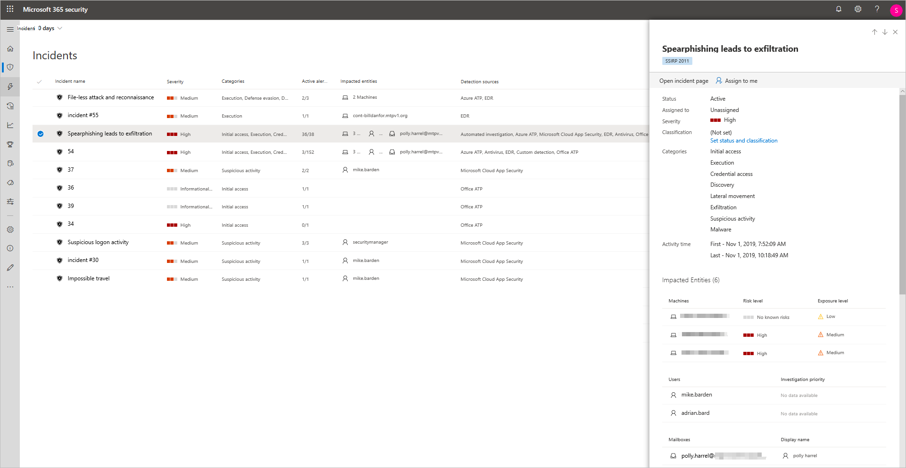
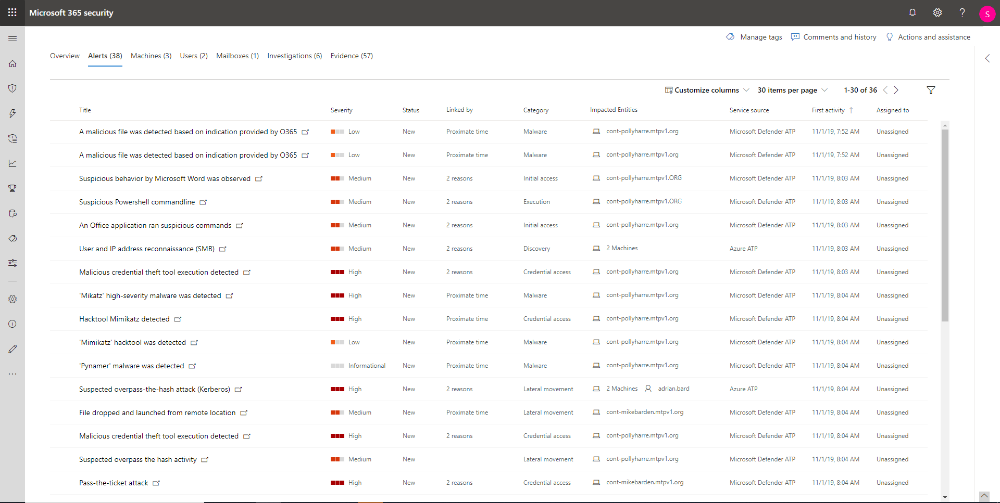
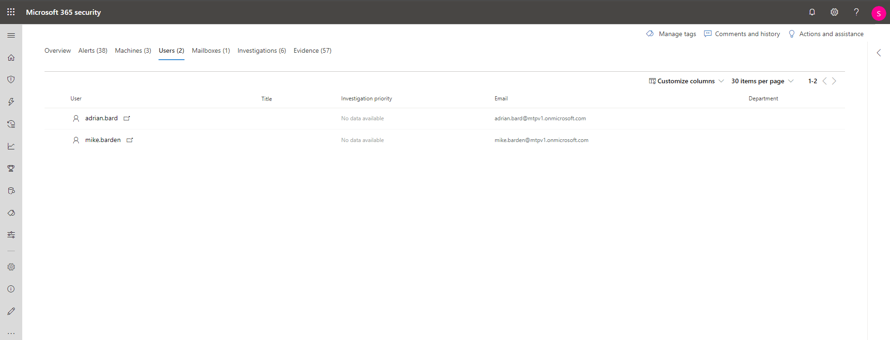
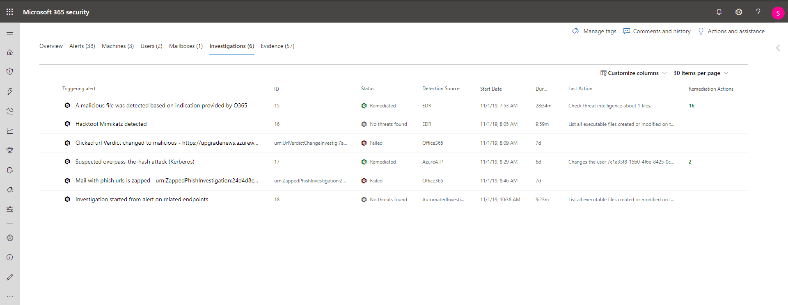
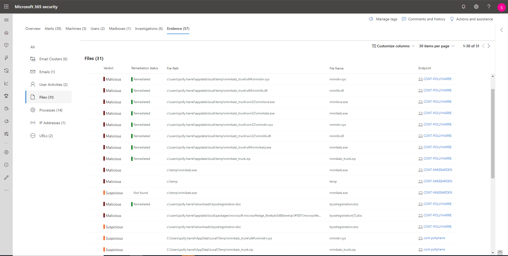

# Analizzare gli incidenti in Microsoft 365 Defender

[!INCLUDE [Microsoft 365 Defender rebranding](../includes/microsoft-defender.md)]

**Si applica a:**

- Microsoft 365 Defender

Microsoft 365 Defender aggrega tutti gli avvisi, gli asset, le indagini e le prove correlati provenienti da dispositivi, utenti e cassette postali per fornire una panoramica completa dell'intera ampiezza di un attacco.

Analizzare gli avvisi che riguardano la rete, comprenderne il significato e raccogliere le prove associate agli incidenti consente di poter elaborare un piano di correzione efficace.

## Analizzare un incidente

1. Selezionare un incidente dalla relativa coda.   Viene aperto un pannello laterale che offre un'anteprima di informazioni importanti, ad esempio stato, gravità, categorie ed entità influenzate.

    

2. Selezionare **Apri pagina dell'incidente**.   Verrà aperta la pagina dell'evento imprevisto in cui sono disponibili ulteriori informazioni su dettagli, commenti e azioni, schede (panoramica, avvisi, dispositivi, utenti, indagini, prove).

3. Esaminare gli avvisi, i dispositivi, gli utenti e altre entità coinvolte nell'incidente.

## Panoramica dell'incidente

La pagina di panoramica offre un quadro generale sugli elementi principali relativi all'incidente a cui prestare attenzione.

Le categorie di attacco offrono una visualizzazione visiva e numerica dell'avanzamento dell'attacco contro la catena di uccidi. Come per altri prodotti di sicurezza Microsoft, Microsoft 365 Defender è allineato al framework [MITRE ATT&&trade; CK.](https://attack.mitre.org/)

La sezione relativa all'ambito fornisce un elenco delle principali risorse interessate che fanno parte di questo incidente. Se sono presenti informazioni specifiche su una determinata risorsa (ad esempio, il livello di rischio, la priorità dell'indagine e i contrassegni sulle attività) saranno disponibili in questa sezione.

La sequenza temporale degli avvisi permette di visualizzare un'anteprima dell'ordine cronologico in cui si sono verificati gli avvisi, nonché i motivi per cui tali avvisi sono collegati a questo incidente.

Infine, la sezione delle prove fornisce un riepilogo di quanti artefatti diversi sono stati inclusi nell'incidente e il relativo stato di correzione, in modo da poter identificare immediatamente se sono necessarie azioni da parte dell'utente.

Questa panoramica può essere utile nella valutazione iniziale dell'incidente fornendo dati analitici relativi alle principali caratteristiche dell'incidente di cui l'utente dovrebbe essere a conoscenza.

## Avvisi

È possibile visualizzare tutti gli avvisi correlati all'evento imprevisto e altre informazioni su di essi, ad esempio la gravità, le entità coinvolte nell'avviso, l'origine degli avvisi (Microsoft Defender for Identity, Microsoft Defender for Endpoint, Microsoft Defender per Office 365) e il motivo per cui sono stati collegati tra loro.

Per impostazione predefinita, gli avvisi sono ordinati cronologicamente, per consentire di visualizzare prima come si è svolto l'attacco nel tempo. Facendo clic su ogni avviso verrà visualizzata la pagina di avviso pertinente in cui è possibile eseguire un'analisi approfondita dell'avviso. Informazioni su come usare le pagine di avviso e la coda di avvisi unificati in [Analizzare gli avvisi](investigate-alerts.md)

## Dispositivi

Nella scheda dei dispositivi sono elencati tutti i dispositivi in cui vengono visualizzati gli avvisi relativi all'incidente.

Facendo clic sul nome del computer in cui si è verificato l'attacco, si accede alla relativa pagina in cui è possibile visualizzare gli avvisi che sono stati attivati e gli eventi correlati forniti per facilitare l'indagine.

Selezionando la scheda della sequenza temporale è possibile scorrere la sequenza temporale del computer e visualizzare tutti gli eventi e i comportamenti osservati sul computer in ordine cronologico, intervallati dagli avvisi generati.

> [!TIP]
> Puoi eseguire analisi su richiesta in una pagina del dispositivo. Nel Centro sicurezza Microsoft 365 scegliere **Inventario dispositivi**. Selezionare un dispositivo con avvisi ed eseguire un'analisi antivirus. Le azioni, ad esempio le analisi antivirus, vengono rilevate e visibili nella **pagina Inventario** dispositivi. Per altre informazioni, vedi [Eseguire l'analisi di Microsoft Defender Antivirus nei dispositivi.](/microsoft-365/security/defender-endpoint/respond-machine-alerts#run-microsoft-defender-antivirus-scan-on-devices)

## Utenti

Visualizzare gli utenti che sono stati identificati come parte di un determinato incidente, oppure relativi a esso.

Facendo clic sul nome utente si accede alla pagina di Cloud App Security dell'utente dove è possibile condurre ulteriori indagini.

## Cassette postali

Analizzare tutte le cassette postali che sono state identificate come parte di un relativo incidente, oppure relative a esso. Per eseguire ulteriori attività di indagine, selezionando l'avviso correlato alla posta elettronica verrà aperto Microsoft Defender per Office 365 in cui è possibile eseguire azioni correttive.

## Indagini

Selezionare **Indagini per** visualizzare tutte le indagini automatizzate attivate dagli avvisi in questo evento imprevisto. Le indagini eseguiranno azioni di correzione o attenderanno l'approvazione degli analisti delle azioni, a seconda di come sono configurate le indagini automatizzate per l'esecuzione in Microsoft Defender per Endpoint e Defender per Office 365.

Selezionare un'indagine per accedere alla pagina dei dettagli dell'indagine per ottenere informazioni complete sull'indagine e sullo stato della correzione. Se sono presenti azioni in sospeso per l'approvazione nell'ambito dell'indagine, verranno visualizzate nella scheda Azioni in sospeso. Eseguire un'azione nell'ambito della correzione degli eventi imprevisti.

## Prove

Microsoft 365 Defender analizza automaticamente tutti gli eventi supportati e le entità sospette degli incidenti negli avvisi, fornendoti la risposta automatica e le informazioni sui file, i processi, i servizi, i messaggi di posta elettronica e altro ancora importanti. Ciò consente di rilevare e bloccare rapidamente le potenziali minacce nell'incidente.

Ognuna delle entità analizzate sarà contrassegnata con un verdetto (Dannosa, Sospetta, Pulita) e uno stato di correzione. Ciò consente di comprendere lo stato di correzione dell'intero incidente e quali sono i prossimi passi che possono essere presi per porre ulteriore rimedio.

## Argomenti correlati

- [Panoramica sugli incidenti](incidents-overview.md)
- [Assegnare priorità agli incidenti](incident-queue.md)
- [Gestire gli incidenti](manage-incidents.md)

