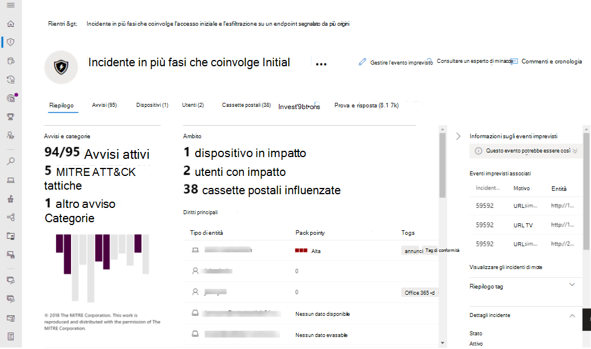

# Attivare Microsoft 365 Defender

[!INCLUDE [Microsoft 365 Defender rebranding](../includes/microsoft-defender.md)]

**Si applica a:**
- Microsoft 365 Defender

[Microsoft 365 Defender](microsoft-365-defender.md) unifica il processo di risposta agli incidenti integrando le funzionalità chiave in Microsoft Defender for Endpoint, Microsoft Defender per Office 365, Microsoft Cloud App Security e Microsoft Defender for Identity. Questa esperienza unificata aggiunge importanti funzionalità alle quali è possibile accedere nel Centro sicurezza Microsoft 365.

Microsoft 365 Defender si attiva automaticamente quando i clienti idonei con le autorizzazioni necessarie visitano il Centro sicurezza Microsoft 365. Leggere questo articolo per comprendere diversi prerequisiti e come viene eseguito il provisioning di Microsoft 365 Defender.

## Verificare l'idoneità della licenza e le autorizzazioni necessarie

Una licenza per un prodotto di sicurezza Microsoft 365 in genere consente di usare Microsoft 365 Defender nel Centro sicurezza Microsoft 365 senza costi aggiuntivi per le licenze. È consigliabile ottenere una licenza di Microsoft 365 E5, E5 Security, A5 o A5 Security o una combinazione valida di licenze che consente l'accesso a tutti i servizi supportati.

Per informazioni dettagliate sulle licenze, [leggere i requisiti di licenza](prerequisites.md#licensing-requirements).

### Controllare il ruolo

Per attivare Microsoft 365 **Defender,** è necessario essere un amministratore globale o un amministratore della sicurezza **in** Azure Active Directory. [Visualizzare i ruoli in Azure AD](/azure/active-directory/users-groups-roles/directory-manage-roles-portal)

## Servizi supportati

Microsoft 365 Defender aggrega i dati dei vari servizi supportati già distribuiti. I dati verranno processati e archiviati centralmente per identificare nuove informazioni dettagliate e rendere possibili flussi di lavoro di risposta centralizzati. Questa operazione non influisce sulle distribuzioni, le impostazioni o i dati esistenti associati ai servizi integrati.

Per ottenere la migliore protezione e ottimizzare Microsoft 365 Defender, è consigliabile distribuire tutti i servizi supportati applicabili nella rete. Per ulteriori informazioni, [vedere distribuzione di servizi supportati.](deploy-supported-services.md)

## Onboard al servizio
L'onboarding in Microsoft 365 Defender è semplice. Dal menu di spostamento seleziona qualsiasi elemento nella sezione Endpoint, ad esempio Eventi imprevisti, Ricerca, Centro notifiche o Analisi delle minacce per avviare il processo di onboarding. 

### Posizione del data center

Microsoft 365 Defender archivierà ed eelaborare i dati nello stesso percorso utilizzato [da Microsoft Defender per Endpoint.](/windows/security/threat-protection/microsoft-defender-atp/data-storage-privacy) Se non si dispone di Microsoft Defender for Endpoint, viene selezionata automaticamente una nuova posizione del data center in base alla posizione dei servizi di sicurezza di Microsoft 365 attivi. La posizione del data center selezionata viene visualizzata sullo schermo.

Selezionare **Serve assistenza?** nel Centro sicurezza Microsoft 365 per contattare il supporto Tecnico Microsoft per il provisioning di Microsoft 365 Defender in un'altra posizione del data center.

> [!NOTE]
> Microsoft Defender for Endpoint effettua automaticamente il provisioning nei data center dell'Unione Europea (UE) quando è attivato tramite Azure Defender. Microsoft 365 Defender eseguirà automaticamente il provisioning nello stesso data center ue per i clienti che hanno effettuato il provisioning di Defender per Endpoint in questo modo.

### Verificare che il servizio sia attivo

Dopo aver eseguito il provisioning il servizio aggiunge:

- [Gestione degli eventi imprevisti](incidents-overview.md)
- [Coda di avvisi](investigate-alerts.md)
- Un centro operativo per la gestione delle [analisi e risposte automatiche](m365d-autoir.md)
- [Funzionalità di ricerca](advanced-hunting-overview.md) avanzate
- Analisi delle minacce

 *Microsoft 365 Defender*

### Recupero dei dati di Microsoft Defender for Identity 
Per abilitare l'integrazione con Microsoft Cloud App Security, devi accedere a Microsoft Cloud App Security almeno una volta.

## Ottenere assistenza

Per ottenere risposte alle domande più frequenti sull'attivazione di Microsoft 365 Defender, [leggere le domande frequenti](m365d-enable-faq.md).

Il personale di supporto Microsoft può aiutare a eseguire il provisioning o il deprovisioning del servizio e delle risorse correlate nel tenant. Per assistenza, selezionare **Serve assistenza?** nel Centro sicurezza Microsoft 365. Quando si contatta il supporto, menzionaRe Microsoft 365 Defender.

## Argomenti correlati

- [Domande frequenti](m365d-enable-faq.md)
- [Requisiti relativi alle licenze e altri prerequisiti](prerequisites.md)
- [Distribuire i servizi supportati](deploy-supported-services.md)
- [Panoramica di Microsoft 365 Defender](microsoft-365-defender.md)
- [Panoramica di Microsoft Defender for Endpoint](../defender-endpoint/microsoft-defender-endpoint.md)
- [Panoramica di Defender per Office 365](../office-365-security/defender-for-office-365.md)
- [Panoramica di Microsoft Cloud App Security](/cloud-app-security/what-is-cloud-app-security)
- [Panoramica di Microsoft Defender for Identity](/azure-advanced-threat-protection/what-is-atp)
- [Archiviazione dei dati di Microsoft Defender for Endpoint](../defender-endpoint/data-storage-privacy.md)
