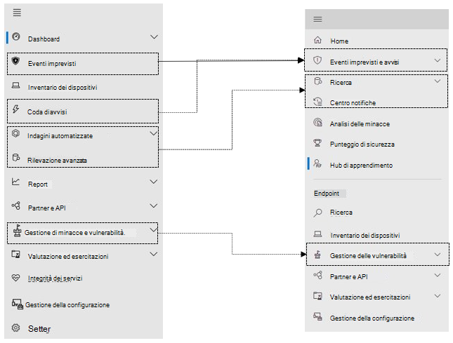

# Microsoft Defender for Endpoint nel centro sicurezza Microsoft 365 sicurezza

[!INCLUDE [Microsoft 365 Defender rebranding](../includes/microsoft-defender.md)]

**Si applica a:**

- [Microsoft 365 Defender](microsoft-365-defender.md)
- [Microsoft Defender ATP](https://go.microsoft.com/fwlink/p/?linkid=2154037)
- [Microsoft Defender per Office 365](/microsoft-365/security/office-365-security/defender-for-office-365)

## Riferimento rapido

L'immagine e la tabella seguente elencano le modifiche nello spostamento tra il Microsoft Defender Security Center e il centro sicurezza Microsoft 365 sicurezza.

> [!div class="mx-imgBorder"]
> 

| Microsoft Defender Security Center | Centro sicurezza Microsoft 365 |
|---------|---------|
| Dashboard <ul><li>Operazioni di sicurezza</li><li>Analisi delle minacce</li></ul>  |Home <ul><li>Analisi delle minacce</li></ul>   |
| Eventi imprevisti | Eventi imprevisti & avvisi |
| Inventario dei dispositivi | Inventario dei dispositivi |
| Coda di avvisi | Eventi imprevisti & avvisi |
| Indagini automatizzate | Centro notifiche |
| Rilevazione avanzata | Ricerca |
| Report | Report |
| Partner & API | Partner & API |
| Gestione delle & delle minacce | Gestione delle vulnerabilità |
| Valutazione ed esercitazioni | Esercitazioni & valutazione |
| Gestione della configurazione | Gestione della configurazione |
| Impostazioni | Impostazioni | 

Il Centro [sicurezza Microsoft 365](overview-security-center.md) funzionalità di sicurezza migliorate combina funzionalità di sicurezza che proteggono, rilevano, analizzano e rispondono alle minacce di posta [https://security.microsoft.com](https://security.microsoft.com) elettronica, collaborazione, identità e dispositivi. Questo centro sicurezza riunisce le funzionalità dei portali di sicurezza Microsoft esistenti, tra cui Microsoft Defender Security Center e il centro sicurezza Office 365 sicurezza & conformità.

Se si ha familiarità con il Microsoft Defender Security Center, in questo articolo vengono descritte alcune delle modifiche e dei miglioramenti apportati al Centro sicurezza Microsoft 365 sicurezza. Esistono tuttavia alcuni elementi nuovi e aggiornati di cui tenere conto.

Storicamente, la [Microsoft Defender Security Center](/windows/security/threat-protection/microsoft-defender-atp/portal-overview) è stata la sede di Microsoft Defender per Endpoint. Enterprise team di sicurezza lo hanno usato per monitorare e contribuire a rispondere agli avvisi di potenziali attività avanzate di minacce persistenti o violazioni dei dati. Per ridurre il numero di portali, il centro sicurezza Microsoft 365 sarà la sede per il monitoraggio e la gestione della sicurezza tra le identità, i dati, i dispositivi, le app e l'infrastruttura Microsoft.

Microsoft Defender for Endpoint nel centro sicurezza Microsoft 365 supporta la concessione dell'accesso ai provider di servizi di sicurezza gestiti [(MSSP)](/windows/security/threat-protection/microsoft-defender-atp/grant-mssp-access) nello stesso modo in cui viene concesso l'accesso nel Centro sicurezza [Microsoft Defender.](mssp-access.md)

> [!IMPORTANT]
> Ciò che viene visualizzato nel centro Microsoft 365 sicurezza dipende dalle sottoscrizioni correnti. Ad esempio, se non hai una licenza per Microsoft Defender per Office 365, la sezione Email & Collaboration non verrà visualizzata.

>[!Note]
>Il nuovo portale unificato non è disponibile per:
>- Us Government Community Cloud (GCC)
>- Us Government Community Cloud High (GCC High)
>- US Department of Defense
>- Tutte le istituzioni governative statunitensi con licenze commerciali

Dai un'occhiata al centro sicurezza Microsoft 365 sicurezza: [https://security.microsoft.com](https://security.microsoft.com) .

Altre informazioni sui vantaggi: [Panoramica del Centro sicurezza Microsoft 365r](overview-security-center.md)

## Modifiche

Questa tabella è un riferimento rapido alle modifiche tra il Microsoft Defender Security Center e il centro sicurezza Microsoft 365 sicurezza.

### Avvisi e azioni

| Area | Descrizione della modifica |
|---------|---------|
| [Eventi imprevisti & avvisi](incidents-overview.md)  | Nel centro Microsoft 365 sicurezza, è possibile gestire eventi imprevisti e avvisi in tutti gli endpoint, i messaggi di posta elettronica e le identità. Abbiamo convergente l'esperienza per aiutarti a trovare più facilmente gli eventi correlati. Per ulteriori informazioni, vedere [Incidents Overview.](incidents-overview.md)   |
| [Ricerca](advanced-hunting-overview.md)  |  La modifica delle regole di rilevamento personalizzate create in Microsoft Defender for Endpoint per includere le tabelle di identità e posta elettronica le sposta automaticamente Microsoft 365 Defender. Gli avvisi corrispondenti verranno visualizzati anche in Microsoft 365 Defender. Per ulteriori informazioni su queste modifiche, vedere [Migrate custom detection rules](advanced-hunting-migrate-from-mde.md#migrate-custom-detection-rules).   La `DeviceAlertEvents` tabella per la ricerca avanzata non è disponibile in Microsoft 365 Defender. Per eseguire query sulle informazioni di avviso specifiche del dispositivo in Microsoft 365 Defender, puoi usare le tabelle e per includere ulteriori informazioni da un `AlertInfo` `AlertEvidence` set di origini diverse. Crea la query correlata al dispositivo successiva seguendo [Le query di scrittura senza DeviceAlertEvents](advanced-hunting-migrate-from-mde.md#write-queries-without-devicealertevents).|
|[Centro notifiche](m365d-action-center.md)    | Elenca le azioni in sospeso e completate eseguite in seguito a indagini automatizzate e azioni di correzione. In precedenza, il centro notifiche nel Microsoft Defender Security Center elencate le azioni in sospeso e completate per le azioni di correzione eseguite solo sui dispositivi, mentre le indagini automatizzate hanno elencato gli avvisi e lo stato. Nel centro sicurezza Microsoft 365 sicurezza avanzata, il centro notifiche riunisce le azioni di correzione e le indagini su posta elettronica, dispositivi e utenti, il tutto in un'unica posizione.  |
| [Analisi delle minacce](threat-analytics.md) |  Spostato nella parte superiore della barra di spostamento per semplificarne l'individuazione e l'utilizzo. Ora include informazioni sulle minacce sia per gli endpoint che per la posta elettronica e la collaborazione.    |

### Endpoint

| Area | Descrizione della modifica |
|---------|---------|
|Ricerca   |  Invece di essere nell'intestazione, la barra di ricerca di Microsoft Defender for Endpoint si sposta sotto la sezione Endpoint. È possibile continuare a cercare dispositivi, file, utenti, URL, IP, vulnerabilità, software e suggerimenti.  |
|[Dashboard](/windows/security/threat-protection/microsoft-defender-atp/security-operations-dashboard)   |  Questo è il dashboard delle operazioni di sicurezza. Vedi una panoramica del numero di avvisi attivi attivati, dei dispositivi a rischio, degli utenti a rischio e del livello di gravità per avvisi, dispositivi e utenti. Puoi anche vedere se i dispositivi hanno problemi con i sensori, l'integrità complessiva del servizio e il modo in cui sono stati rilevati eventuali avvisi non risolti. |
|Inventario dei dispositivi | Nessuna modifica. |
|[Gestione delle vulnerabilità](/windows/security/threat-protection/microsoft-defender-atp/next-gen-threat-and-vuln-mgt)    |    Il nome è stato abbreviato per adattarsi al riquadro di spostamento. Corrisponde alla sezione gestione di minacce e vulnerabilità, con tutte le pagine sottostanti.     |
| Partner e API | Nessuna modifica. |
| Valutazioni & esercitazioni    |     Nuove funzionalità di test e apprendimento.     |
| Gestione della configurazione   |  Nessuna modifica.  |

> [!NOTE]
> **L'analisi e la correzione automatiche** fanno ora parte degli incidenti. È possibile visualizzare gli eventi di analisi e correzione automatizzati nella **scheda Analisi** > eventi imprevisti.

> [!TIP]
> La ricerca dei dispositivi viene eseguita da Endpoint > Search.

### Accesso e creazione di report

| Area | Descrizione della modifica |
|---------|---------|
| Report  | Vedi i report per gli endpoint e la & di posta elettronica, tra cui Protezione dalle minacce, Integrità e conformità dei dispositivi e Dispositivi vulnerabili. |
| Sanità  |  Attualmente si collega alla pagina "Integrità del servizio" [nell'Microsoft 365 di amministrazione.](https://admin.microsoft.com/) |
| Impostazioni |  Gestisci le impostazioni per il centro sicurezza Microsoft 365, Microsoft 365 Defender, Endpoint, Collaborazione & posta elettronica, Identità e Individuazione dispositivi.   |

## Microsoft 365 navigazione e funzionalità di sicurezza

La barra di spostamento sinistro, o barra di avvio veloce, ha un aspetto familiare. Tuttavia, sono presenti alcuni elementi nuovi e aggiornati in questo Centro sicurezza.

### Eventi imprevisti e avvisi

Raggruppa la gestione degli eventi imprevisti e degli avvisi in tutta la posta elettronica, i dispositivi e le identità. La pagina di avviso fornisce il contesto completo dell'avviso combinando i segnali di attacco per creare una storia dettagliata. Una nuova esperienza unificata ora riunisce una visualizzazione coerente degli avvisi nei diversi carichi di lavoro. È possibile analizzare, investigare e intervenire rapidamente.

- [Altre informazioni sugli incidenti](incidents-overview.md)
-  [Altre informazioni sulla gestione degli avvisi](investigate-alerts.md).

### Ricerca

Cercare proattivamente minacce, software dannosi e attività dannose in endpoint, cassette postali di Office 365 e altro ancora usando [query di ricerca avanzata ](advanced-hunting-overview.md). Queste query potenti possono essere utilizzate per individuare ed esaminare gli indicatori di minaccia e le entità per le minacce note e potenziali.

[Le regole di rilevamento](custom-detection-rules.md) personalizzate possono essere create da query di ricerca avanzate che consentono di osservare in modo proattivo gli eventi che potrebbero essere indicativi dell'attività di violazione e dei dispositivi non configurati correttamente.

### Centro notifiche

Il centro notifiche mostra le indagini create da funzionalità automatizzate di indagine e risposta. Questo strumento automatizzato e self-healing di Microsoft 365 Defender può aiutare i team addetti alla sicurezza a rispondere automaticamente a eventi specifici.

[Altre informazioni sul centro notifiche](m365d-action-center.md).

### Analisi delle minacce

Ottenere analisi delle minacce da esperti ricercatori Microsoft in materia di sicurezza. Analisi delle minacce aiuta i team addetti alla sicurezza a essere più efficienti di fronte alle minacce emergenti. Analisi delle minacce comprende:

- Rilevamenti e mitigazioni correlati alla posta elettronica da Microsoft Defender per Office 365. Questa opzione si aggiunge ai dati dell’endpoint già disponibili da Microsoft Defender per endpoint.
- Visualizzazione degli incidenti relativi alle minacce.
- Esperienza migliorata per identificare e usare rapidamente le informazioni interattive nei report.

È possibile accedere all'analisi delle minacce dalla barra di spostamento in alto a sinistra nel centro sicurezza Microsoft 365 o da una scheda del dashboard dedicata che mostra le minacce principali per l'organizzazione.

Ulteriori informazioni su come tenere [traccia e rispondere alle minacce emergenti con l'analisi delle minacce.](./threat-analytics.md)

### Sezione Endpoint

Visualizzare e gestire la sicurezza degli endpoint nell'organizzazione. Se hai usato il Microsoft Defender Security Center, sarà familiare.

### Accesso e report

Consente di visualizzare report, modificare le impostazioni e i ruoli utente.

### Connessioni API SIEM

Se usi [l'API Defender for Endpoint SIEM,](../defender-endpoint/enable-siem-integration.md)puoi continuare a farlo. Nel payload dell'API sono stati aggiunti nuovi collegamenti che puntano alla pagina di avviso o alla pagina degli eventi imprevisti nel portale Microsoft 365 sicurezza. I nuovi campi API includono LinkToMTP e IncidentLinkToMTP. Per altre informazioni, vedi [Reindirizzamento degli account da Microsoft Defender per Endpoint](./microsoft-365-security-mde-redirection.md)al centro sicurezza Microsoft 365 sicurezza .

### Avvisi tramite posta elettronica

Puoi continuare a usare gli avvisi di posta elettronica per Defender per Endpoint. Sono stati aggiunti nuovi collegamenti nei messaggi di posta elettronica che puntano alla pagina di avviso o alla pagina dell'evento imprevisto nel centro sicurezza Microsoft 365 sicurezza. Per altre informazioni, vedi [Reindirizzamento degli account da Microsoft Defender per Endpoint](./microsoft-365-security-mde-redirection.md)al centro sicurezza Microsoft 365 sicurezza .

## Informazioni correlate

- [Centro sicurezza Microsoft 365](overview-security-center.md)
- [Microsoft Defender for Endpoint nel centro sicurezza Microsoft 365 sicurezza](microsoft-365-security-center-mde.md)
- [Reindirizzamento degli account da Microsoft Defender per Endpoint al Centro sicurezza Microsoft 365 sicurezza](microsoft-365-security-mde-redirection.md)
