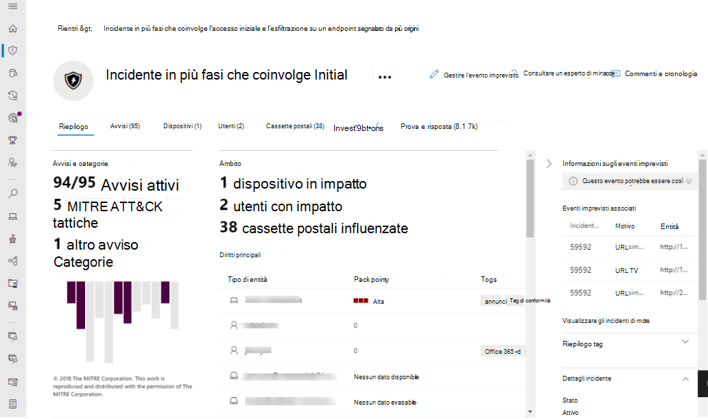

# Panoramica del Centro sicurezza Microsoft 365 unificatoThe unified Microsoft 365 security center overview

[!INCLUDE [Microsoft 365 Defender rebranding](../includes/microsoft-defender.md)]

[!INCLUDE [Prerelease](../includes/prerelease.md)]

**Si applica a:****Applies to:**

- [Microsoft 365 DefenderMicrosoft 365 Defender](microsoft-365-defender.md)
- [Microsoft Defender ATPMicrosoft Defender for Endpoint](https://go.microsoft.com/fwlink/p/?linkid=2154037)
- [Microsoft Defender per Office 365Microsoft Defender for Office 365](/microsoft-365/security/office-365-security/defender-for-office-365)

> Vuoi provare Microsoft 365 Defender?Want to experience Microsoft 365 Defender? Puoi [valutarlo in un ambiente lab](m365d-evaluation.md?ocid=cx-docs-MTPtriallab) o [eseguire il progetto pilota in produzione](m365d-pilot.md?ocid=cx-evalpilot).You can [evaluate it in a lab environment](m365d-evaluation.md?ocid=cx-docs-MTPtriallab) or [run your pilot project in production](m365d-pilot.md?ocid=cx-evalpilot).

Il Centro sicurezza **Microsoft 365** migliorato ( ) combina protezione, rilevamento, indagine e risposta alla posta elettronica, alla collaborazione, all'identità e alle minacce dei [https://security.microsoft.com](https://security.microsoft.com) dispositivi, in un portale centrale.    The improved **Microsoft 365 security center** ([https://security.microsoft.com](https://security.microsoft.com)) combines protection, detection, investigation, and response to *email*, *collaboration*, *identity*, and *device* threats, in a central portal.

Il Centro sicurezza Microsoft 365 riunisce le funzionalità dei portali di sicurezza Microsoft esistenti, come Microsoft Defender Security Center e il Centro sicurezza & e conformità di Office 365.Microsoft 365 security center brings together functionality from existing Microsoft security portals, like Microsoft Defender Security Center and the Office 365 Security & Compliance center. Il centro sicurezza enfatizza l'accesso rapido alle informazioni, ai layout più semplici e alla raccolta delle informazioni correlate per un utilizzo più semplice.The security center emphasizes quick access to information, simpler layouts, and bringing related information together for easier use. Questo centro include:This center includes:

- **[Microsoft Defender per Office 365](/microsoft-365/security/office-365-security/defender-for-office-365)** Microsoft Defender per Office 365 aiuta le organizzazioni a proteggere la propria azienda con un set di funzionalità di prevenzione, rilevamento, indagine e ricerca per proteggere la posta elettronica e le risorse di Office 365.**[Microsoft Defender for Office 365](/microsoft-365/security/office-365-security/defender-for-office-365)** Microsoft Defender for Office 365 helps organizations secure their enterprise with a set of prevention, detection, investigation and hunting features to protect email, and Office 365 resources.
- **[Microsoft Defender for Endpoint](/microsoft-365/security/defender-endpoint/microsoft-defender-advanced-threat-protection)** offre protezione preventiva, rilevamento post-violazione, analisi automatizzata e risposta per i dispositivi nell'organizzazione.**[Microsoft Defender for Endpoint](/microsoft-365/security/defender-endpoint/microsoft-defender-advanced-threat-protection)** delivers preventative protection, post-breach detection, automated investigation, and response for devices in your organization.
- **[Microsoft 365 Defender](microsoft-365-defender.md)** fa parte della soluzione XDR *(Extended Detection and Response)* di Microsoft che sfrutta il portfolio di sicurezza di Microsoft 365 per analizzare automaticamente i dati sulle minacce nei domini e creare un'immagine di un attacco in un singolo dashboard.**[Microsoft 365 Defender](microsoft-365-defender.md)** is part of Microsoft’s *Extended Detection and Response* (XDR) solution that leverages the Microsoft 365 security portfolio to automatically analyze threat data across domains, and build a picture of an attack on a single dashboard.

Se sono necessarie informazioni sulle modifiche dal Centro sicurezza & e conformità di Office 365 o da Microsoft Defender Security Center, vedere:If you need information about what's changed from the Office 365 Security & Compliance center or the Microsoft Defender Security Center, see:

- [Defender per Office 365 nel Centro sicurezza Microsoft 365Defender for Office 365 in the Microsoft 365 security center](microsoft-365-security-center-mdo.md)
- [Defender per endpoint nel Centro sicurezza Microsoft 365Defender for Endpoint in the Microsoft 365 security center](microsoft-365-security-center-mde.md)

## Cosa aspettarsiWhat to expect

Tutti i contenuti di sicurezza utilizzati nel Centro sicurezza e conformità di Office 365 (protection.office.com) e nel Centro sicurezza Microsoft Defender (securitycenter.microsoft.com) sono ora disponibili nel Centro sicurezza *Microsoft 365.*All the security content that you use in the Office 365 Security and Compliance Center (protection.office.com) and the Microsoft Defender security center (securitycenter.microsoft.com) can now be found in the *Microsoft 365 security center*.

Il Centro sicurezza Microsoft 365 aiuta i team di sicurezza ad analizzare e rispondere agli attacchi, inondando i segnali provenienti da carichi di lavoro diversi in un'unica esperienza unificata:Microsoft 365 security center helps security teams investigate and respond to attacks by brining in signals from different workloads into a single, unified experiences:

- Eventi imprevisti & avvisiIncidents & alerts
- RicercaHunting
- Centro notificheAction Center
- Analisi delle minacceThreat analytics

Il Centro sicurezza Microsoft 365 sottolinea *l'unità,* la chiarezza e gli obiettivi comuni in quanto unisce Microsoft Defender per Office 365 e Microsoft Defender for Endpoint.The Microsoft 365 security center emphasizes *unity, clarity, and common goals* as it merges Microsoft Defender for Office 365 and Microsoft Defender for Endpoint. L'unione si basa sulle priorità elencate di seguito e viene effettuata senza sacrificare le funzionalità che ogni suite di sicurezza ha portato alla combinazione:The merge was based on the priorities listed below, and made without sacrificing the capabilities that each security suite brought to the combination:

- blocchi predefiniti comunicommon building blocks
- terminologia comunecommon terminology
- entità comunicommon entities
- parità delle funzionalità con altri carichi di lavorofeature parity with other workloads

## Indagini unificateUnified investigations

La struttura dei centri di sicurezza crea un singolo riquadro per l'analisi di eventuali incidenti in un'organizzazione di Microsoft 365.Streamlining security centers creates a single pane for investigating any incidents across a Microsoft 365 organization. Un esempio principale è il **nodo Eventi** imprevisti sulla barra di avvio veloce del Centro sicurezza Microsoft 365.A primary example is the **Incidents** node on the quick launch of the Microsoft 365 security center.

:::image type="content" source="../../media/converged-incidents-2.png.png" alt-text="Pagina Eventi imprevisti in MDO.":::

Ad esempio, facendo doppio clic sul  nome di un evento imprevisto con gravità elevata viene visualizzata una pagina che dimostra il vantaggio dei centri convergenza.As an example, double-clicking on an incident name with **High** severity brings you to a page that demonstrates the advantage of converging centers.

> [!TIP]
> La scheda **Utenti** convergenti è un buon punto per iniziare le richieste di informazioni.The converged **Users** tab is a good place to begin your inquiries. Questa singola pagina mostra informazioni per gli utenti provenienti da carichi di lavoro convergenti (Microsoft Defender for Endpoint, Microsoft Defender for Identity e MCAS, se lo si utilizza) e una serie di origini, ad esempio Active Directory locale, Azure Active Directory, utenti sincronizzati, locali e di terze parti.This single page surfaces information for users from converged workloads (Microsoft Defender for Endpoint, Microsoft Defender for Identity, and MCAS, if you leverage it) and a range of sources such as on-premises Active Directory, Azure Active Directory, synced, local, and third-party users. Ulteriori informazioni sulla [nuova esperienza degli utenti.](investigate-users.md)Learn more about [the new Users experience](investigate-users.md).

Le informazioni sugli incidenti mostrano le specifiche dell'utente/identità e i dispositivi a rischio, oltre alle cassette postali interessate.Incident information shows user/identity specifics and at-risk devices, beside affected mailboxes. Inoltre, si riferisce a tutte **le informazioni di indagine** e alle prove **raccolte.**It also relates any **Investigation information** and gathered **Evidence**. In questo modo, gli amministratori e i team delle operazioni di sicurezza possono eseguire il pivot da un avviso ad alto rischio agli utenti e alle cassette postali interessati.This makes it easier for admins and security operation teams to pivot from one high-risk alert to the affected users and mailboxes. Osservando le **schede Operazioni** non consentite nella parte superiore di questa pagina, sono disponibili altri pivot di sicurezza chiave da questa singola posizione.Looking at the **Incident** tabs at the top of this page, there are other key security pivots available from this single location.

> [!IMPORTANT]
> Nella parte superiore di qualsiasi pagina per un evento imprevisto specifico, verranno visualizzate le schede **Riepilogo,** **Avvisi,** **Dispositivi,** **Utenti,** Cassette **postali,** Indagini **e** Prova.Along the top of any page for a specific Incident, you'll see the **Summary**, **Alerts**, **Devices**, **Users**, **Mailboxes**, **Investigations**, and **Evidence** tabs.

Selezionando **Indagini viene** aperta una pagina con un elemento grafico dell'analisi in corso ed è elencato uno stato (ad esempio in attesa di approvazione) per la correzione. Selecting **Investigations** opens  a page that features a graphic of the analysis taking place and lists a status (such as **pending approval**) for remediation. Prendere tempo per selezionare eventi imprevisti specifici nell'ambiente, eseguire il drill-down in queste schede e praticare la creazione di un profilo per diversi tipi di minacce.Take time to select specific incidents in your environment, drill down into these tabs, and practice building a profile for different kinds of threats. La familiarità trarrà vantaggio da eventuali indagini urgenti successive.Familiarity will benefit any later pressing investigations.

## Processi miglioratiImproved processes

I controlli e il contenuto comuni vengono visualizzati nello stesso punto oppure sono suddivisi in un unico feed di dati, semplificando l'individuazione.Common controls and content either appear in the same place, or are condensed into one feed of data making it easier to find. Ad esempio, impostazioni unificate.For example, unified settings.

### Impostazioni unificateUnified settings

### Autorizzazioni & ruoliPermissions & roles

 Access the Microsoft 365 security center is configured with Azure Active Directory global roles or by using custom roles.Access the Microsoft 365 security center is configured with Azure Active Directory global roles or by using custom roles. Per Defender for Endpoint, vedi [Assegnare l'accesso utente a Microsoft Defender Security Center.](/microsoft-365/security/defender-endpoint/assign-portal-access)For Defender for Endpoint, see [Assign user access to Microsoft Defender Security Center](/microsoft-365/security/defender-endpoint/assign-portal-access). Per Defender per Office 365, vedere Autorizzazioni nel Centro conformità Microsoft 365 e nel Centro sicurezza [Microsoft 365.](../office-365-security/permissions-microsoft-365-compliance-security.md)For Defender for Office 365, see [Permissions in the Microsoft 365 compliance center and Microsoft 365 security center](../office-365-security/permissions-microsoft-365-compliance-security.md).

- Altre informazioni su come gestire [l'accesso a Microsoft 365 Defender](m365d-permissions.md)Learn more about how to [manage access to Microsoft 365 Defender](m365d-permissions.md)
- Ulteriori informazioni su come creare [ruoli personalizzati](custom-roles.md) nel Centro sicurezza Microsoft 365Learn more about how to [create custom roles](custom-roles.md) in Microsoft 365 security center

> [!NOTE]
> Microsoft Defender for Endpoint nel centro sicurezza Microsoft 365 supporta la concessione dell'accesso ai provider di servizi di sicurezza gestiti [(MSSP)](/windows/security/threat-protection/microsoft-defender-atp/grant-mssp-access) nello stesso modo in cui viene concesso l'accesso nel Centro sicurezza [Microsoft Defender.](./mssp-access.md)Microsoft Defender for Endpoint in the Microsoft 365 security center supports [granting access to managed security service providers (MSSPs)](/windows/security/threat-protection/microsoft-defender-atp/grant-mssp-access) in the same that way access is [granted in the Microsoft Defender security center](./mssp-access.md).

### Report integratiIntegrated reports

I report vengono inoltre unificati nel Centro sicurezza Microsoft 365.Reports are also unified in the Microsoft 365 security center. Gli amministratori possono iniziare con un report di sicurezza generale e creare report specifici sugli endpoint, la posta elettronica & collaborazione.Admins can start with a general security report, and branch into specific reports about endpoints, email & collaboration. I collegamenti qui vengono generati in modo dinamico in base alla configurazione del carico di lavoro.The links here are dynamically generated based upon workload configuration.

### Visualizzare rapidamente l'ambiente Microsoft 365Quickly view your Microsoft 365 environment

La **home** page mostra molte delle schede comuni necessarie ai team di sicurezza.The **Home** page shows many of the common cards that security teams need. La composizione di schede e dati dipende dal ruolo utente.The composition of cards and data is dependent on the user role. Poiché il Centro sicurezza Microsoft 365 utilizza il controllo dell'accesso basato sui ruoli, diversi ruoli visualizzano schede più significative per i loro processi quotidiani.Because the Microsoft 365 security center uses role-based access control, different roles will see cards that are more meaningful to their day to day jobs.  

Queste informazioni dettagliate consentono di tenere il passo con le attività più recenti dell'organizzazione.This at-a-glance information helps you keep up with the latest activities in your organization. Il Centro sicurezza Microsoft 365 riunisce segnali provenienti da origini diverse per presentare una visione olistica dell'ambiente Microsoft 365.The Microsoft 365 security center brings together signals from different sources to present a holistic view of your Microsoft 365 environment.

Le carte rientrano nelle categorie seguenti:The cards fall into these categories:

- **Identità:** monitorare le identità nell'organizzazione e tenere traccia di comportamenti sospetti o rischiosi.**Identities**- Monitor the identities in your organization and keep track of suspicious or risky behaviors. [Ulteriori informazioni sulla protezione delle identità.](/azure/active-directory/identity-protection/overview-identity-protection)[Learn more about identity protection](/azure/active-directory/identity-protection/overview-identity-protection).
- **Dati:** consente di tenere traccia delle attività degli utenti che potrebbero portare alla divulgazione non autorizzata dei dati.**Data** - Help track user activity that could lead to unauthorized data disclosure.
- **Dispositivi:** ottenere informazioni aggiornate su avvisi, attività di violazione e altre minacce nei dispositivi.**Devices** - Get up-to-date information on alerts, breach activity, and other threats on your devices.
- **App:** informazioni dettagliate sull'uso delle app cloud nell'organizzazione.**Apps** - Gain insight into how cloud apps are being used in your organization. [Altre informazioni sulle app individuate da Cloud App Security.](/cloud-app-security/discovered-apps)[Learn more about Cloud App Security discovered apps](/cloud-app-security/discovered-apps).

## Analisi delle minacce con una migliore copertura dei datiThreat analytics with better data coverage
Tenere traccia e rispondere alle minacce emergenti con la seguente esperienza integrata di Analisi delle minacce di Microsoft 365 Defender:Track and respond to emerging threats with the following Microsoft 365 Defender threat analytics integrated experience:

- Una migliore copertura dei dati tra Microsoft Defender for Endpoint e Microsoft Defender per Office 365, rendendo possibile la gestione combinata degli incidenti, l'indagine automatica, la correzione e la ricerca proattiva o reattiva delle minacce nel dominio.Better data coverage between Microsoft Defender for Endpoint and Microsoft Defender for Office 365, making combined incident management, automatic investigation, remediation, and proactive or reactive threat hunting across-domain possible. 
- Rilevamenti e mitigazioni correlati alla posta elettronica da Microsoft Defender per Office 365, oltre ai dati dell'endpoint già disponibili da Microsoft Defender per Endpoint.Email-related detections and mitigations from Microsoft Defender for Office 365, in addition to the endpoint data already available from Microsoft Defender for Endpoint.
- Una visualizzazione degli eventi imprevisti correlati alle minacce che aggregano gli avvisi in storie di attacco end-to-end in Microsoft Defender for Endpoint e Microsoft Defender per Office 365 per ridurre la coda di lavoro, oltre a semplificare e velocizzare l'indagine.A view of threat-related incidents which aggregate alerts into end-to-end attack stories across Microsoft Defender for Endpoint and Microsoft Defender for Office 365 to reduce the work queue, as well as simplify and speed up your investigation.
- Tentativi di attacco rilevati e bloccati dalle soluzioni Microsoft 365 Defender.Attack attempts detected and blocked by Microsoft 365 Defender solutions. Sono inoltre disponibili dati che è possibile utilizzare per guidare azioni preventive che attenuano il rischio di ulteriore esposizione e aumentano la resilienza.There's also data that you can use to drive preventive actions that mitigate the risk of further exposure and increase resilience. 
- Progettazione avanzata che mette sotto i riflettori le informazioni utili per identificare rapidamente i dati su cui concentrarsi, analizzare e sfruttare i report.Enhanced design that puts actionable information in the spotlight to help you  quickly identify data to urgently focus on, investigate, and leverage from the reports.

## Hub di apprendimento centralizzatoA centralized Learning Hub

Il Centro sicurezza Microsoft 365 include un hub di apprendimento che fornisce indicazioni ufficiali da risorse come il blog sulla sicurezza Microsoft, la community di sicurezza Microsoft su YouTube e la documentazione ufficiale su docs.microsoft.com.The Microsoft 365 security center includes a learning hub that bubbles up official guidance from resources such as the Microsoft security blog, the Microsoft security community on YouTube, and the official documentation at docs.microsoft.com.

All'interno dell'hub di apprendimento, le indicazioni per la collaborazione di Email & (Microsoft Defender per Office 365 o MDO) sono affiancate a Endpoint (Microsoft Defender for Endpoint o MDE) e alle risorse di apprendimento di Microsoft 365 Defender.Inside the learning hub, Email & Collaboration (Microsoft Defender for Office 365 or MDO) guidance is side-by-side with Endpoint (Microsoft Defender for Endpoint or MDE), and Microsoft 365 Defender learning resources.

L'hub di apprendimento si apre con percorsi di apprendimento organizzati attorno ad argomenti come "Come analizzare l'uso di Microsoft 365 Defender?"The learning hub opens with Learning paths organized around topics such as “How to Investigate Using Microsoft 365 Defender?” e "Procedure consigliate per Microsoft Defender per Office 365".and “Microsoft Defender for Office 365 Best Practices”. Questa sezione è attualmente curata dal gruppo di prodotti di sicurezza all'interno di Microsoft.This section is currently curated by the security Product Group inside Microsoft. Ogni percorso di apprendimento riflette il tempo proiettato necessario per ottenere i concetti.Each Learning path reflects a projected time it takes to get through the concepts. Ad esempio, "La procedura da eseguire quando un account utente di Microsoft Defender per Office 365 viene compromesso" è proiettato in 8 minuti ed è utile per imparare in tempo reale.For example 'Steps to take when a Microsoft Defender for Office 365 user account is compromised' is projected to take 8 minutes, and is valuable learning on the fly.

Dopo aver fatto clic sul contenuto, può essere utile aggiungere un segnalibro al sito e organizzare i segnalibri in una cartella "Sicurezza" o "Critica".After clicking through to the content, it may be useful to bookmark this site and organize bookmarks into a 'Security' or 'Critical' folder. Per visualizzare tutti i percorsi di apprendimento, fai clic sul collegamento Mostra tutto nel pannello principale.To see all Learning paths, click the Show all link in the main panel.

> [!NOTE]
> Nella parte  superiore dell'hub di apprendimento del Centro sicurezza Microsoft 365 sono disponibili filtri utili che consentono di scegliere tra i prodotti (attualmente Microsoft 365 Defender, Microsoft Defender for Endpoint e Microsoft Defender per Office 365).There are helpful **filters** along the top of the Microsoft 365 security center learning hub that will let you choose between products (currently Microsoft 365 Defender, Microsoft Defender for Endpoint, and Microsoft Defender for Office 365). Si noti che è elencato il numero di risorse di apprendimento per ogni sezione, che può aiutare gli studenti a tenere traccia del numero di risorse a disposizione per la formazione e l'apprendimento.Notice that the number of learning resources for each section is listed, which can help learners keep track of how many resources they have at hand for training and learning.
>
> Oltre al filtro prodotto, sono elencati gli argomenti correnti, i tipi di risorse (dai video ai webinar), i livelli di familiarità o di esperienza con le aree di sicurezza, i ruoli di sicurezza e le funzionalità del prodotto.Along with the Product filter, current topics, types of resources (from videos to webinars), levels of familiarity or experience with security areas, security roles, and product features are listed.

## Inviaci il tuo feedbackSend us your feedback

Abbiamo bisogno del tuo feedback.We need your feedback. Stiamo sempre cercando di migliorare, quindi se c'è qualcosa che vuoi vedere, inviaci il tuo feedback su [Microsoft 365 Defender.](https://www.microsoft.com/videoplayer/embed/RE4K5Ci)We're always looking to improve, so if there's something you'd like to see, [send us your Microsoft 365 Defender feedback](https://www.microsoft.com/videoplayer/embed/RE4K5Ci).

Puoi anche lasciare commenti e suggerimenti da questo articolo.You can also leave feedback from this article. Nella sezione "Feedback" alla fine in "Invia e visualizza feedback per", le opzioni sono Questo *prodotto* o *Questa pagina.*In the 'Feedback' section at the end under 'Submit and view feedback for', the options are *This product*, or *This page*.

Usa il **pulsante Questo prodotto** per il feedback *del* prodotto:Use the **This product** button for *product* feedback:

1. Seleziona *Questo prodotto* nella parte inferiore dell'articolo.Select *This product* at the bottom of the article.
    1. Fai clic con il pulsante destro del mouse sul pulsante e su "Apri in una nuova scheda" se vuoi continuare a leggere queste indicazioni stradali.Right-click the button and 'Open in a new tab' if you want to keep reading these directions.
2. Verrà visualizzato il **forum uservoice**.This will navigate to the **UserVoice forum**.
3. Sono disponibili 2 opzioni:You have 2 options:
    1. Scorrere verso il basso fino alla casella di testo Come migliorare la conformità o proteggere meglio gli utenti *in Office 365?* e incollare nel Centro sicurezza *Microsoft 365.*Scroll down to the text box *How can we improve compliance or protect your users better in Office 365?* and paste in *Microsoft 365 security center*. Puoi cercare nei risultati un'idea come la tua e votarla o usare il pulsante **per Pubblicare una nuova idea.**You can search the results for an idea like yours and up-vote it, or use the button for **Post a new idea**.
    1. Se si è certi che questo problema sia già stato segnalato e si desidera alzarne il profilo con un voto (o voti), utilizzare la casella Invia *feedback* sul lato destro di UserVoice.If you feel certain this issue is already reported, and want to raise its profile with a vote (or votes), use the *Give Feedback* box on the right side of UserVoice. Cercare il *Centro sicurezza Microsoft 365,* **individuare il problema** e usare il pulsante di voto per alzarne lo stato.Search for *Microsoft 365 security center*, **find the issue, and use the vote button** to raise its status.

Usa *questa pagina per* il feedback sull'articolo stesso.Use *This page* for feedback on the article itself. Grazie per il feedback.Thanks for your feedback. La tua voce ci aiuta a migliorare i prodotti.Your voice helps us improve products.

### Scopri cosa offre il Centro sicurezzaExplore what the security center has to offer

Continuare a esplorare le funzionalità e le funzionalità del Centro sicurezza Microsoft 365:Keep exploring the features and capabilities in the Microsoft 365 security center:

- [Gestire eventi imprevisti e avvisiManage incidents and alerts](manage-incidents.md)
- [Tenere traccia e rispondere alle minacce emergenti con l'analisi delle minacceTrack and respond to emerging threats with threat analytics](threat-analytics.md)
- [Centro operativoThe Action center](m365d-action-center.md)
- [Cercare minacce tra dispositivi, posta elettronica, app e identitàHunt for threats across devices, emails, apps, and identities](./advanced-hunting-query-emails-devices.md)
- [Regole di rilevamento personalizzateCustom detection rules](./custom-detection-rules.md)
- [Avvisi posta elettronica e collaborazioneEmail & collaboration alerts](../../compliance/alert-policies.md#default-alert-policies)
- [Creare una simulazione di attacco di phishing](../office-365-security/attack-simulation-training.md) e creare un payload per la formazione dei [team](/microsoft-365/security/office-365-security/attack-simulation-training-payloads)[Create a phishing attack simulation](../office-365-security/attack-simulation-training.md) and [create a payload for training your teams](/microsoft-365/security/office-365-security/attack-simulation-training-payloads)
 
### Informazioni correlateRelated information
- [Centro sicurezza Microsoft 365Microsoft 365 security center](overview-security-center.md)
- [Defender per Office 365 nel Centro sicurezza Microsoft 365Microsoft Defender for Office 365 in the Microsoft 365 security center](microsoft-365-security-center-mdo.md)
- [Microsoft Defender for Endpoint nel Centro sicurezza Microsoft 365Microsoft Defender for Endpoint in the Microsoft 365 security center](microsoft-365-security-center-mde.md)
- [Reindirizzamento degli account da Microsoft Defender per Endpoint al Centro sicurezza Microsoft 365Redirecting accounts from Microsoft Defender for Endpoint to the Microsoft 365 security center](microsoft-365-security-mde-redirection.md)