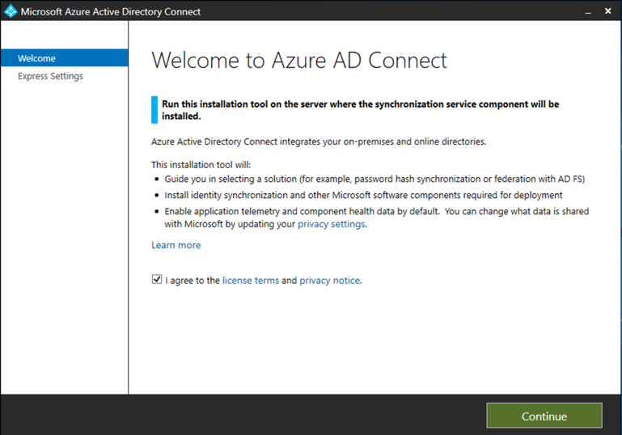

# Preparare il laboratorio di valutazione o l'ambiente pilota di Microsoft 365 DefenderPrepare your Microsoft 365 Defender trial lab or pilot environment

[!INCLUDE [Microsoft 365 Defender rebranding](../includes/microsoft-defender.md)]

**Si applica a:****Applies to:**
- Microsoft 365 DefenderMicrosoft 365 Defender

La creazione di un laboratorio di valutazione o di un ambiente pilota di Microsoft 365 Defender e la distribuzione è un processo in tre fasi:Creating a Microsoft 365 Defender trial lab or pilot environment and deploying it is a three-phase process:

| Fase 1: prepararePhase 1: Prepare | [Fase 2: configurazionePhase 2: Set up](setup-m365deval.md) | [Fase 3: onboardPhase 3: Onboard](config-m365d-eval.md) |  [Torna al playbook pilotaBack to pilot playbook](m365d-pilot.md) |
|--|--|--|--|
|*Sei qui!**You are here!* | || |

È in corso la fase di preparazione.You're currently in the preparation phase.

La preparazione è fondamentale per una distribuzione corretta.Preparation is key to any successful deployment. In questa sezione verranno trattate le informazioni necessarie per preparare la creazione di un laboratorio di valutazione o di un ambiente pilota per la distribuzione di Microsoft 365 Defender.This section will guide you through what you need to consider as you prepare to create a trial lab or pilot environment for your Microsoft 365 Defender deployment.

## PrerequisitiPrerequisites
Informazioni sulle licenze, i requisiti hardware e software e altre impostazioni di configurazione per il provisioning e l'uso di Microsoft 365 Defender.Learn about the licensing, hardware and software requirements, and other configuration settings to provision and use Microsoft 365 Defender. Vedere i requisiti minimi per [Microsoft 365 Defender,](https://docs.microsoft.com/microsoft-365/security/defender/prerequisites) [Microsoft Defender for Endpoint,](https://docs.microsoft.com/windows/security/threat-protection/microsoft-defender-atp/minimum-requirements) [Microsoft Defender per Office 365,](https://docs.microsoft.com/office365/servicedescriptions/office-365-advanced-threat-protection-service-description) [Microsoft Defender for Identity,](https://docs.microsoft.com/azure-advanced-threat-protection/atp-prerequisites) [Microsoft Cloud App Security.](https://docs.microsoft.com/azure-advanced-threat-protection/atp-prerequisites)See the minimum requirements for [Microsoft 365 Defender](https://docs.microsoft.com/microsoft-365/security/defender/prerequisites), [Microsoft Defender for Endpoint](https://docs.microsoft.com/windows/security/threat-protection/microsoft-defender-atp/minimum-requirements), [Microsoft Defender for Office 365](https://docs.microsoft.com/office365/servicedescriptions/office-365-advanced-threat-protection-service-description), [Microsoft Defender for Identity](https://docs.microsoft.com/azure-advanced-threat-protection/atp-prerequisites), [Microsoft Cloud App Security](https://docs.microsoft.com/azure-advanced-threat-protection/atp-prerequisites).

## Parti interessate e disconnessioneStakeholders and sign-off
Identificare tutti gli stakeholder coinvolti nel progetto e chi potrebbe dover disconnettersi, rivedere o rimanere informati, sia per la valutazione che per l'esecuzione di un progetto pilota.Identify all the stakeholders that are involved in the project and who may need to sign-off, review, or stay informed, whether for evaluation or running a pilot project.

>[!NOTE]
>Non tutte le organizzazioni potrebbero avere la maturità dell'organizzazione di sicurezza per avere tali ruoli.Not all organizations might have the security organization maturity to have such roles. In tal caso, consultare il team di leadership sulle responsabilità di revisione e approvazione.In such case, consult with your leadership team on review and approval accountabilities.

Aggiungere le parti interessate alla tabella seguente in base alle esigenze dell'organizzazione.Add stakeholders to the table below as appropriate for your organization.

-   SO = Sign-off on this projectSO = Sign-off on this project

-   R = Rivedere questo progetto e fornire inputR = Review this project and provide input

-   I = Informato di questo progettoI = Informed of this project

| NomeName                 | RuoloRole                                                                                                                                                                                                          | AzioneAction |
|----------------------|---------------------------------------------------------------------------------------------------------------------------------------------------------------------------------------------------------------|--------|
| Immettere nome e posta elettronicaEnter name and email | **Chief Information Security Officer (CISO)** Un rappresentante esecutivo che funge da sponsor all'interno dell'organizzazione *per la distribuzione delle nuove tecnologie.***Chief Information Security Officer (CISO)** *An executive representative who serves as sponsor inside the organization for the new technology deployment.*                                                  | AlloraSO     |
| Immettere nome e posta elettronicaEnter name and email | **Head of Cyber Defense Operations Center (CDOC)** Un rappresentante del team CDOC incaricato di definire in che modo questa modifica è allineata ai processi nel team delle operazioni di *sicurezza dei clienti.***Head of Cyber Defense Operations Center (CDOC)** *A representative from the CDOC team in charge of defining how this change is aligned with the processes in the customers security operations team.*       | AlloraSO     |
| Immettere nome e posta elettronicaEnter name and email | **Security Architect** Un rappresentante del team di sicurezza responsabile della definizione di come questa modifica è allineata all'architettura di sicurezza di *base dell'organizzazione.***Security Architect** *A representative from the Security team in charge of defining how this change is aligned with the core Security architecture in the organization.*                         | RR      |
| Immettere nome e posta elettronicaEnter name and email | **Workplace Architect** Un rappresentante del team IT responsabile della definizione del modo in cui questo cambiamento è allineato all'architettura aziendale di *base dell'organizzazione.***Workplace Architect** *A representative from the IT team in charge of defining how this change is aligned with the core workplace architecture in the organization.*                             | RR      |
| Immettere nome e posta elettronicaEnter name and email | **Security Analyst** *Un rappresentante del team CDOC* che può fornire feedback sulle funzionalità di rilevamento, sull'esperienza utente e sull'utilità complessiva di questo cambiamento dal punto di vista delle operazioni di sicurezza.**Security Analyst** *A representative from the CDOC team who can provide feedback on the detection capabilities, user experience, and overall usefulness of this change from a security operations perspective.* | II      |

## Preparare Azure Active DirectoryPrepare your Azure Active Directory
Ignorare questo passaggio se è già stata abilitata la sincronizzazione tra Active Directory e Azure Active Directory in locale.Skip this step if you have already enabled synchronization between Active Directory and Azure Active Directory on premises. Esaminare la documentazione sulle procedure consigliate esistenti da Azure Active Directory.Review existing best practices documentation from Azure Active Directory. I passaggi seguenti sono ottimizzati per valutare o eseguire un progetto pilota di Microsoft 365 Defender.The following steps are optimized to evaluate or run a pilot Microsoft 365 Defender project.

1. Passare al portale [di Azure Active Directory](https://portal.azure.com/#blade/Microsoft_AAD_IAM/ActiveDirectoryMenuBlade) > Azure AD **Connect**.Go to the [Azure Active Directory](https://portal.azure.com/#blade/Microsoft_AAD_IAM/ActiveDirectoryMenuBlade) portal > **Azure AD Connect**. 
   

2. Fare **clic su** Scarica da Microsoft Azure Active Directory **Connect** e trasferirlo nel controller di dominio.Click **Download** from **Microsoft Azure Active Directory Connect** and transfer it to your Domain Controller.
  

3. Nel controller di dominio, seguire la procedura guidata Azure Active Directory Connect.On the domain controller, follow the Azure Active Directory Connect wizard. Leggi le condizioni di licenza e l'informativa sulla privacy e seleziona la casella di controllo se accetti.Read the license terms and privacy notice and select the checkbox if you agree. Fare clic su **Continua**.Click **Continue**.
  

4. Passare a **Impostazioni rapide**.Navigate to **Express Settings**.
  

5. Immettere le credenziali di amministratore globale.Enter your global administrator credentials. Fare clic su **Avanti**.Click **Next**.
  

6. Immettere le credenziali di amministratore dell'organizzazione di Servizi di dominio Active Directory.Enter your Active Directory Domain Services enterprise administrator credentials. Fare clic su **Avanti**.Click **Next**.
  

7. Fare **clic su** Installa per confermare la configurazione.Click **Install** to confirm the configuration.
  

8. Congratulazioni, azure Active Directory Connect è stato configurato correttamente.Congratulations, you have successfully configured Azure Active Directory Connect.
  

È ora possibile [aggiungere utenti e gruppi ad Active Directory e](/azure-advanced-threat-protection/atp-playbook-setup-lab#bkmk_hydrate) configurare un criterio [SAM-R.](/azure-advanced-threat-protection/atp-playbook-setup-lab#configure-sam-r-capabilities-from-contosodc)You can now [add users and groups to Active Directory](/azure-advanced-threat-protection/atp-playbook-setup-lab#bkmk_hydrate) and [configure a SAM-R policy](/azure-advanced-threat-protection/atp-playbook-setup-lab#configure-sam-r-capabilities-from-contosodc).  

## Ordine di configurazioneConfiguration order
La tabella seguente indica l'ordine consigliato da Microsoft per la configurazione dei componenti di Microsoft 365 Defender per la distribuzione del laboratorio di valutazione o dell'ambiente pilota.The following table indicates the order Microsoft recommends for configuring the Microsoft 365 Defender components for your trial lab or pilot environment deployment.

| ComponenteComponent                               | DescrizioneDescription                                                                                                                                                                                                                                                                                                                                                                                                                                                                                                                                                                                                                                                                                              | Classificazione dell'ordine di configurazioneConfiguration order rank |
|-----------------------------------------|----------------------------------------------------------------------------------------------------------------------------------------------------------------------------------------------------------------------------------------------------------------------------------------------------------------------------------------------------------------------------------------------------------------------------------------------------------------------------------------------------------------------------------------------------------------------------------------------------------------------------------------------------------------------------------------------------------|---------------------|
|Microsoft Defender per Office 365Microsoft Defender for Office 365|Microsoft Defender per Office 365 protegge l'organizzazione dalle minacce dannose rappresentate da messaggi di posta elettronica, collegamenti (URL) e strumenti di collaborazione.Microsoft Defender for Office 365 safeguards your organization against malicious threats posed by email messages, links (URLs), and collaboration tools.   [Ulteriori informazioni.Learn more.](/microsoft-365/security/defender-365-security/defender-for-office-365)                                                                                                                                                                                                                                             | 11                   |
|Microsoft Defender per identitàMicrosoft Defender for Identity|Microsoft Defender for Identity usa i segnali di Active Directory per identificare, rilevare e analizzare minacce avanzate, identità compromesse e azioni insider dannose indirizzate all'organizzazione.Microsoft Defender for Identity uses Active Directory signals to identify, detect, and investigate advanced threats, compromised identities, and malicious insider actions directed at your organization.   [Altre informazioni](/azure-advanced-threat-protection/).[Learn more](/azure-advanced-threat-protection/).| 2 2 |
|Microsoft Cloud App SecurityMicrosoft Cloud App Security| Microsoft Cloud App Security è un Cloud Access Security Broker (CASB) che opera su più cloud.Microsoft Cloud App Security is a Cloud Access Security Broker (CASB) that operates on multiple clouds. Offre una visibilità completa, un controllo sui trasferimenti di dati e analisi sofisticate per identificare e combattere gli attacchi informatici in tutti i servizi cloud.It provides rich visibility, control over data travel, and sophisticated analytics to identify and combat cyberthreats across all your cloud services.   [Altre informazioni](/cloud-app-security/).[Learn more](/cloud-app-security/).                                                                                                                                                                                                                                                                                                                                                                       |3 3                   |
|Microsoft Defender ATPMicrosoft Defender for Endpoint | Le funzionalità di rilevamento e di risposta degli endpoint disponibili in Microsoft Defender per endpoint forniscono il rilevamento di attacchi avanzati quasi in tempo reale.Microsoft Defender for Endpoint endpoint detection and response capabilities provide advanced attack detections that are near real-time and actionable. I responsabili della sicurezza possono assegnare priorità agli avvisi in modo efficace, ottenere una visibilità completa su una violazione e adottare azioni di risposta per correggere le minacce.Security analysts can prioritize alerts effectively, gain visibility into the full scope of a breach, and take response actions to remediate threats.   [Ulteriori informazioni.Learn more.](/windows/security/threat-protection/microsoft-defender-atp/microsoft-defender-advanced-threat-protection)                                     |4 4                   |                                                                                                                                                                                                                                    

## Passaggio successivoNext step
|  [Fase 2: installazionePhase 2: Setup](setup-m365deval.md) | Configurare il laboratorio di valutazione o l'ambiente pilota di Microsoft 365 DefenderSet up your Microsoft 365 Defender trial lab or pilot environment
|:-------|:-----|
