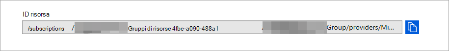

# <a name="configure-microsoft-365-defender-to-stream-advanced-hunting-events-to-your-azure-event-hubs"></a><span data-ttu-id="4b4e3-104">Configurare Microsoft 365 Defender per trasmettere gli eventi di ricerca avanzata agli hub eventi di Azure</span><span class="sxs-lookup"><span data-stu-id="4b4e3-104">Configure Microsoft 365 Defender to stream Advanced Hunting events to your Azure Event Hubs</span></span>

[!INCLUDE [Microsoft 365 Defender rebranding](../../includes/microsoft-defender.md)]


<span data-ttu-id="4b4e3-105">**Si applica a:**</span><span class="sxs-lookup"><span data-stu-id="4b4e3-105">**Applies to:**</span></span>
- [<span data-ttu-id="4b4e3-106">Microsoft 365 Defender</span><span class="sxs-lookup"><span data-stu-id="4b4e3-106">Microsoft 365 Defender</span></span>](https://go.microsoft.com/fwlink/?linkid=2118804)

[!include[Prerelease information](../../includes/prerelease.md)]

## <a name="before-you-begin"></a><span data-ttu-id="4b4e3-107">Informazioni preliminari:</span><span class="sxs-lookup"><span data-stu-id="4b4e3-107">Before you begin:</span></span>

1. <span data-ttu-id="4b4e3-108">Creare un [hub eventi](/azure/event-hubs/) nel tenant.</span><span class="sxs-lookup"><span data-stu-id="4b4e3-108">Create an [event hub](/azure/event-hubs/) in your tenant.</span></span>

2. <span data-ttu-id="4b4e3-109">Accedere al [tenant di Azure,](https://ms.portal.azure.com/)passare a Sottoscrizioni > La sottoscrizione > provider di risorse **> registrarsi a Microsoft.Insights**.</span><span class="sxs-lookup"><span data-stu-id="4b4e3-109">Log in to your [Azure tenant](https://ms.portal.azure.com/), go to **Subscriptions > Your subscription > Resource Providers > Register to Microsoft.Insights**.</span></span>

3. <span data-ttu-id="4b4e3-110">Crea uno spazio dei nomi hub eventi, vai a Hub eventi **> Aggiungi** e seleziona il livello di prezzi, le unità di velocità effettiva e l'gonfiazione automatica appropriata per il carico previsto.</span><span class="sxs-lookup"><span data-stu-id="4b4e3-110">Create an Event Hub Namespace, go to **Event Hubs > Add** and select the pricing tier, throughput units and Auto-Inflate appropriate for expected load.</span></span> <span data-ttu-id="4b4e3-111">Per altre informazioni, vedi [Prezzi - Hub eventi | Microsoft Azure](https://azure.microsoft.com/en-us/pricing/details/event-hubs/).</span><span class="sxs-lookup"><span data-stu-id="4b4e3-111">For more information, see [Pricing - Event Hubs | Microsoft Azure](https://azure.microsoft.com/en-us/pricing/details/event-hubs/).</span></span>  

4. <span data-ttu-id="4b4e3-112">Dopo aver creato lo spazio dei nomi dell'hub eventi, dovrai aggiungere l'entità servizio di registrazione app come lettore, il ricevitore di dati hub eventi di Azure e l'utente che accederà Microsoft 365 Defender come collaboratore (questa operazione può essere eseguita anche a livello di gruppo di risorse o di sottoscrizione).</span><span class="sxs-lookup"><span data-stu-id="4b4e3-112">Once the event hub namespace is created you will need to add the App Registration Service Principal as Reader, Azure Event Hubs Data Receiver and the user who will be logging into Microsoft 365 Defender as Contributor (this can also be done at Resource Group or Subscription level).</span></span> <span data-ttu-id="4b4e3-113">Vai a Hub eventi dello spazio dei nomi > controllo di accesso **(IAM) > Aggiungi** e verifica in **Assegnazioni di ruolo**.</span><span class="sxs-lookup"><span data-stu-id="4b4e3-113">Go to **Event hubs namespace > Access control (IAM) > Add** and verify under **Role assignements**.</span></span>

## <a name="enable-raw-data-streaming"></a><span data-ttu-id="4b4e3-114">Abilita flusso di dati non elaborati:</span><span class="sxs-lookup"><span data-stu-id="4b4e3-114">Enable raw data streaming:</span></span>

1. <span data-ttu-id="4b4e3-115">Accedere al Centro sicurezza [Microsoft 365 Defender](https://security.microsoft.com) come ***Amministratore** globale _ o _* Amministratore _della sicurezza_\*\*.</span><span class="sxs-lookup"><span data-stu-id="4b4e3-115">Log in to the [Microsoft 365 Defender security center](https://security.microsoft.com) as a ***Global Administrator** _ or _*_Security Administrator_\*\*.</span></span>

2. <span data-ttu-id="4b4e3-116">Passare alla [pagina Impostazioni esportazione dati](https://security.microsoft.com/settings/mtp_settings/raw_data_export).</span><span class="sxs-lookup"><span data-stu-id="4b4e3-116">Go to the [Data export settings page](https://security.microsoft.com/settings/mtp_settings/raw_data_export).</span></span>

3. <span data-ttu-id="4b4e3-117">Fare clic su **Aggiungi**.</span><span class="sxs-lookup"><span data-stu-id="4b4e3-117">Click on **Add**.</span></span>

4. <span data-ttu-id="4b4e3-118">Scegliere un nome per le nuove impostazioni.</span><span class="sxs-lookup"><span data-stu-id="4b4e3-118">Choose a name for your new settings.</span></span>

5. <span data-ttu-id="4b4e3-119">Scegliere **Inoltra eventi a Hub eventi di Azure**.</span><span class="sxs-lookup"><span data-stu-id="4b4e3-119">Choose **Forward events to Azure Event Hubs**.</span></span>

6. <span data-ttu-id="4b4e3-120">Puoi scegliere se esportare i dati dell'evento in un singolo hub eventi o per esportare ogni tabella di eventi in un hub pari diverso nello spazio dei nomi dell'hub eventi.</span><span class="sxs-lookup"><span data-stu-id="4b4e3-120">You can select if you want to export the event data to a single event hub, or to export each event table to a different even hub in your event hub namespace.</span></span> 

7. <span data-ttu-id="4b4e3-121">Per esportare i dati dell'evento in un singolo hub eventi, immetti il nome **dell'hub eventi** e l'ID **risorsa Hub eventi.**</span><span class="sxs-lookup"><span data-stu-id="4b4e3-121">To export the event data to a single event hub, Enter your **Event Hub name** and your **Event Hub resource ID**.</span></span>

   <span data-ttu-id="4b4e3-122">Per ottenere **l'ID** risorsa Hub eventi, passare alla pagina dello spazio dei nomi Hub eventi di [Azure](https://ms.portal.azure.com/)nella scheda Proprietà di Azure > copiare il testo in  >   ID **risorsa**:</span><span class="sxs-lookup"><span data-stu-id="4b4e3-122">To get your **Event Hubs resource ID**, go to your Azure Event Hubs namespace page on [Azure](https://ms.portal.azure.com/) > **Properties** tab > copy the text under **Resource ID**:</span></span>

   

8. <span data-ttu-id="4b4e3-124">Scegli gli eventi che vuoi trasmettere e fai clic su **Salva.**</span><span class="sxs-lookup"><span data-stu-id="4b4e3-124">Choose the events you want to stream and click **Save**.</span></span>

## <a name="the-schema-of-the-events-in-azure-event-hubs"></a><span data-ttu-id="4b4e3-125">Schema degli eventi negli hub eventi di Azure:</span><span class="sxs-lookup"><span data-stu-id="4b4e3-125">The schema of the events in Azure Event Hubs:</span></span>

```
{
    "records": [
                    {
                        "time": "<The time Microsoft 365 Defender received the event>"
                        "tenantId": "<The Id of the tenant that the event belongs to>"
                        "category": "<The Advanced Hunting table name with 'AdvancedHunting-' prefix>"
                        "properties": { <Microsoft 365 Defender Advanced Hunting event as Json> }
                    }
                    ...
                ]
}
```

- <span data-ttu-id="4b4e3-126">Ogni messaggio dell'hub eventi in Hub eventi di Azure contiene un elenco di record.</span><span class="sxs-lookup"><span data-stu-id="4b4e3-126">Each event hub message in Azure Event Hubs contains list of records.</span></span>

- <span data-ttu-id="4b4e3-127">Ogni record contiene il nome dell'evento, l'ora in cui Microsoft 365 Defender ha ricevuto l'evento, il tenant a cui appartiene (si otterrà solo gli eventi dal tenant) e l'evento in formato JSON in una proprietà denominata "**properties**".</span><span class="sxs-lookup"><span data-stu-id="4b4e3-127">Each record contains the event name, the time Microsoft 365 Defender received the event, the tenant it belongs (you will only get events from your tenant), and the event in JSON format in a property called "**properties**".</span></span>

- <span data-ttu-id="4b4e3-128">Per altre informazioni sullo schema degli eventi Microsoft 365 Defender, vedi [Panoramica di Advanced Hunting.](advanced-hunting-overview.md)</span><span class="sxs-lookup"><span data-stu-id="4b4e3-128">For more information about the schema of Microsoft 365 Defender events, see [Advanced Hunting overview](advanced-hunting-overview.md).</span></span>

- <span data-ttu-id="4b4e3-129">In Ricerca avanzata, la **tabella DeviceInfo** contiene una colonna denominata **MachineGroup** che contiene il gruppo del dispositivo.</span><span class="sxs-lookup"><span data-stu-id="4b4e3-129">In Advanced Hunting, the **DeviceInfo** table has a column named **MachineGroup** which contains the group of the device.</span></span> <span data-ttu-id="4b4e3-130">Anche qui ogni evento verrà decorato con questa colonna.</span><span class="sxs-lookup"><span data-stu-id="4b4e3-130">Here every event will be decorated with this column as well.</span></span> 

9. <span data-ttu-id="4b4e3-131">Per esportare ogni tabella di eventi in un hub eventi diverso, lascia semplicemente vuoto il nome **dell'hub** eventi e Microsoft 365 Defender farà il resto.</span><span class="sxs-lookup"><span data-stu-id="4b4e3-131">To export each event table to a different event hub, simply leave the **Event hub name** empty, and Microsoft 365 Defender will do the rest.</span></span>


## <a name="data-types-mapping"></a><span data-ttu-id="4b4e3-132">Mapping dei tipi di dati:</span><span class="sxs-lookup"><span data-stu-id="4b4e3-132">Data types mapping:</span></span>

<span data-ttu-id="4b4e3-133">Per ottenere i tipi di dati per le proprietà dell'evento, eseguire le operazioni seguenti:</span><span class="sxs-lookup"><span data-stu-id="4b4e3-133">To get the data types for event properties do the following:</span></span>

1. <span data-ttu-id="4b4e3-134">Accedi al centro [Microsoft 365 sicurezza](https://security.microsoft.com) e vai alla pagina [Ricerca avanzata.](https://security.microsoft.com/hunting-package)</span><span class="sxs-lookup"><span data-stu-id="4b4e3-134">Log in to [Microsoft 365 security center](https://security.microsoft.com) and go to [Advanced Hunting page](https://security.microsoft.com/hunting-package).</span></span>

2. <span data-ttu-id="4b4e3-135">Eseguire la query seguente per ottenere il mapping dei tipi di dati per ogni evento:</span><span class="sxs-lookup"><span data-stu-id="4b4e3-135">Run the following query to get the data types mapping for each event:</span></span>
 
   ```
   {EventType}
   | getschema
   | project ColumnName, ColumnType 
   ```

- <span data-ttu-id="4b4e3-136">Ecco un esempio di evento Info dispositivo:</span><span class="sxs-lookup"><span data-stu-id="4b4e3-136">Here is an example for Device Info event:</span></span> 

  

## <a name="related-topics"></a><span data-ttu-id="4b4e3-138">Argomenti correlati</span><span class="sxs-lookup"><span data-stu-id="4b4e3-138">Related topics</span></span>
- [<span data-ttu-id="4b4e3-139">Panoramica della ricerca avanzata</span><span class="sxs-lookup"><span data-stu-id="4b4e3-139">Overview of Advanced Hunting</span></span>](advanced-hunting-overview.md)
- [<span data-ttu-id="4b4e3-140">Microsoft 365 Defender streaming API</span><span class="sxs-lookup"><span data-stu-id="4b4e3-140">Microsoft 365 Defender streaming API</span></span>](streaming-api.md)
- [<span data-ttu-id="4b4e3-141">Trasmettere Microsoft 365 eventi di Defender all'account di archiviazione di Azure</span><span class="sxs-lookup"><span data-stu-id="4b4e3-141">Stream Microsoft 365 Defender events to your Azure storage account</span></span>](streaming-api-storage.md)
- [<span data-ttu-id="4b4e3-142">Documentazione di Azure Event Hubs</span><span class="sxs-lookup"><span data-stu-id="4b4e3-142">Azure Event Hubs documentation</span></span>](/azure/event-hubs/)
- [<span data-ttu-id="4b4e3-143">Risolvere i problemi di connettività - Hub eventi di Azure</span><span class="sxs-lookup"><span data-stu-id="4b4e3-143">Troubleshoot connectivity issues - Azure Event Hubs</span></span>](/azure/event-hubs/troubleshooting-guide)
