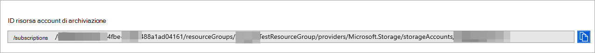
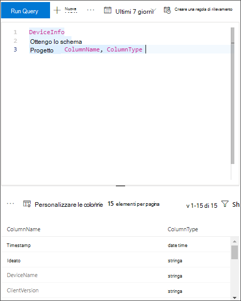

# <a name="configure-microsoft-365-defender-to-stream-advanced-hunting-events-to-your-storage-account"></a><span data-ttu-id="52e48-104">Configurare Microsoft 365 Defender per trasmettere eventi di ricerca avanzata al tuo account Archiviazione</span><span class="sxs-lookup"><span data-stu-id="52e48-104">Configure Microsoft 365 Defender to stream Advanced Hunting events to your Storage account</span></span>

[!INCLUDE [Microsoft 365 Defender rebranding](../../includes/microsoft-defender.md)]


<span data-ttu-id="52e48-105">**Si applica a:**</span><span class="sxs-lookup"><span data-stu-id="52e48-105">**Applies to:**</span></span>
- [<span data-ttu-id="52e48-106">Microsoft 365 Defender</span><span class="sxs-lookup"><span data-stu-id="52e48-106">Microsoft 365 Defender</span></span>](https://go.microsoft.com/fwlink/?linkid=2118804)

[!include[Prerelease information](../../includes/prerelease.md)]

## <a name="before-you-begin"></a><span data-ttu-id="52e48-107">Prima di iniziare</span><span class="sxs-lookup"><span data-stu-id="52e48-107">Before you begin</span></span>

1. <span data-ttu-id="52e48-108">Creare un [Archiviazione nel](/azure/storage/common/storage-account-overview) tenant.</span><span class="sxs-lookup"><span data-stu-id="52e48-108">Create a [Storage account](/azure/storage/common/storage-account-overview) in your tenant.</span></span>

2. <span data-ttu-id="52e48-109">Accedere al [tenant di Azure,](https://ms.portal.azure.com/)passare a Sottoscrizioni > La sottoscrizione > provider di risorse **> registrarsi a Microsoft.Insights**.</span><span class="sxs-lookup"><span data-stu-id="52e48-109">Log in to your [Azure tenant](https://ms.portal.azure.com/), go to **Subscriptions > Your subscription > Resource Providers > Register to Microsoft.Insights**.</span></span>

## <a name="enable-raw-data-streaming"></a><span data-ttu-id="52e48-110">Abilitare lo streaming di dati non elaborati</span><span class="sxs-lookup"><span data-stu-id="52e48-110">Enable raw data streaming</span></span>

1. <span data-ttu-id="52e48-111">Accedere al portale di Microsoft 365 Defender ( <https://security.microsoft.com> ) come ***Amministratore** globale _ o _*_Amministratore della sicurezza_\*\*.</span><span class="sxs-lookup"><span data-stu-id="52e48-111">Log in to the Microsoft 365 Defender portal (<https://security.microsoft.com>) as a ***Global Administrator** _ or _*_Security Administrator_\*\*.</span></span>

2. <span data-ttu-id="52e48-112">Vai a **Impostazioni** \> **Microsoft 365 Defender** \> **Streaming API**.</span><span class="sxs-lookup"><span data-stu-id="52e48-112">Go to **Settings** \> **Microsoft 365 Defender** \> **Streaming API**.</span></span> <span data-ttu-id="52e48-113">Per passare direttamente alla pagina **API di streaming,** usa <https://security.microsoft.com/settings/mtp_settings/raw_data_export> .</span><span class="sxs-lookup"><span data-stu-id="52e48-113">To go directly to the **Streaming API** page, use <https://security.microsoft.com/settings/mtp_settings/raw_data_export>.</span></span>

3. <span data-ttu-id="52e48-114">Fare clic su **Aggiungi**.</span><span class="sxs-lookup"><span data-stu-id="52e48-114">Click **Add**.</span></span>

4. <span data-ttu-id="52e48-115">Nel riquadro **a comparsa Aggiungi nuove impostazioni API** di streaming visualizzato configura le impostazioni seguenti:</span><span class="sxs-lookup"><span data-stu-id="52e48-115">In the **Add new Streaming API settings** flyout that appears, configure the following settings:</span></span>
   1. <span data-ttu-id="52e48-116">**Nome**: scegliere un nome per le nuove impostazioni.</span><span class="sxs-lookup"><span data-stu-id="52e48-116">**Name**: Choose a name for your new settings.</span></span>
   2. <span data-ttu-id="52e48-117">Selezionare **Inoltra eventi a Archiviazione di Azure**.</span><span class="sxs-lookup"><span data-stu-id="52e48-117">Select **Forward events to Azure Storage**.</span></span>
   3. <span data-ttu-id="52e48-118">Nella casella **Archiviazione ID** risorsa account che viene visualizzato digitare l Archiviazione ID **risorsa account.**</span><span class="sxs-lookup"><span data-stu-id="52e48-118">In the **Storage Account Resource ID** box that appears, type your **Storage Account Resource ID**.</span></span> <span data-ttu-id="52e48-119">Per ottenere **l'ID** risorsa account Archiviazione , aprire il portale di Azure in , fare clic su account Archiviazione passare alla scheda proprietà copiare il testo in ID risorsa account Archiviazione <https://portal.azure.com>  \> \> . </span><span class="sxs-lookup"><span data-stu-id="52e48-119">To get your **Storage Account Resource ID**, open the Azure portal at <https://portal.azure.com>, click **Storage accounts** \> go to the properties tab \> copy the text under **Storage Account Resource ID**.</span></span>

      

   4. <span data-ttu-id="52e48-121">Torna al riquadro a comparsa **Aggiungi nuove impostazioni API** di streaming, scegli i tipi **di** evento che vuoi trasmettere.</span><span class="sxs-lookup"><span data-stu-id="52e48-121">Back on the **Add new Streaming API settings** flyout, choose the **Event types** that you want to stream.</span></span>

   <span data-ttu-id="52e48-122">Al termine, fare clic su **Invia.**</span><span class="sxs-lookup"><span data-stu-id="52e48-122">When you're finished, click **Submit**.</span></span>

## <a name="the-schema-of-the-events-in-the-storage-account"></a><span data-ttu-id="52e48-123">Schema degli eventi nell'account Archiviazione account</span><span class="sxs-lookup"><span data-stu-id="52e48-123">The schema of the events in the Storage account</span></span>

- <span data-ttu-id="52e48-124">Verrà creato un contenitore BLOB per ogni tipo di evento:</span><span class="sxs-lookup"><span data-stu-id="52e48-124">A blob container will be created for each event type:</span></span>

  

- <span data-ttu-id="52e48-126">Lo schema di ogni riga di un BLOB è il codice JSON seguente:</span><span class="sxs-lookup"><span data-stu-id="52e48-126">The schema of each row in a blob is the following JSON:</span></span>

  ```JSON
  {
          "time": "<The time Microsoft 365 Defender received the event>"
          "tenantId": "<Your tenant ID>"
          "category": "<The Advanced Hunting table name with 'AdvancedHunting-' prefix>"
          "properties": { <Microsoft 365 Defender Advanced Hunting event as Json> }
  }
  ```

- <span data-ttu-id="52e48-127">Ogni BLOB contiene più righe.</span><span class="sxs-lookup"><span data-stu-id="52e48-127">Each blob contains multiple rows.</span></span>

- <span data-ttu-id="52e48-128">Ogni riga contiene il nome dell'evento, l'ora in cui Defender per Endpoint ha ricevuto l'evento, il tenant a cui appartiene (si otterrà solo gli eventi dal tenant) e l'evento in formato JSON in una proprietà denominata "proprietà".</span><span class="sxs-lookup"><span data-stu-id="52e48-128">Each row contains the event name, the time Defender for Endpoint received the event, the tenant it belongs (you will only get events from your tenant), and the event in JSON format in a property called "properties".</span></span>

- <span data-ttu-id="52e48-129">Per ulteriori informazioni sullo schema degli eventi Microsoft 365 Defender, vedere [Advanced Hunting overview.](../defender/advanced-hunting-overview.md)</span><span class="sxs-lookup"><span data-stu-id="52e48-129">For more information about the schema of Microsoft 365 Defender events, see [Advanced Hunting overview](../defender/advanced-hunting-overview.md).</span></span>

## <a name="data-types-mapping"></a><span data-ttu-id="52e48-130">Mapping dei tipi di dati</span><span class="sxs-lookup"><span data-stu-id="52e48-130">Data types mapping</span></span>

<span data-ttu-id="52e48-131">Per ottenere i tipi di dati per le proprietà degli eventi, eseguire le operazioni seguenti:</span><span class="sxs-lookup"><span data-stu-id="52e48-131">In order to get the data types for our events properties do the following:</span></span>

1. <span data-ttu-id="52e48-132">Accedi al portale di Microsoft 365 Defender ( <https://security.microsoft.com> ) e vai a Ricerca **avanzata** \> **ricerca**.</span><span class="sxs-lookup"><span data-stu-id="52e48-132">Log in to the Microsoft 365 Defender portal (<https://security.microsoft.com>) and go to **Hunting** \> **Advanced hunting**.</span></span> <span data-ttu-id="52e48-133">Per passare direttamente alla **pagina Ricerca avanzata,** utilizzare <security.microsoft.com/advanced-hunting>.</span><span class="sxs-lookup"><span data-stu-id="52e48-133">To go directly to the **Advanced hunting** page, use <security.microsoft.com/advanced-hunting>.</span></span>

2. <span data-ttu-id="52e48-134">Nella scheda **Query** eseguire la query seguente per ottenere il mapping dei tipi di dati per ogni evento:</span><span class="sxs-lookup"><span data-stu-id="52e48-134">On the **Query** tab, run the following query to get the data types mapping for each event:</span></span>

   ```text
   {EventType}
   | getschema
   | project ColumnName, ColumnType
   ```

- <span data-ttu-id="52e48-135">Ecco un esempio di evento Info dispositivo:</span><span class="sxs-lookup"><span data-stu-id="52e48-135">Here is an example for Device Info event:</span></span>

  

## <a name="related-topics"></a><span data-ttu-id="52e48-137">Argomenti correlati</span><span class="sxs-lookup"><span data-stu-id="52e48-137">Related topics</span></span>

- [<span data-ttu-id="52e48-138">Panoramica della ricerca avanzata</span><span class="sxs-lookup"><span data-stu-id="52e48-138">Overview of Advanced Hunting</span></span>](../defender/advanced-hunting-overview.md)
- [<span data-ttu-id="52e48-139">Microsoft 365 Defender Streaming API</span><span class="sxs-lookup"><span data-stu-id="52e48-139">Microsoft 365 Defender Streaming API</span></span>](streaming-api.md)
- [<span data-ttu-id="52e48-140">Trasmettere Microsoft 365 Defender eventi all'account di archiviazione di Azure</span><span class="sxs-lookup"><span data-stu-id="52e48-140">Stream Microsoft 365 Defender events to your Azure storage account</span></span>](streaming-api-storage.md)
- [<span data-ttu-id="52e48-141">Archiviazione di Azure Documentazione dell'account</span><span class="sxs-lookup"><span data-stu-id="52e48-141">Azure Storage Account documentation</span></span>](/azure/storage/common/storage-account-overview)
