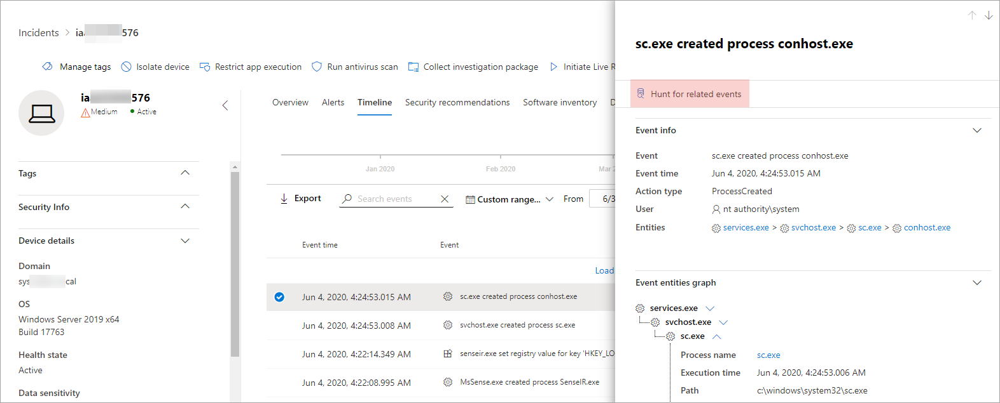

# <a name="quickly-hunt-for-entity-or-event-information-with-go-hunt"></a>Cercare rapidamente informazioni su entità o eventi con Go Hunt

[!INCLUDE [Microsoft 365 Defender rebranding](../includes/microsoft-defender.md)]


**Si applica a:**
- Microsoft Threat Protection

Con l'azione *Go Hunt* , è possibile esaminare rapidamente gli eventi e i vari tipi di entità utilizzando potenti funzionalità di [caccia avanzate](advanced-hunting-overview.md) basate su query. Questa azione esegue automaticamente una query di ricerca avanzata per trovare informazioni rilevanti sull'evento o l'entità selezionata.

L'azione *Go Hunt* è disponibile in diverse sezioni del Centro sicurezza ogni volta che vengono visualizzati i dettagli dell'evento o dell'entità. Ad esempio, è possibile utilizzare *Go Hunt* dalle sezioni seguenti:

- Nella [pagina Incident](investigate-incidents.md#incident-overview)è possibile esaminare i dettagli relativi a utenti, dispositivi e molte altre entità associate a un evento Incident. Quando si seleziona un'entità, vengono fornite informazioni aggiuntive e diverse azioni che è possibile intraprendere su tale entitity. Nell'esempio seguente viene selezionata una cassetta postale, in cui vengono visualizzati i dettagli relativi alla cassetta postale e l'opzione di ricerca per ulteriori informazioni sulla cassetta postale.

    

- Nella pagina Incident è inoltre possibile accedere a un elenco di entità nella scheda Evidence. Se si seleziona una di queste entità, viene fornita un'opzione per cercare rapidamente informazioni su tale entità.

    


- Quando si visualizza la sequenza temporale per un dispositivo, è possibile selezionare un evento nella sequenza temporale per visualizzare ulteriori informazioni su quell'evento. Dopo aver selezionato un evento, si ottiene la possibilità di cercare altri eventi rilevanti nella ricerca avanzata.

    

Se si seleziona Vai o Cerca **per eventi correlati** , **vengono** passate diverse query, a seconda che sia stata selezionata un'entità o un evento.

## <a name="query-for-entity-information"></a>Query per informazioni sulle entità
Quando si utilizza *Go Hunt* per eseguire una query per informazioni su un utente, un dispositivo o qualsiasi altro tipo di entità, la query verifica tutte le tabelle dello schema rilevanti per tutti gli eventi che interessano tale entità. Per garantire la gestione dei risultati, la query ha un ambito pari a circa lo stesso periodo di tempo della prima attività negli ultimi 30 giorni che coinvolge l'entità ed è associata all'evento Incident.

Di seguito è riportato un esempio della query Go Hunt per un dispositivo:

```kusto
let selectedTimestamp = datetime(2020-06-02T02:06:47.1167157Z);
let deviceName = "fv-az770.example.com";
let deviceId = "device-guid";
search in (DeviceLogonEvents, DeviceProcessEvents, DeviceNetworkEvents, DeviceFileEvents, DeviceRegistryEvents, DeviceImageLoadEvents, DeviceEvents, DeviceImageLoadEvents, IdentityLogonEvents, IdentityQueryEvents)
Timestamp between ((selectedTimestamp - 1h) .. (selectedTimestamp + 1h))
and DeviceName == deviceName
// or RemoteDeviceName == deviceName
// or DeviceId == deviceId
| take 100
```
### <a name="supported-entity-types"></a>Tipi di entità supportate
È possibile utilizzare *Go Hunt* dopo aver selezionato uno qualsiasi di questi tipi di entità:

- File
- Messaggi di posta elettronica
- Cluster di posta elettronica
- Cassette postali
- Utenti
- Dispositivi
- Indirizzi IP
- URL

## <a name="query-for-event-information"></a>Query per informazioni sugli eventi
Quando si utilizza *Go Hunt* per eseguire una query per informazioni su un evento Timeline, la query verifica tutte le tabelle dello schema rilevanti per gli altri eventi che interessano il periodo dell'evento selezionato. Ad esempio, la query seguente elenca gli eventi in diverse tabelle dello schema che si sono verificati nello stesso periodo di tempo nello stesso dispositivo:

```kusto
// List relevant events 30 minutes before and after selected LogonAttempted event
let selectedEventTimestamp = datetime(2020-06-04T01:29:09.2496688Z);
search in (DeviceFileEvents, DeviceProcessEvents, DeviceEvents, DeviceRegistryEvents, DeviceNetworkEvents, DeviceImageLoadEvents, DeviceLogonEvents)
    Timestamp between ((selectedEventTimestamp - 30m) .. (selectedEventTimestamp + 30m))
    and DeviceId == "079ecf9c5798d249128817619606c1c47369eb3e"
| sort by Timestamp desc
| extend Relevance = iff(Timestamp == selectedEventTimestamp, "Selected event", iff(Timestamp < selectedEventTimestamp, "Earlier event", "Later event"))
| project-reorder Relevance
```

## <a name="adjust-the-query"></a>Modificare la query
Con una certa conoscenza del [linguaggio di query](advanced-hunting-query-language.md), è possibile modificare la query in base alle proprie preferenze. Ad esempio, è possibile modificare questa linea, che determina le dimensioni della finestra temporale:

```kusto
Timestamp between ((selectedTimestamp - 1h) .. (selectedTimestamp + 1h))
```

Oltre a modificare la query per ottenere risultati più rilevanti, è anche possibile:
- [Visualizzare i risultati come grafici](advanced-hunting-query-results.md#view-query-results-as-a-table-or-chart)
- [Creare una regola di rilevamento personalizzata](custom-detection-rules.md)

## <a name="related-topics"></a>Argomenti correlati
- [Panoramica della ricerca avanzata](advanced-hunting-overview.md)
- [Capire il linguaggio delle query](advanced-hunting-query-language.md)
- [Usare i risultati delle query](advanced-hunting-query-results.md)
- [Regole di rilevamento personalizzate](custom-detection-rules.md)
