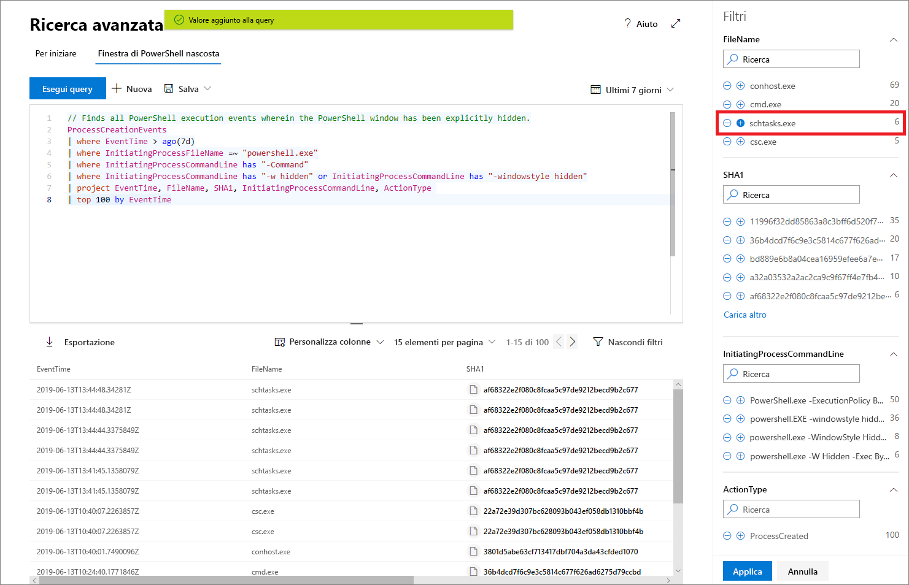

# Cercare in modo proattivo minacce con la ricerca avanzata di Microsoft Threat Protection

**Si applica a:**
- Microsoft Threat Protection

[!include[Prerelease information](prerelease.md)]

La ricerca avanzata è uno strumento di ricerca delle minacce basato sulla query che permette di esplorare dati non elaborati fino a 30 giorni. È possibile controllare in modo proattivo eventi nella rete per localizzare indicatori ed entità interessanti. L'accesso flessibile ai dati facilita la ricerca non vincolata delle minacce conosciute e potenziali.

nel Centro sicurezza Microsoft 365, la ricerca avanzata supporta query che esaminano i dati di Microsoft Defender ATP, di dispositivi caricati e di Office 365 ATP, fornendo i dati dalle email. Per utilizzare la ricerca avanzata, [attivare Microsoft Threat Protection](mtp-enable.md).

## Introduzione alla ricerca avanzata

È consigliabile passare attraverso diverse fasi per diventare rapidamente operativi con la ricerca avanzata.

| Obiettivo di formazione | Descrizione | Risorsa |
|--|--|--|
| **Avere un'idea della lingua** | La ricerca avanzata si basa sul [linguaggio di query Kusto](https://docs.microsoft.com/azure/kusto/query/), supportandone la sintassi e gli operatori. Iniziare ad apprendere il linguaggio di query eseguendone la prima. | [Informazioni generali sul linguaggio di query](advanced-hunting-query-language.md) |
| **Comprensione dello schema** | È possibile ottenere una conoscenza buona e approfondita delle tabelle nello schema e delle relative colonne. Questo consente di determinare dove cercare i dati e come creare le query. | [Informazioni di riferimento sullo schema](advanced-hunting-schema-tables.md) |
| **Utilizzare le query predefinite** | Esplorare le raccolte di query predefinite che coprono diversi scenari di ricerca delle minacce. | [Utilizzare le query condivise](advanced-hunting-shared-queries.md)
| **Ottimizzare le query** | Informazioni su come creare query efficienti e query che combinino dati da email e dispositivi. | [Procedure consigliate per le query](advanced-hunting-shared-queries.md), [Ricerca attraverso dispositivi ed email](advanced-hunting-best-practices.md)

## Ottenere assistenza nella scrittura delle query
Trarre vantaggio dalle seguenti funzionalità per scrivere query più velocemente:
- **Suggerimenti automatici** — durante la scrittura di query, la ricerca avanzata propone suggerimenti. 
- **Riferimento di schema** — accanto all’area di lavoro è disponibile il riferimento a uno schema che include l'elenco di tabelle e le relative colonne. Per altre informazioni, passare il puntatore su un elemento. Fare doppio clic su un elemento per inserirlo nell'editor di query.

## Eseguire il drill-down dai risultati della query
Per visualizzare altre informazioni sulle entità, come computer, file, utenti, indirizzi IP e URL, fare clic sull'identificatore di entità nei risultati delle query. Quindi si aprirà una pagina profilo dettagliata per l’entità selezionata nel Microsoft Defender Security Center.

## Perfezionare le query dai risultati
Fare clic con il pulsante destro del mouse su un valore nel set di risultati per migliorare rapidamente la query. È possibile usare le opzioni per:

- Cercare in modo esplicito il valore selezionato (`==`)
- Escludere il valore selezionato dalla query (`!=`)
- Per aggiungere il valore alla query, è possibile usare gli operatori più avanzati, come `contains`, `starts with` e `ends with` 

## Filtrare i risultati della query
I filtri visualizzati a destra forniscono un riepilogo del set di risultati. Ogni colonna ha una propria sezione in cui sono elencati i valori distinti individuati per quella colonna e il numero di istanze.

Perfezionare la query selezionando i pulsanti "+" o "-" sui valori che si desidera includere o escludere e quindi selezionare **Esegui query**.

Dopo avere applicato il filtro per modificare la query e aver eseguito la query, i risultati vengono aggiornati di conseguenza.

## Argomenti correlati
- [Apprendere il linguaggio delle query](advanced-hunting-query-language.md)
- [Utilizzare le query condivise](advanced-hunting-shared-queries.md)
- [Ricerca delle minacce attraverso dispositivi ed email](advanced-hunting-query-emails-devices.md)
- [Comprendere lo schema](advanced-hunting-schema-tables.md)
- [Applicazione delle procedure consigliate per le query](advanced-hunting-best-practices.md)