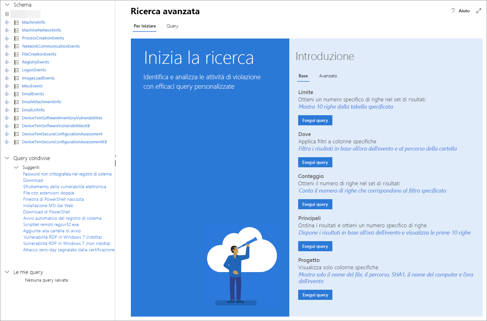

# <a name="learn-the-advanced-hunting-query-language"></a><span data-ttu-id="ae6bd-104">Scoprire il linguaggio delle query in Ricerca avanzata</span><span class="sxs-lookup"><span data-stu-id="ae6bd-104">Learn the advanced hunting query language</span></span>

<span data-ttu-id="ae6bd-105">**Si applica a:**</span><span class="sxs-lookup"><span data-stu-id="ae6bd-105">**Applies to:**</span></span>
- <span data-ttu-id="ae6bd-106">Microsoft Threat Protection</span><span class="sxs-lookup"><span data-stu-id="ae6bd-106">Microsoft Threat Protection</span></span>

[!INCLUDE [Prerelease information](../includes/prerelease.md)]

<span data-ttu-id="ae6bd-107">Ricerca avanzata si basa sul [linguaggio delle query in Esplora dati](https://docs.microsoft.com/azure/kusto/query/).</span><span class="sxs-lookup"><span data-stu-id="ae6bd-107">Advanced hunting is based on the [Kusto query language](https://docs.microsoft.com/azure/kusto/query/).</span></span> <span data-ttu-id="ae6bd-108">È possibile usare la sintassi e gli operatori di Esplora dati per creare query che individuano informazioni nello [schema](advanced-hunting-schema-tables.md) specificamente strutturate per Ricerca avanzata.</span><span class="sxs-lookup"><span data-stu-id="ae6bd-108">You can use Kusto syntax and operators to construct queries that locate information in the [schema](advanced-hunting-schema-tables.md) specifically structured for advanced hunting.</span></span> <span data-ttu-id="ae6bd-109">Per comprendere meglio questi concetti, eseguire la prima query.</span><span class="sxs-lookup"><span data-stu-id="ae6bd-109">To understand these concepts better, run your first query.</span></span>

## <a name="try-your-first-query"></a><span data-ttu-id="ae6bd-110">Provare la prima query</span><span class="sxs-lookup"><span data-stu-id="ae6bd-110">Try your first query</span></span>

<span data-ttu-id="ae6bd-111">nel Centro sicurezza Microsoft 365 andare su **Ricerca** per eseguire la prima query.</span><span class="sxs-lookup"><span data-stu-id="ae6bd-111">in the Microsoft 365 security center, go to **Hunting** to run your first query.</span></span> <span data-ttu-id="ae6bd-112">Usare l'esempio seguente:</span><span class="sxs-lookup"><span data-stu-id="ae6bd-112">Use the following example:</span></span>

```kusto
// Finds PowerShell execution events that could involve a download.
DeviceProcessEvents 
| where Timestamp > ago(7d)
| where FileName in ("powershell.exe", "POWERSHELL.EXE", "powershell_ise.exe", "POWERSHELL_ISE.EXE") 
| where ProcessCommandLine has "Net.WebClient"
        or ProcessCommandLine has "DownloadFile"
        or ProcessCommandLine has "Invoke-WebRequest"
        or ProcessCommandLine has "Invoke-Shellcode"
        or ProcessCommandLine contains "http:"
| project Timestamp, DeviceName, InitiatingProcessFileName, FileName, ProcessCommandLine
| top 100 by Timestamp
```

<span data-ttu-id="ae6bd-113">Questo è come apparirà in Ricerca avanzata.</span><span class="sxs-lookup"><span data-stu-id="ae6bd-113">This is how it will look like in advanced hunting.</span></span>


<span data-ttu-id="ae6bd-115">La query inizia con un breve commento che descrive il contenuto.</span><span class="sxs-lookup"><span data-stu-id="ae6bd-115">The query starts with a short comment describing what it is for.</span></span> <span data-ttu-id="ae6bd-116">In un secondo momento si può decidere di salvare la query e condividerla con altri utenti dell'organizzazione.</span><span class="sxs-lookup"><span data-stu-id="ae6bd-116">This helps if you later decide to save your query and share it with others in your organization.</span></span>

```kusto
// Finds PowerShell execution events that could involve a download.
DeviceProcessEvents
```

<span data-ttu-id="ae6bd-117">La query viene in genere avviata con un nome di tabella seguito da una serie di elementi avviati da una pipe (`|`).</span><span class="sxs-lookup"><span data-stu-id="ae6bd-117">The query itself will typically start with a table name followed by a series of elements started by a pipe (`|`).</span></span> <span data-ttu-id="ae6bd-118">In questo esempio, iniziamo aggiungendo il nome della tabella `DeviceProcessEvents` e gli elementi reindirizzati, se necessario.</span><span class="sxs-lookup"><span data-stu-id="ae6bd-118">In this example, we start by adding  with the table name `DeviceProcessEvents` and add piped elements as needed.</span></span>

<span data-ttu-id="ae6bd-119">Il primo elemento reindirizzato è l'ambito del filtro del periodo entro i sette giorni precedenti.</span><span class="sxs-lookup"><span data-stu-id="ae6bd-119">The first piped element is a time filter scoped within the previous seven days.</span></span> <span data-ttu-id="ae6bd-120">Il mantenimento dell'intervallo di tempo il più possibile ravvicinato assicura che le query vengano eseguite bene, che restituiscano risultati gestibili e che non scadano.</span><span class="sxs-lookup"><span data-stu-id="ae6bd-120">Keeping the time range as narrow as possible ensures that queries perform well, return manageable results, and don't time out.</span></span>

```kusto
| where Timestamp > ago(7d)
```

<span data-ttu-id="ae6bd-121">L'intervallo di tempo è seguito immediatamente da una ricerca di file che rappresenta l'applicazione di PowerShell.</span><span class="sxs-lookup"><span data-stu-id="ae6bd-121">The time range is immediately followed by a search for files representing the PowerShell application.</span></span>

```kusto
| where FileName in ("powershell.exe", "POWERSHELL.EXE", "powershell_ise.exe", "POWERSHELL_ISE.EXE")
```

<span data-ttu-id="ae6bd-122">In seguito, la query cerca le righe di comando usate in genere con PowerShell per scaricare i file.</span><span class="sxs-lookup"><span data-stu-id="ae6bd-122">Afterwards, the query looks for command lines that are typically used with PowerShell to download files.</span></span>

```kusto
| where ProcessCommandLine has "Net.WebClient"
        or ProcessCommandLine has "DownloadFile"
        or ProcessCommandLine has "Invoke-WebRequest"
        or ProcessCommandLine has "Invoke-Shellcode"
        or ProcessCommandLine contains "http:"
```

<span data-ttu-id="ae6bd-123">Ora che la query identifica chiaramente i dati da individuare, è possibile aggiungere elementi che definiscono come appaiono i risultati.</span><span class="sxs-lookup"><span data-stu-id="ae6bd-123">Now that your query clearly identifies the data you want to locate, you can add elements that define what the results look like.</span></span> <span data-ttu-id="ae6bd-124">`project` restituisce colonne specifiche e `top` limita il numero di risultati, rendendo i risultati ben formattati, ragionevolmente grandi e facili da elaborare.</span><span class="sxs-lookup"><span data-stu-id="ae6bd-124">`project` returns specific columns and `top` limits the number of results, making the results well-formatted and reasonably large and easy to process.</span></span>

```kusto
| project Timestamp, DeviceName, InitiatingProcessFileName, FileName, ProcessCommandLine
| top 100 by Timestamp'
```

<span data-ttu-id="ae6bd-125">Fare clic su **Esegui query** per visualizzare i risultati.</span><span class="sxs-lookup"><span data-stu-id="ae6bd-125">Click **Run query** to see the results.</span></span> <span data-ttu-id="ae6bd-126">È possibile espandere la visualizzazione dello schermo in modo da concentrarsi sulla query di ricerca e sui risultati.</span><span class="sxs-lookup"><span data-stu-id="ae6bd-126">You can expand the screen view so you can focus on your hunting query and the results.</span></span>

## <a name="learn-common-query-operators-for-advanced-hunting"></a><span data-ttu-id="ae6bd-127">Informazioni sugli operatori di query più comuni per la Ricerca avanzata</span><span class="sxs-lookup"><span data-stu-id="ae6bd-127">Learn common query operators for advanced hunting</span></span>

<span data-ttu-id="ae6bd-128">Ora che è stata eseguita la prima query e si ha un'idea generale dei relativi componenti, è il momento di tornare indietro e imparare alcune nozioni di base.</span><span class="sxs-lookup"><span data-stu-id="ae6bd-128">Now that you've run your first query and have a general idea of its components, it's time to backtrack a little bit and learn some basics.</span></span> <span data-ttu-id="ae6bd-129">Il linguaggio delle query di Esplora dati usato in Ricerca avanzata supporta una serie di operatori, di seguito sono elencati i più comuni.</span><span class="sxs-lookup"><span data-stu-id="ae6bd-129">The Kusto query language used by advanced hunting supports a range of operators, including the following common ones.</span></span>

| <span data-ttu-id="ae6bd-130">Operatore</span><span class="sxs-lookup"><span data-stu-id="ae6bd-130">Operator</span></span> | <span data-ttu-id="ae6bd-131">Descrizione e utilizzo</span><span class="sxs-lookup"><span data-stu-id="ae6bd-131">Description and usage</span></span> |
|--|--|
| `where` | <span data-ttu-id="ae6bd-132">Filtrare una tabella nel sottoinsieme di righe che soddisfano un predicato.</span><span class="sxs-lookup"><span data-stu-id="ae6bd-132">Filter a table to the subset of rows that satisfy a predicate.</span></span> |
| `summarize` | <span data-ttu-id="ae6bd-133">Creare una tabella che aggrega il contenuto della tabella di input.</span><span class="sxs-lookup"><span data-stu-id="ae6bd-133">Produce a table that aggregates the content of the input table.</span></span> |
| `join` | <span data-ttu-id="ae6bd-134">Unire le righe di due tabelle per creare una nuova tabella in base ai valori corrispondenti delle colonne specificate di ogni tabella.</span><span class="sxs-lookup"><span data-stu-id="ae6bd-134">Merge the rows of two tables to form a new table by matching values of the specified column(s) from each table.</span></span> |
| `count` | <span data-ttu-id="ae6bd-135">Restituire il numero di record nel set di record di input.</span><span class="sxs-lookup"><span data-stu-id="ae6bd-135">Return the number of records in the input record set.</span></span> |
| `top` | <span data-ttu-id="ae6bd-136">Restituire i primi N record ordinati in base alle colonne specificate.</span><span class="sxs-lookup"><span data-stu-id="ae6bd-136">Return the first N records sorted by the specified columns.</span></span> |
| `limit` | <span data-ttu-id="ae6bd-137">Tornare al numero specificato di righe.</span><span class="sxs-lookup"><span data-stu-id="ae6bd-137">Return up to the specified number of rows.</span></span> |
| `project` | <span data-ttu-id="ae6bd-138">Selezionare le colonne da includere, rinominare o rilasciare e inserire nuove colonne calcolate.</span><span class="sxs-lookup"><span data-stu-id="ae6bd-138">Select the columns to include, rename or drop, and insert new computed columns.</span></span> |
| `extend` | <span data-ttu-id="ae6bd-139">Creare colonne calcolate e accodarle al set di risultati.</span><span class="sxs-lookup"><span data-stu-id="ae6bd-139">Create calculated columns and append them to the result set.</span></span> |
| `makeset` |  <span data-ttu-id="ae6bd-140">Restituire una matrice dinamica (JSON) del set di valori distinti che Expr accetta nel gruppo.</span><span class="sxs-lookup"><span data-stu-id="ae6bd-140">Return a dynamic (JSON) array of the set of distinct values that Expr takes in the group.</span></span> |
| `find` | <span data-ttu-id="ae6bd-141">Trovare le righe che corrispondono a un predicato in un set di tabelle.</span><span class="sxs-lookup"><span data-stu-id="ae6bd-141">Find rows that match a predicate across a set of tables.</span></span> |

<span data-ttu-id="ae6bd-142">Per vedere un esempio pratico di questi operatori, eseguirli nella sezione **Introduzione** in Ricerca avanzata.</span><span class="sxs-lookup"><span data-stu-id="ae6bd-142">To see a live example of these operators, run them from the **Get started** section in advanced hunting.</span></span>

## <a name="understand-data-types-and-their-query-syntax-implications"></a><span data-ttu-id="ae6bd-143">Informazioni sui tipi di dati e sulle implicazioni della sintassi delle query</span><span class="sxs-lookup"><span data-stu-id="ae6bd-143">Understand data types and their query syntax implications</span></span>

<span data-ttu-id="ae6bd-144">I dati nelle tabelle di Ricerca avanzata sono generalmente classificati nei seguenti tipi di dati.</span><span class="sxs-lookup"><span data-stu-id="ae6bd-144">Data in advanced hunting tables are generally classified into the following data types.</span></span>

| <span data-ttu-id="ae6bd-145">Tipo di dati</span><span class="sxs-lookup"><span data-stu-id="ae6bd-145">Data type</span></span> | <span data-ttu-id="ae6bd-146">Descrizione e implicazioni delle query</span><span class="sxs-lookup"><span data-stu-id="ae6bd-146">Description and query implications</span></span> |
|--|--|
| `datetime` | <span data-ttu-id="ae6bd-147">Informazioni sui dati e sull'ora che rappresentano in genere timestamp dell'evento</span><span class="sxs-lookup"><span data-stu-id="ae6bd-147">Data and time information typically representing event timestamps</span></span> |
| `string` | <span data-ttu-id="ae6bd-148">Stringa di caratteri</span><span class="sxs-lookup"><span data-stu-id="ae6bd-148">Character string</span></span> |
| `bool` | <span data-ttu-id="ae6bd-149">True o False</span><span class="sxs-lookup"><span data-stu-id="ae6bd-149">True or false</span></span> |
| `int` | <span data-ttu-id="ae6bd-150">Valore numerico 32 bit</span><span class="sxs-lookup"><span data-stu-id="ae6bd-150">32-bit numeric value</span></span>  |
| `long` | <span data-ttu-id="ae6bd-151">Valore numerico 64 bit</span><span class="sxs-lookup"><span data-stu-id="ae6bd-151">64-bit numeric value</span></span> |

## <a name="use-sample-queries"></a><span data-ttu-id="ae6bd-152">Usare query di esempio</span><span class="sxs-lookup"><span data-stu-id="ae6bd-152">Use sample queries</span></span>

<span data-ttu-id="ae6bd-153">La sezione **Introduzione** presenta alcune semplici query che impiegano operatori di uso comune.</span><span class="sxs-lookup"><span data-stu-id="ae6bd-153">The **Get started** section provides a few simple queries using commonly used operators.</span></span> <span data-ttu-id="ae6bd-154">Provare a eseguire queste query e apportare piccole modifiche.</span><span class="sxs-lookup"><span data-stu-id="ae6bd-154">Try running these queries and making small modifications to them.</span></span>



>[!NOTE]
><span data-ttu-id="ae6bd-156">Oltre agli esempi di query di base, è anche possibile accedere [query condivise](advanced-hunting-shared-queries.md) per specifici scenari di ricerca delle minacce.</span><span class="sxs-lookup"><span data-stu-id="ae6bd-156">Apart from the basic query samples, you can also access [shared queries](advanced-hunting-shared-queries.md) for specific threat hunting scenarios.</span></span> <span data-ttu-id="ae6bd-157">Esplorare le query condivise sul lato sinistro della pagina o sul repository di query GitHub.</span><span class="sxs-lookup"><span data-stu-id="ae6bd-157">Explore the shared queries on the left side of the page or the GitHub query repository.</span></span>

## <a name="access-query-language-documentation"></a><span data-ttu-id="ae6bd-158">Documentazione sulle query</span><span class="sxs-lookup"><span data-stu-id="ae6bd-158">Access query language documentation</span></span>

<span data-ttu-id="ae6bd-159">Per altre informazioni sul linguaggio delle query di Esplora dati e sugli operatori supportati, vedere [Documentazione sul linguaggio delle query di Esplora dati](https://docs.microsoft.com/azure/kusto/query/).</span><span class="sxs-lookup"><span data-stu-id="ae6bd-159">For more information on Kusto query language and supported operators, see [Kusto query language documentation](https://docs.microsoft.com/azure/kusto/query/).</span></span>

## <a name="related-topics"></a><span data-ttu-id="ae6bd-160">Argomenti correlati</span><span class="sxs-lookup"><span data-stu-id="ae6bd-160">Related topics</span></span>
- [<span data-ttu-id="ae6bd-161">Ricerca proattiva delle minacce</span><span class="sxs-lookup"><span data-stu-id="ae6bd-161">Proactively hunt for threats</span></span>](advanced-hunting-overview.md)
- [<span data-ttu-id="ae6bd-162">Utilizzare le query condivise</span><span class="sxs-lookup"><span data-stu-id="ae6bd-162">Use shared queries</span></span>](advanced-hunting-shared-queries.md)
- [<span data-ttu-id="ae6bd-163">Ricerca delle minacce attraverso dispositivi e email</span><span class="sxs-lookup"><span data-stu-id="ae6bd-163">Hunt for threats across devices and emails</span></span>](advanced-hunting-query-emails-devices.md)
- [<span data-ttu-id="ae6bd-164">Comprensione dello schema</span><span class="sxs-lookup"><span data-stu-id="ae6bd-164">Understand the schema</span></span>](advanced-hunting-schema-tables.md)
- [<span data-ttu-id="ae6bd-165">Applicazione delle procedure consigliate per le query</span><span class="sxs-lookup"><span data-stu-id="ae6bd-165">Apply query best practices</span></span>](advanced-hunting-best-practices.md)