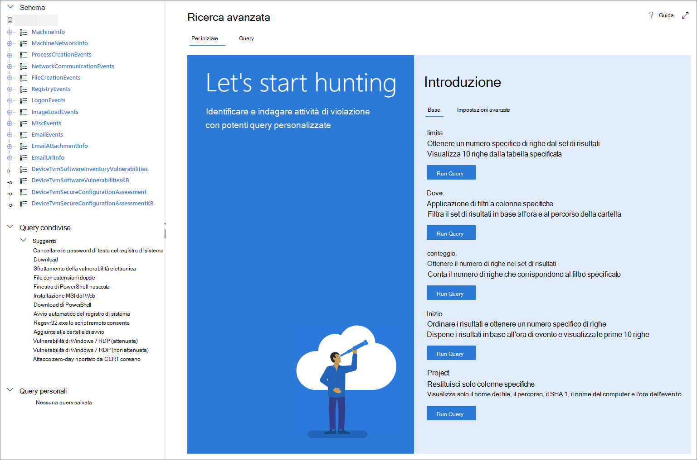

# <a name="learn-the-advanced-hunting-query-language"></a><span data-ttu-id="65ab1-104">Scoprire il linguaggio delle query in Ricerca avanzata</span><span class="sxs-lookup"><span data-stu-id="65ab1-104">Learn the advanced hunting query language</span></span>

[!INCLUDE [Microsoft 365 Defender rebranding](../includes/microsoft-defender.md)]


<span data-ttu-id="65ab1-105">**Si applica a:**</span><span class="sxs-lookup"><span data-stu-id="65ab1-105">**Applies to:**</span></span>
- <span data-ttu-id="65ab1-106">Microsoft Threat Protection</span><span class="sxs-lookup"><span data-stu-id="65ab1-106">Microsoft Threat Protection</span></span>

<span data-ttu-id="65ab1-107">Ricerca avanzata si basa sul [linguaggio delle query in Esplora dati](https://docs.microsoft.com/azure/kusto/query/).</span><span class="sxs-lookup"><span data-stu-id="65ab1-107">Advanced hunting is based on the [Kusto query language](https://docs.microsoft.com/azure/kusto/query/).</span></span> <span data-ttu-id="65ab1-108">È possibile usare la sintassi e gli operatori di Esplora dati per creare query che individuano informazioni nello [schema](advanced-hunting-schema-tables.md) specificamente strutturate per Ricerca avanzata.</span><span class="sxs-lookup"><span data-stu-id="65ab1-108">You can use Kusto syntax and operators to construct queries that locate information in the [schema](advanced-hunting-schema-tables.md) specifically structured for advanced hunting.</span></span> <span data-ttu-id="65ab1-109">Per comprendere meglio questi concetti, eseguire la prima query.</span><span class="sxs-lookup"><span data-stu-id="65ab1-109">To understand these concepts better, run your first query.</span></span>

## <a name="try-your-first-query"></a><span data-ttu-id="65ab1-110">Provare la prima query</span><span class="sxs-lookup"><span data-stu-id="65ab1-110">Try your first query</span></span>

<span data-ttu-id="65ab1-111">In Microsoft 365 Security Center, andare a **caccia** per eseguire la prima query.</span><span class="sxs-lookup"><span data-stu-id="65ab1-111">In Microsoft 365 security center, go to **Hunting** to run your first query.</span></span> <span data-ttu-id="65ab1-112">Usare l'esempio seguente:</span><span class="sxs-lookup"><span data-stu-id="65ab1-112">Use the following example:</span></span>

```kusto
// Finds PowerShell execution events that could involve a download
union DeviceProcessEvents, DeviceNetworkEvents
| where Timestamp > ago(7d)
// Pivoting on PowerShell processes
| where FileName in~ ("powershell.exe", "powershell_ise.exe")
// Suspicious commands
| where ProcessCommandLine has_any("WebClient",
 "DownloadFile",
 "DownloadData",
 "DownloadString",
"WebRequest",
"Shellcode",
"http",
"https")
| project Timestamp, DeviceName, InitiatingProcessFileName, InitiatingProcessCommandLine, 
FileName, ProcessCommandLine, RemoteIP, RemoteUrl, RemotePort, RemoteIPType
| top 100 by Timestamp
```

<span data-ttu-id="65ab1-113">Questo è come apparirà in Ricerca avanzata.</span><span class="sxs-lookup"><span data-stu-id="65ab1-113">This is how it will look like in advanced hunting.</span></span>


### <a name="describe-the-query-and-specify-the-tables-to-search"></a><span data-ttu-id="65ab1-115">Descrivere la query e specificare le tabelle di cui eseguire la ricerca</span><span class="sxs-lookup"><span data-stu-id="65ab1-115">Describe the query and specify the tables to search</span></span>
<span data-ttu-id="65ab1-116">All'inizio della query è stato aggiunto un breve commento per descrivere il relativo contenuto.</span><span class="sxs-lookup"><span data-stu-id="65ab1-116">A short comment has been added to the beginning of the query to describe what it is for.</span></span> <span data-ttu-id="65ab1-117">Ciò aiuta se in seguito si decide di salvare la query e condividerla con altri utenti dell'organizzazione.</span><span class="sxs-lookup"><span data-stu-id="65ab1-117">This helps if you later decide to save the query and share it with others in your organization.</span></span> 

```kusto
// Finds PowerShell execution events that could involve a download
```

<span data-ttu-id="65ab1-118">La query viene in genere avviata con un nome di tabella seguito da una serie di elementi avviati da una pipe (`|`).</span><span class="sxs-lookup"><span data-stu-id="65ab1-118">The query itself will typically start with a table name followed by a series of elements started by a pipe (`|`).</span></span> <span data-ttu-id="65ab1-119">In questo esempio viene avviata la creazione di un'Unione di due tabelle  `DeviceProcessEvents` e `DeviceNetworkEvents` , quindi, vengono aggiunti gli elementi reindirizzati in base alle esigenze.</span><span class="sxs-lookup"><span data-stu-id="65ab1-119">In this example, we start by creating a union of two tables,  `DeviceProcessEvents` and `DeviceNetworkEvents`, and add piped elements as needed.</span></span>

```kusto
union DeviceProcessEvents, DeviceNetworkEvents
```
### <a name="set-the-time-range"></a><span data-ttu-id="65ab1-120">Impostare l'intervallo di tempo</span><span class="sxs-lookup"><span data-stu-id="65ab1-120">Set the time range</span></span>
<span data-ttu-id="65ab1-121">Il primo elemento con pipe è un filtro temporale che ha come ambito i sette giorni precedenti.</span><span class="sxs-lookup"><span data-stu-id="65ab1-121">The first piped element is a time filter scoped to the previous seven days.</span></span> <span data-ttu-id="65ab1-122">Il mantenimento dell'intervallo di tempo il più possibile ravvicinato assicura che le query vengano eseguite bene, che restituiscano risultati gestibili e che non scadano.</span><span class="sxs-lookup"><span data-stu-id="65ab1-122">Keeping the time range as narrow as possible ensures that queries perform well, return manageable results, and don't time out.</span></span>

```kusto
| where Timestamp > ago(7d)
```

### <a name="check-specific-processes"></a><span data-ttu-id="65ab1-123">Controllare i processi specifici</span><span class="sxs-lookup"><span data-stu-id="65ab1-123">Check specific processes</span></span>
<span data-ttu-id="65ab1-124">L'intervallo di tempo è subito seguito da una ricerca dei nomi dei file di processo che rappresentano l'applicazione PowerShell.</span><span class="sxs-lookup"><span data-stu-id="65ab1-124">The time range is immediately followed by a search for process file names representing the PowerShell application.</span></span>

```kusto
// Pivoting on PowerShell processes
| where FileName in~ ("powershell.exe", "powershell_ise.exe")
```

### <a name="search-for-specific-command-strings"></a><span data-ttu-id="65ab1-125">Ricerca di stringhe di comandi specifiche</span><span class="sxs-lookup"><span data-stu-id="65ab1-125">Search for specific command strings</span></span>
<span data-ttu-id="65ab1-126">Successivamente, la query Cerca stringhe nelle righe di comando che vengono in genere utilizzate per scaricare i file tramite PowerShell.</span><span class="sxs-lookup"><span data-stu-id="65ab1-126">Afterwards, the query looks for strings in command lines that are typically used to download files using PowerShell.</span></span>

```kusto
// Suspicious commands
| where ProcessCommandLine has_any("WebClient",
    "DownloadFile",
    "DownloadData",
    "DownloadString",
    "WebRequest",
    "Shellcode",
    "http",
    "https")
```

### <a name="customize-result-columns-and-length"></a><span data-ttu-id="65ab1-127">Personalizzare le colonne dei risultati e la lunghezza</span><span class="sxs-lookup"><span data-stu-id="65ab1-127">Customize result columns and length</span></span> 
<span data-ttu-id="65ab1-128">Ora che la query identifica chiaramente i dati da individuare, è possibile aggiungere elementi che definiscono come appaiono i risultati.</span><span class="sxs-lookup"><span data-stu-id="65ab1-128">Now that your query clearly identifies the data you want to locate, you can add elements that define what the results look like.</span></span> <span data-ttu-id="65ab1-129">`project` restituisce colonne specifiche e `top` limita il numero di risultati.</span><span class="sxs-lookup"><span data-stu-id="65ab1-129">`project` returns specific columns, and `top` limits the number of results.</span></span> <span data-ttu-id="65ab1-130">Questi operatori contribuiscono a garantire che i risultati siano ben formattati e ragionevolmente grandi e facili da elaborare.</span><span class="sxs-lookup"><span data-stu-id="65ab1-130">These operators help ensure the results are well-formatted and reasonably large and easy to process.</span></span>

```kusto
| project Timestamp, DeviceName, InitiatingProcessFileName, InitiatingProcessCommandLine, 
FileName, ProcessCommandLine, RemoteIP, RemoteUrl, RemotePort, RemoteIPType
| top 100 by Timestamp
```

<span data-ttu-id="65ab1-131">Fare clic su **Esegui query** per visualizzare i risultati.</span><span class="sxs-lookup"><span data-stu-id="65ab1-131">Click **Run query** to see the results.</span></span> <span data-ttu-id="65ab1-132">Selezionare l'icona Espandi nell'angolo superiore destro dell'editor di query per concentrarsi sulla query di caccia e sui risultati.</span><span class="sxs-lookup"><span data-stu-id="65ab1-132">Select the expand icon at the top right of the query editor to focus on your hunting query and the results.</span></span> 


>[!TIP]
><span data-ttu-id="65ab1-134">È possibile visualizzare i risultati delle query come grafici e regolare rapidamente i filtri.</span><span class="sxs-lookup"><span data-stu-id="65ab1-134">You can view query results as charts and quickly adjust filters.</span></span> <span data-ttu-id="65ab1-135">Per ulteriori informazioni, [vedere Utilizzo dei risultati delle query](advanced-hunting-query-results.md)</span><span class="sxs-lookup"><span data-stu-id="65ab1-135">For guidance, [read about working with query results](advanced-hunting-query-results.md)</span></span>

## <a name="learn-common-query-operators"></a><span data-ttu-id="65ab1-136">Informazioni sugli operatori di query comuni</span><span class="sxs-lookup"><span data-stu-id="65ab1-136">Learn common query operators</span></span>

<span data-ttu-id="65ab1-137">Ora che è stata eseguita la prima query e si ha un'idea generale dei relativi componenti, è il momento di tornare indietro e imparare alcune nozioni di base.</span><span class="sxs-lookup"><span data-stu-id="65ab1-137">Now that you've run your first query and have a general idea of its components, it's time to backtrack a little bit and learn some basics.</span></span> <span data-ttu-id="65ab1-138">Il linguaggio delle query di Esplora dati usato in Ricerca avanzata supporta una serie di operatori, di seguito sono elencati i più comuni.</span><span class="sxs-lookup"><span data-stu-id="65ab1-138">The Kusto query language used by advanced hunting supports a range of operators, including the following common ones.</span></span>

| <span data-ttu-id="65ab1-139">Operatore</span><span class="sxs-lookup"><span data-stu-id="65ab1-139">Operator</span></span> | <span data-ttu-id="65ab1-140">Descrizione e utilizzo</span><span class="sxs-lookup"><span data-stu-id="65ab1-140">Description and usage</span></span> |
|--|--|
| `where` | <span data-ttu-id="65ab1-141">Filtrare una tabella nel sottoinsieme di righe che soddisfano un predicato.</span><span class="sxs-lookup"><span data-stu-id="65ab1-141">Filter a table to the subset of rows that satisfy a predicate.</span></span> |
| `summarize` | <span data-ttu-id="65ab1-142">Creare una tabella che aggrega il contenuto della tabella di input.</span><span class="sxs-lookup"><span data-stu-id="65ab1-142">Produce a table that aggregates the content of the input table.</span></span> |
| `join` | <span data-ttu-id="65ab1-143">Unire le righe di due tabelle per creare una nuova tabella in base ai valori corrispondenti delle colonne specificate di ogni tabella.</span><span class="sxs-lookup"><span data-stu-id="65ab1-143">Merge the rows of two tables to form a new table by matching values of the specified column(s) from each table.</span></span> |
| `count` | <span data-ttu-id="65ab1-144">Restituire il numero di record nel set di record di input.</span><span class="sxs-lookup"><span data-stu-id="65ab1-144">Return the number of records in the input record set.</span></span> |
| `top` | <span data-ttu-id="65ab1-145">Restituire i primi N record ordinati in base alle colonne specificate.</span><span class="sxs-lookup"><span data-stu-id="65ab1-145">Return the first N records sorted by the specified columns.</span></span> |
| `limit` | <span data-ttu-id="65ab1-146">Tornare al numero specificato di righe.</span><span class="sxs-lookup"><span data-stu-id="65ab1-146">Return up to the specified number of rows.</span></span> |
| `project` | <span data-ttu-id="65ab1-147">Selezionare le colonne da includere, rinominare o rilasciare e inserire nuove colonne calcolate.</span><span class="sxs-lookup"><span data-stu-id="65ab1-147">Select the columns to include, rename or drop, and insert new computed columns.</span></span> |
| `extend` | <span data-ttu-id="65ab1-148">Creare colonne calcolate e accodarle al set di risultati.</span><span class="sxs-lookup"><span data-stu-id="65ab1-148">Create calculated columns and append them to the result set.</span></span> |
| `makeset` |  <span data-ttu-id="65ab1-149">Restituire una matrice dinamica (JSON) del set di valori distinti che Expr accetta nel gruppo.</span><span class="sxs-lookup"><span data-stu-id="65ab1-149">Return a dynamic (JSON) array of the set of distinct values that Expr takes in the group.</span></span> |
| `find` | <span data-ttu-id="65ab1-150">Trovare le righe che corrispondono a un predicato in un set di tabelle.</span><span class="sxs-lookup"><span data-stu-id="65ab1-150">Find rows that match a predicate across a set of tables.</span></span> |

<span data-ttu-id="65ab1-151">Per vedere un esempio pratico di questi operatori, eseguirli nella sezione **Introduzione** in Ricerca avanzata.</span><span class="sxs-lookup"><span data-stu-id="65ab1-151">To see a live example of these operators, run them from the **Get started** section in advanced hunting.</span></span>

## <a name="understand-data-types"></a><span data-ttu-id="65ab1-152">Informazioni sui tipi di dati</span><span class="sxs-lookup"><span data-stu-id="65ab1-152">Understand data types</span></span>

<span data-ttu-id="65ab1-153">I dati nelle tabelle di Ricerca avanzata sono generalmente classificati nei seguenti tipi di dati.</span><span class="sxs-lookup"><span data-stu-id="65ab1-153">Data in advanced hunting tables are generally classified into the following data types.</span></span>

| <span data-ttu-id="65ab1-154">Tipo di dati</span><span class="sxs-lookup"><span data-stu-id="65ab1-154">Data type</span></span> | <span data-ttu-id="65ab1-155">Descrizione e implicazioni delle query</span><span class="sxs-lookup"><span data-stu-id="65ab1-155">Description and query implications</span></span> |
|--|--|
| `datetime` | <span data-ttu-id="65ab1-156">Informazioni sui dati e sull'ora che rappresentano in genere timestamp dell'evento</span><span class="sxs-lookup"><span data-stu-id="65ab1-156">Data and time information typically representing event timestamps</span></span> |
| `string` | <span data-ttu-id="65ab1-157">Stringa di caratteri</span><span class="sxs-lookup"><span data-stu-id="65ab1-157">Character string</span></span> |
| `bool` | <span data-ttu-id="65ab1-158">True o False</span><span class="sxs-lookup"><span data-stu-id="65ab1-158">True or false</span></span> |
| `int` | <span data-ttu-id="65ab1-159">Valore numerico 32 bit</span><span class="sxs-lookup"><span data-stu-id="65ab1-159">32-bit numeric value</span></span>  |
| `long` | <span data-ttu-id="65ab1-160">Valore numerico 64 bit</span><span class="sxs-lookup"><span data-stu-id="65ab1-160">64-bit numeric value</span></span> |

<span data-ttu-id="65ab1-161">Per ulteriori informazioni su questi tipi di dati e sulle relative implicazioni, [leggere informazioni sui tipi di dati scalari di Kusto](https://docs.microsoft.com/azure/data-explorer/kusto/query/scalar-data-types/).</span><span class="sxs-lookup"><span data-stu-id="65ab1-161">To learn more about these data types and their implications, [read about Kusto scalar data types](https://docs.microsoft.com/azure/data-explorer/kusto/query/scalar-data-types/).</span></span>

## <a name="get-help-as-you-write-queries"></a><span data-ttu-id="65ab1-162">Ottenere assistenza nella scrittura delle query</span><span class="sxs-lookup"><span data-stu-id="65ab1-162">Get help as you write queries</span></span>
<span data-ttu-id="65ab1-163">Trarre vantaggio dalle seguenti funzionalità per scrivere query più velocemente:</span><span class="sxs-lookup"><span data-stu-id="65ab1-163">Take advantage of the following functionality to write queries faster:</span></span>
- <span data-ttu-id="65ab1-164">**AutoSuggest** : durante la scrittura di query, la ricerca avanzata fornisce suggerimenti da IntelliSense.</span><span class="sxs-lookup"><span data-stu-id="65ab1-164">**Autosuggest** — as you write queries, advanced hunting provides suggestions from IntelliSense.</span></span> 
- <span data-ttu-id="65ab1-165">**Albero dello schema** : una rappresentazione dello schema che include l'elenco delle tabelle e delle relative colonne viene fornita accanto all'area di lavoro.</span><span class="sxs-lookup"><span data-stu-id="65ab1-165">**Schema tree** — a schema representation that includes the list of tables and their columns is provided next to your working area.</span></span> <span data-ttu-id="65ab1-166">Per altre informazioni, passare il puntatore su un elemento.</span><span class="sxs-lookup"><span data-stu-id="65ab1-166">For more information, hover over an item.</span></span> <span data-ttu-id="65ab1-167">Fare doppio clic su un elemento per inserirlo nell'editor di query.</span><span class="sxs-lookup"><span data-stu-id="65ab1-167">Double-click an item to insert it to the query editor.</span></span>
- <span data-ttu-id="65ab1-168">**[Riferimenti dello schema](advanced-hunting-schema-tables.md#get-schema-information-in-the-security-center)** : riferimenti in-Portal con descrizioni di tabelle e colonne, nonché tipi di evento supportati ( `ActionType` valori) e query di esempio</span><span class="sxs-lookup"><span data-stu-id="65ab1-168">**[Schema reference](advanced-hunting-schema-tables.md#get-schema-information-in-the-security-center)** — in-portal reference with table and column descriptions as well as supported event types (`ActionType` values) and sample queries</span></span>

## <a name="work-with-multiple-queries-in-the-editor"></a><span data-ttu-id="65ab1-169">Utilizzo di più query nell'editor</span><span class="sxs-lookup"><span data-stu-id="65ab1-169">Work with multiple queries in the editor</span></span>
<span data-ttu-id="65ab1-170">L'editor di query può fungere da Scratch Pad per la sperimentazione con più query.</span><span class="sxs-lookup"><span data-stu-id="65ab1-170">The query editor can serve as your scratch pad for experimenting with multiple queries.</span></span> <span data-ttu-id="65ab1-171">Per utilizzare più query:</span><span class="sxs-lookup"><span data-stu-id="65ab1-171">To use multiple queries:</span></span>

- <span data-ttu-id="65ab1-172">Separare ogni query con una linea vuota.</span><span class="sxs-lookup"><span data-stu-id="65ab1-172">Separate each query with an empty line.</span></span>
- <span data-ttu-id="65ab1-173">Posizionare il cursore su qualsiasi parte di una query per selezionare la query prima di eseguirla.</span><span class="sxs-lookup"><span data-stu-id="65ab1-173">Place the cursor on any part of a query to select that query before running it.</span></span> <span data-ttu-id="65ab1-174">Verrà eseguita solo la query selezionata.</span><span class="sxs-lookup"><span data-stu-id="65ab1-174">This will run only the selected query.</span></span> <span data-ttu-id="65ab1-175">Per eseguire un'altra query, spostare il cursore di conseguenza e selezionare **Esegui query**.</span><span class="sxs-lookup"><span data-stu-id="65ab1-175">To run another query, move the cursor accordingly and select **Run query**.</span></span>


## <a name="use-sample-queries"></a><span data-ttu-id="65ab1-177">Usare query di esempio</span><span class="sxs-lookup"><span data-stu-id="65ab1-177">Use sample queries</span></span>

<span data-ttu-id="65ab1-178">La sezione **Introduzione** presenta alcune semplici query che impiegano operatori di uso comune.</span><span class="sxs-lookup"><span data-stu-id="65ab1-178">The **Get started** section provides a few simple queries using commonly used operators.</span></span> <span data-ttu-id="65ab1-179">Provare a eseguire queste query e apportare piccole modifiche.</span><span class="sxs-lookup"><span data-stu-id="65ab1-179">Try running these queries and making small modifications to them.</span></span>



>[!NOTE]
><span data-ttu-id="65ab1-181">Oltre agli esempi di query di base, è anche possibile accedere [query condivise](advanced-hunting-shared-queries.md) per specifici scenari di ricerca delle minacce.</span><span class="sxs-lookup"><span data-stu-id="65ab1-181">Apart from the basic query samples, you can also access [shared queries](advanced-hunting-shared-queries.md) for specific threat hunting scenarios.</span></span> <span data-ttu-id="65ab1-182">Esplorare le query condivise sul lato sinistro della pagina o sul repository di query GitHub.</span><span class="sxs-lookup"><span data-stu-id="65ab1-182">Explore the shared queries on the left side of the page or the GitHub query repository.</span></span>

## <a name="access-query-language-documentation"></a><span data-ttu-id="65ab1-183">Documentazione sulle query</span><span class="sxs-lookup"><span data-stu-id="65ab1-183">Access query language documentation</span></span>

<span data-ttu-id="65ab1-184">Per altre informazioni sul linguaggio delle query di Esplora dati e sugli operatori supportati, vedere [Documentazione sul linguaggio delle query di Esplora dati](https://docs.microsoft.com/azure/kusto/query/).</span><span class="sxs-lookup"><span data-stu-id="65ab1-184">For more information on Kusto query language and supported operators, see [Kusto query language documentation](https://docs.microsoft.com/azure/kusto/query/).</span></span>

## <a name="related-topics"></a><span data-ttu-id="65ab1-185">Argomenti correlati</span><span class="sxs-lookup"><span data-stu-id="65ab1-185">Related topics</span></span>
- [<span data-ttu-id="65ab1-186">Panoramica della ricerca avanzata</span><span class="sxs-lookup"><span data-stu-id="65ab1-186">Advanced hunting overview</span></span>](advanced-hunting-overview.md)
- [<span data-ttu-id="65ab1-187">Usare i risultati delle query</span><span class="sxs-lookup"><span data-stu-id="65ab1-187">Work with query results</span></span>](advanced-hunting-query-results.md)
- [<span data-ttu-id="65ab1-188">Utilizzare le query condivise</span><span class="sxs-lookup"><span data-stu-id="65ab1-188">Use shared queries</span></span>](advanced-hunting-shared-queries.md)
- [<span data-ttu-id="65ab1-189">Cercare tra dispositivi, posta elettronica, app e identità</span><span class="sxs-lookup"><span data-stu-id="65ab1-189">Hunt across devices, emails, apps, and identities</span></span>](advanced-hunting-query-emails-devices.md)
- [<span data-ttu-id="65ab1-190">Comprendere lo schema</span><span class="sxs-lookup"><span data-stu-id="65ab1-190">Understand the schema</span></span>](advanced-hunting-schema-tables.md)
- [<span data-ttu-id="65ab1-191">Applicare le procedure consigliate per le query</span><span class="sxs-lookup"><span data-stu-id="65ab1-191">Apply query best practices</span></span>](advanced-hunting-best-practices.md)
