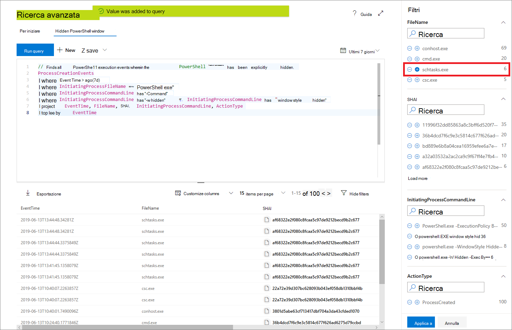

# <a name="work-with-advanced-hunting-query-results"></a>Utilizzare i risultati della query di ricerca avanzata

**Si applica a:**
- Microsoft Threat Protection

[!INCLUDE [Prerelease information](../includes/prerelease.md)]

Anche se è possibile creare query di [ricerca avanzate](advanced-hunting-overview.md) per restituire informazioni molto precise, è inoltre possibile collaborare con i risultati della query per acquisire ulteriore intuizione e studiare specifiche attività e indicatori. Nei risultati delle query è possibile eseguire le operazioni seguenti:

- Visualizzare i risultati come tabella o grafico
- Esportare tabelle e grafici
- Eseguire il drill-down per informazioni dettagliate sull'entità
- Modificare le query direttamente dai risultati o applicare filtri

## <a name="view-query-results-as-a-table-or-chart"></a>Visualizzare i risultati delle query come tabella o grafico
Per impostazione predefinita, la ricerca avanzata Visualizza i risultati delle query come dati tabulari. È inoltre possibile visualizzare gli stessi dati di un grafico. Advanced Hunting supporta le visualizzazioni seguenti:

| Tipo visualizzazione | Descrizione |
| -- | -- |
| **tavolo** | Visualizza i risultati della query in formato tabulare |
| **Istogramma** | Esegue il rendering di una serie di elementi univoci sull'asse x come barre verticali le cui altezze rappresentano valori numerici da un altro campo |
| **Istogramma in pila** | Esegue il rendering di una serie di elementi univoci sull'asse x come barre verticali sovrapposte, le cui altezze rappresentano valori numerici da uno o più altri campi |
| **Grafico a torta** | Esegue il rendering di torte sezionali che rappresentano elementi univoci. La dimensione di ogni torta rappresenta valori numerici da un altro campo. |
| **Grafico ciambella** | Esegue il rendering di archi sezionali che rappresentano elementi univoci. La lunghezza di ogni arco rappresenta valori numerici da un altro campo. |
| **Grafico a linee** | Traccia i valori numerici per una serie di elementi univoci e connette i valori tracciati |
| **Grafico a dispersione** | Stampa valori numerici per una serie di elementi univoci |
| **Grafico ad area** | Traccia i valori numerici per una serie di elementi univoci e riempie le sezioni al di sotto dei valori tracciati. |

### <a name="construct-queries-for-effective-charts"></a>Creare query per i grafici effettivi
Quando si esegue il rendering dei grafici, la ricerca avanzata identifica automaticamente le colonne di interesse e i valori numerici da aggregare. Per ottenere grafici significativi, creare le query per restituire i valori specifici che si desidera visualizzare. Di seguito sono riportate alcune query di esempio e i grafici risultanti.

#### <a name="alerts-by-severity"></a>Avvisi per gravità
Utilizzare l' `summarize` operatore per ottenere un conteggio numerico dei valori che si desidera tracciare. La query seguente utilizza l' `summarize` operatore per ottenere il numero di avvisi per gravità.

```kusto
AlertInfo
| summarize Total = count() by Severity
```
Quando si esegue il rendering dei risultati, in un istogramma viene visualizzato ogni valore di gravità come colonna separata:


 *per gli avvisi in base alla gravità visualizzati come* istogramma

#### <a name="alert-severity-by-operating-system"></a>Severità degli avvisi in base al sistema operativo
È inoltre possibile utilizzare l' `summarize` operatore per preparare i risultati per la creazione di grafici di valori da più campi. Ad esempio, si potrebbe voler capire in che modo gli avvisi vengono distribuiti tra i sistemi operativi (OS). 

La query seguente utilizza un `join` operatore per inserire le informazioni sul sistema operativo dalla `DeviceInfo` tabella e quindi utilizza `summarize` per conteggiare i valori sia nelle `OSPlatform` colonne che in quelle seguenti `Severity` :

```kusto
AlertInfo
| join AlertEvidence on AlertId
| join DeviceInfo on DeviceId
| summarize Count = count() by OSPlatform, Severity 
```
Questi risultati vengono visualizzati in modo ottimale utilizzando un istogramma in pila:


 *per gli avvisi del sistema operativo e la gravità visualizzati come un grafico in pila*

#### <a name="phishing-emails-across-top-ten-sender-domains"></a>Messaggi di posta elettronica di phishing tra i primi dieci domini mittente
Se si ha a che fare con un elenco di valori non finiti, è possibile utilizzare l' `Top` operatore per tracciare solo i valori con la maggior parte delle istanze. Ad esempio, per ottenere i primi dieci domini mittente con la maggior parte dei messaggi di posta elettronica di phishing, utilizzare la query seguente:

```kusto
EmailEvents
| where PhishFilterVerdict == "Phish"
| summarize Count = count() by SenderFromDomain
| top 10 by Count
```
Utilizzare la visualizzazione grafico a torta per visualizzare in modo efficace la distribuzione nei domini principali:


 *Mostra la distribuzione dei messaggi di posta elettronica di phishing nei domini principali del mittente*

#### <a name="file-activities-over-time"></a>Attività del file nel tempo
`summarize`Se si utilizza l'operatore con la `bin()` funzione, è possibile verificare la possibilità di controllare gli eventi che coinvolgono un determinato indicatore nel tempo. La query che segue conta gli eventi che coinvolgono il file `invoice.doc` a intervalli di 30 minuti per visualizzare i picchi nelle attività relative a tale file:

```kusto
AppFileEvents
| union DeviceFileEvents
| where FileName == "invoice.doc"
| summarize FileCount = count() by bin(Timestamp, 30m)
```
Il grafico a linee sotto evidenzia chiaramente i periodi di tempo con più attività che coinvolgono `invoice.doc` : 


 *che mostra il numero di eventi che coinvolgono un file nel tempo*


## <a name="export-tables-and-charts"></a>Esportare tabelle e grafici
Dopo aver eseguito una query, selezionare **Esporta** per salvare i risultati nel file locale. La visualizzazione scelta determina il modo in cui i risultati vengono esportati:

- **Visualizzazione tabella** : i risultati della query vengono esportati in formato tabulare come cartella di lavoro di Microsoft Excel
- **Qualsiasi grafico** : i risultati della query vengono esportati come immagine JPEG del grafico di cui è stato eseguito il rendering

## <a name="drill-down-from-query-results"></a>Eseguire il drill-down dai risultati delle query
Per esaminare rapidamente un record nei risultati della query, selezionare la riga corrispondente per aprire il riquadro **ispeziona record** . Nel riquadro sono disponibili le informazioni seguenti in base al record selezionato:

- **Asset** : visualizzazione riepilogata delle risorse principali (cassette postali, dispositivi e utenti) rilevate nel record, arricchite con informazioni disponibili, ad esempio i livelli di rischio e di esposizione
- **Albero dei processi** : generato per i record con informazioni sul processo e arricchito utilizzando informazioni contestuali disponibili; in generale, le query che restituiscono più colonne possono generare strutture di elaborazione più ricche.
- **Tutti i dettagli** : tutti i valori delle colonne del record  


Per visualizzare ulteriori informazioni su un'entità specifica nei risultati della query, ad esempio un computer, un file, un utente, un indirizzo IP o un URL, selezionare l'identificatore di entità per aprire una pagina del profilo dettagliata per tale entità.

## <a name="tweak-your-queries-from-the-results"></a>Perfezionare le query dai risultati
Fare clic con il pulsante destro del mouse su un valore nel set di risultati per migliorare rapidamente la query. È possibile usare le opzioni per:

- Cercare in modo esplicito il valore selezionato (`==`)
- Escludere il valore selezionato dalla query (`!=`)
- Per aggiungere il valore alla query, è possibile usare gli operatori più avanzati, come `contains`, `starts with` e `ends with` 


## <a name="filter-the-query-results"></a>Filtrare i risultati della query
I filtri visualizzati a destra forniscono un riepilogo del set di risultati. Ogni colonna ha una propria sezione in cui sono elencati i valori distinti individuati per quella colonna e il numero di istanze.

Affinare la query selezionando i `+` `-` pulsanti o nei valori che si desidera includere o escludere e quindi selezionando **Esegui query**.



Dopo avere applicato il filtro per modificare la query e aver eseguito la query, i risultati vengono aggiornati di conseguenza.

## <a name="related-topics"></a>Argomenti correlati
- [Panoramica della ricerca avanzata](advanced-hunting-overview.md)
- [Capire il linguaggio delle query](advanced-hunting-query-language.md)
- [Utilizzare le query condivise](advanced-hunting-shared-queries.md)
- [Cercare tra i dispositivi, i messaggi di posta elettronica, le app e le identità](advanced-hunting-query-emails-devices.md)
- [Comprendere lo schema](advanced-hunting-schema-tables.md)
- [Applicare le procedure consigliate per le query](advanced-hunting-best-practices.md)
- [Panoramica dei rilevamenti personalizzati](custom-detections-overview.md)
