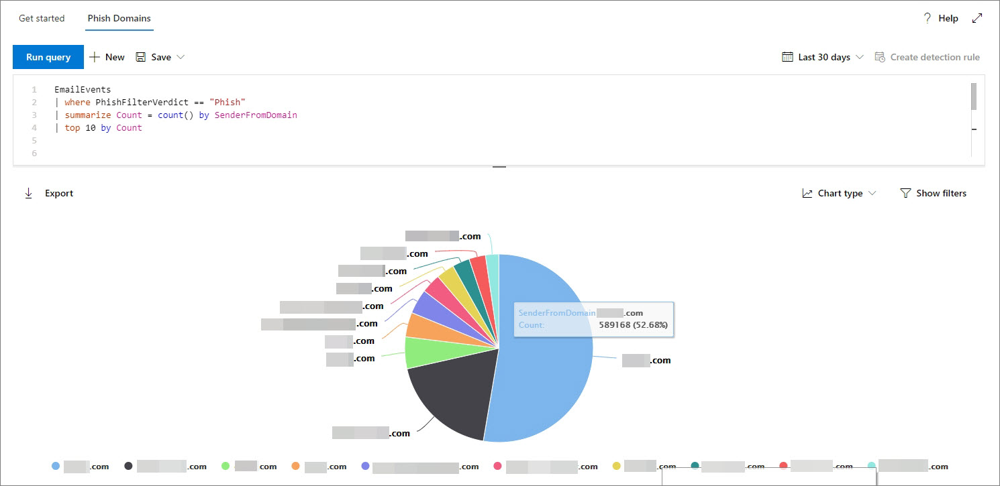

# <a name="work-with-advanced-hunting-query-results"></a><span data-ttu-id="cd84b-104">Utilizzare i risultati della query di ricerca avanzata</span><span class="sxs-lookup"><span data-stu-id="cd84b-104">Work with advanced hunting query results</span></span>

<span data-ttu-id="cd84b-105">**Si applica a:**</span><span class="sxs-lookup"><span data-stu-id="cd84b-105">**Applies to:**</span></span>
- <span data-ttu-id="cd84b-106">Microsoft Threat Protection</span><span class="sxs-lookup"><span data-stu-id="cd84b-106">Microsoft Threat Protection</span></span>

[!INCLUDE [Prerelease information](../includes/prerelease.md)]

<span data-ttu-id="cd84b-107">Anche se è possibile creare query di [ricerca avanzate](advanced-hunting-overview.md) per restituire informazioni molto precise, è inoltre possibile collaborare con i risultati della query per acquisire ulteriore intuizione e studiare specifiche attività e indicatori.</span><span class="sxs-lookup"><span data-stu-id="cd84b-107">While you can construct your [advanced hunting](advanced-hunting-overview.md) queries to return very precise information, you can also work with the query results to gain further insight and investigate specific activities and indicators.</span></span> <span data-ttu-id="cd84b-108">Nei risultati delle query è possibile eseguire le operazioni seguenti:</span><span class="sxs-lookup"><span data-stu-id="cd84b-108">You can take the following actions on your query results:</span></span>

- <span data-ttu-id="cd84b-109">Visualizzare i risultati come tabella o grafico</span><span class="sxs-lookup"><span data-stu-id="cd84b-109">View results as a table or chart</span></span>
- <span data-ttu-id="cd84b-110">Esportare tabelle e grafici</span><span class="sxs-lookup"><span data-stu-id="cd84b-110">Export tables and charts</span></span>
- <span data-ttu-id="cd84b-111">Eseguire il drill-down per informazioni dettagliate sull'entità</span><span class="sxs-lookup"><span data-stu-id="cd84b-111">Drill down to detailed entity information</span></span>
- <span data-ttu-id="cd84b-112">Modificare le query direttamente dai risultati o applicare filtri</span><span class="sxs-lookup"><span data-stu-id="cd84b-112">Tweak your queries directly from the results or apply filters</span></span>

## <a name="view-query-results-as-a-table-or-chart"></a><span data-ttu-id="cd84b-113">Visualizzare i risultati delle query come tabella o grafico</span><span class="sxs-lookup"><span data-stu-id="cd84b-113">View query results as a table or chart</span></span>
<span data-ttu-id="cd84b-114">Per impostazione predefinita, la ricerca avanzata Visualizza i risultati delle query come dati tabulari.</span><span class="sxs-lookup"><span data-stu-id="cd84b-114">By default, advanced hunting displays query results as tabular data.</span></span> <span data-ttu-id="cd84b-115">È inoltre possibile visualizzare gli stessi dati di un grafico.</span><span class="sxs-lookup"><span data-stu-id="cd84b-115">You can also display the same data as a chart.</span></span> <span data-ttu-id="cd84b-116">Advanced Hunting supporta le visualizzazioni seguenti:</span><span class="sxs-lookup"><span data-stu-id="cd84b-116">Advanced hunting supports the following views:</span></span>

| <span data-ttu-id="cd84b-117">Tipo visualizzazione</span><span class="sxs-lookup"><span data-stu-id="cd84b-117">View type</span></span> | <span data-ttu-id="cd84b-118">Descrizione</span><span class="sxs-lookup"><span data-stu-id="cd84b-118">Description</span></span> |
| -- | -- |
| <span data-ttu-id="cd84b-119">**tavolo**</span><span class="sxs-lookup"><span data-stu-id="cd84b-119">**Table**</span></span> | <span data-ttu-id="cd84b-120">Visualizza i risultati della query in formato tabulare</span><span class="sxs-lookup"><span data-stu-id="cd84b-120">Displays the query results in tabular format</span></span> |
| <span data-ttu-id="cd84b-121">**Istogramma**</span><span class="sxs-lookup"><span data-stu-id="cd84b-121">**Column chart**</span></span> | <span data-ttu-id="cd84b-122">Esegue il rendering di una serie di elementi univoci sull'asse x come barre verticali le cui altezze rappresentano valori numerici da un altro campo</span><span class="sxs-lookup"><span data-stu-id="cd84b-122">Renders a series of unique items on the x-axis as vertical bars whose heights represent numeric values from another field</span></span> |
| <span data-ttu-id="cd84b-123">**Istogramma in pila**</span><span class="sxs-lookup"><span data-stu-id="cd84b-123">**Stacked column chart**</span></span> | <span data-ttu-id="cd84b-124">Esegue il rendering di una serie di elementi univoci sull'asse x come barre verticali sovrapposte, le cui altezze rappresentano valori numerici da uno o più altri campi</span><span class="sxs-lookup"><span data-stu-id="cd84b-124">Renders a series of unique items on the x-axis as stacked vertical bars whose heights represent numeric values from one or more other fields</span></span> |
| <span data-ttu-id="cd84b-125">**Grafico a torta**</span><span class="sxs-lookup"><span data-stu-id="cd84b-125">**Pie chart**</span></span> | <span data-ttu-id="cd84b-126">Esegue il rendering di torte sezionali che rappresentano elementi univoci.</span><span class="sxs-lookup"><span data-stu-id="cd84b-126">Renders sectional pies representing unique items.</span></span> <span data-ttu-id="cd84b-127">La dimensione di ogni torta rappresenta valori numerici da un altro campo.</span><span class="sxs-lookup"><span data-stu-id="cd84b-127">The size of each pie represents numeric values from another field.</span></span> |
| <span data-ttu-id="cd84b-128">**Grafico ciambella**</span><span class="sxs-lookup"><span data-stu-id="cd84b-128">**Donut chart**</span></span> | <span data-ttu-id="cd84b-129">Esegue il rendering di archi sezionali che rappresentano elementi univoci.</span><span class="sxs-lookup"><span data-stu-id="cd84b-129">Renders sectional arcs representing unique items.</span></span> <span data-ttu-id="cd84b-130">La lunghezza di ogni arco rappresenta valori numerici da un altro campo.</span><span class="sxs-lookup"><span data-stu-id="cd84b-130">The length of each arc represents numeric values from another field.</span></span> |
| <span data-ttu-id="cd84b-131">**Grafico a linee**</span><span class="sxs-lookup"><span data-stu-id="cd84b-131">**Line chart**</span></span> | <span data-ttu-id="cd84b-132">Traccia i valori numerici per una serie di elementi univoci e connette i valori tracciati</span><span class="sxs-lookup"><span data-stu-id="cd84b-132">Plots numeric values for a series of unique items and connects the plotted values</span></span> |
| <span data-ttu-id="cd84b-133">**Grafico a dispersione**</span><span class="sxs-lookup"><span data-stu-id="cd84b-133">**Scatter chart**</span></span> | <span data-ttu-id="cd84b-134">Stampa valori numerici per una serie di elementi univoci</span><span class="sxs-lookup"><span data-stu-id="cd84b-134">Plots numeric values for a series of unique items</span></span> |
| <span data-ttu-id="cd84b-135">**Grafico ad area**</span><span class="sxs-lookup"><span data-stu-id="cd84b-135">**Area chart**</span></span> | <span data-ttu-id="cd84b-136">Traccia i valori numerici per una serie di elementi univoci e riempie le sezioni al di sotto dei valori tracciati.</span><span class="sxs-lookup"><span data-stu-id="cd84b-136">Plots numeric values for a series of unique items and fills the sections below the plotted values</span></span> |

### <a name="construct-queries-for-effective-charts"></a><span data-ttu-id="cd84b-137">Creare query per i grafici effettivi</span><span class="sxs-lookup"><span data-stu-id="cd84b-137">Construct queries for effective charts</span></span>
<span data-ttu-id="cd84b-138">Quando si esegue il rendering dei grafici, la ricerca avanzata identifica automaticamente le colonne di interesse e i valori numerici da aggregare.</span><span class="sxs-lookup"><span data-stu-id="cd84b-138">When rendering charts, advanced hunting automatically identifies columns of interest and the numeric values to aggregate.</span></span> <span data-ttu-id="cd84b-139">Per ottenere grafici significativi, creare le query per restituire i valori specifici che si desidera visualizzare.</span><span class="sxs-lookup"><span data-stu-id="cd84b-139">To get meaningful charts, construct your queries to return the specific values you want to see visualized.</span></span> <span data-ttu-id="cd84b-140">Di seguito sono riportate alcune query di esempio e i grafici risultanti.</span><span class="sxs-lookup"><span data-stu-id="cd84b-140">Here are some sample queries and the resulting charts.</span></span>

#### <a name="alerts-by-severity"></a><span data-ttu-id="cd84b-141">Avvisi per gravità</span><span class="sxs-lookup"><span data-stu-id="cd84b-141">Alerts by severity</span></span>
<span data-ttu-id="cd84b-142">Utilizzare l' `summarize` operatore per ottenere un conteggio numerico dei valori che si desidera tracciare.</span><span class="sxs-lookup"><span data-stu-id="cd84b-142">Use the `summarize` operator to obtain a numeric count of the values you want to chart.</span></span> <span data-ttu-id="cd84b-143">La query seguente utilizza l' `summarize` operatore per ottenere il numero di avvisi per gravità.</span><span class="sxs-lookup"><span data-stu-id="cd84b-143">The query below uses the `summarize` operator to get the number of alerts by severity.</span></span>

```kusto
AlertInfo
| summarize Total = count() by Severity
```
<span data-ttu-id="cd84b-144">Quando si esegue il rendering dei risultati, in un istogramma viene visualizzato ogni valore di gravità come colonna separata:</span><span class="sxs-lookup"><span data-stu-id="cd84b-144">When rendering the results, a column chart displays each severity value as a separate column:</span></span>

<span data-ttu-id="cd84b-145">
 *per gli avvisi in base alla gravità visualizzati come* istogramma</span><span class="sxs-lookup"><span data-stu-id="cd84b-145">
*Query results for alerts by severity displayed as a column chart*</span></span>

#### <a name="alert-severity-by-operating-system"></a><span data-ttu-id="cd84b-146">Severità degli avvisi in base al sistema operativo</span><span class="sxs-lookup"><span data-stu-id="cd84b-146">Alert severity by operating system</span></span>
<span data-ttu-id="cd84b-147">È inoltre possibile utilizzare l' `summarize` operatore per preparare i risultati per la creazione di grafici di valori da più campi.</span><span class="sxs-lookup"><span data-stu-id="cd84b-147">You could also use the `summarize` operator to prepare results for charting values from multiple fields.</span></span> <span data-ttu-id="cd84b-148">Ad esempio, si potrebbe voler capire in che modo gli avvisi vengono distribuiti tra i sistemi operativi (OS).</span><span class="sxs-lookup"><span data-stu-id="cd84b-148">For example, you might want to understand how alert severities are distributed across operating systems (OS).</span></span> 

<span data-ttu-id="cd84b-149">La query seguente utilizza un `join` operatore per inserire le informazioni sul sistema operativo dalla `DeviceInfo` tabella e quindi utilizza `summarize` per conteggiare i valori sia nelle `OSPlatform` colonne che in quelle seguenti `Severity` :</span><span class="sxs-lookup"><span data-stu-id="cd84b-149">The query below uses a `join` operator to pull in OS information from the `DeviceInfo` table, and then uses `summarize` to count values in both the `OSPlatform` and `Severity` columns:</span></span>

```kusto
AlertInfo
| join AlertEvidence on AlertId
| join DeviceInfo on DeviceId
| summarize Count = count() by OSPlatform, Severity 
```
<span data-ttu-id="cd84b-150">Questi risultati vengono visualizzati in modo ottimale utilizzando un istogramma in pila:</span><span class="sxs-lookup"><span data-stu-id="cd84b-150">These results are best visualized using a stacked column chart:</span></span>

<span data-ttu-id="cd84b-151">
 *per gli avvisi del sistema operativo e la gravità visualizzati come un grafico in pila*</span><span class="sxs-lookup"><span data-stu-id="cd84b-151">
*Query results for alerts by OS and severity displayed as a stacked chart*</span></span>

#### <a name="phishing-emails-across-top-ten-sender-domains"></a><span data-ttu-id="cd84b-152">Messaggi di posta elettronica di phishing tra i primi dieci domini mittente</span><span class="sxs-lookup"><span data-stu-id="cd84b-152">Phishing emails across top ten sender domains</span></span>
<span data-ttu-id="cd84b-153">Se si ha a che fare con un elenco di valori non finiti, è possibile utilizzare l' `Top` operatore per tracciare solo i valori con la maggior parte delle istanze.</span><span class="sxs-lookup"><span data-stu-id="cd84b-153">If you're dealing with a list of values that isn’t finite, you can use the `Top` operator to chart only the values with the most instances.</span></span> <span data-ttu-id="cd84b-154">Ad esempio, per ottenere i primi dieci domini mittente con la maggior parte dei messaggi di posta elettronica di phishing, utilizzare la query seguente:</span><span class="sxs-lookup"><span data-stu-id="cd84b-154">For example, to get the top ten sender domains with the most phishing emails, use the query below:</span></span>

```kusto
EmailEvents
| where PhishFilterVerdict == "Phish"
| summarize Count = count() by SenderFromDomain
| top 10 by Count
```
<span data-ttu-id="cd84b-155">Utilizzare la visualizzazione grafico a torta per visualizzare in modo efficace la distribuzione nei domini principali:</span><span class="sxs-lookup"><span data-stu-id="cd84b-155">Use the pie chart view to effectively show distribution across the top domains:</span></span>

<span data-ttu-id="cd84b-156">
 *Mostra la distribuzione dei messaggi di posta elettronica di phishing nei domini principali del mittente*</span><span class="sxs-lookup"><span data-stu-id="cd84b-156">
*Pie chart showing distribution of phishing emails across top sender domains*</span></span>

#### <a name="file-activities-over-time"></a><span data-ttu-id="cd84b-157">Attività del file nel tempo</span><span class="sxs-lookup"><span data-stu-id="cd84b-157">File activities over time</span></span>
<span data-ttu-id="cd84b-158">`summarize`Se si utilizza l'operatore con la `bin()` funzione, è possibile verificare la possibilità di controllare gli eventi che coinvolgono un determinato indicatore nel tempo.</span><span class="sxs-lookup"><span data-stu-id="cd84b-158">Using the `summarize` operator with the `bin()` function, you can check for events involving a particular indicator over time.</span></span> <span data-ttu-id="cd84b-159">La query che segue conta gli eventi che coinvolgono il file `invoice.doc` a intervalli di 30 minuti per visualizzare i picchi nelle attività relative a tale file:</span><span class="sxs-lookup"><span data-stu-id="cd84b-159">The query below counts events involving the file `invoice.doc` at 30 minute intervals to show spikes in activity related to that file:</span></span>

```kusto
AppFileEvents
| union DeviceFileEvents
| where FileName == "invoice.doc"
| summarize FileCount = count() by bin(Timestamp, 30m)
```
<span data-ttu-id="cd84b-160">Il grafico a linee sotto evidenzia chiaramente i periodi di tempo con più attività che coinvolgono `invoice.doc` :</span><span class="sxs-lookup"><span data-stu-id="cd84b-160">The line chart below clearly highlights time periods with more activity involving `invoice.doc`:</span></span> 

<span data-ttu-id="cd84b-161">
 *che mostra il numero di eventi che coinvolgono un file nel tempo*</span><span class="sxs-lookup"><span data-stu-id="cd84b-161">
*Line chart showing the number of events involving a file over time*</span></span>


## <a name="export-tables-and-charts"></a><span data-ttu-id="cd84b-162">Esportare tabelle e grafici</span><span class="sxs-lookup"><span data-stu-id="cd84b-162">Export tables and charts</span></span>
<span data-ttu-id="cd84b-163">Dopo aver eseguito una query, selezionare **Esporta** per salvare i risultati nel file locale.</span><span class="sxs-lookup"><span data-stu-id="cd84b-163">After running a query, select **Export** to save the results to local file.</span></span> <span data-ttu-id="cd84b-164">La visualizzazione scelta determina il modo in cui i risultati vengono esportati:</span><span class="sxs-lookup"><span data-stu-id="cd84b-164">Your chosen view determines how the results are exported:</span></span>

- <span data-ttu-id="cd84b-165">**Visualizzazione tabella** : i risultati della query vengono esportati in formato tabulare come cartella di lavoro di Microsoft Excel</span><span class="sxs-lookup"><span data-stu-id="cd84b-165">**Table view** — the query results are exported in tabular form as a Microsoft Excel workbook</span></span>
- <span data-ttu-id="cd84b-166">**Qualsiasi grafico** : i risultati della query vengono esportati come immagine JPEG del grafico di cui è stato eseguito il rendering</span><span class="sxs-lookup"><span data-stu-id="cd84b-166">**Any chart** — the query results are exported as a JPEG image of the rendered chart</span></span>

## <a name="drill-down-from-query-results"></a><span data-ttu-id="cd84b-167">Eseguire il drill-down dai risultati delle query</span><span class="sxs-lookup"><span data-stu-id="cd84b-167">Drill down from query results</span></span>
<span data-ttu-id="cd84b-168">Per esaminare rapidamente un record nei risultati della query, selezionare la riga corrispondente per aprire il riquadro **ispeziona record** .</span><span class="sxs-lookup"><span data-stu-id="cd84b-168">To quickly inspect a record in your query results, select the corresponding row to open the **Inspect record** panel.</span></span> <span data-ttu-id="cd84b-169">Nel riquadro sono disponibili le informazioni seguenti in base al record selezionato:</span><span class="sxs-lookup"><span data-stu-id="cd84b-169">The panel provides the following information based on the selected record:</span></span>

- <span data-ttu-id="cd84b-170">**Asset** : visualizzazione riepilogata delle risorse principali (cassette postali, dispositivi e utenti) rilevate nel record, arricchite con informazioni disponibili, ad esempio i livelli di rischio e di esposizione</span><span class="sxs-lookup"><span data-stu-id="cd84b-170">**Assets** — summarized view of the main assets (mailboxes, devices, and users) found in the record, enriched with available information, such as risk and exposure levels</span></span>
- <span data-ttu-id="cd84b-171">**Albero dei processi** : generato per i record con informazioni sul processo e arricchito utilizzando informazioni contestuali disponibili; in generale, le query che restituiscono più colonne possono generare strutture di elaborazione più ricche.</span><span class="sxs-lookup"><span data-stu-id="cd84b-171">**Process tree** — generated for records with process information and enriched using available contextual information; in general, queries that return more columns can result in richer process trees.</span></span>
- <span data-ttu-id="cd84b-172">**Tutti i dettagli** : tutti i valori delle colonne del record</span><span class="sxs-lookup"><span data-stu-id="cd84b-172">**All details** — all the values from the columns in the record</span></span>  


<span data-ttu-id="cd84b-174">Per visualizzare ulteriori informazioni su un'entità specifica nei risultati della query, ad esempio un computer, un file, un utente, un indirizzo IP o un URL, selezionare l'identificatore di entità per aprire una pagina del profilo dettagliata per tale entità.</span><span class="sxs-lookup"><span data-stu-id="cd84b-174">To view more information about a specific entity in your query results, such as a machine, file, user, IP address, or URL, select the entity identifier to open a detailed profile page for that entity.</span></span>

## <a name="tweak-your-queries-from-the-results"></a><span data-ttu-id="cd84b-175">Perfezionare le query dai risultati</span><span class="sxs-lookup"><span data-stu-id="cd84b-175">Tweak your queries from the results</span></span>
<span data-ttu-id="cd84b-176">Fare clic con il pulsante destro del mouse su un valore nel set di risultati per migliorare rapidamente la query.</span><span class="sxs-lookup"><span data-stu-id="cd84b-176">Right-click a value in the result set to quickly enhance your query.</span></span> <span data-ttu-id="cd84b-177">È possibile usare le opzioni per:</span><span class="sxs-lookup"><span data-stu-id="cd84b-177">You can use the options to:</span></span>

- <span data-ttu-id="cd84b-178">Cercare in modo esplicito il valore selezionato (`==`)</span><span class="sxs-lookup"><span data-stu-id="cd84b-178">Explicitly look for the selected value (`==`)</span></span>
- <span data-ttu-id="cd84b-179">Escludere il valore selezionato dalla query (`!=`)</span><span class="sxs-lookup"><span data-stu-id="cd84b-179">Exclude the selected value from the query (`!=`)</span></span>
- <span data-ttu-id="cd84b-180">Per aggiungere il valore alla query, è possibile usare gli operatori più avanzati, come `contains`, `starts with` e `ends with`</span><span class="sxs-lookup"><span data-stu-id="cd84b-180">Get more advanced operators for adding the value to your query, such as `contains`, `starts with` and `ends with`</span></span> 


## <a name="filter-the-query-results"></a><span data-ttu-id="cd84b-182">Filtrare i risultati della query</span><span class="sxs-lookup"><span data-stu-id="cd84b-182">Filter the query results</span></span>
<span data-ttu-id="cd84b-183">I filtri visualizzati a destra forniscono un riepilogo del set di risultati.</span><span class="sxs-lookup"><span data-stu-id="cd84b-183">The filters displayed to the right provide a summary of the result set.</span></span> <span data-ttu-id="cd84b-184">Ogni colonna ha una propria sezione in cui sono elencati i valori distinti individuati per quella colonna e il numero di istanze.</span><span class="sxs-lookup"><span data-stu-id="cd84b-184">Each column has its own section that lists the distinct values found for that column and the number of instances.</span></span>

<span data-ttu-id="cd84b-185">Affinare la query selezionando i `+` `-` pulsanti o nei valori che si desidera includere o escludere e quindi selezionando **Esegui query**.</span><span class="sxs-lookup"><span data-stu-id="cd84b-185">Refine your query by selecting the `+` or `-` buttons on the values that you want to include or exclude and then selecting **Run query**.</span></span>


<span data-ttu-id="cd84b-187">Dopo avere applicato il filtro per modificare la query e aver eseguito la query, i risultati vengono aggiornati di conseguenza.</span><span class="sxs-lookup"><span data-stu-id="cd84b-187">Once you apply the filter to modify the query and then run the query, the results are updated accordingly.</span></span>

## <a name="related-topics"></a><span data-ttu-id="cd84b-188">Argomenti correlati</span><span class="sxs-lookup"><span data-stu-id="cd84b-188">Related topics</span></span>
- [<span data-ttu-id="cd84b-189">Panoramica della ricerca avanzata</span><span class="sxs-lookup"><span data-stu-id="cd84b-189">Advanced hunting overview</span></span>](advanced-hunting-overview.md)
- [<span data-ttu-id="cd84b-190">Capire il linguaggio delle query</span><span class="sxs-lookup"><span data-stu-id="cd84b-190">Learn the query language</span></span>](advanced-hunting-query-language.md)
- [<span data-ttu-id="cd84b-191">Utilizzare le query condivise</span><span class="sxs-lookup"><span data-stu-id="cd84b-191">Use shared queries</span></span>](advanced-hunting-shared-queries.md)
- [<span data-ttu-id="cd84b-192">Ricerca delle minacce attraverso dispositivi e posta elettronica</span><span class="sxs-lookup"><span data-stu-id="cd84b-192">Hunt for threats across devices and emails</span></span>](advanced-hunting-query-emails-devices.md)
- [<span data-ttu-id="cd84b-193">Comprendere lo schema</span><span class="sxs-lookup"><span data-stu-id="cd84b-193">Understand the schema</span></span>](advanced-hunting-schema-tables.md)
- [<span data-ttu-id="cd84b-194">Applicare le procedure consigliate per le query</span><span class="sxs-lookup"><span data-stu-id="cd84b-194">Apply query best practices</span></span>](advanced-hunting-best-practices.md)
- [<span data-ttu-id="cd84b-195">Panoramica dei rilevamenti personalizzati</span><span class="sxs-lookup"><span data-stu-id="cd84b-195">Custom detections overview</span></span>](custom-detections-overview.md)
