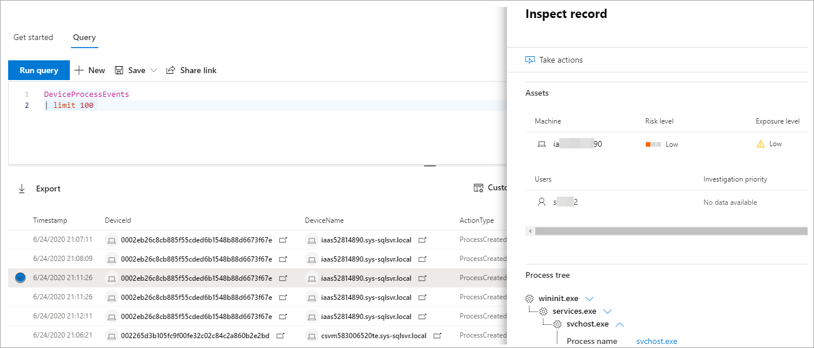

# <a name="work-with-advanced-hunting-query-results"></a>Utilizzare i risultati delle query di ricerca avanzata

[!INCLUDE [Microsoft 365 Defender rebranding](../includes/microsoft-defender.md)]


**Si applica a:**
- Microsoft 365 Defender

[!INCLUDE [Prerelease information](../includes/prerelease.md)]

Anche se è [](advanced-hunting-overview.md) possibile creare query di ricerca avanzata per restituire informazioni molto precise, è anche possibile utilizzare i risultati delle query per ottenere ulteriori informazioni e analizzare attività e indicatori specifici. È possibile eseguire le azioni seguenti sui risultati della query:

- Visualizzare i risultati come tabella o grafico
- Esportare tabelle e grafici
- Eseguire il drill-down per ottenere informazioni dettagliate sulle entità
- Modificare le query direttamente dai risultati o applicare filtri

## <a name="view-query-results-as-a-table-or-chart"></a>Visualizzare i risultati della query come tabella o grafico
Per impostazione predefinita, la ricerca avanzata visualizza i risultati delle query come dati tabulari. È inoltre possibile visualizzare gli stessi dati di un grafico. La ricerca avanzata supporta le visualizzazioni seguenti:

| Tipo visualizzazione | Descrizione |
| -- | -- |
| **tavolo** | Visualizza i risultati della query in formato tabulare |
| **Istogramma** | Esegue il rendering di una serie di elementi univoci sull'asse x come barre verticali le cui altezze rappresentano valori numerici di un altro campo |
| **Istogramma in pila** | Esegue il rendering di una serie di elementi univoci sull'asse x come barre verticali in pila le cui altezze rappresentano valori numerici di uno o più campi |
| **Grafico a torta** | Esegue il rendering delle torta di sezione che rappresentano elementi univoci. Le dimensioni di ogni torta rappresentano valori numerici di un altro campo. |
| **Grafico ad anello** | Esegue il rendering degli archi di sezione che rappresentano elementi univoci. La lunghezza di ogni arco rappresenta valori numerici di un altro campo. |
| **Grafico a linee** | Traccia valori numerici per una serie di elementi univoci e connette i valori tracciati |
| **Grafico a dispersione** | Traccia valori numerici per una serie di elementi univoci |
| **Grafico ad area** | Traccia valori numerici per una serie di elementi univoci e riempie le sezioni sotto i valori tracciati |

### <a name="construct-queries-for-effective-charts"></a>Creare query per grafici efficaci
Durante il rendering dei grafici, la ricerca avanzata identifica automaticamente le colonne di interesse e i valori numerici da aggregare. Per ottenere grafici significativi, creare le query in modo da restituire i valori specifici che si desidera visualizzare. Ecco alcune query di esempio e i grafici risultanti.

#### <a name="alerts-by-severity"></a>Avvisi in base alla gravità
Utilizzare `summarize` l'operatore per ottenere un conteggio numerico dei valori che si desidera utilizzare come grafico. La query seguente usa `summarize` l'operatore per ottenere il numero di avvisi in base alla gravità.

```kusto
AlertInfo
| summarize Total = count() by Severity
```
Durante il rendering dei risultati, un istogramma visualizza ogni valore di gravità come colonna separata:


 *come istogramma*

#### <a name="alert-severity-by-operating-system"></a>Gravità dell'avviso in base al sistema operativo
È inoltre possibile utilizzare `summarize` l'operatore per preparare i risultati per la creazione di grafici di valori da più campi. Ad esempio, potrebbe essere necessario comprendere in che modo le gravità degli avvisi vengono distribuite nei sistemi operativi. 

La query seguente utilizza un operatore per estrarre le informazioni sul sistema operativo dalla tabella e quindi utilizza per contare i valori `join` sia nelle colonne che nelle `DeviceInfo` `summarize` `OSPlatform` `Severity` colonne:

```kusto
AlertInfo
| join AlertEvidence on AlertId
| join DeviceInfo on DeviceId
| summarize Count = count() by OSPlatform, Severity 
```
Questi risultati sono visualizzati meglio usando un istogramma in pila:


 *grafico in pila*

#### <a name="phishing-emails-across-top-ten-sender-domains"></a>Messaggi di posta elettronica di phishing nei primi dieci domini del mittente
Se hai a che fare con un elenco di valori non finiti, puoi usare l'operatore per creare un grafico solo dei valori con la maggior `Top` parte delle istanze. Ad esempio, per ottenere i primi dieci domini di mittente con il maggior numero di messaggi di posta elettronica di phishing, utilizzare la query seguente:

```kusto
EmailEvents
| where ThreatTypes has "Phish" 
| summarize Count = count() by SenderFromDomain 
| top 10 by Count
```
Usa la visualizzazione grafico a torta per mostrare in modo efficace la distribuzione nei domini principali:


 *di phishing nei domini dei mittenti principali*

#### <a name="file-activities-over-time"></a>Attività sui file nel tempo
Utilizzando `summarize` l'operatore con `bin()` la funzione, è possibile verificare la presenza di eventi che coinvolgono un determinato indicatore nel tempo. La query seguente conta gli eventi che coinvolgono il file a intervalli di 30 minuti per mostrare picchi di attività `invoice.doc` correlati a tale file:

```kusto
AppFileEvents
| union DeviceFileEvents
| where FileName == "invoice.doc"
| summarize FileCount = count() by bin(Timestamp, 30m)
```
Il grafico a linee seguente evidenzia chiaramente i periodi di tempo con più attività che `invoice.doc` coinvolgono: 


 *un file nel tempo*


## <a name="export-tables-and-charts"></a>Esportare tabelle e grafici
Dopo aver eseguito una query, selezionare **Esporta** per salvare i risultati nel file locale. La visualizzazione scelta determina la modalità di esportazione dei risultati:

- **Visualizzazione tabella:** i risultati della query vengono esportati in formato tabulare come cartella di lavoro di Microsoft Excel
- **Qualsiasi grafico:** i risultati della query vengono esportati come immagine JPEG del grafico sottoposto a rendering

## <a name="drill-down-from-query-results"></a>Eseguire il drill-down dai risultati della query
Per esaminare rapidamente un record nei risultati della query, selezionare la riga corrispondente per aprire il **pannello Inspect record.** Il pannello fornisce le informazioni seguenti in base al record selezionato:

- **Asset:** visualizzazione riepilogata delle principali risorse (cassette postali, dispositivi e utenti) presenti nel record, arricchite con le informazioni disponibili, ad esempio i livelli di rischio e esposizione
- **Albero dei processi,** generato per i record con informazioni sui processi e arricchito con le informazioni contestuali disponibili; in generale, le query che restituiscono più colonne possono comportare alberi di processo più ricchi.
- **Tutti i** dettagli, ovvero tutti i valori delle colonne del record  



Per visualizzare ulteriori informazioni su un'entità specifica nei risultati della query, ad esempio un computer, un file, un utente, un indirizzo IP o un URL, selezionare l'identificatore dell'entità per aprire una pagina del profilo dettagliata per tale entità.

## <a name="tweak-your-queries-from-the-results"></a>Perfezionare le query dai risultati
Fare clic con il pulsante destro del mouse su un valore nel set di risultati per migliorare rapidamente la query. È possibile usare le opzioni per:

- Cercare in modo esplicito il valore selezionato (`==`)
- Escludere il valore selezionato dalla query (`!=`)
- Per aggiungere il valore alla query, è possibile usare gli operatori più avanzati, come `contains`, `starts with` e `ends with` 


## <a name="filter-the-query-results"></a>Filtrare i risultati della query
I filtri visualizzati a destra forniscono un riepilogo del set di risultati. Ogni colonna ha una propria sezione in cui sono elencati i valori distinti individuati per quella colonna e il numero di istanze.

Perfezionare la query selezionando i pulsanti o i pulsanti sui valori che si desidera includere o escludere e quindi `+` `-` selezionando Esegui **query.**


Dopo avere applicato il filtro per modificare la query e aver eseguito la query, i risultati vengono aggiornati di conseguenza.

## <a name="related-topics"></a>Argomenti correlati
- [Panoramica della ricerca avanzata](advanced-hunting-overview.md)
- [Capire il linguaggio delle query](advanced-hunting-query-language.md)
- [Utilizzare le query condivise](advanced-hunting-shared-queries.md)
- [Cercare tra dispositivi, posta elettronica, app e identità](advanced-hunting-query-emails-devices.md)
- [Comprendere lo schema](advanced-hunting-schema-tables.md)
- [Applicare le procedure consigliate per le query](advanced-hunting-best-practices.md)
- [Panoramica dei rilevamenti personalizzati](custom-detections-overview.md)
