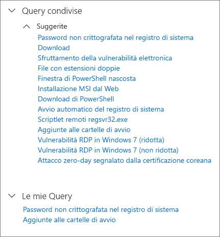
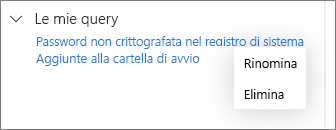

# Usare le query condivise nella ricerca avanzata

**Si applica a:**
- Microsoft Threat Protection

[!include[Prerelease information](prerelease.md)]

[Le query Ricerca avanzata](advanced-hunting-overview.md) possono essere condivise tra con gli utenti della stessa organizzazione. È anche possibile trovare query condivise pubblicamente su GitHub. Queste query consentono di intraprendere rapidamente specifici scenari di ricerca delle minacce senza dover scrivere le query da zero.

## Salvare, modificare e condividere una query
È possibile salvare una query nuova o esistente in modo che sia solo accessibile all'utente o condivisa con altri utenti della propria organizzazione. 

1. Creare o modificare una query. 

2. Fare clic sul pulsante a discesa **Salva query** e selezionare **Salva con nome**.
    
3. Immettere un nome per la query. 

   

4. Selezionare la cartella in cui si vuole salvare la query.
    - **Query condivise**: query condivise con tutti gli utenti dell'organizzazione
    - **Query personali**: query accessibili solo all'utente
    
5. Selezionare **Salva**. 

## Eliminare o rinominare una query
1. Fare clic con il pulsante destro del mouse su una query che si vuole rinominare o eliminare.

    

2. Selezionare **Elimina** per confermare l'eliminazione. In alternativa, selezionare **Rinomina** e immettere un nuovo nome per la query.

## Accedere alle query nel repository GitHub  
I ricercatori della sicurezza Microsoft condividono regolarmente query di ricerca avanzata in un [repository pubblico designato in GitHub](https://github.com/microsoft/MTP-AHQ). È possibile collaborare a questo repository. Per collaborare, [iscriversi a GitHub gratuitamente](https://github.com/).

>[!tip]
>I ricercatori della sicurezza Microsoft forniscono anche query di ricerca avanzata che è possibile usare per trovare le attività e gli indicatori associati alle minacce emergenti. Queste query sono incluse nei report di [analisi delle minacce](https://docs.microsoft.com/windows/security/threat-protection/microsoft-defender-atp/threat-analytics) nel Microsoft Defender Security Center.

## Argomenti correlati
- [Ricerca proattiva delle minacce](advanced-hunting-overview.md)
- [Capire il linguaggio delle query](advanced-hunting-query-language.md)
- [Ricerca delle minacce su dispositivi ed e-mail](advanced-hunting-query-emails-devices.md)
- [Comprensione dello schema](advanced-hunting-schema-tables.md)
- [Applicazione delle procedure consigliate per le query](advanced-hunting-best-practices.md)