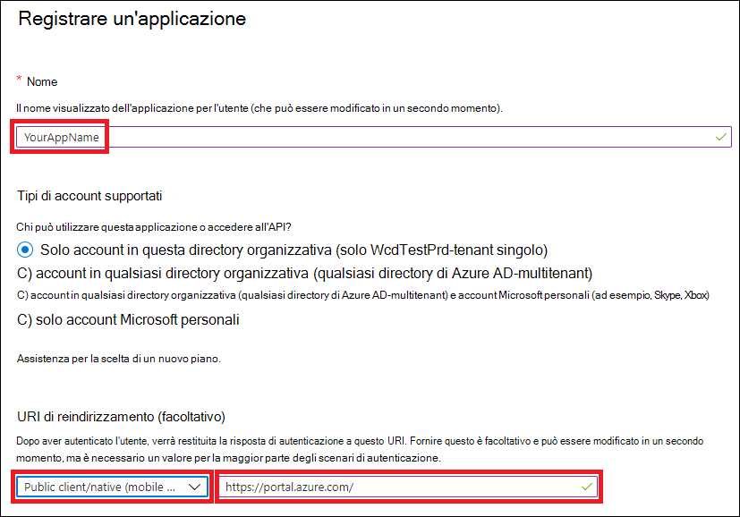
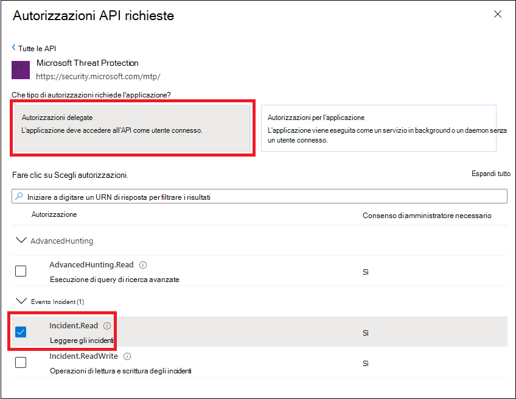
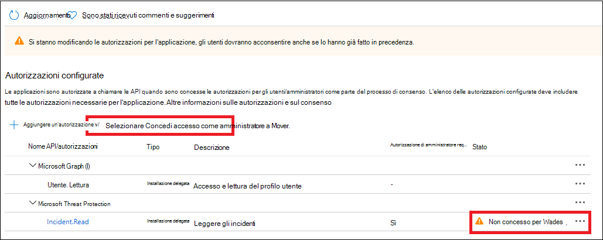

# <a name="access-microsoft-threat-protection-apis-on-behalf-of-user"></a>Accedere alle API di Microsoft Threat Protection per conto dell'utente

[!INCLUDE [Microsoft 365 Defender rebranding](../includes/microsoft-defender.md)]


**Si applica a:**
- Microsoft Threat Protection

>[!IMPORTANT] 
>Alcune informazioni si riferiscono al prodotto prerilasciato che può essere modificato in modo sostanziale prima che venga rilasciato commercialmente. Microsoft makes no warranties, express or implied, with respect to the information provided here.


In questa pagina viene descritto come creare un'applicazione per ottenere l'accesso programmatico a Microsoft Threat Protection per conto di un utente.

Se è necessario l'accesso a livello di programmazione Microsoft Threat Protection senza un utente, fare riferimento a [creare un'app per accedere a Microsoft Threat Protection senza un utente](api-create-app-web.md).

Se non si è certi di quale accesso è necessario, leggere l' [accesso alle API di Microsoft Threat Protection](api-access.md).

Microsoft Threat Protection espone gran parte dei suoi dati e delle sue azioni tramite un insieme di API programmatiche. Tali API consentiranno di automatizzare i flussi di lavoro e di innovare in base alle funzionalità di protezione dalle minacce di Microsoft. L'accesso API richiede l'autenticazione OAuth 2.0. Per ulteriori informazioni, vedere il [flusso del codice di autorizzazione OAuth 2,0](https://docs.microsoft.com/azure/active-directory/develop/active-directory-v2-protocols-oauth-code).

In generale, è necessario eseguire la procedura seguente per utilizzare le API:
- Creare un'applicazione AAD
- Ottenere un token di accesso tramite questa applicazione
- Utilizzare il token per accedere all'API di Microsoft Threat Protection

In questa pagina viene illustrato come creare un'applicazione AAD, ottenere un token di accesso a Microsoft Threat Protection e convalidare il token.

>[!NOTE]
> Quando si accede all'API di Microsoft Threat Protection per conto di un utente, è necessario disporre delle autorizzazioni appropriate per l'applicazione e l'autorizzazione dell'utente.


>[!TIP]
> Se si dispone dell'autorizzazione necessaria per eseguire un'azione nel portale, è possibile disporre dell'autorizzazione per eseguire l'azione nell'API.

## <a name="create-an-app"></a>Creare un'app

1. Accedere a [Azure](https://portal.azure.com) con l'utente con ruolo di **amministratore globale** .

2. Passare a registrazione delle app di **Azure Active Directory**  >  **App registrations**  >  **nuova registrazione**. 

   

3. Nella registrazione da, immettere le informazioni seguenti, quindi fare clic su **registra**.

   

   - **Nome:** Nome dell'applicazione
   - **Tipo di applicazione:** Client pubblico
   - **URI di reindirizzamento:**https://portal.azure.com

4. Per consentire all'app di accedere a Microsoft Threat Protection e assegnargli le autorizzazioni, nella pagina dell'applicazione selezionare **autorizzazioni API**  >  **Aggiungi autorizzazione**API  >  **l'organizzazione utilizza** >, digitare **Microsoft Threat Protection**e quindi selezionare **Microsoft Threat Protection**.

    >[!NOTE]
    > Microsoft Threat Protection non viene visualizzato nell'elenco originale. È necessario iniziare a scrivere il nome nella casella di testo per visualizzarlo.

      

    - Scegliere **autorizzazioni Delegate** > scegliere le autorizzazioni rilevanti per lo scenario, ad esempio **Incident. Read**, quindi selezionare **Aggiungi autorizzazioni**.

      

     >[!IMPORTANT]
     >È necessario selezionare le autorizzazioni rilevanti. 

    -  Per determinare le autorizzazioni necessarie, consultare la sezione **autorizzazioni** nell'API che si desidera chiamare.

    - Fare clic su **Concedi consenso**

      >[!NOTE]
      >Ogni volta che si aggiunge l'autorizzazione, è necessario fare clic su **Concedi consenso** per la nuova autorizzazione per rendere effettive le autorizzazioni.

      

6. Annotare l'ID dell'applicazione e l'ID tenant:

   - Nella pagina applicazione passare a **Panoramica** e copiare quanto segue:

   


## <a name="get-an-access-token-using-powershell"></a>Ottenere un token di accesso tramite PowerShell

```
#Install the ADAL.PS package if it's not installed.
if(!(Get-Package adal.ps)) { Install-Package -Name adal.ps }

$authority = "https://login.windows.net/{tenant-id}" # replace {tenant-id} with your tenant ID.

$clientId = "{application-id}" #replace {application-id} with your application ID.

$redirectUri = "{redirect-uri}" # replace {redirect-uri} with your application redirect URI.

$resourceUrl = "https://api.security.microsoft.com"

$response = Get-ADALToken -Resource $resourceUrl -ClientId $clientId -RedirectUri $redirectUri -Authority $authority -PromptBehavior:Always
$response.AccessToken | clip
$response.AccessToken
```

## <a name="related-topics"></a>Argomenti correlati
- [Accedere alle API di Microsoft Threat Protection](api-access.md)
- [Accedere a Microsoft Threat Protection con il contesto dell'applicazione](api-create-app-web.md)
