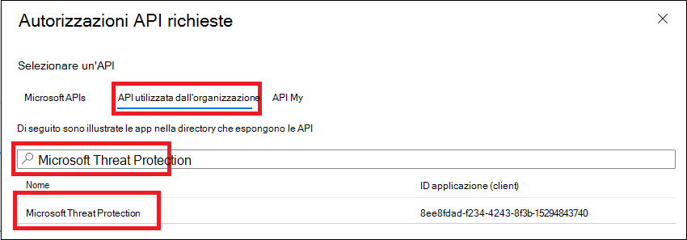
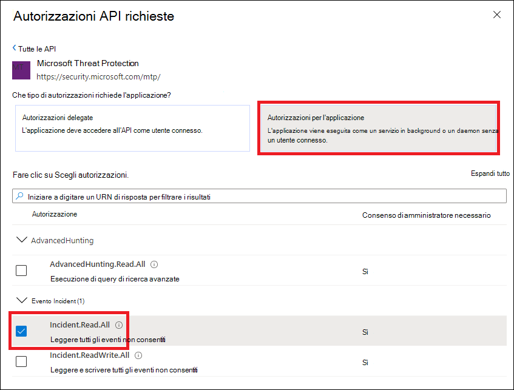
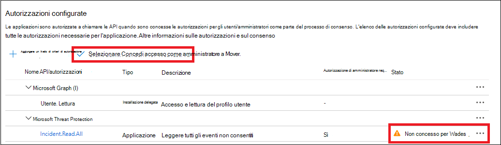
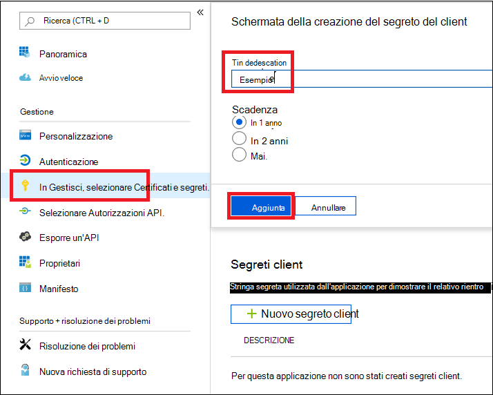
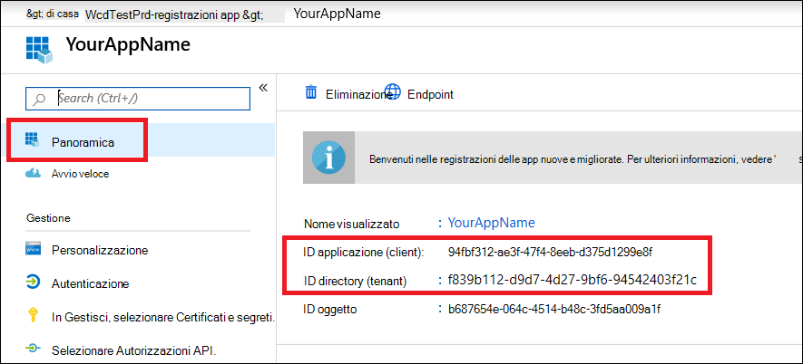

# <a name="create-an-app-to-access-microsoft-365-defender-without-a-user"></a><span data-ttu-id="f4699-104">Creare un'app per accedere a Microsoft 365 Defender senza un utente</span><span class="sxs-lookup"><span data-stu-id="f4699-104">Create an app to access Microsoft 365 Defender without a user</span></span>

[!INCLUDE [Microsoft 365 Defender rebranding](../includes/microsoft-defender.md)]

<span data-ttu-id="f4699-105">**Si applica a:**</span><span class="sxs-lookup"><span data-stu-id="f4699-105">**Applies to:**</span></span>

- <span data-ttu-id="f4699-106">Microsoft 365 Defender</span><span class="sxs-lookup"><span data-stu-id="f4699-106">Microsoft 365 Defender</span></span>

> [!IMPORTANT]
> <span data-ttu-id="f4699-107">Alcune informazioni si riferiscono al prodotto prerilasciato che può essere modificato in modo sostanziale prima che venga rilasciato commercialmente.</span><span class="sxs-lookup"><span data-stu-id="f4699-107">Some information relates to prereleased product which may be substantially modified before it's commercially released.</span></span> <span data-ttu-id="f4699-108">Microsoft makes no warranties, express or implied, with respect to the information provided here.</span><span class="sxs-lookup"><span data-stu-id="f4699-108">Microsoft makes no warranties, express or implied, with respect to the information provided here.</span></span>

<span data-ttu-id="f4699-109">In questa pagina viene descritto come creare un'applicazione per ottenere l'accesso programmatico a Microsoft 365 Defender senza un utente definito, ad esempio se si sta creando un daemon o un servizio in background.</span><span class="sxs-lookup"><span data-stu-id="f4699-109">This page describes how to create an application to get programmatic access to Microsoft 365 Defender without a defined user—for example, if you're creating a daemon or background service.</span></span>

<span data-ttu-id="f4699-110">Se è necessario l'accesso a livello di programmazione a Microsoft 365 Defender per conto di uno o più utenti, vedere [creare un'app per accedere alle API di microsoft 365 Defender per conto di un utente](api-create-app-user-context.md) e [creare un'app con accesso partner alle api di Microsoft 365 Defender](api-partner-access.md).</span><span class="sxs-lookup"><span data-stu-id="f4699-110">If you need programmatic access to Microsoft 365 Defender on behalf of one or more users, see [Create an app to access Microsoft 365 Defender APIs on behalf of a user](api-create-app-user-context.md) and [Create an app with partner access to Microsoft 365 Defender APIs](api-partner-access.md).</span></span> <span data-ttu-id="f4699-111">Se non si è certi del tipo di accesso necessario, vedere [Introduzione](api-access.md).</span><span class="sxs-lookup"><span data-stu-id="f4699-111">If you're not sure which kind of access you need, see [Get started](api-access.md).</span></span>

<span data-ttu-id="f4699-112">Microsoft 365 Defender espone gran parte dei suoi dati e delle sue azioni tramite un insieme di API programmatiche.</span><span class="sxs-lookup"><span data-stu-id="f4699-112">Microsoft 365 Defender exposes much of its data and actions through a set of programmatic APIs.</span></span> <span data-ttu-id="f4699-113">Tali API consentono di automatizzare i flussi di lavoro e di avvalersi delle funzionalità di Microsoft 365 Defender.</span><span class="sxs-lookup"><span data-stu-id="f4699-113">Those APIs help you automate workflows and make use of Microsoft 365 Defender's capabilities.</span></span> <span data-ttu-id="f4699-114">Questo accesso API richiede l'autenticazione OAuth 2.0.</span><span class="sxs-lookup"><span data-stu-id="f4699-114">This API access requires OAuth2.0 authentication.</span></span> <span data-ttu-id="f4699-115">Per ulteriori informazioni, vedere il [flusso del codice di autorizzazione OAuth 2,0](https://docs.microsoft.com/azure/active-directory/develop/active-directory-v2-protocols-oauth-code).</span><span class="sxs-lookup"><span data-stu-id="f4699-115">For more information, see [OAuth 2.0 Authorization Code Flow](https://docs.microsoft.com/azure/active-directory/develop/active-directory-v2-protocols-oauth-code).</span></span>

<span data-ttu-id="f4699-116">In generale, è necessario eseguire la procedura seguente per utilizzare queste API:</span><span class="sxs-lookup"><span data-stu-id="f4699-116">In general, you'll need to take the following steps to use these APIs:</span></span>

- <span data-ttu-id="f4699-117">Creare un'applicazione Azure Active Directory (Azure AD).</span><span class="sxs-lookup"><span data-stu-id="f4699-117">Create an Azure Active Directory (Azure AD) application.</span></span>
- <span data-ttu-id="f4699-118">Ottenere un token di accesso utilizzando l'applicazione.</span><span class="sxs-lookup"><span data-stu-id="f4699-118">Get an access token using this application.</span></span>
- <span data-ttu-id="f4699-119">Utilizzare il token per accedere a Microsoft 365 Defender API.</span><span class="sxs-lookup"><span data-stu-id="f4699-119">Use the token to access Microsoft 365 Defender API.</span></span>

<span data-ttu-id="f4699-120">In questo articolo viene illustrato come eseguire le operazioni seguenti:</span><span class="sxs-lookup"><span data-stu-id="f4699-120">This article explains how to:</span></span>

- <span data-ttu-id="f4699-121">Creare un'applicazione Azure AD</span><span class="sxs-lookup"><span data-stu-id="f4699-121">Create an Azure AD application</span></span>
- <span data-ttu-id="f4699-122">Ottenere un token di accesso a Microsoft 365 Defender</span><span class="sxs-lookup"><span data-stu-id="f4699-122">Get an access token to Microsoft 365 Defender</span></span>
- <span data-ttu-id="f4699-123">Convalidare il token.</span><span class="sxs-lookup"><span data-stu-id="f4699-123">Validate the token.</span></span>

## <a name="create-an-app"></a><span data-ttu-id="f4699-124">Creare un'app</span><span class="sxs-lookup"><span data-stu-id="f4699-124">Create an app</span></span>

1. <span data-ttu-id="f4699-125">Accedere a [Azure](https://portal.azure.com) come utente con il ruolo di **amministratore globale** .</span><span class="sxs-lookup"><span data-stu-id="f4699-125">Sign in to [Azure](https://portal.azure.com) as a user with the **Global Administrator** role.</span></span>

2. <span data-ttu-id="f4699-126">Passare a registrazione delle app di **Azure Active Directory**  >    >  **nuova registrazione**.</span><span class="sxs-lookup"><span data-stu-id="f4699-126">Navigate to **Azure Active Directory** > **App registrations** > **New registration**.</span></span>

   

3. <span data-ttu-id="f4699-128">Nel modulo scegliere un nome per l'applicazione e quindi fare clic su **registra**.</span><span class="sxs-lookup"><span data-stu-id="f4699-128">In the form, choose a name for your application, then select **Register**.</span></span>

4. <span data-ttu-id="f4699-129">Nella pagina dell'applicazione selezionare **autorizzazioni API**  >  **Aggiungi API di autorizzazione**  >  **l'organizzazione utilizza** >, digitare **Microsoft Threat Protection** e selezionare **Microsoft Threat Protection**.</span><span class="sxs-lookup"><span data-stu-id="f4699-129">On your application page, select **API Permissions** > **Add permission** > **APIs my organization uses** >, type **Microsoft Threat Protection**, and select **Microsoft Threat Protection**.</span></span> <span data-ttu-id="f4699-130">L'app può ora accedere a Microsoft 365 Defender.</span><span class="sxs-lookup"><span data-stu-id="f4699-130">Your app can now access Microsoft 365 Defender.</span></span>

   > [!TIP]
   > <span data-ttu-id="f4699-131">*Microsoft Threat Protection* è un nome precedente per Microsoft 365 Defender e non verrà visualizzato nell'elenco originale.</span><span class="sxs-lookup"><span data-stu-id="f4699-131">*Microsoft Threat Protection* is a former name for Microsoft 365 Defender, and will not appear in the original list.</span></span> <span data-ttu-id="f4699-132">È necessario iniziare a scrivere il nome nella casella di testo per visualizzarlo.</span><span class="sxs-lookup"><span data-stu-id="f4699-132">You need to start writing its name in the text box to see it appear.</span></span>

   

5. <span data-ttu-id="f4699-134">Selezionare **Autorizzazioni applicazione**.</span><span class="sxs-lookup"><span data-stu-id="f4699-134">Select **Application permissions**.</span></span> <span data-ttu-id="f4699-135">Scegliere le autorizzazioni rilevanti per lo scenario, ad esempio **Incident. Read. All**, e quindi selezionare **Aggiungi autorizzazioni**.</span><span class="sxs-lookup"><span data-stu-id="f4699-135">Choose the relevant permissions for your scenario (for example, **Incident.Read.All**), and then select **Add permissions**.</span></span>

   

    > [!NOTE]
    > <span data-ttu-id="f4699-137">È necessario selezionare le autorizzazioni rilevanti per lo scenario.</span><span class="sxs-lookup"><span data-stu-id="f4699-137">You need to select the relevant permissions for your scenario.</span></span> <span data-ttu-id="f4699-138">*Leggere tutti gli eventi* non consentiti è solo un esempio.</span><span class="sxs-lookup"><span data-stu-id="f4699-138">*Read all incidents* is just an example.</span></span> <span data-ttu-id="f4699-139">Per determinare le autorizzazioni necessarie, vedere la sezione relativa alle **autorizzazioni** nell'API che si desidera chiamare.</span><span class="sxs-lookup"><span data-stu-id="f4699-139">To determine which permission you need, please look at the **Permissions** section in the API you want to call.</span></span>
    >
    > <span data-ttu-id="f4699-140">Ad esempio, per [eseguire query avanzate](api-advanced-hunting.md), selezionare l'autorizzazione ' Esegui query avanzate '; per [isolare un dispositivo](https://docs.microsoft.com/windows/security/threat-protection/microsoft-defender-atp/isolate-machine), selezionare l'autorizzazione ' isolate machine '.</span><span class="sxs-lookup"><span data-stu-id="f4699-140">For instance, to [run advanced queries](api-advanced-hunting.md), select the 'Run advanced queries' permission; to [isolate a device](https://docs.microsoft.com/windows/security/threat-protection/microsoft-defender-atp/isolate-machine), select the 'Isolate machine' permission.</span></span>

6. <span data-ttu-id="f4699-141">Selezionare **Concedi consenso amministratore**.</span><span class="sxs-lookup"><span data-stu-id="f4699-141">Select **Grant admin consent**.</span></span> <span data-ttu-id="f4699-142">Ogni volta che si aggiunge un'autorizzazione, è necessario selezionare **Concedi all'amministratore il consenso** per rendere effettive le autorizzazioni.</span><span class="sxs-lookup"><span data-stu-id="f4699-142">Every time you add a permission, you must select **Grant admin consent** for it to take effect.</span></span>

    

7. <span data-ttu-id="f4699-144">Per aggiungere un segreto all'applicazione, selezionare **certificati & segreti**, aggiungere una descrizione al segreto e quindi fare clic su **Aggiungi**.</span><span class="sxs-lookup"><span data-stu-id="f4699-144">To add a secret to the application, select **Certificates & secrets**, add a description to the secret, then select **Add**.</span></span>

    > [!TIP]
    > <span data-ttu-id="f4699-145">Dopo aver selezionato **Aggiungi**, selezionare **copia il valore segreto generato**.</span><span class="sxs-lookup"><span data-stu-id="f4699-145">After you select **Add**, select **copy the generated secret value**.</span></span> <span data-ttu-id="f4699-146">Non sarà possibile recuperare il valore segreto dopo l'uscita.</span><span class="sxs-lookup"><span data-stu-id="f4699-146">You won't be able to retrieve the secret value after you leave.</span></span>

    

8. <span data-ttu-id="f4699-148">Registrare l'ID dell'applicazione e l'ID del tenant in una posizione sicura.</span><span class="sxs-lookup"><span data-stu-id="f4699-148">Record your application ID and your tenant ID somewhere safe.</span></span> <span data-ttu-id="f4699-149">Sono elencate in **Panoramica** nella pagina dell'applicazione.</span><span class="sxs-lookup"><span data-stu-id="f4699-149">They're listed under **Overview** on your application page.</span></span>

   

9. <span data-ttu-id="f4699-151">**Solo per microsoft 365 Defender Partners**: [seguire queste istruzioni](https://docs.microsoft.com/microsoft-365/security/mtp/api-partner-access) per l'accesso dei partner tramite le API di Microsoft 365 Defender, impostare la propria app come multi-tenant, in modo che possa essere disponibile in tutti i tenant una volta che si riceve il consenso di amministratore.</span><span class="sxs-lookup"><span data-stu-id="f4699-151">**For Microsoft 365 Defender Partners only**: [Follow these instructions](https://docs.microsoft.com/microsoft-365/security/mtp/api-partner-access) for partner access through the Microsoft 365 Defender APIs, set your app to be multi-tenant, so it can be available in all tenants once you receive admin consent.</span></span> <span data-ttu-id="f4699-152">L'accesso dei partner è **necessario** per le app di terze parti, ad esempio se si crea un'app che deve essere eseguita in più tenant dei clienti.</span><span class="sxs-lookup"><span data-stu-id="f4699-152">Partner access is **required** for third-party apps—for example, if you create an app that is intended to run in multiple customers' tenants.</span></span> <span data-ttu-id="f4699-153">Non è **necessario** se si crea un servizio che si desidera eseguire solo nel tenant, ad esempio un'applicazione per l'utilizzo che interagirà solo con i propri dati.</span><span class="sxs-lookup"><span data-stu-id="f4699-153">It is **not required** if you create a service that you want to run in your tenant only, such as an application for your own usage that will only interact with your own data.</span></span> <span data-ttu-id="f4699-154">Per impostare l'app come multi-tenant:</span><span class="sxs-lookup"><span data-stu-id="f4699-154">To set your app to be multi-tenant:</span></span>

    - <span data-ttu-id="f4699-155">Andare a **autenticazione** e aggiungere https://portal.azure.com come URI di **Reindirizzamento**.</span><span class="sxs-lookup"><span data-stu-id="f4699-155">Go to **Authentication**, and add https://portal.azure.com as the **Redirect URI**.</span></span>

    - <span data-ttu-id="f4699-156">Nella parte inferiore della pagina, in **tipi di account supportati**, selezionare gli **account in qualsiasi** autorizzazione dell'applicazione directory organizzativa per l'app multi-tenant.</span><span class="sxs-lookup"><span data-stu-id="f4699-156">On the bottom of the page, under **Supported account types**, select the **Accounts in any organizational directory** application consent for your multi-tenant app.</span></span>

    <span data-ttu-id="f4699-157">Poiché l'applicazione interagisce con Microsoft 365 Defender per conto degli utenti, è necessario approvarla per ogni tenant su cui si intende utilizzarlo.</span><span class="sxs-lookup"><span data-stu-id="f4699-157">Since your application interacts with Microsoft 365 Defender on behalf of your users, it needs be approved for every tenant on which you intend to use it.</span></span>

    <span data-ttu-id="f4699-158">L'amministratore globale di Active Directory per ogni tenant deve selezionare il collegamento di consenso e approvare l'app.</span><span class="sxs-lookup"><span data-stu-id="f4699-158">The Active Directory global admin for each tenant needs to select the consent link and approve your app.</span></span>

    <span data-ttu-id="f4699-159">Il collegamento di consenso ha la seguente struttura:</span><span class="sxs-lookup"><span data-stu-id="f4699-159">The consent link has the following structure:</span></span>

    ```http
    https://login.microsoftonline.com/common/oauth2/authorize?prompt=consent&client_id=<00000000-0000-0000-0000-000000000000>&response_type=code&sso_reload=true
    ```

    <span data-ttu-id="f4699-160">Le cifre `00000000-0000-0000-0000-000000000000` devono essere sostituite con l'ID dell'applicazione.</span><span class="sxs-lookup"><span data-stu-id="f4699-160">The digits `00000000-0000-0000-0000-000000000000` should be replaced with your Application ID.</span></span>  

<span data-ttu-id="f4699-161">**Fatto!**</span><span class="sxs-lookup"><span data-stu-id="f4699-161">**Done!**</span></span> <span data-ttu-id="f4699-162">La registrazione di un'applicazione è stata completata correttamente.</span><span class="sxs-lookup"><span data-stu-id="f4699-162">You've successfully registered an application!</span></span> <span data-ttu-id="f4699-163">Vedere gli esempi riportati di seguito per l'acquisizione e la convalida dei token.</span><span class="sxs-lookup"><span data-stu-id="f4699-163">See examples below for token acquisition and validation.</span></span>

## <a name="get-an-access-token"></a><span data-ttu-id="f4699-164">Ottenere un token di accesso</span><span class="sxs-lookup"><span data-stu-id="f4699-164">Get an access token</span></span>

<span data-ttu-id="f4699-165">Per ulteriori informazioni sui token di Azure Active Directory, vedere l' [esercitazione su Azure ad](https://docs.microsoft.com/azure/active-directory/develop/active-directory-v2-protocols-oauth-client-creds).</span><span class="sxs-lookup"><span data-stu-id="f4699-165">For more information on Azure Active Directory tokens, see the [Azure AD tutorial](https://docs.microsoft.com/azure/active-directory/develop/active-directory-v2-protocols-oauth-client-creds).</span></span>

> [!IMPORTANT]
> <span data-ttu-id="f4699-166">Anche se negli esempi di questa sezione è consigliabile incollare i valori segreti a scopo di testing, **non è mai necessario impostare come hardcoded i segreti** in un'applicazione in esecuzione in produzione.</span><span class="sxs-lookup"><span data-stu-id="f4699-166">Although the examples in this section encourage you to paste in secret values for testing purposes, you should **never hardcode secrets** into an application running in production.</span></span> <span data-ttu-id="f4699-167">Una terza parte può usare il segreto per accedere alle risorse.</span><span class="sxs-lookup"><span data-stu-id="f4699-167">A third party could use your secret to access resources.</span></span> <span data-ttu-id="f4699-168">È possibile proteggere i segreti dell'app utilizzando il [Vault Key di Azure](https://docs.microsoft.com/azure/key-vault/general/about-keys-secrets-certificates).</span><span class="sxs-lookup"><span data-stu-id="f4699-168">You can help keep your app's secrets secure by using [Azure Key Vault](https://docs.microsoft.com/azure/key-vault/general/about-keys-secrets-certificates).</span></span> <span data-ttu-id="f4699-169">Per un esempio pratico del modo in cui è possibile proteggere l'app, vedere [gestire i segreti nelle app del server con il Vault Key di Azure](https://docs.microsoft.com/learn/modules/manage-secrets-with-azure-key-vault/).</span><span class="sxs-lookup"><span data-stu-id="f4699-169">For a practical example of how you can protect your app, see [Manage secrets in your server apps with Azure Key Vault](https://docs.microsoft.com/learn/modules/manage-secrets-with-azure-key-vault/).</span></span>

### <a name="get-an-access-token-using-powershell"></a><span data-ttu-id="f4699-170">Ottenere un token di accesso tramite PowerShell</span><span class="sxs-lookup"><span data-stu-id="f4699-170">Get an access token using PowerShell</span></span>

```PowerShell
# This code gets the application context token and saves it to a file named "Latest-token.txt" under the current directory.

$tenantId = '' # Paste your directory (tenant) ID here
$clientId = '' # Paste your application (client) ID here
$appSecret = '' # Paste your own app secret here to test, then store it in a safe place, such as the Azure Key Vault!

$resourceAppIdUri = 'https://api.security.microsoft.com'
$oAuthUri = "https://login.windows.net/$tenantId/oauth2/token"

$authBody = [Ordered] @{
    resource = $resourceAppIdUri
    client_id = $clientId
    client_secret = $appSecret
    grant_type = 'client_credentials'
}

$authResponse = Invoke-RestMethod -Method Post -Uri $oAuthUri -Body $authBody -ErrorAction Stop
$token = $authResponse.access_token

Out-File -FilePath "./Latest-token.txt" -InputObject $token

return $token
```

### <a name="get-an-access-token-using-c"></a><span data-ttu-id="f4699-171">Ottenere un token di accesso tramite C\#</span><span class="sxs-lookup"><span data-stu-id="f4699-171">Get an access token using C\#</span></span>

> [!NOTE]
> <span data-ttu-id="f4699-172">Il codice seguente è stato testato con NuGet Microsoft. IdentityModel. clients. ActiveDirectory 3.19.8.</span><span class="sxs-lookup"><span data-stu-id="f4699-172">The following code was tested with Nuget Microsoft.IdentityModel.Clients.ActiveDirectory 3.19.8.</span></span>

1. <span data-ttu-id="f4699-173">Creare una nuova applicazione console.</span><span class="sxs-lookup"><span data-stu-id="f4699-173">Create a new console application.</span></span>

1. <span data-ttu-id="f4699-174">Installare NuGet [Microsoft. IdentityModel. clients. ActiveDirectory](https://www.nuget.org/packages/Microsoft.IdentityModel.Clients.ActiveDirectory/).</span><span class="sxs-lookup"><span data-stu-id="f4699-174">Install NuGet [Microsoft.IdentityModel.Clients.ActiveDirectory](https://www.nuget.org/packages/Microsoft.IdentityModel.Clients.ActiveDirectory/).</span></span>

1. <span data-ttu-id="f4699-175">Aggiungere la riga seguente:</span><span class="sxs-lookup"><span data-stu-id="f4699-175">Add the following line:</span></span>

    ```C#
    using Microsoft.IdentityModel.Clients.ActiveDirectory;
    ```

1. <span data-ttu-id="f4699-176">Copiare e incollare il codice seguente nell'app (non dimenticare di aggiornare le tre variabili: `tenantId` , `clientId` , `appSecret` ):</span><span class="sxs-lookup"><span data-stu-id="f4699-176">Copy and paste the following code into your app (don't forget to update the three variables: `tenantId`, `clientId`, `appSecret`):</span></span>

    ```C#
    string tenantId = ""; // Paste your directory (tenant) ID here
    string clientId = ""; // Paste your application (client) ID here
    string appSecret = ""; // Paste your own app secret here to test, then store it in a safe place, such as the Azure Key Vault!

    const string authority = "https://login.windows.net";
    const string wdatpResourceId = "https://api.security.microsoft.com";

    AuthenticationContext auth = new AuthenticationContext($"{authority}/{tenantId}/");
    ClientCredential clientCredential = new ClientCredential(clientId, appSecret);
    AuthenticationResult authenticationResult = auth.AcquireTokenAsync(wdatpResourceId, clientCredential).GetAwaiter().GetResult();
    string token = authenticationResult.AccessToken;
    ```

### <a name="get-an-access-token-using-python"></a><span data-ttu-id="f4699-177">Ottenere un token di accesso tramite Python</span><span class="sxs-lookup"><span data-stu-id="f4699-177">Get an access token using Python</span></span>

```Python
import json
import urllib.request
import urllib.parse

tenantId = '' # Paste your directory (tenant) ID here
clientId = '' # Paste your application (client) ID here
appSecret = '' # Paste your own app secret here to test, then store it in a safe place, such as the Azure Key Vault!

url = "https://login.windows.net/%s/oauth2/token" % (tenantId)

resourceAppIdUri = 'https://api.securitycenter.windows.com'

body = {
    'resource' : resourceAppIdUri,
    'client_id' : clientId,
    'client_secret' : appSecret,
    'grant_type' : 'client_credentials'
}

data = urllib.parse.urlencode(body).encode("utf-8")

req = urllib.request.Request(url, data)
response = urllib.request.urlopen(req)
jsonResponse = json.loads(response.read())
aadToken = jsonResponse["access_token"]
```

### <a name="get-an-access-token-using-curl"></a><span data-ttu-id="f4699-178">Ottenere un token di accesso tramite CURL</span><span class="sxs-lookup"><span data-stu-id="f4699-178">Get an access token using curl</span></span>

> [!NOTE]
> <span data-ttu-id="f4699-179">Curl è preinstallato in Windows 10, versione 1803 e versioni successive.</span><span class="sxs-lookup"><span data-stu-id="f4699-179">Curl is pre-installed on Windows 10, versions 1803 and later.</span></span> <span data-ttu-id="f4699-180">Per altre versioni di Windows, scaricare e installare lo strumento direttamente dal [sito web ufficiale di curl](https://curl.haxx.se/windows/).</span><span class="sxs-lookup"><span data-stu-id="f4699-180">For other versions of Windows, download and install the tool directly from the [official curl website](https://curl.haxx.se/windows/).</span></span>

1. <span data-ttu-id="f4699-181">Aprire una finestra del prompt dei comandi e impostare CLIENT_ID sull'ID dell'applicazione di Azure.</span><span class="sxs-lookup"><span data-stu-id="f4699-181">Open a command prompt, and set CLIENT_ID to your Azure application ID.</span></span>

1. <span data-ttu-id="f4699-182">Impostare CLIENT_SECRET per l'applicazione di Azure segreta.</span><span class="sxs-lookup"><span data-stu-id="f4699-182">Set CLIENT_SECRET to your Azure application secret.</span></span>

1. <span data-ttu-id="f4699-183">Impostare TENANT_ID sull'ID tenant di Azure del cliente che desidera utilizzare l'app per accedere a Microsoft 365 Defender.</span><span class="sxs-lookup"><span data-stu-id="f4699-183">Set TENANT_ID to the Azure tenant ID of the customer that wants to use your app to access Microsoft 365 Defender.</span></span>

1. <span data-ttu-id="f4699-184">Eseguire il comando riportato di seguito:</span><span class="sxs-lookup"><span data-stu-id="f4699-184">Run the following command:</span></span>

   ```bash
   curl -i -X POST -H "Content-Type:application/x-www-form-urlencoded" -d "grant_type=client_credentials" -d "client_id=%CLIENT_ID%" -d "scope=https://securitycenter.onmicrosoft.com/windowsatpservice/.default" -d "client_secret=%CLIENT_SECRET%" "https://login.microsoftonline.com/%TENANT_ID%/oauth2/v2.0/token" -k
   ```

   <span data-ttu-id="f4699-185">Una risposta corretta avrà un aspetto simile al seguente:</span><span class="sxs-lookup"><span data-stu-id="f4699-185">A successful response will look like this:</span></span>

   ```bash
   {"token_type":"Bearer","expires_in":3599,"ext_expires_in":0,"access_token":"eyJ0eXAiOiJKV1QiLCJhbGciOiJSUzI1NiIsIn <truncated> aWReH7P0s0tjTBX8wGWqJUdDA"}
   ```

## <a name="validate-the-token"></a><span data-ttu-id="f4699-186">Convalidare il token</span><span class="sxs-lookup"><span data-stu-id="f4699-186">Validate the token</span></span>

1. <span data-ttu-id="f4699-187">Copiare e incollare il token nel [sito Web di convalida del token Web JSON, JWT,](https://jwt.ms) per decodificarlo.</span><span class="sxs-lookup"><span data-stu-id="f4699-187">Copy and paste the token into the [JSON web token validator website, JWT,](https://jwt.ms) to decode it.</span></span>

1. <span data-ttu-id="f4699-188">Verificare che l'attestazione dei *ruoli* all'interno del token decodificato contenga le autorizzazioni desiderate.</span><span class="sxs-lookup"><span data-stu-id="f4699-188">Make sure that the *roles* claim within the decoded token contains the desired permissions.</span></span>

   <span data-ttu-id="f4699-189">Nell'immagine seguente, è possibile visualizzare un token decodificato acquisito da un'app, con `Incidents.Read.All` , `Incidents.ReadWrite.All` e le `AdvancedHunting.Read.All` autorizzazioni:</span><span class="sxs-lookup"><span data-stu-id="f4699-189">In the following image, you can see a decoded token acquired from an app, with `Incidents.Read.All`, `Incidents.ReadWrite.All`, and `AdvancedHunting.Read.All` permissions:</span></span>

   

## <a name="use-the-token-to-access-the-microsoft-365-defender-api"></a><span data-ttu-id="f4699-191">Utilizzare il token per accedere all'API Microsoft 365 Defender</span><span class="sxs-lookup"><span data-stu-id="f4699-191">Use the token to access the Microsoft 365 Defender API</span></span>

1. <span data-ttu-id="f4699-192">Scegliere l'API che si desidera utilizzare (operazioni non consentite o ricerca avanzata).</span><span class="sxs-lookup"><span data-stu-id="f4699-192">Choose the API you want to use (incidents, or advanced hunting).</span></span> <span data-ttu-id="f4699-193">Per ulteriori informazioni, vedere [API di Microsoft 365 Defender supportate](api-supported.md).</span><span class="sxs-lookup"><span data-stu-id="f4699-193">For more information, see [Supported Microsoft 365 Defender APIs](api-supported.md).</span></span>

2. <span data-ttu-id="f4699-194">Nella richiesta HTTP che si sta per inviare, impostare l'intestazione di autorizzazione su `"Bearer" <token>` , *portatore* che è lo schema di autorizzazione e *token* che è il token convalidato.</span><span class="sxs-lookup"><span data-stu-id="f4699-194">In the http request you are about to send, set the authorization header to `"Bearer" <token>`, *Bearer* being the authorization scheme, and *token* being your validated token.</span></span>

3. <span data-ttu-id="f4699-195">Il token scadrà entro un'ora.</span><span class="sxs-lookup"><span data-stu-id="f4699-195">The token will expire within one hour.</span></span> <span data-ttu-id="f4699-196">È possibile inviare più di una richiesta durante questo periodo con lo stesso token.</span><span class="sxs-lookup"><span data-stu-id="f4699-196">You can send more than one request during this time with the same token.</span></span>

<span data-ttu-id="f4699-197">Nell'esempio riportato di seguito viene illustrato come inviare una richiesta per ottenere un elenco di operazioni non consentite **tramite C#**.</span><span class="sxs-lookup"><span data-stu-id="f4699-197">The following example shows how to send a request to get a list of incidents **using C#**.</span></span>

```C#
    var httpClient = new HttpClient();
    var request = new HttpRequestMessage(HttpMethod.Get, "https://api.security.microsoft.com/api/incidents");

    request.Headers.Authorization = new AuthenticationHeaderValue("Bearer", token);

    var response = httpClient.SendAsync(request).GetAwaiter().GetResult();
```

## <a name="related-articles"></a><span data-ttu-id="f4699-198">Articoli correlati</span><span class="sxs-lookup"><span data-stu-id="f4699-198">Related articles</span></span>

- [<span data-ttu-id="f4699-199">Panoramica delle API di Microsoft 365 Defender</span><span class="sxs-lookup"><span data-stu-id="f4699-199">Microsoft 365 Defender APIs overview</span></span>](api-overview.md)
- [<span data-ttu-id="f4699-200">Accedere alle API di Microsoft 365 Defender</span><span class="sxs-lookup"><span data-stu-id="f4699-200">Access the Microsoft 365 Defender APIs</span></span>](api-access.md)
- [<span data-ttu-id="f4699-201">Creare un'applicazione ' Hello World '</span><span class="sxs-lookup"><span data-stu-id="f4699-201">Create a 'Hello world' application</span></span>](api-hello-world.md)
- [<span data-ttu-id="f4699-202">Creare un'app per accedere alle API di Microsoft 365 Defender per conto di un utente</span><span class="sxs-lookup"><span data-stu-id="f4699-202">Create an app to access Microsoft 365 Defender APIs on behalf of a user</span></span>](api-create-app-user-context.md)
- [<span data-ttu-id="f4699-203">Creare un'app con accesso partner multi-tenant a Microsoft 365 Defender APIs</span><span class="sxs-lookup"><span data-stu-id="f4699-203">Create an app with multi-tenant partner access to Microsoft 365 Defender APIs</span></span>](api-partner-access.md)
- [<span data-ttu-id="f4699-204">Informazioni sui limiti delle API e sulle licenze</span><span class="sxs-lookup"><span data-stu-id="f4699-204">Learn about API limits and licensing</span></span>](api-terms.md)
- [<span data-ttu-id="f4699-205">Informazioni sui codici di errore</span><span class="sxs-lookup"><span data-stu-id="f4699-205">Understand error codes</span></span>](api-error-codes.md)
- [<span data-ttu-id="f4699-206">Gestione dei segreti nelle app del server con il Vault Key di Azure</span><span class="sxs-lookup"><span data-stu-id="f4699-206">Manage secrets in your server apps with Azure Key Vault</span></span>](https://docs.microsoft.com/learn/modules/manage-secrets-with-azure-key-vault/)
- [<span data-ttu-id="f4699-207">OAuth 2,0 autorizzazione per l'accesso dell'utente e dell'API</span><span class="sxs-lookup"><span data-stu-id="f4699-207">OAuth 2.0 authorization for user sign in and API access</span></span>](https://docs.microsoft.com/azure/active-directory/develop/active-directory-v2-protocols-oauth-code)
