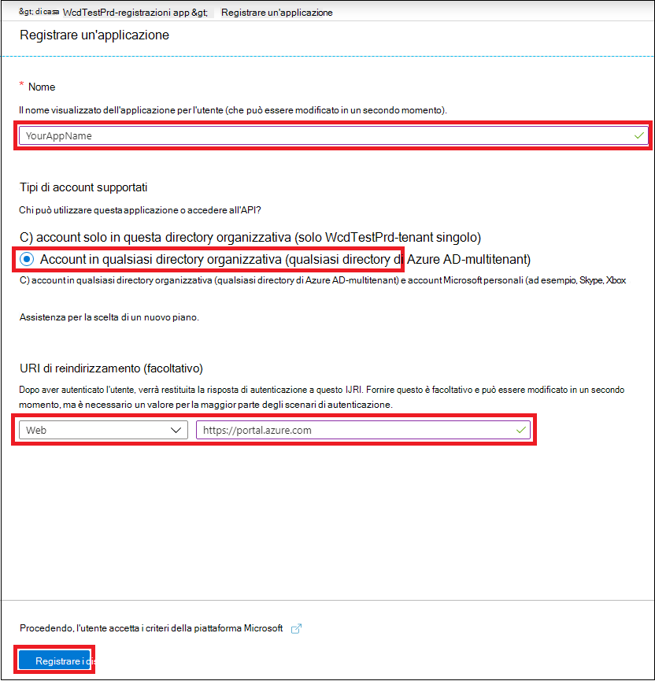
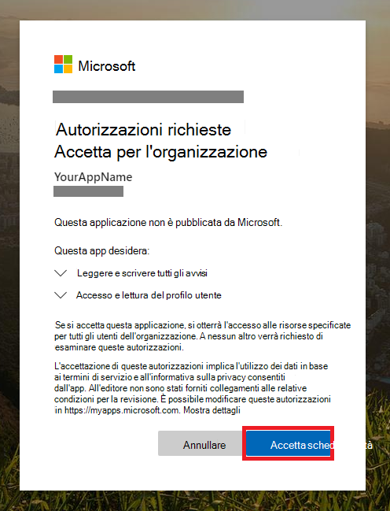

# <a name="create-an-app-with-partner-access-to-microsoft-365-defender-apis"></a>Creare un'app con accesso partner alle API di Microsoft 365 Defender

[!INCLUDE [Microsoft 365 Defender rebranding](../includes/microsoft-defender.md)]

**Si applica a:**

- Microsoft 365 Defender

> [!IMPORTANT]
> Alcune informazioni riguardano prodotti prereleased che possono essere sostanzialmente modificati prima che venga rilasciato commercialmente. Microsoft makes no warranties, express or implied, with respect to the information provided here.

Questa pagina descrive come creare un'app Azure Active Directory con accesso programmatico a Microsoft 365 Defender, per conto degli utenti in più tenant. Le app multi-tenant sono utili per servire grandi gruppi di utenti.

Se è necessario l'accesso a livello di codice a Microsoft 365 Defender per conto di un singolo utente, vedere Creare un'app per accedere alle API di [Microsoft 365 Defender](api-create-app-user-context.md)per conto di un utente. Se devi accedere senza un utente definito esplicitamente (ad esempio, se stai scrivendo un'app in background o un daemon), vedi Creare un'app per accedere a [Microsoft 365 Defender](api-create-app-web.md)senza un utente. Se non si è certi del tipo di accesso necessario, vedere [Introduzione.](api-access.md)

Microsoft 365 Defender espone gran parte dei dati e delle azioni tramite un set di API programmatiche. Queste API consentono di automatizzare i flussi di lavoro e di usare le funzionalità di Microsoft 365 Defender. L'accesso all'API richiede l'autenticazione OAuth2.0. Per ulteriori informazioni, vedere Flusso del codice di autorizzazione [OAuth 2.0.](/azure/active-directory/develop/active-directory-v2-protocols-oauth-code)

In generale, dovrai eseguire la procedura seguente per usare queste API:

- Creare un'applicazione Azure Active Directory (Azure AD).
- Ottieni un token di accesso usando questa applicazione.
- Usa il token per accedere all'API di Microsoft 365 Defender.

Dal momento che questa app è multi-tenant, dovrai anche il consenso dell'amministratore [di](/azure/active-directory/develop/v2-permissions-and-consent#requesting-consent-for-an-entire-tenant) ogni tenant per conto dei suoi utenti.

In questo articolo viene illustrato come:

- Creare **un'applicazione** Azure AD multi-tenant
- Ottenere il consenso autorizzato dall'amministratore dell'utente per l'applicazione per accedere a Microsoft 365 Defender di cui ha bisogno.
- Ottenere un token di accesso a Microsoft 365 Defender
- Convalidare il token

Microsoft 365 Defender espone gran parte dei dati e delle azioni tramite un set di API programmatiche. Queste API ti aiuteranno ad automatizzare i flussi di lavoro e a innovare in base alle funzionalità di Microsoft 365 Defender. L'accesso API richiede l'autenticazione OAuth2.0. Per ulteriori informazioni, vedere Flusso del codice di autorizzazione [OAuth 2.0.](/azure/active-directory/develop/active-directory-v2-protocols-oauth-code)

In generale, dovrai eseguire la procedura seguente per usare le API:

- Creare un'applicazione Azure AD **multi-tenant.**
- Ottenere l'autorizzazione (consenso) dall'amministratore dell'utente per l'applicazione per accedere alle risorse di Microsoft 365 Defender necessarie.
- Ottieni un token di accesso usando questa applicazione.
- Usa il token per accedere all'API di Microsoft 365 Defender.

La procedura seguente illustra come creare un'applicazione Azure AD multi-tenant, ottenere un token di accesso a Microsoft 365 Defender e convalidare il token.

## <a name="create-the-multi-tenant-app"></a>Creare l'app multi-tenant

1. Accedere ad [Azure](https://portal.azure.com) come utente con il **ruolo Amministratore** globale.

2. Passare ad **Azure Active Directory** App  >  **registrations** Nuova  >  **registrazione**.

   

3. Nel modulo di registrazione:

   - Scegliere un nome per l'applicazione.
   - In **Tipi di account supportati** selezionare Account in qualsiasi directory **dell'organizzazione (qualsiasi directory di Azure AD) - Multitenant**.
   - Compila la **sezione Uri di reindirizzamento.** Selezionare il tipo **Web** e assegnare l'URI di reindirizzamento come **https://portal.azure.com** .

   Dopo aver compilato il modulo, selezionare **Registra**.

   

4. Nella pagina dell'applicazione seleziona **Autorizzazioni API** Aggiungi le API di autorizzazione che l'organizzazione usa >, digita  >    >   Microsoft **Threat Protection** e seleziona Microsoft **Threat Protection.** La tua app ora può accedere a Microsoft 365 Defender.

   > [!TIP]
   > *Microsoft Threat Protection* è un ex nome di Microsoft 365 Defender e non verrà visualizzato nell'elenco originale. È necessario iniziare a scrivere il nome nella casella di testo per visualizzarlo.

   

5. Selezionare **Autorizzazioni applicazione**. Scegliere le autorizzazioni rilevanti per lo scenario, ad esempio **Incident.Read.All,** e quindi **selezionare Aggiungi autorizzazioni**.

   

    > [!NOTE]
    > È necessario selezionare le autorizzazioni pertinenti per lo scenario. *Leggere tutti gli eventi imprevisti* è solo un esempio. Per determinare l'autorizzazione necessaria, consulta la **sezione Autorizzazioni** nell'API che vuoi chiamare.
    >
    > Ad esempio, per [eseguire query avanzate,](api-advanced-hunting.md)selezionare l'autorizzazione "Esegui query avanzate". per [isolare un dispositivo,](/windows/security/threat-protection/microsoft-defender-atp/isolate-machine)seleziona l'autorizzazione "Isola computer".

6. Selezionare **Concedi il consenso dell'amministratore.** Ogni volta che aggiungi un'autorizzazione, devi selezionare **Concedi** il consenso dell'amministratore per l'applicazione.

    

7. Per aggiungere un segreto all'applicazione, selezionare **Certificati & segreti,** aggiungere una descrizione al segreto, quindi selezionare **Aggiungi**.

    > [!TIP]
    > Dopo aver selezionato **Aggiungi,** selezionare **copia il valore segreto generato.** Non sarà possibile recuperare il valore segreto dopo aver lasciato.

    

8. Registrare l'ID applicazione e l'ID tenant in un luogo sicuro. Sono elencati in **Panoramica nella** pagina dell'applicazione.

   

9. Aggiungere l'applicazione al tenant dell'utente.

   Poiché l'applicazione interagisce con Microsoft 365 Defender per conto degli utenti, deve essere approvata per ogni tenant in cui si intende usarla.

   Un **amministratore globale** del tenant dell'utente deve visualizzare il collegamento di consenso e approvare l'applicazione.

   Il collegamento consenso ha il formato seguente:

   ```HTTP
   https://login.microsoftonline.com/common/oauth2/authorize?prompt=consent&client_id=00000000-0000-0000-0000-000000000000&response_type=code&sso_reload=true
   ```

   Le cifre `00000000-0000-0000-0000-000000000000` devono essere sostituite con l'ID applicazione.

   Dopo aver fatto clic sul collegamento di consenso, accedere con l'amministratore globale del tenant dell'utente e acconsentire all'applicazione.

   

   Dovrai anche chiedere all'utente l'ID tenant. L'ID tenant è uno degli identificatori usati per acquisire i token di accesso.

- **Fatto!** L'applicazione è stata registrata correttamente.
- Vedi gli esempi seguenti per l'acquisizione e la convalida di token.

## <a name="get-an-access-token"></a>Ottenere un token di accesso

Per altre informazioni sui token di Azure AD, vedi l'esercitazione [su Azure AD.](/azure/active-directory/develop/active-directory-v2-protocols-oauth-client-creds)

> [!IMPORTANT]
> Anche se gli esempi in questa sezione incoraggiano a incollare valori segreti a scopo di test, non è consigliabile codificare mai segreti **hardcoded** in un'applicazione in esecuzione nell'ambiente di produzione. Una terza parte potrebbe usare il segreto per accedere alle risorse. Puoi proteggere i segreti dell'app usando [Azure Key Vault.](/azure/key-vault/general/about-keys-secrets-certificates) Per un esempio pratico di come proteggere la tua app, vedi Gestire i segreti [nelle app server con Azure Key Vault.](/learn/modules/manage-secrets-with-azure-key-vault/)

> [!TIP]
> Negli esempi seguenti, usa l'ID tenant di un utente per verificare che lo script funzioni.

### <a name="get-an-access-token-using-powershell"></a>Ottenere un token di accesso tramite PowerShell

```PowerShell
# This code gets the application context token and saves it to a file named "Latest-token.txt" under the current directory.

$tenantId = '' # Paste your directory (tenant) ID here
$clientId = '' # Paste your application (client) ID here
$appSecret = '' # Paste your own app secret here to test, then store it in a safe place!

$resourceAppIdUri = 'https://api.security.microsoft.com'
$oAuthUri = "https://login.windows.net/$tenantId/oauth2/token"

$authBody = [Ordered] @{
    resource = $resourceAppIdUri
    client_id = $clientId
    client_secret = $appSecret
    grant_type = 'client_credentials'
}

$authResponse = Invoke-RestMethod -Method Post -Uri $oAuthUri -Body $authBody -ErrorAction Stop
$token = $authResponse.access_token

Out-File -FilePath "./Latest-token.txt" -InputObject $token

return $token
```

### <a name="get-an-access-token-using-c"></a>Ottenere un token di accesso con C\#

> [!NOTE]
> Il codice seguente è stato testato con Nuget Microsoft.IdentityModel.Clients.ActiveDirectory 3.19.8.

1. Creare una nuova applicazione console.
1. Installare NuGet [Microsoft.IdentityModel.Clients.ActiveDirectory](https://www.nuget.org/packages/Microsoft.IdentityModel.Clients.ActiveDirectory/).
1. Aggiungere la riga seguente:

    ```C#
    using Microsoft.IdentityModel.Clients.ActiveDirectory;
    ```

1. Copia e incolla il codice seguente nella tua app (non dimenticare di aggiornare le tre variabili: `tenantId` , `clientId` , `appSecret` ):

    ```C#
    string tenantId = ""; // Paste your directory (tenant) ID here
    string clientId = ""; // Paste your application (client) ID here
    string appSecret = ""; // Paste your own app secret here to test, then store it in a safe place, such as the Azure Key Vault!

    const string authority = "https://login.windows.net";
    const string wdatpResourceId = "https://api.security.microsoft.com";

    AuthenticationContext auth = new AuthenticationContext($"{authority}/{tenantId}/");
    ClientCredential clientCredential = new ClientCredential(clientId, appSecret);
    AuthenticationResult authenticationResult = auth.AcquireTokenAsync(wdatpResourceId, clientCredential).GetAwaiter().GetResult();
    string token = authenticationResult.AccessToken;
    ```

### <a name="get-an-access-token-using-python"></a>Ottenere un token di accesso con Python

```Python
import json
import urllib.request
import urllib.parse

tenantId = '' # Paste your directory (tenant) ID here
clientId = '' # Paste your application (client) ID here
appSecret = '' # Paste your own app secret here to test, then store it in a safe place, such as the Azure Key Vault!

url = "https://login.windows.net/%s/oauth2/token" % (tenantId)

resourceAppIdUri = 'https://api.securitycenter.windows.com'

body = {
    'resource' : resourceAppIdUri,
    'client_id' : clientId,
    'client_secret' : appSecret,
    'grant_type' : 'client_credentials'
}

data = urllib.parse.urlencode(body).encode("utf-8")

req = urllib.request.Request(url, data)
response = urllib.request.urlopen(req)
jsonResponse = json.loads(response.read())
aadToken = jsonResponse["access_token"]
```

### <a name="get-an-access-token-using-curl"></a>Ottenere un token di accesso con l'arricciatura

> [!NOTE]
> Curl è preinstallato in Windows 10, versioni 1803 e successive. Per altre versioni di Windows, scarica e installa lo strumento direttamente dal sito [Web ufficiale di .NET Framework.](https://curl.haxx.se/windows/)

1. Aprire un prompt dei comandi e impostare CLIENT_ID'ID applicazione di Azure.
1. Impostare CLIENT_SECRET sul segreto dell'applicazione Azure.
1. Imposta TENANT_ID'ID tenant di Azure dell'utente che vuole usare la tua app per accedere a Microsoft 365 Defender.
1. Eseguire il comando qui riportato:

```bash
curl -i -X POST -H "Content-Type:application/x-www-form-urlencoded" -d "grant_type=client_credentials" -d "client_id=%CLIENT_ID%" -d "scope=https://securitycenter.onmicrosoft.com/windowsatpservice/.default" -d "client_secret=%CLIENT_SECRET%" "https://login.microsoftonline.com/%TENANT_ID%/oauth2/v2.0/token" -k
```

Una risposta corretta sarà simile alla seguente:

```bash
{"token_type":"Bearer","expires_in":3599,"ext_expires_in":0,"access_token":"eyJ0eXAiOiJKV1QiLCJhbGciOiJSUzI1NiIsIn <truncated> aWReH7P0s0tjTBX8wGWqJUdDA"}
```

## <a name="validate-the-token"></a>Convalidare il token

1. Copiare e incollare il token nel sito [Web JWT (Json Web Token Validator)](https://jwt.ms) per decodificarlo.
1. Verificare che *l'attestazione dei* ruoli all'interno del token decodificato contenga le autorizzazioni desiderate.

Nell'immagine seguente puoi vedere un token decodificato acquisito da un'app, con ```Incidents.Read.All``` ```Incidents.ReadWrite.All``` , e ```AdvancedHunting.Read.All``` autorizzazioni:


## <a name="use-the-token-to-access-the-microsoft-365-defender-api"></a>Usare il token per accedere all'API di Microsoft 365 Defender

1. Scegli l'API che vuoi usare (eventi imprevisti o ricerca avanzata). Per altre informazioni, vedi [API supportate di Microsoft 365 Defender.](api-supported.md)
2. Nella richiesta http che stai per inviare, imposta l'intestazione di autorizzazione su , Bearer è lo schema di autorizzazione e il token è `"Bearer" <token>` il token  convalidato. 
3. Il token scadrà entro un'ora. Puoi inviare più di una richiesta durante questo periodo di tempo con lo stesso token.

Nell'esempio seguente viene illustrato come inviare una richiesta per ottenere un elenco di eventi imprevisti **tramite C#**.

```C#
   var httpClient = new HttpClient();
   var request = new HttpRequestMessage(HttpMethod.Get, "https://api.security.microsoft.com/api/incidents");

   request.Headers.Authorization = new AuthenticationHeaderValue("Bearer", token);

   var response = httpClient.SendAsync(request).GetAwaiter().GetResult();
```

## <a name="related-articles"></a>Articoli correlati

- [Panoramica delle API di Microsoft 365 Defender](api-overview.md)
- [Accedere alle API di Microsoft 365 Defender](api-access.md)
- [Creare un'applicazione "Hello world"](api-hello-world.md)
- [Creare un'app per accedere a Microsoft 365 Defender senza un utente](api-create-app-web.md)
- [Creare un'app per accedere alle API di Microsoft 365 Defender per conto di un utente](api-create-app-user-context.md)
- [Informazioni sui limiti delle API e sulle licenze](api-terms.md)
- [Comprendere i codici di errore](api-error-codes.md)
- [Gestire i segreti nelle app server con Azure Key Vault](/learn/modules/manage-secrets-with-azure-key-vault/)
- [Autorizzazione OAuth 2.0 per l'accesso utente e l'accesso api](/azure/active-directory/develop/active-directory-v2-protocols-oauth-code)