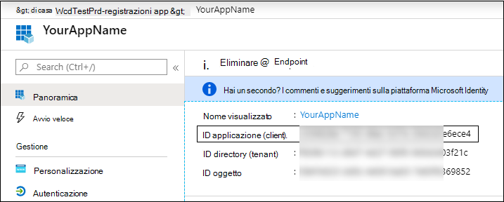

# <a name="partner-access-through-microsoft-365-defender-apis"></a><span data-ttu-id="1a6f4-104">Accesso partner tramite API Microsoft 365 Defender</span><span class="sxs-lookup"><span data-stu-id="1a6f4-104">Partner access through Microsoft 365 Defender APIs</span></span>

[!INCLUDE [Microsoft 365 Defender rebranding](../includes/microsoft-defender.md)]


<span data-ttu-id="1a6f4-105">**Si applica a:**</span><span class="sxs-lookup"><span data-stu-id="1a6f4-105">**Applies to:**</span></span>
- <span data-ttu-id="1a6f4-106">Microsoft 365 Defender</span><span class="sxs-lookup"><span data-stu-id="1a6f4-106">Microsoft 365 Defender</span></span>

>[!IMPORTANT] 
><span data-ttu-id="1a6f4-107">Alcune informazioni si riferiscono al prodotto prerilasciato che può essere modificato in modo sostanziale prima che venga rilasciato commercialmente.</span><span class="sxs-lookup"><span data-stu-id="1a6f4-107">Some information relates to prereleased product which may be substantially modified before it's commercially released.</span></span> <span data-ttu-id="1a6f4-108">Microsoft makes no warranties, express or implied, with respect to the information provided here.</span><span class="sxs-lookup"><span data-stu-id="1a6f4-108">Microsoft makes no warranties, express or implied, with respect to the information provided here.</span></span>


<span data-ttu-id="1a6f4-109">In questa pagina viene descritto come creare un'applicazione AAD per ottenere l'accesso programmatico a Microsoft 365 Defender per conto dei clienti.</span><span class="sxs-lookup"><span data-stu-id="1a6f4-109">This page describes how to create an AAD application to get programmatic access to Microsoft 365 Defender on behalf of your customers.</span></span>

<span data-ttu-id="1a6f4-110">Microsoft 365 Defender espone gran parte dei suoi dati e delle sue azioni tramite un insieme di API programmatiche.</span><span class="sxs-lookup"><span data-stu-id="1a6f4-110">Microsoft 365 Defender exposes much of its data and actions through a set of programmatic APIs.</span></span> <span data-ttu-id="1a6f4-111">Tali API consentono di automatizzare i flussi di lavoro e di innovare in base alle funzionalità di Microsoft 365 Defender.</span><span class="sxs-lookup"><span data-stu-id="1a6f4-111">Those APIs will help you automate work flows and innovate based on Microsoft 365 Defender capabilities.</span></span> <span data-ttu-id="1a6f4-112">L'accesso API richiede l'autenticazione OAuth 2.0.</span><span class="sxs-lookup"><span data-stu-id="1a6f4-112">The API access requires OAuth2.0 authentication.</span></span> <span data-ttu-id="1a6f4-113">Per ulteriori informazioni, vedere il [flusso del codice di autorizzazione OAuth 2,0](https://docs.microsoft.com/azure/active-directory/develop/active-directory-v2-protocols-oauth-code).</span><span class="sxs-lookup"><span data-stu-id="1a6f4-113">For more information, see [OAuth 2.0 Authorization Code Flow](https://docs.microsoft.com/azure/active-directory/develop/active-directory-v2-protocols-oauth-code).</span></span>

<span data-ttu-id="1a6f4-114">In generale, è necessario eseguire la procedura seguente per utilizzare le API:</span><span class="sxs-lookup"><span data-stu-id="1a6f4-114">In general, you’ll need to take the following steps to use the APIs:</span></span>
- <span data-ttu-id="1a6f4-115">Creare un'applicazione AAD **multi-tenant** .</span><span class="sxs-lookup"><span data-stu-id="1a6f4-115">Create a **multi-tenant** AAD application.</span></span>
- <span data-ttu-id="1a6f4-116">Ottenere autorizzato (consenso) dall'amministratore dei clienti per l'applicazione per accedere alle risorse di Microsoft 365 Defender di cui ha bisogno.</span><span class="sxs-lookup"><span data-stu-id="1a6f4-116">Get authorized (consent) by your customer administrator for your application to access Microsoft 365 Defender resources it needs.</span></span>
- <span data-ttu-id="1a6f4-117">Ottenere un token di accesso utilizzando l'applicazione.</span><span class="sxs-lookup"><span data-stu-id="1a6f4-117">Get an access token using this application.</span></span>
- <span data-ttu-id="1a6f4-118">Utilizzare il token per accedere a Microsoft 365 Defender API.</span><span class="sxs-lookup"><span data-stu-id="1a6f4-118">Use the token to access Microsoft 365 Defender API.</span></span>

<span data-ttu-id="1a6f4-119">Nella procedura seguente viene descritto come creare un'applicazione AAD, ottenere un token di accesso a Microsoft 365 Defender e convalidare il token.</span><span class="sxs-lookup"><span data-stu-id="1a6f4-119">The following steps with guide you how to create an AAD application, get an access token to Microsoft 365 Defender and validate the token.</span></span>

## <a name="create-the-multi-tenant-app"></a><span data-ttu-id="1a6f4-120">Creare l'app multi-tenant</span><span class="sxs-lookup"><span data-stu-id="1a6f4-120">Create the multi-tenant app</span></span>

1. <span data-ttu-id="1a6f4-121">Accedere al tenant di [Azure](https://portal.azure.com) con un utente che ha un ruolo di **amministratore globale** .</span><span class="sxs-lookup"><span data-stu-id="1a6f4-121">Log on to your [Azure tenant](https://portal.azure.com) with user that has **Global Administrator** role.</span></span>

2. <span data-ttu-id="1a6f4-122">Passare a registrazione delle app di **Azure Active Directory**  >  **App registrations**  >  **nuova registrazione**.</span><span class="sxs-lookup"><span data-stu-id="1a6f4-122">Navigate to **Azure Active Directory** > **App registrations** > **New registration**.</span></span> 

   

3. <span data-ttu-id="1a6f4-124">Nel modulo di registrazione:</span><span class="sxs-lookup"><span data-stu-id="1a6f4-124">In the registration form:</span></span>

    - <span data-ttu-id="1a6f4-125">Scegliere un nome per l'applicazione.</span><span class="sxs-lookup"><span data-stu-id="1a6f4-125">Choose a name for your application.</span></span>

    - <span data-ttu-id="1a6f4-126">Tipi di account supportati-account in qualsiasi directory organizzativa.</span><span class="sxs-lookup"><span data-stu-id="1a6f4-126">Supported account types - accounts in any organizational directory.</span></span>

    - <span data-ttu-id="1a6f4-127">Reindirizza URI-Type: Web, URI: https://portal.azure.com</span><span class="sxs-lookup"><span data-stu-id="1a6f4-127">Redirect URI - type: Web, URI: https://portal.azure.com</span></span>

    


4. <span data-ttu-id="1a6f4-129">Consentire all'applicazione di accedere a Microsoft 365 Defender e assegnargli il set minimo di autorizzazioni necessarie per completare l'integrazione.</span><span class="sxs-lookup"><span data-stu-id="1a6f4-129">Allow your Application to access Microsoft 365 Defender and assign it with the minimal set of permissions required to complete the integration.</span></span>

   - <span data-ttu-id="1a6f4-130">Nella pagina dell'applicazione fare clic su **autorizzazioni API**  >  **Aggiungi** autorizzazioni API  >  **l'organizzazione utilizza** > tipo **Microsoft 365 Defender** e fare clic su **Microsoft 365 Defender**.</span><span class="sxs-lookup"><span data-stu-id="1a6f4-130">On your application page, click **API Permissions** > **Add permission** > **APIs my organization uses** > type **Microsoft 365 Defender** and click on **Microsoft 365 Defender**.</span></span>

   >[!NOTE]
   ><span data-ttu-id="1a6f4-131">Microsoft 365 Defender non viene visualizzato nell'elenco originale.</span><span class="sxs-lookup"><span data-stu-id="1a6f4-131">Microsoft 365 Defender does not appear in the original list.</span></span> <span data-ttu-id="1a6f4-132">È necessario iniziare a scrivere il nome nella casella di testo per visualizzarlo.</span><span class="sxs-lookup"><span data-stu-id="1a6f4-132">You need to start writing its name in the text box to see it appear.</span></span>

   
   
   ### <a name="request-api-permissions"></a><span data-ttu-id="1a6f4-134">Autorizzazioni API richieste</span><span class="sxs-lookup"><span data-stu-id="1a6f4-134">Request API permissions</span></span>

   <span data-ttu-id="1a6f4-135">Per determinare le autorizzazioni necessarie, consultare la sezione **autorizzazioni** nell'API che si desidera chiamare.</span><span class="sxs-lookup"><span data-stu-id="1a6f4-135">To determine which permission you need, please look at the **Permissions** section in the API you are interested to call.</span></span> 

   <span data-ttu-id="1a6f4-136">Nell'esempio seguente vengono utilizzate le autorizzazioni **' Leggi tutti gli incidenti '** :</span><span class="sxs-lookup"><span data-stu-id="1a6f4-136">In the following example we will use **'Read all incidents'** permission:</span></span>

   <span data-ttu-id="1a6f4-137">Scegliere le autorizzazioni per l' **applicazione** operazioni non consentite  >  **. tutti** > fare clic su **Aggiungi autorizzazioni**</span><span class="sxs-lookup"><span data-stu-id="1a6f4-137">Choose **Application permissions** > **Incidents.Read.All** > Click on **Add permissions**</span></span>

   


5. <span data-ttu-id="1a6f4-139">Fare clic su **Concedi consenso**</span><span class="sxs-lookup"><span data-stu-id="1a6f4-139">Click **Grant consent**</span></span>

    >[!NOTE]
    ><span data-ttu-id="1a6f4-140">Ogni volta che si aggiunge l'autorizzazione, è necessario fare clic su **Concedi consenso** per la nuova autorizzazione per rendere effettive le autorizzazioni.</span><span class="sxs-lookup"><span data-stu-id="1a6f4-140">Every time you add permission you must click on **Grant consent** for the new permission to take effect.</span></span>

    

6. <span data-ttu-id="1a6f4-142">Aggiungere un segreto all'applicazione.</span><span class="sxs-lookup"><span data-stu-id="1a6f4-142">Add a secret to the application.</span></span>

    - <span data-ttu-id="1a6f4-143">Fare clic su **certificati & segreti** , aggiungere una descrizione al segreto e fare clic su **Aggiungi**.</span><span class="sxs-lookup"><span data-stu-id="1a6f4-143">Click **Certificates & secrets** , add description to the secret and click **Add**.</span></span>

    >[!IMPORTANT]
    > <span data-ttu-id="1a6f4-144">Dopo aver selezionato **Aggiungi** , **copiare il valore segreto generato**.</span><span class="sxs-lookup"><span data-stu-id="1a6f4-144">After selecting **Add** , **copy the generated secret value**.</span></span> <span data-ttu-id="1a6f4-145">Non sarà possibile recuperare dopo l'uscita.</span><span class="sxs-lookup"><span data-stu-id="1a6f4-145">You won't be able to retrieve after you leave!</span></span>

    

7. <span data-ttu-id="1a6f4-147">Annotare l'ID dell'applicazione:</span><span class="sxs-lookup"><span data-stu-id="1a6f4-147">Write down your application ID:</span></span>

   - <span data-ttu-id="1a6f4-148">Nella pagina applicazione passare a **Panoramica** e copiare quanto segue:</span><span class="sxs-lookup"><span data-stu-id="1a6f4-148">On your application page, go to **Overview** and copy the following:</span></span>

   

8. <span data-ttu-id="1a6f4-150">Aggiungere l'applicazione al tenant del cliente.</span><span class="sxs-lookup"><span data-stu-id="1a6f4-150">Add the application to your customer's tenant.</span></span>

    <span data-ttu-id="1a6f4-151">È necessario che l'applicazione venga approvata in ogni tenant del cliente in cui si intende utilizzarla.</span><span class="sxs-lookup"><span data-stu-id="1a6f4-151">You need your application to be approved in each customer tenant where you intend to use it.</span></span> <span data-ttu-id="1a6f4-152">Ciò è dovuto al fatto che l'applicazione interagisce con l'applicazione Microsoft 365 Defender per conto del cliente.</span><span class="sxs-lookup"><span data-stu-id="1a6f4-152">This is because your application interacts with Microsoft 365 Defender application on behalf of your customer.</span></span>

    <span data-ttu-id="1a6f4-153">Un utente con **amministratore globale** dal tenant del cliente deve fare clic sul collegamento di consenso e approvare l'applicazione.</span><span class="sxs-lookup"><span data-stu-id="1a6f4-153">A user with **Global Administrator** from your customer's tenant need to click the consent link and approve your application.</span></span>

    <span data-ttu-id="1a6f4-154">Il collegamento di consenso ha il formato seguente:</span><span class="sxs-lookup"><span data-stu-id="1a6f4-154">Consent link is of the form:</span></span>

    ```
    https://login.microsoftonline.com/common/oauth2/authorize?prompt=consent&client_id=00000000-0000-0000-0000-000000000000&response_type=code&sso_reload=true
    ```

    <span data-ttu-id="1a6f4-155">Dove 00000000-0000-0000-0000-000000000000 deve essere sostituito con l'ID dell'applicazione</span><span class="sxs-lookup"><span data-stu-id="1a6f4-155">Where 00000000-0000-0000-0000-000000000000 should be replaced with your Application ID</span></span>

    <span data-ttu-id="1a6f4-156">Dopo aver fatto clic sul collegamento di consenso, effettuare l'accesso con l'amministratore globale del tenant del cliente e acconsentire l'applicazione.</span><span class="sxs-lookup"><span data-stu-id="1a6f4-156">After clicking on the consent link, login with the Global Administrator of the customer's tenant and consent the application.</span></span>

    

    <span data-ttu-id="1a6f4-158">Inoltre, è necessario chiedere al cliente il proprio ID tenant e salvarlo per un utilizzo futuro quando si acquisisce il token.</span><span class="sxs-lookup"><span data-stu-id="1a6f4-158">In addition, you will need to ask your customer for their tenant ID and save it for future use when acquiring the token.</span></span>

- <span data-ttu-id="1a6f4-159">**Fatto!**</span><span class="sxs-lookup"><span data-stu-id="1a6f4-159">**Done!**</span></span> <span data-ttu-id="1a6f4-160">La registrazione di un'applicazione è stata completata correttamente.</span><span class="sxs-lookup"><span data-stu-id="1a6f4-160">You have successfully registered an application!</span></span> 
- <span data-ttu-id="1a6f4-161">Vedere gli esempi riportati di seguito per l'acquisizione e la convalida dei token.</span><span class="sxs-lookup"><span data-stu-id="1a6f4-161">See examples below for token acquisition and validation.</span></span>

## <a name="get-an-access-token-examples"></a><span data-ttu-id="1a6f4-162">Ottenere un esempio di token di accesso:</span><span class="sxs-lookup"><span data-stu-id="1a6f4-162">Get an access token examples:</span></span>

>[!NOTE]
> <span data-ttu-id="1a6f4-163">Per ottenere il token di accesso per conto del cliente, utilizzare l'ID tenant del cliente nelle acquisizioni di token seguenti.</span><span class="sxs-lookup"><span data-stu-id="1a6f4-163">To get access token on behalf of your customer, use the customer's tenant ID on the following token acquisitions.</span></span>

<br><span data-ttu-id="1a6f4-164">Per ulteriori informazioni su token AAD, fare riferimento a [AAD tutorial](https://docs.microsoft.com/azure/active-directory/develop/active-directory-v2-protocols-oauth-client-creds)</span><span class="sxs-lookup"><span data-stu-id="1a6f4-164">For more details on AAD token, refer to [AAD tutorial](https://docs.microsoft.com/azure/active-directory/develop/active-directory-v2-protocols-oauth-client-creds)</span></span>

### <a name="using-powershell"></a><span data-ttu-id="1a6f4-165">Utilizzo di PowerShell</span><span class="sxs-lookup"><span data-stu-id="1a6f4-165">Using PowerShell</span></span>

```
# That code gets the App Context Token and save it to a file named "Latest-token.txt" under the current directory
# Paste below your Tenant ID, App ID and App Secret (App key).

$tenantId = '' ### Paste your tenant ID here
$appId = '' ### Paste your Application ID here
$appSecret = '' ### Paste your Application key here

$resourceAppIdUri = 'https://api.security.microsoft.com'
$oAuthUri = "https://login.windows.net/$TenantId/oauth2/token"
$authBody = [Ordered] @{
    resource = "$resourceAppIdUri"
    client_id = "$appId"
    client_secret = "$appSecret"
    grant_type = 'client_credentials'
}
$authResponse = Invoke-RestMethod -Method Post -Uri $oAuthUri -Body $authBody -ErrorAction Stop
$token = $authResponse.access_token
Out-File -FilePath "./Latest-token.txt" -InputObject $token
return $token
```

### <a name="using-c"></a><span data-ttu-id="1a6f4-166">Utilizzo di C#:</span><span class="sxs-lookup"><span data-stu-id="1a6f4-166">Using C#:</span></span>

><span data-ttu-id="1a6f4-167">Il codice riportato di seguito è stato testato con NuGet Microsoft. IdentityModel. clients. ActiveDirectory</span><span class="sxs-lookup"><span data-stu-id="1a6f4-167">The below code was tested with Nuget Microsoft.IdentityModel.Clients.ActiveDirectory</span></span>

- <span data-ttu-id="1a6f4-168">Creare una nuova applicazione console</span><span class="sxs-lookup"><span data-stu-id="1a6f4-168">Create a new Console Application</span></span>
- <span data-ttu-id="1a6f4-169">Installazione di NuGet [Microsoft. IdentityModel. clients. ActiveDirectory](https://www.nuget.org/packages/Microsoft.IdentityModel.Clients.ActiveDirectory/)</span><span class="sxs-lookup"><span data-stu-id="1a6f4-169">Install Nuget [Microsoft.IdentityModel.Clients.ActiveDirectory](https://www.nuget.org/packages/Microsoft.IdentityModel.Clients.ActiveDirectory/)</span></span>
- <span data-ttu-id="1a6f4-170">Aggiungere il seguente utilizzo</span><span class="sxs-lookup"><span data-stu-id="1a6f4-170">Add the below using</span></span>

    ```
    using Microsoft.IdentityModel.Clients.ActiveDirectory;
    ```

- <span data-ttu-id="1a6f4-171">Copia/incolla il codice riportato di seguito nell'applicazione (non dimenticare di aggiornare le 3 variabili: ```tenantId, appId, appSecret``` )</span><span class="sxs-lookup"><span data-stu-id="1a6f4-171">Copy/Paste the below code in your application (do not forget to update the 3 variables: ```tenantId, appId, appSecret```)</span></span>

    ```
    string tenantId = "00000000-0000-0000-0000-000000000000"; // Paste your own tenant ID here
    string appId = "11111111-1111-1111-1111-111111111111"; // Paste your own app ID here
    string appSecret = "22222222-2222-2222-2222-222222222222"; // Paste your own app secret here for a test, and then store it in a safe place! 

    const string authority = "https://login.windows.net";
    const string mtpResourceId = "https://api.security.microsoft.com";

    AuthenticationContext auth = new AuthenticationContext($"{authority}/{tenantId}/");
    ClientCredential clientCredential = new ClientCredential(appId, appSecret);
    AuthenticationResult authenticationResult = auth.AcquireTokenAsync(mtpResourceId, clientCredential).GetAwaiter().GetResult();
    string token = authenticationResult.AccessToken;
    ```


### <a name="using-curl"></a><span data-ttu-id="1a6f4-172">Utilizzo di curl</span><span class="sxs-lookup"><span data-stu-id="1a6f4-172">Using Curl</span></span>

> [!NOTE]
> <span data-ttu-id="1a6f4-173">Nella procedura seguente è già installato nel computer l'arricciatura supposta per Windows.</span><span class="sxs-lookup"><span data-stu-id="1a6f4-173">The below procedure supposed Curl for Windows is already installed on your computer</span></span>

- <span data-ttu-id="1a6f4-174">Aprire una finestra di comando</span><span class="sxs-lookup"><span data-stu-id="1a6f4-174">Open a command window</span></span>
- <span data-ttu-id="1a6f4-175">Impostare CLIENT_ID sull'ID applicazione di Azure</span><span class="sxs-lookup"><span data-stu-id="1a6f4-175">Set CLIENT_ID to your Azure application ID</span></span>
- <span data-ttu-id="1a6f4-176">Impostare CLIENT_SECRET per l'applicazione segreta di Azure</span><span class="sxs-lookup"><span data-stu-id="1a6f4-176">Set CLIENT_SECRET to your Azure application secret</span></span>
- <span data-ttu-id="1a6f4-177">Impostare TENANT_ID sull'ID tenant di Azure del cliente che desidera utilizzare l'applicazione per accedere all'applicazione Microsoft 365 Defender</span><span class="sxs-lookup"><span data-stu-id="1a6f4-177">Set TENANT_ID to the Azure tenant ID of the customer that wants to use your application to access Microsoft 365 Defender application</span></span>
- <span data-ttu-id="1a6f4-178">Eseguire il comando riportato di seguito:</span><span class="sxs-lookup"><span data-stu-id="1a6f4-178">Run the below command:</span></span>

```
curl -i -X POST -H "Content-Type:application/x-www-form-urlencoded" -d "grant_type=client_credentials" -d "client_id=%CLIENT_ID%" -d "scope=https://api.security.microsoft.com.default" -d "client_secret=%CLIENT_SECRET%" "https://login.microsoftonline.com/%TENANT_ID%/oauth2/v2.0/token" -k
```

<span data-ttu-id="1a6f4-179">Si otterrà una risposta al modulo:</span><span class="sxs-lookup"><span data-stu-id="1a6f4-179">You will get an answer of the form:</span></span>

```
{"token_type":"Bearer","expires_in":3599,"ext_expires_in":0,"access_token":"eyJ0eXAiOiJKV1QiLCJhbGciOiJSUzI1NiIsIn <truncated> aWReH7P0s0tjTBX8wGWqJUdDA"}
```

## <a name="validate-the-token"></a><span data-ttu-id="1a6f4-180">Convalidare il token</span><span class="sxs-lookup"><span data-stu-id="1a6f4-180">Validate the token</span></span>

<span data-ttu-id="1a6f4-181">Verifica dell'integrità per assicurarsi di avere un token corretto:</span><span class="sxs-lookup"><span data-stu-id="1a6f4-181">Sanity check to make sure you got a correct token:</span></span>

- <span data-ttu-id="1a6f4-182">Copia/incolla in [JWT](https://jwt.ms) il token ottenuto nel passaggio precedente per decodificarlo</span><span class="sxs-lookup"><span data-stu-id="1a6f4-182">Copy/paste into [JWT](https://jwt.ms) the token you get in the previous step in order to decode it</span></span>
- <span data-ttu-id="1a6f4-183">Convalidare si ottiene un'attestazione di "ruoli" con le autorizzazioni desiderate</span><span class="sxs-lookup"><span data-stu-id="1a6f4-183">Validate you get a 'roles' claim with the desired permissions</span></span>
- <span data-ttu-id="1a6f4-184">Nella schermata seguente, è possibile visualizzare un token decodificato acquisito da un'applicazione con più autorizzazioni per Microsoft 365 Defender:</span><span class="sxs-lookup"><span data-stu-id="1a6f4-184">In the screenshot below, you can see a decoded token acquired from an Application with multiple permissions to Microsoft 365 Defender:</span></span>
- <span data-ttu-id="1a6f4-185">L'attestazione "TID" è l'ID tenant a cui appartiene il token.</span><span class="sxs-lookup"><span data-stu-id="1a6f4-185">The "tid" claim is the tenant ID the token belongs to.</span></span>


## <a name="use-the-token-to-access-microsoft-365-defender-api"></a><span data-ttu-id="1a6f4-187">Utilizzare il token per accedere a Microsoft 365 Defender API</span><span class="sxs-lookup"><span data-stu-id="1a6f4-187">Use the token to access Microsoft 365 Defender API</span></span>

- <span data-ttu-id="1a6f4-188">Scegliere l'API che si desidera utilizzare, per ulteriori informazioni, vedere [supported Microsoft 365 Defender Apis](api-supported.md)</span><span class="sxs-lookup"><span data-stu-id="1a6f4-188">Choose the API you want to use, for more information, see [Supported Microsoft 365 Defender APIs](api-supported.md)</span></span>
- <span data-ttu-id="1a6f4-189">Impostare l'intestazione di autorizzazione nella richiesta HTTP inviata a "portatore {token}" (il portatore è lo schema di autorizzazione)</span><span class="sxs-lookup"><span data-stu-id="1a6f4-189">Set the Authorization header in the Http request you send to "Bearer {token}" (Bearer is the Authorization scheme)</span></span>
- <span data-ttu-id="1a6f4-190">La data di scadenza del token è di 1 ora (è possibile inviare più di una richiesta con lo stesso token)</span><span class="sxs-lookup"><span data-stu-id="1a6f4-190">The Expiration time of the token is 1 hour (you can send more then one request with the same token)</span></span>

- <span data-ttu-id="1a6f4-191">Esempio di invio di una richiesta per ottenere un elenco di operazioni non consentite **tramite C#**</span><span class="sxs-lookup"><span data-stu-id="1a6f4-191">Example of sending a request to get a list of incidents **using C#**</span></span> 
    ```
    var httpClient = new HttpClient();

    var request = new HttpRequestMessage(HttpMethod.Get, "https://api.security.microsoft.com/api/incidents");

    request.Headers.Authorization = new AuthenticationHeaderValue("Bearer", token);

    var response = httpClient.SendAsync(request).GetAwaiter().GetResult();

    // Do something useful with the response
    ```

## <a name="related-topics"></a><span data-ttu-id="1a6f4-192">Argomenti correlati</span><span class="sxs-lookup"><span data-stu-id="1a6f4-192">Related topics</span></span> 

- [<span data-ttu-id="1a6f4-193">Accedere alle API di Microsoft 365 Defender</span><span class="sxs-lookup"><span data-stu-id="1a6f4-193">Access the Microsoft 365 Defender APIs</span></span>](api-access.md)
- [<span data-ttu-id="1a6f4-194">Accedere a Microsoft 365 Defender con contesto dell'applicazione</span><span class="sxs-lookup"><span data-stu-id="1a6f4-194">Access  Microsoft 365 Defender with application context</span></span>](api-create-app-web.md)
- [<span data-ttu-id="1a6f4-195">Accedere a Microsoft 365 Defender con contesto utente</span><span class="sxs-lookup"><span data-stu-id="1a6f4-195">Access  Microsoft 365 Defender with user context</span></span>](api-create-app-user-context.md)
