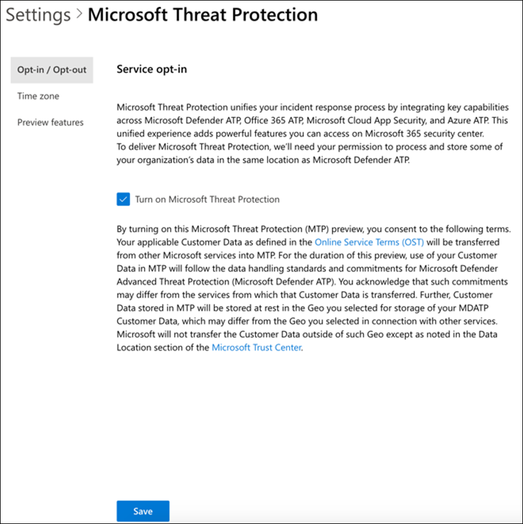

# Configurare i pilastri Microsoft Threat Protection per l'ambiente lab di valutazioneConfigure Microsoft Threat Protection pillars for your trial lab environment

**Si applica a:****Applies to:**
- Microsoft Threat ProtectionMicrosoft Threat Protection

La creazione di un ambiente di laboratorio di valutazione di Microsoft Threat Protection e la distribuzione di questo è un processo in tre fasi:Creating a Microsoft Threat Protection trial lab environment and deploying it is a three-phase process:

 
<table border="0" width="100%" align="center">
  <tr style="text-align:center;">
    <td align="center" style="width:25%; border:0;" >
      <a href= "https://docs.microsoft.com/microsoft-365/security/mtp/prepare-mtpeval?view=o365-worldwide"> 
        
       Fase 1: preparazione</a>Phase 1: Prepare </a> 
    </td>
     <td align="center">
      <a href="https://docs.microsoft.com/microsoft-365/security/mtp/setup-mtpeval?view=o365-worldwide">
        
       Fase 2: installazione</a>Phase 2: Setup </a> 
    </td>
    <td align="center" bgcolor="#d5f5e3">
      <a href="https://docs.microsoft.com/microsoft-365/security/mtp/config-mtpeval?view=o365-worldwide">
        
       Fase 3: configurare & onboard</a>Phase 3: Configure & Onboard </a> 
</td>

  </tr>
</table>

Si è attualmente in fase di configurazione.You are currently in the configuration phase.

La preparazione è la chiave per una distribuzione corretta.Preparation is key to any successful deployment. In questo articolo verranno illustrati i punti che è necessario prendere in considerazione durante la preparazione per la distribuzione di Microsoft Defender ATP.In this article, you'll be guided on the points you'll need to consider as you prepare to deploy Microsoft Defender ATP.

## Pilastri di Microsoft Threat ProtectionMicrosoft Threat Protection pillars
Microsoft Threat Protection è costituito da quattro pilastri.Microsoft Threat Protection consists of four pillars. Anche se un pilastro può già fornire valore alla sicurezza dell'organizzazione della rete, l'abilitazione dei quattro pilastri Microsoft Threat Protection darà alla propria organizzazione il massimo valore.Although one pillar can already provide value to your network organization's security, enabling the four Microsoft Threat Protection pillars will give your organization the most value.

![Image of_Microsoft soluzione di protezione dalle minacce per gli utenti, la protezione avanzata dalle minacce di Azure, per gli endpoint Microsoft Defender Advanced Threat Protection, per le app Cloud, Microsoft cloud app Security e per i dati, Office 365 Advanced Threat ProtectionImage of_Microsoft Threat Protection solution for users, Azure Advanced Threat Protection, for endpoints Microsoft Defender Advanced Threat Protection, for cloud apps, Microsoft Cloud App Security, and for data, Office 365 Advanced Threat Protection  ](../../media/mtp-eval-31.png)  

In questa sezione viene illustrata la configurazione:This section will guide you to configure:
-   Office 365 Advanced Threat ProtectionOffice 365 Advanced Threat Protection
-   Azure Advanced Threat ProtectionAzure Advanced Threat Protection 
-   Microsoft Cloud App SecurityMicrosoft Cloud App Security
-   Microsoft Defender Advanced Threat ProtectionMicrosoft Defender Advanced Threat Protection

## Configurare Office 365 Advanced Threat ProtectionConfigure Office 365 Advanced Threat Protection
>[!NOTE]
>Ignorare questo passaggio se è già stata abilitata la protezione avanzata dalle minacce di Office 365.Skip this step if you have already enabled Office 365 Advanced Threat Protection. 

È presente un modulo di PowerShell denominato l' *analizzatore di configurazione consigliato di Office 365 Advanced Threat Protection (Orca)* che consente di determinare alcune di queste impostazioni.There is a PowerShell Module called the *Office 365 Advanced Threat Protection Recommended Configuration Analyzer (ORCA)* that helps determine some of these settings. Quando si esegue il ruolo di amministratore nel tenant, Get-ORCAReport contribuirà a generare una valutazione delle impostazioni di protezione da posta indesiderata, anti-phishing e altre informazioni di igiene dei messaggi.When run as an administrator in your tenant, get-ORCAReport will help generate an assessment of the anti-spam, anti-phish, and other message hygiene settings. È possibile scaricare il modulo da https://www.powershellgallery.com/packages/ORCA/ .You can download this module from https://www.powershellgallery.com/packages/ORCA/. 

1. Accedere a [Office 365 Security & Compliance Center](https://protection.office.com/homepage)  >  **Threat Management**  >  **policy**.Navigate to [Office 365 Security & Compliance Center](https://protection.office.com/homepage) > **Threat management** > **Policy**.
  
 
2. Fare clic su **ATP anti-phishing**, selezionare **Crea** e compila il nome e la descrizione dei criteri.Click **ATP anti-phishing**, select **Create** and fill in the policy name and description. Fare clic su **Avanti**.Click **Next**.
  

>[!NOTE]
>Modificare i criteri avanzati di anti-phishing ATP.Edit your Advanced ATP anti-phishing policy. Modificare la **soglia di phishing avanzata** su **2-aggressiva**.Change **Advanced Phishing Threshold** to **2 - Aggressive**.
 

3. Fare clic sul menu a discesa **Aggiungi condizione** e selezionare il dominio o i domini come dominio del destinatario.Click the **Add a condition** drop-down menu and select your domain(s) as recipient domain. Fare clic su **Avanti**.Click **Next**.
  
 
4. Esaminare le impostazioni.Review your settings. Fare clic su **crea questo criterio** per confermare.Click **Create this policy** to confirm. 
  
 
5. Selezionare **allegati sicuri di ATP** e selezionare l'opzione **attiva ATP per SharePoint, OneDrive e Microsoft teams** .Select **ATP Safe attachments** and select the **Turn on ATP for SharePoint, OneDrive, and Microsoft Teams** option.  
  

6. Fare clic sull'icona + per creare un nuovo criterio allegato sicuro, applicarlo come dominio destinatario ai domini.Click the + icon to create a new safe attachment policy, apply it as recipient domain to your domains. Fare clic su **Salva**.Click **Save**.
  
 
7. Successivamente, selezionare il criterio **collegamenti sicuri ATP** , quindi fare clic sull'icona a forma di matita per modificare il criterio predefinito.Next, select the **ATP Safe Links** policy, then click the pencil icon to edit the default policy.

8. Verificare che l'opzione non **rintracci quando gli utenti fanno clic su collegamenti sicuri** non è selezionata, mentre le altre opzioni sono selezionate.Make sure that the **Do not track when users click safe links** option is not selected, while the rest of the options are selected. Per informazioni dettagliate, vedere [Safe Links Settings](https://docs.microsoft.com/microsoft-365/security/office-365-security/recommended-settings-for-eop-and-office365-atp?view=o365-worldwide) .See [Safe Links settings](https://docs.microsoft.com/microsoft-365/security/office-365-security/recommended-settings-for-eop-and-office365-atp?view=o365-worldwide) for details. Fare clic su **Salva**.Click **Save**. 
  

9. Selezionare quindi il criterio **antimalware** , selezionare l'impostazione predefinita e scegliere l'icona a forma di matita.Next select the **Anti-malware** policy, select the default, and choose the pencil icon.

10. Fare clic su **Impostazioni** e selezionare **Sì e utilizzare il testo di notifica predefinito** per abilitare la **risposta di rilevamento malware**.Click **Settings** and select **Yes and use the default notification text** to enable **Malware Detection Response**. Attiva il **filtro dei tipi di allegati comuni** .Turn the **Common Attachment Types Filter** on. Fare clic su **Salva**.Click **Save**.
   
  
11. Accedere a [Office 365 Security & Compliance Center](https://protection.office.com/homepage)  >  **Search**  >  **log di controllo** di ricerca e attivazione del controllo.Navigate to [Office 365 Security & Compliance Center](https://protection.office.com/homepage) > **Search** > **Audit log search** and turn Auditing on.  
  

12. Integrazione di Office 365 ATP con Microsoft Defender ATP.Integrate Office 365 ATP with Microsoft Defender ATP. Passare a [Office 365 Security & Compliance Center](https://protection.office.com/homepage)  >  **Threat Management**  >  **Explorer** e selezionare le **impostazioni di WDATP** nell'angolo superiore destro dello schermo.Navigate to [Office 365 Security & Compliance Center](https://protection.office.com/homepage) > **Threat management** > **Explorer** and select **WDATP Settings** on the upper right corner of the screen. Nella finestra di dialogo Microsoft Defender ATP Connection, abilitare **Connect to Windows ATP**.In the Microsoft Defender ATP connection dialog box, turn on **Connect to Windows ATP**.
  

## Configurare la protezione avanzata dalle minacce di AzureConfigure Azure Advanced Threat Protection
>[!NOTE]
>Ignorare questo passaggio se è già stata abilitata la protezione avanzata dalle minacce di AzureSkip this step if you have already enabled Azure Advanced Threat Protection

1. Accedere a [Microsoft 365 Security Center](https://security.microsoft.com/info) > selezionare **altre risorse**  >  **Azure Advanced Threat Protection**.Navigate to [Microsoft 365 Security Center](https://security.microsoft.com/info) > select **More Resources** > **Azure Advanced Threat Protection**.
  

2. Fare clic su **Crea** per avviare la procedura guidata di Azure Advanced Threat Protection.Click **Create** to start the Azure Advanced Threat Protection wizard. 
   

3. Scegliere **Fornisci un nome utente e una password per connettersi alla foresta di Active Directory**.Choose **Provide a username and password to connect to your Active Directory forest**.  
  

4. Immettere le credenziali di Active Directory in locale.Enter your Active Directory on-premises credentials. Può trattarsi di qualsiasi account utente che disponga dell'accesso in lettura a Active Directory.This can be any user account that has read access to Active Directory.
  

5. Successivamente, scegliere **download Sensor Setup** and transfer file to your domain controller.Next, choose **Download Sensor Setup** and transfer file to your domain controller. 
  

6. Eseguire il programma di installazione del sensore ATP di Azure e iniziare a seguire la procedura guidata.Execute the Azure ATP Sensor Setup and begin following the wizard.
   
 
7. Fare clic su **Avanti** nel tipo di distribuzione del sensore.Click **Next** at the sensor deployment type.
   
 
8. Copiare il tasto di accesso poiché sarà necessario immetterlo successivamente nella procedura guidata.Copy the access key as you will need to enter it next in the Wizard.
  
 
9. Copiare la chiave di accesso nella procedura guidata e fare clic su **Installa**.Copy the access key into the Wizard and click **Install**. 
   

10. Congratulazioni, è stata configurata correttamente la protezione avanzata dalle minacce di Azure nel controller di dominio.Congratulations, you have successfully configured Azure Advanced Threat Protection on your domain controller.
  
 
11. Nella sezione impostazioni [ATP di Azure Azure](https://go.microsoft.com/fwlink/?linkid=2040449) selezionare **Windows Defender ATP**e quindi attivare l'interruttore.Under the [Azure Azure ATP](https://go.microsoft.com/fwlink/?linkid=2040449) settings section, select **Windows Defender ATP**, then turn the toggle on. Fare clic su **Salva**.Click **Save**. 
  

>[!NOTE]
>Windows Defender ATP è stato rebranded As Microsoft Defender ATP.Windows Defender ATP has been rebranded as Microsoft Defender ATP. Le modifiche di rebranding in tutti i portali vengono distribuite per garantire la coerenza.Rebranding changes across all of our portals are being rolled out the for consistency.

## Configurare Microsoft cloud app SecurityConfigure Microsoft Cloud App Security
>[!NOTE]
>Ignorare questo passaggio se è già stata abilitata la sicurezza delle app cloud di Microsoft.Skip this step if you have already enabled Microsoft Cloud App Security. 

1. Accedere a [Microsoft 365 Security Center](https://security.microsoft.com/info)  >  **altre risorse**  >  **Microsoft cloud app Security**.Navigate to [Microsoft 365 Security Center](https://security.microsoft.com/info) > **More Resources** > **Microsoft Cloud App Security**.
  

2. Alla richiesta di informazioni per l'integrazione di Azure ATP, selezionare **Enable Azure ATP Data Integration**.At the information prompt to integrate Azure ATP, select **Enable Azure ATP data integration**. 
   

>[!NOTE]
>Se questo messaggio non viene visualizzato, potrebbe significare che l'integrazione dei dati ATP di Azure è già stata abilitata.If you don’t see this prompt, it might mean that your Azure ATP data integration has already been enabled. Tuttavia, se non si è certi, contattare l'amministratore IT per confermare.However, if you are not sure, contact your IT Administrator to confirm. 

3. Andare a **Impostazioni**, attivare l'interruttore di **integrazione ATP di Azure** , quindi fare clic su **Salva**.Go to **Settings**, turn the **Azure ATP integration** toggle on, then click **Save**. 
  
>[!NOTE]
>Per le nuove istanze di Azure ATP, questo interruttore di integrazione viene attivato automaticamente.For new Azure ATP instances, this integration toggle is automatically turned on. Verificare che l'integrazione di Azure ATP sia stata abilitata prima di procedere con il passaggio successivo.Confirm that your Azure ATP integration has been enabled before you proceed to the next step.
 
4. In impostazioni di individuazione cloud selezionare **Microsoft Defender ATP Integration**e quindi abilitare l'integrazione.Under the Cloud discovery settings, select **Microsoft Defender ATP integration**, then enable the integration. Fare clic su **Salva**.Click **Save**.
Click save.](../../media/mtp-eval-56.png)  

5. In impostazioni di individuazione cloud selezionare **arricchimento degli utenti**e quindi abilitare l'integrazione con Azure Active Directory.Under Cloud discovery settings, select **User enrichment**, then enable the integration with Azure Active Directory.
  

## Configurare Microsoft Defender Advanced Threat ProtectionConfigure Microsoft Defender Advanced Threat Protection
>[!NOTE]
>Ignorare questo passaggio se è già stata abilitata la protezione avanzata dalle minacce di Microsoft Defender.Skip this step if you have already enabled Microsoft Defender Advanced Threat Protection.

1. Accedere a [Microsoft 365 Security Center](https://security.microsoft.com/info)  >  **altre risorse**  >  **Microsoft Defender Security Center**.Navigate to [Microsoft 365 Security Center](https://security.microsoft.com/info) > **More Resources** > **Microsoft Defender Security Center**. Fare clic su **Apri**. Click **Open**.
   
 
2. Seguire la procedura guidata Microsoft Defender Advanced Threat Protection.Follow the Microsoft Defender Advanced Threat Protection wizard. Fare clic su **Avanti**.Click **Next**. 
   

3. Scegliere in base alla posizione di archiviazione dei dati preferita, al criterio di conservazione dei dati, alle dimensioni dell'organizzazione e all'opt-in per le funzionalità di anteprima.Choose based on your preferred data storage location, data retention policy, organization size, and opt-in for preview features. 
   
>[!NOTE]
>Non è possibile modificare alcune impostazioni, ad esempio il percorso di archiviazione dei dati, in seguito.You cannot change some of the settings, like data storage location, afterwards. 
 

Fare clic su **Avanti**.Click **Next**. 

4. Fare clic su **continua** e verrà eseguito il provisioning del tenant Microsoft Defender ATP.Click **Continue** and it will provision your Microsoft Defender ATP tenant.
   

5. Onboard your Endpoints tramite criteri di gruppo, Microsoft Endpoint Manager o esecuzione di uno script locale in Microsoft Defender ATP.Onboard your endpoints through Group Policies, Microsoft Endpoint Manager or by running a local script to Microsoft Defender ATP. Per semplicità, in questa guida viene utilizzato lo script locale.For simplicity, this guide uses the local script.

6. Fare clic su **Scarica pacchetto** e copiare lo script di onboarding negli endpoint.Click **Download package** and copy the onboarding script to your endpoint(s).  
   

7. Nell'endpoint, eseguire lo script onboarding come amministratore e scegliere Y.On your endpoint, run the onboarding script as Administrator and choose Y.
   

8. Congratulazioni, è stato installato il primo endpoint.Congratulations, you have onboarded your first endpoint.  
   

9. Copia e incolla il test di rilevamento dalla procedura guidata ATP di Microsoft Defender.Copy-paste the detection test from the Microsoft Defender ATP wizard.
   

10. Copiare lo script di PowerShell in un prompt dei comandi con privilegi elevati ed eseguirlo.Copy the PowerShell script to an elevated command prompt and run it. 
   

11. Fare clic su **avvia tramite Microsoft Defender ATP** dalla procedura guidata.Select **Start using Microsoft Defender ATP** from the Wizard.
   
 
12. Visitare il [Centro sicurezza di Microsoft Defender](https://securitycenter.windows.com/).Visit the [Microsoft Defender Security Center](https://securitycenter.windows.com/). Andare a **Impostazioni** , quindi selezionare **funzionalità avanzate**.Go to **Settings** and then select **Advanced features**. 
   

13. Attiva l'integrazione con **Azure Advanced Threat Protection**.Turn on the integration with **Azure Advanced Threat Protection**.  
   

14. Attiva l'integrazione con **Office 365 Threat Intelligence**.Turn on the integration with **Office 365 Threat Intelligence**.
   

15. Attiva l'integrazione con **Microsoft cloud app Security**.Turn on integration with **Microsoft Cloud App Security**.
   

16. Scorrere verso il basso e fare clic su **Salva preferenze** per confermare le nuove integrazioni.Scroll down and click **Save preferences** to confirm the new integrations.
   

## Attivare Microsoft Threat ProtectionTurn on Microsoft Threat Protection
>[!NOTE]
>A partire dal 1 ° giugno 2020, Microsoft attiva automaticamente le funzionalità di protezione dalle minacce di Microsoft per tutti i tenant idonei.Starting June 1, 2020, Microsoft automatically enables Microsoft Threat Protection features for all eligible tenants. Per ulteriori informazioni, vedere l' [articolo relativo a Microsoft Tech Community sull'idoneità delle licenze](https://techcommunity.microsoft.com/t5/security-privacy-and-compliance/microsoft-threat-protection-will-automatically-turn-on-for/ba-p/1345426) .See this [Microsoft Tech Community article on license eligibility](https://techcommunity.microsoft.com/t5/security-privacy-and-compliance/microsoft-threat-protection-will-automatically-turn-on-for/ba-p/1345426) for details. 
 
1. Accedere a [Microsoft 365 Security Center](https://security.microsoft.com/homepage).Go to [Microsoft 365 Security Center](https://security.microsoft.com/homepage). Passare a **Impostazioni** , quindi selezionare **Microsoft Threat Protection**.Navigate to **Settings** and then select **Microsoft Threat Protection**.
   

2. Selezionare la casella **di controllo attiva Microsoft Threat Protection** e quindi fare clic su **Salva**.Select the **Turn on Microsoft Threat Protection** checkbox, then click **Save**.
   

Congratulazioni!Congratulations! L'ambiente di valutazione di Microsoft Threat Protection è appena stato creato.You've just created your Microsoft Threat Protection trial lab environment! È ora possibile simulare un attacco e vedere in che modo le funzionalità del prodotto Cross rilevano, creano avvisi e rispondono automaticamente a un attacco non file su un endpoint.You can now simulate an attack and see how the cross product capabilities detect, create alerts, and automatically respond to a fileless attack on an endpoint.

## Passaggi successiviNext steps
[Generare un avviso di test](generate-test-alert.md).[Generate a test alert](generate-test-alert.md).
