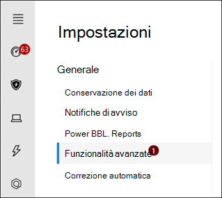

# Configurare i pilastri Microsoft Threat Protection per l'ambiente lab di valutazione

**Si applica a:**
- Microsoft Threat Protection

La creazione di un ambiente di laboratorio di valutazione di Microsoft Threat Protection e la distribuzione di questo è un processo in tre fasi:

 
<table border="0" width="100%" align="center">
  <tr style="text-align:center;">
    <td align="center" style="width:25%; border:0;" >
      <a href= "https://docs.microsoft.com/microsoft-365/security/mtp/prepare-mtpeval?view=o365-worldwide"> 
        
       Fase 1: preparazione</a> 
    </td>
     <td align="center">
      <a href="https://docs.microsoft.com/microsoft-365/security/mtp/setup-mtpeval?view=o365-worldwide">
        
       Fase 2: installazione</a> 
    </td>
    <td align="center" bgcolor="#d5f5e3">
      <a href="https://docs.microsoft.com/microsoft-365/security/mtp/config-mtpeval?view=o365-worldwide">
        
       Fase 3: configurare & onboard</a> 
</td>

  </tr>
</table>

Si è attualmente in fase di configurazione.

La preparazione è la chiave per una distribuzione corretta. In questo articolo verranno illustrati i punti che è necessario prendere in considerazione durante la preparazione per la distribuzione di Microsoft Defender ATP.

## Pilastri di Microsoft Threat Protection
Microsoft Threat Protection è costituito da quattro pilastri. Anche se un pilastro può già fornire valore alla sicurezza dell'organizzazione della rete, l'abilitazione dei quattro pilastri Microsoft Threat Protection darà alla propria organizzazione il massimo valore.

  

In questa sezione viene illustrata la configurazione:
-   Office 365 Advanced Threat Protection
-   Azure Advanced Threat Protection 
-   Microsoft Cloud App Security
-   Microsoft Defender Advanced Threat Protection

## Configurare Office 365 Advanced Threat Protection
>[!NOTE]
>Ignorare questo passaggio se è già stata abilitata la protezione avanzata dalle minacce di Office 365. 

È presente un modulo di PowerShell denominato l' *analizzatore di configurazione consigliato di Office 365 Advanced Threat Protection (Orca)* che consente di determinare alcune di queste impostazioni. Quando si esegue il ruolo di amministratore nel tenant, Get-ORCAReport contribuirà a generare una valutazione delle impostazioni di protezione da posta indesiderata, anti-phishing e altre informazioni di igiene dei messaggi. È possibile scaricare il modulo da https://www.powershellgallery.com/packages/ORCA/ . 

1. Accedere a [Office 365 Security & Compliance Center](https://protection.office.com/homepage)  >  **Threat Management**  >  **policy**.
  
 
2. Fare clic su **ATP anti-phishing**, selezionare **Crea** e compila il nome e la descrizione dei criteri. Fare clic su **Avanti**.
  

>[!NOTE]
>Modificare i criteri avanzati di anti-phishing ATP. Modificare la **soglia di phishing avanzata** su **2-aggressiva**.
 

3. Fare clic sul menu a discesa **Aggiungi condizione** e selezionare il dominio o i domini come dominio del destinatario. Fare clic su **Avanti**.
  
 
4. Esaminare le impostazioni. Fare clic su **crea questo criterio** per confermare. 
  
 
5. Selezionare **allegati sicuri di ATP** e selezionare l'opzione **attiva ATP per SharePoint, OneDrive e Microsoft teams** .  
  

6. Fare clic sull'icona + per creare un nuovo criterio allegato sicuro, applicarlo come dominio destinatario ai domini. Fare clic su **Salva**.
  
 
7. Successivamente, selezionare il criterio **collegamenti sicuri ATP** , quindi fare clic sull'icona a forma di matita per modificare il criterio predefinito.

8. Verificare che l'opzione non **rintracci quando gli utenti fanno clic su collegamenti sicuri** non è selezionata, mentre le altre opzioni sono selezionate. Per informazioni dettagliate, vedere [Safe Links Settings](https://docs.microsoft.com/microsoft-365/security/office-365-security/recommended-settings-for-eop-and-office365-atp?view=o365-worldwide) . Fare clic su **Salva**. 
  

9. Selezionare quindi il criterio **antimalware** , selezionare l'impostazione predefinita e scegliere l'icona a forma di matita.

10. Fare clic su **Impostazioni** e selezionare **Sì e utilizzare il testo di notifica predefinito** per abilitare la **risposta di rilevamento malware**. Attiva il **filtro dei tipi di allegati comuni** . Fare clic su **Salva**.
   
  
11. Accedere a [Office 365 Security & Compliance Center](https://protection.office.com/homepage)  >  **Search**  >  **log di controllo** di ricerca e attivazione del controllo.  
  

12. Integrazione di Office 365 ATP con Microsoft Defender ATP. Passare a [Office 365 Security & Compliance Center](https://protection.office.com/homepage)  >  **Threat Management**  >  **Explorer** e selezionare le **impostazioni di WDATP** nell'angolo superiore destro dello schermo. Nella finestra di dialogo Microsoft Defender ATP Connection, abilitare **Connect to Windows ATP**.
  

## Configurare la protezione avanzata dalle minacce di Azure
>[!NOTE]
>Ignorare questo passaggio se è già stata abilitata la protezione avanzata dalle minacce di Azure

1. Accedere a [Microsoft 365 Security Center](https://security.microsoft.com/info) > selezionare **altre risorse**  >  **Azure Advanced Threat Protection**.
  

2. Fare clic su **Crea** per avviare la procedura guidata di Azure Advanced Threat Protection. 
   

3. Scegliere **Fornisci un nome utente e una password per connettersi alla foresta di Active Directory**.  
  

4. Immettere le credenziali di Active Directory in locale. Può trattarsi di qualsiasi account utente che disponga dell'accesso in lettura a Active Directory.
  

5. Successivamente, scegliere **download Sensor Setup** and transfer file to your domain controller. 
  

6. Eseguire il programma di installazione del sensore ATP di Azure e iniziare a seguire la procedura guidata.
   
 
7. Fare clic su **Avanti** nel tipo di distribuzione del sensore.
   
 
8. Copiare il tasto di accesso poiché sarà necessario immetterlo successivamente nella procedura guidata.
  
 
9. Copiare la chiave di accesso nella procedura guidata e fare clic su **Installa**. 
   

10. Congratulazioni, è stata configurata correttamente la protezione avanzata dalle minacce di Azure nel controller di dominio.
  
 
11. Nella sezione impostazioni [ATP di Azure Azure](https://go.microsoft.com/fwlink/?linkid=2040449) selezionare **Windows Defender ATP**e quindi attivare l'interruttore. Fare clic su **Salva**. 
  

>[!NOTE]
>Windows Defender ATP è stato rebranded As Microsoft Defender ATP. Le modifiche di rebranding in tutti i portali vengono distribuite per garantire la coerenza.

## Configurare Microsoft cloud app Security
>[!NOTE]
>Ignorare questo passaggio se è già stata abilitata la sicurezza delle app cloud di Microsoft. 

1. Accedere a [Microsoft 365 Security Center](https://security.microsoft.com/info)  >  **altre risorse**  >  **Microsoft cloud app Security**.
  

2. Alla richiesta di informazioni per l'integrazione di Azure ATP, selezionare **Enable Azure ATP Data Integration**. 
   

>[!NOTE]
>Se questo messaggio non viene visualizzato, potrebbe significare che l'integrazione dei dati ATP di Azure è già stata abilitata. Tuttavia, se non si è certi, contattare l'amministratore IT per confermare. 

3. Andare a **Impostazioni**, attivare l'interruttore di **integrazione ATP di Azure** , quindi fare clic su **Salva**. 
  
>[!NOTE]
>Per le nuove istanze di Azure ATP, questo interruttore di integrazione viene attivato automaticamente. Verificare che l'integrazione di Azure ATP sia stata abilitata prima di procedere con il passaggio successivo.
 
4. In impostazioni di individuazione cloud selezionare **Microsoft Defender ATP Integration**e quindi abilitare l'integrazione. Fare clic su **Salva**.
  

5. In impostazioni di individuazione cloud selezionare **arricchimento degli utenti**e quindi abilitare l'integrazione con Azure Active Directory.
  

## Configurare Microsoft Defender Advanced Threat Protection
>[!NOTE]
>Ignorare questo passaggio se è già stata abilitata la protezione avanzata dalle minacce di Microsoft Defender.

1. Accedere a [Microsoft 365 Security Center](https://security.microsoft.com/info)  >  **altre risorse**  >  **Microsoft Defender Security Center**. Fare clic su **Apri**. 
   
 
2. Seguire la procedura guidata Microsoft Defender Advanced Threat Protection. Fare clic su **Avanti**. 
   

3. Scegliere in base alla posizione di archiviazione dei dati preferita, al criterio di conservazione dei dati, alle dimensioni dell'organizzazione e all'opt-in per le funzionalità di anteprima. 
   
>[!NOTE]
>Non è possibile modificare alcune impostazioni, ad esempio il percorso di archiviazione dei dati, in seguito. 
 

Fare clic su **Avanti**. 

4. Fare clic su **continua** e verrà eseguito il provisioning del tenant Microsoft Defender ATP.
   

5. Onboard your Endpoints tramite criteri di gruppo, Microsoft Endpoint Manager o esecuzione di uno script locale in Microsoft Defender ATP. Per semplicità, in questa guida viene utilizzato lo script locale.

6. Fare clic su **Scarica pacchetto** e copiare lo script di onboarding negli endpoint.  
   

7. Nell'endpoint, eseguire lo script onboarding come amministratore e scegliere Y.
   

8. Congratulazioni, è stato installato il primo endpoint.  
   

9. Copia e incolla il test di rilevamento dalla procedura guidata ATP di Microsoft Defender.
   

10. Copiare lo script di PowerShell in un prompt dei comandi con privilegi elevati ed eseguirlo. 
   

11. Fare clic su **avvia tramite Microsoft Defender ATP** dalla procedura guidata.
   
 
12. Visitare il [Centro sicurezza di Microsoft Defender](https://securitycenter.windows.com/). Andare a **Impostazioni** , quindi selezionare **funzionalità avanzate**. 
   

13. Attiva l'integrazione con **Azure Advanced Threat Protection**.  
   

14. Attiva l'integrazione con **Office 365 Threat Intelligence**.
   

15. Attiva l'integrazione con **Microsoft cloud app Security**.
   

16. Scorrere verso il basso e fare clic su **Salva preferenze** per confermare le nuove integrazioni.
   

## Avviare il servizio Microsoft Threat Protection
>[!NOTE]
>A partire dal 1 ° giugno 2020, Microsoft attiva automaticamente le funzionalità di protezione dalle minacce di Microsoft per tutti i tenant idonei. Per ulteriori informazioni, vedere l' [articolo relativo a Microsoft Tech Community sull'idoneità delle licenze](https://techcommunity.microsoft.com/t5/security-privacy-and-compliance/microsoft-threat-protection-will-automatically-turn-on-for/ba-p/1345426) . 
 

Accedere a [Microsoft 365 Security Center](https://security.microsoft.com/homepage). Passare a **Impostazioni** , quindi selezionare **Microsoft Threat Protection**.
   

Per ulteriori informazioni, vedere [abilitare Microsoft Threat Protection](mtp-enable.md). 

Congratulazioni! L'ambiente di valutazione di Microsoft Threat Protection è appena stato creato. A questo punto, è possibile acquisire familiarità con l'interfaccia utente di Microsoft Threat Protection. Vedere cosa si può imparare e sapere come usare ogni dashboard per le attività quotidiane di sicurezza: [Guida interattiva di Microsoft Threat Protection](https://aka.ms/MTP-Interactive-Guide).

Successivamente, è possibile simulare un attacco e vedere in che modo le funzionalità del prodotto incrociato rilevano, creano avvisi e rispondono automaticamente a un attacco non file su un endpoint.

## Passaggi successivi
[Generare un avviso di test](generate-test-alert.md).
