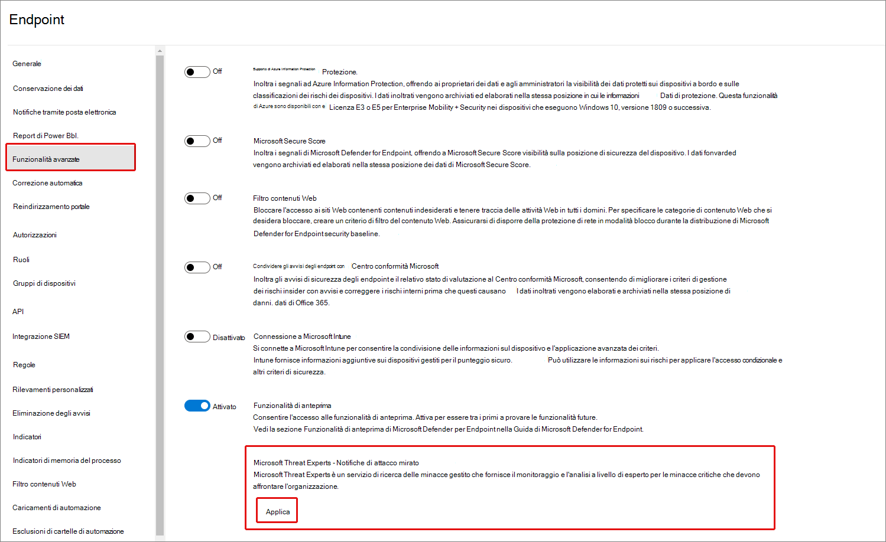
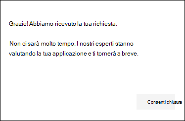
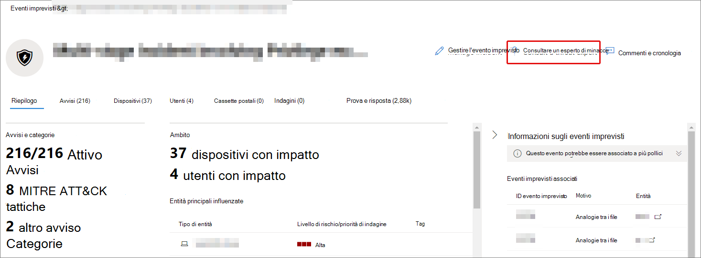

# Configurare e gestire le funzionalità di Microsoft Threat Experts tramite Microsoft 365 Defender

[!INCLUDE [Microsoft 365 Defender rebranding](../includes/microsoft-defender.md)]

**Si applica a:**

- [Microsoft 365 Defender](https://go.microsoft.com/fwlink/?linkid=2118804)
- [Microsoft Defender ATP](https://go.microsoft.com/fwlink/p/?linkid=2154037)

[!INCLUDE [Prerelease](../includes/prerelease.md)]

## Prima di iniziare

> [!IMPORTANT]
> Prima di candidarti, assicurati di discutere i requisiti di idoneità per microsoft Threat Experts – Targeted Attack Notifications managed threat hunting service with your Microsoft Technical Service provider and account team.

Per ricevere notifiche di attacco mirate, dovrai distribuire Microsoft 365 Defender con i dispositivi registrati. Quindi, inviare un'applicazione tramite il portale M365 per microsoft Threat Experts - Notifiche di attacco mirato.

Contattare il team dell'account o il rappresentante Microsoft per iscriversi a Microsoft Threat Experts - Experts on Demand. Gli esperti su richiesta ti consentono di consultare i nostri esperti sulle minacce su come proteggere l'organizzazione da rilevamenti e avversari pertinenti.

## Richiedere esperti di microsoft threat - Servizio notifiche di attacchi mirati

Se hai già Microsoft Defender per Endpoint e Microsoft 365 Defender, puoi richiedere gli esperti di Microsoft Threat – Notifiche di attacco mirato tramite il portale di Microsoft 365 Defender.  Le notifiche di attacco mirate offrono informazioni e analisi speciali per identificare le minacce più critiche per l'organizzazione, in modo da poterle rispondere rapidamente.

1. Dal riquadro di spostamento passare a Impostazioni > endpoint > generale > Funzionalità avanzate **> Microsoft Threat Experts - Notifiche di attacco mirato.**

2. Selezionare **Applica**.

    

3. Immetti il nome e l'indirizzo di posta elettronica in modo che Microsoft possa contattarti per la tua applicazione.

    

4. Leggi [l'informativa sulla privacy,](https://privacy.microsoft.com/en-us/privacystatement)quindi seleziona **Invia** al termine. Una volta approvata l'applicazione, riceverai un messaggio di posta elettronica di benvenuto.

    

5. Dopo aver ricevuto l'e-mail di benvenuto, inizierai automaticamente a ricevere notifiche di attacco mirate.

6. È possibile verificare lo stato visitando **Impostazioni > endpoint > generale > funzionalità avanzate**. Dopo l'approvazione, l'interruttore **Microsoft Threat Experts - Targeted Attack Notification** sarà visibile e attivato. 

## Dove vedrai le notifiche di attacchi mirati di Microsoft Threat Experts

È possibile ricevere una notifica di attacco mirato dagli esperti microsoft sulle minacce tramite i seguenti mezzi:

- Pagina Eventi imprevisti del portale di Microsoft 365 **Defender**
- Dashboard degli avvisi del portale  di Microsoft 365 Defender
- API di avviso OData [e API](https://docs.microsoft.com/windows/security/threat-protection/microsoft-defender-atp/get-alerts) [REST](https://docs.microsoft.com/windows/security/threat-protection/microsoft-defender-atp/pull-alerts-using-rest-api)
- [Tabella DeviceAlertEvents](https://docs.microsoft.com/windows/security/threat-protection/microsoft-defender-atp/advanced-hunting-devicealertevents-table) in Ricerca avanzata
- Posta in arrivo, se si sceglie di ricevere notifiche di attacco mirate tramite posta elettronica. Vedi [Creare una regola di notifica tramite posta elettronica di](#create-an-email-notification-rule) seguito.

### Creare una regola di notifica tramite posta elettronica

È possibile creare regole per inviare notifiche tramite posta elettronica per i destinatari delle notifiche. Per informazioni dettagliate, vedere  [Configure alert notifications](https://docs.microsoft.com/windows/security/threat-protection/microsoft-defender-atp/configure-email-notifications) to create, edit, delete, or troubleshoot email notification.

## Visualizzare le notifiche di attacchi mirati

Inizierai a ricevere una notifica di attacco mirato dagli esperti microsoft threat nella posta elettronica dopo aver configurato il sistema per ricevere la notifica tramite posta elettronica.

1. Seleziona il collegamento nel messaggio di posta elettronica per passare al contesto di avviso corrispondente nel dashboard contrassegnato con **esperti di minacce.**

2. Nella pagina **Avvisi** selezionare lo stesso argomento di avviso ricevuto nel messaggio di posta elettronica per visualizzare ulteriori dettagli.

## Abbonati a Microsoft Threat Experts - Esperti su richiesta

Se sei già un cliente di Microsoft Defender for Endpoint, puoi contattare il tuo rappresentante Microsoft per sottoscrivere Microsoft Threat Experts - Experts on Demand.

## Consultare un esperto di minacce Microsoft sulle attività sospette di cybersecurity nell'organizzazione

È possibile contattare microsoft threat experts dall'interno del portale di Microsoft 365 Defender. Gli esperti possono aiutarti a comprendere minacce complesse e notifiche di attacchi mirati. Collaborare con esperti per ulteriori dettagli su avvisi e incidenti o consigli sulla gestione della compromissione. Acquisire informazioni approfondite sul contesto di intelligence per le minacce descritto dal dashboard del portale.

> [!NOTE]
>
> - Le richieste di avviso relative ai dati di intelligence sulle minacce personalizzati dell'organizzazione non sono attualmente supportate. Per informazioni dettagliate, consultare le operazioni di sicurezza o il team di risposta agli incidenti.
> - È necessario disporre  dell'autorizzazione Gestisci impostazioni di sicurezza nel Centro sicurezza nel portale di Microsoft 365 Defender per inviare una richiesta tramite **il modulo Consulta** un esperto di minacce.

1. Passare alla pagina del portale relativa alle informazioni che si desidera analizzare, ad esempio **Dispositivo,** **Avviso** o **Evento imprevisto.** Prima di inviare una richiesta di indagine, verificare che sia visualizzata la pagina del portale relativa alla richiesta di informazioni.

2. Scegliere ? dal menu **in alto. Consultare un esperto di minacce**.

    

    Si aprirà una schermata a comparsa.

    L'intestazione indicherà se si è in una sottoscrizione di valutazione o un abbonamento completo a Microsoft Threat Experts - Experts on-Demand.

    

    Il **campo dell'argomento** Indagine verrà già popolato con il collegamento alla pagina pertinente per la richiesta.

3. Nel campo successivo, fornire informazioni sufficienti per fornire agli esperti di microsoft threat un contesto sufficiente per avviare l'indagine.

4. Immettere l'indirizzo di posta elettronica che si desidera utilizzare per la corrispondenza con microsoft threat experts.

> [!NOTE]
> Se si desidera tenere traccia dello stato dei casi esperti su richiesta tramite Hub dei servizi Microsoft, contattare il responsabile dell'account tecnico.

Guarda questo video per una breve panoramica dell'hub dei servizi Microsoft.

> [!VIDEO https://www.microsoft.com/videoplayer/embed/RE4pk9f]

## Argomenti di analisi di esempio

### Informazioni sull'avviso

- È stato visualizzato un nuovo tipo di avviso per un file binario living-off-the-land. Possiamo fornire l'ID avviso. Puoi dirci di più su questo avviso e su come possiamo analizzarlo ulteriormente?
- Sono stati osservati due attacchi simili, che tentano entrambi di eseguire script di PowerShell dannosi ma generano avvisi diversi. Uno è "Riga di comando di PowerShell sospetta" e l'altro è "È stato rilevato un file dannoso in base all'indicazione fornita da O365". Qual è la differenza?
- Oggi abbiamo ricevuto un avviso strano su un numero anomalo di accessi non riusciti dal dispositivo di un utente di alto profilo. Non è possibile trovare ulteriori prove per questi tentativi. In che modo Microsoft 365 Defender può visualizzare questi tentativi? Che tipo di account di accesso viene monitorato?
- È possibile fornire più contesto o informazioni dettagliate sull'avviso, "È stato osservato un comportamento sospetto da parte di un'utilità di sistema"?
- Ho osservato un avviso intitolato "Creazione della regola di inoltro/reindirizzamento". L'attività è benigna. Può dirmi perché ho ricevuto un avviso?

### Possibile compromissione del computer

- È possibile spiegare perché viene visualizzato un messaggio o un avviso per "Processo sconosciuto osservato" in molti dispositivi dell'organizzazione? Apprezziamo qualsiasi input per chiarire se questo messaggio o avviso è correlato ad attività dannose.
- È possibile convalidare una possibile compromissione del sistema seguente, datata la settimana scorsa? Si comporta in modo analogo a un precedente rilevamento di malware nello stesso sistema sei mesi fa.

### Dettagli di Intelligence per le minacce

- È stato rilevato un messaggio di posta elettronica di phishing che ha recapitato un documento di Word dannoso a un utente. Il documento ha causato una serie di eventi sospetti, che hanno attivato più avvisi per una determinata famiglia di malware. Hai informazioni su questo malware? In caso affermativa, è possibile inviarci un collegamento?
- Di recente abbiamo visto un post di blog su una minaccia mirata al nostro settore. Può aiutarci a comprendere quale protezione fornisce Microsoft 365 Defender contro questo attore di minacce?
- Di recente è stata osservata una campagna di phishing condotta contro l'organizzazione. Può dirci se questo è stato specifico per la nostra azienda o verticale?

### Comunicazioni di avviso di Microsoft Threat Experts

- Il team di risposta agli incidenti può aiutarci a risolvere la notifica di attacco mirato che abbiamo ricevuto?
- Abbiamo ricevuto questa notifica di attacco mirato da microsoft Threat Experts. Non abbiamo un team di risposta agli eventi imprevisti. Cosa possiamo fare ora e come possiamo contenere l'incidente?
- Abbiamo ricevuto una notifica di attacco mirato da Microsoft Threat Experts. Quali dati è possibile fornire al team di risposta agli incidenti?

> [!NOTE]
> Microsoft Threat Experts è un servizio di ricerca delle minacce gestito e non un servizio di risposta agli incidenti. Tuttavia, gli esperti possono passare senza problemi l'indagine ai servizi daRT (Detection and Response Team) di Microsoft Cybersecurity Solutions Group (CSG), se necessario. È inoltre possibile scegliere di interagire con il proprio team di risposta agli incidenti per risolvere i problemi che richiedono una risposta agli eventi imprevisti.

## Scenario

### Ricevere un rapporto sullo stato della richiesta di ricerca gestita

La risposta degli esperti microsoft sulle minacce varia in base alla richiesta dell'utente. In genere si riceve una delle seguenti risposte:

- Sono necessarie ulteriori informazioni per proseguire con l'indagine
- Per determinare il contesto tecnico sono necessari uno o più esempi di file
- L'indagine richiede più tempo
- Le informazioni iniziali sono sufficienti per concludere l'indagine

Se un esperto richiede ulteriori informazioni o campioni di file, è fondamentale rispondere rapidamente per mantenere l'indagine in movimento.

## Vedere anche

- [Panoramica di Microsoft Threat Experts](microsoft-threat-experts.md)
