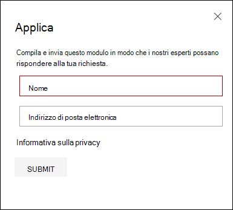

# Configurare e gestire Microsoft Threat Experts funzionalità tramite Microsoft 365 DefenderConfigure and manage Microsoft Threat Experts capabilities through Microsoft 365 Defender

[!INCLUDE [Microsoft 365 Defender rebranding](../includes/microsoft-defender.md)]

**Si applica a:****Applies to:**

- [Microsoft 365 DefenderMicrosoft 365 Defender](https://go.microsoft.com/fwlink/?linkid=2118804)
- [Microsoft Defender ATPMicrosoft Defender for Endpoint](https://go.microsoft.com/fwlink/p/?linkid=2154037)

[!INCLUDE [Prerelease](../includes/prerelease.md)]

## Prima di iniziareBefore you begin

> [!IMPORTANT]
> Prima di candidarti, assicurati di discutere i requisiti di idoneità per il servizio di ricerca delle minacce gestito Microsoft Threat Experts – Targeted Attack Notifications con il tuo provider di servizi tecnici Microsoft e il team di account.Before you apply, make sure to discuss the eligibility requirements for the Microsoft Threat Experts – Targeted Attack Notifications managed threat hunting service with your Microsoft Technical Service provider and account team.

Per ricevere notifiche di attacco mirate, dovrai distribuire Microsoft 365 Defender con i dispositivi registrati.To receive targeted attack notifications, you'll need to have Microsoft 365 Defender deployed with devices enrolled. Quindi, inviare un'applicazione tramite il portale M365 per Microsoft Threat Experts - Notifiche di attacco mirato.Then, submit an application through the M365 portal for Microsoft Threat Experts - Targeted Attack Notifications.

Contattare il team dell'account o il rappresentante Microsoft per sottoscrivere Microsoft Threat Experts - Esperti su richiesta.Contact your account team or Microsoft representative to subscribe to Microsoft Threat Experts - Experts on Demand. Gli esperti su richiesta ti consentono di consultare i nostri esperti sulle minacce su come proteggere l'organizzazione da rilevamenti e avversari pertinenti.Experts on Demand lets you consult with our threat experts on how to protect your organization from relevant detections and adversaries.

## Candidarsi per Microsoft Threat Experts - Servizio Notifiche di attacco miratoApply for Microsoft Threat Experts - Targeted Attack Notifications service

Se hai già Microsoft Defender per Endpoint e Microsoft 365 Defender, puoi richiedere le notifiche di attacco mirato Microsoft Threat Experts - Microsoft Threat Experts tramite il portale Microsoft 365 Defender.If you already have Microsoft Defender for Endpoint and Microsoft 365 Defender, you can apply for Microsoft Threat Experts – Targeted Attack Notifications through their Microsoft 365 Defender portal.  Le notifiche di attacco mirate offrono informazioni e analisi speciali per identificare le minacce più critiche per l'organizzazione, in modo da poterle rispondere rapidamente.Targeted attack notifications grant you special insight and analysis to help identify the most critical threats to your organization, so you can respond to them quickly.

1. Dal riquadro di spostamento, passare a Impostazioni > Endpoint > generale > funzionalità avanzate **> Microsoft Threat Experts - Notifiche di attacco mirato**.From the navigation pane, go to **Settings > Endpoints > General > Advanced features > Microsoft Threat Experts - Targeted Attack Notifications**.

2. Selezionare **Applica**.Select **Apply**.

    

3. Immetti il nome e l'indirizzo di posta elettronica in modo che Microsoft possa contattarti per la tua applicazione.Enter your name and email address so that Microsoft can contact you about your application.

    

4. Leggi [l'informativa sulla privacy,](https://privacy.microsoft.com/en-us/privacystatement)quindi seleziona **Invia** al termine.Read the [privacy statement](https://privacy.microsoft.com/en-us/privacystatement), then select **Submit** when you're done. Una volta approvata l'applicazione, riceverai un messaggio di posta elettronica di benvenuto.You'll receive a welcome email once your application is approved.

    

5. Dopo aver ricevuto l'e-mail di benvenuto, inizierai automaticamente a ricevere notifiche di attacco mirate.After you receive your welcome email, you'll automatically start receiving targeted attack notifications.

6. È possibile verificare lo stato visitando **Impostazioni > endpoint > generale > funzionalità avanzate**.You can verify your status by visiting **Settings > Endpoints > General > Advanced features**. Dopo l'approvazione, **l'interruttore Microsoft Threat Experts - Notifica** di attacco mirato sarà visibile e **attivato.**Once approved, the **Microsoft Threat Experts - Targeted Attack Notification** toggle will be visible and switched **On**.

## Dove vedrai le notifiche di attacco mirate da Microsoft Threat ExpertsWhere you'll see the targeted attack notifications from Microsoft Threat Experts

È possibile ricevere una notifica di attacco mirato Microsoft Threat Experts tramite i seguenti mezzi:You can receive targeted attack notification from Microsoft Threat Experts through the following mediums:

- Pagina Microsoft 365 eventi imprevisti **del** portale di DefenderThe Microsoft 365 Defender portal's **Incidents** page
- Dashboard Microsoft 365 avvisi del portale  di DefenderThe Microsoft 365 Defender portal's **Alerts** dashboard
- API di avviso OData [e API](/windows/security/threat-protection/microsoft-defender-atp/get-alerts) [REST](/windows/security/threat-protection/microsoft-defender-atp/pull-alerts-using-rest-api)OData alerting [API](/windows/security/threat-protection/microsoft-defender-atp/get-alerts) and [REST API](/windows/security/threat-protection/microsoft-defender-atp/pull-alerts-using-rest-api)
- [Tabella DeviceAlertEvents](/windows/security/threat-protection/microsoft-defender-atp/advanced-hunting-devicealertevents-table) in Ricerca avanzata[DeviceAlertEvents](/windows/security/threat-protection/microsoft-defender-atp/advanced-hunting-devicealertevents-table) table in Advanced hunting
- Posta in arrivo, se si sceglie di ricevere notifiche di attacco mirate tramite posta elettronica.Your inbox, if you choose to have targeted attack notifications sent to you via email. Vedi [Creare una regola di notifica tramite posta elettronica di](#create-an-email-notification-rule) seguito.See [Create an email notification rule](#create-an-email-notification-rule) below.

### Creare una regola di notifica tramite posta elettronicaCreate an email notification rule

È possibile creare regole per inviare notifiche tramite posta elettronica per i destinatari delle notifiche.You can create rules to send email notifications for notification recipients. Per informazioni dettagliate, vedere  [Configure alert notifications](/windows/security/threat-protection/microsoft-defender-atp/configure-email-notifications) to create, edit, delete, or troubleshoot email notification.For full details, see  [Configure alert notifications](/windows/security/threat-protection/microsoft-defender-atp/configure-email-notifications) to create, edit, delete, or troubleshoot email notification.

## Visualizzare le notifiche di attacchi miratiView targeted attack notifications

Inizierai a ricevere una notifica di attacco mirato Microsoft Threat Experts posta elettronica dopo aver configurato il sistema per ricevere la notifica tramite posta elettronica.You'll start receiving targeted attack notification from Microsoft Threat Experts in your email after you have configured your system to receive email notification.

1. Seleziona il collegamento nel messaggio di posta elettronica per passare al contesto di avviso corrispondente nel dashboard contrassegnato con **esperti di minacce.**Select the link in the email to go to the corresponding alert context in the dashboard tagged with **Threat experts**.

2. Nella pagina **Avvisi** selezionare lo stesso argomento di avviso ricevuto nel messaggio di posta elettronica per visualizzare ulteriori dettagli.From the **Alerts** page, select the same alert topic as the one you received in the email, to view further details.

## Sottoscrizione a Microsoft Threat Experts - Esperti su richiestaSubscribe to Microsoft Threat Experts - Experts on Demand

Se sei già un cliente di Microsoft Defender for Endpoint, puoi contattare il tuo rappresentante Microsoft per sottoscrivere Microsoft Threat Experts - Esperti su richiesta.If you're already a Microsoft Defender for Endpoint customer, you can contact your Microsoft representative to subscribe to Microsoft Threat Experts - Experts on Demand.

## Consultare un esperto di minacce Microsoft sulle attività sospette di cybersecurity nell'organizzazioneConsult a Microsoft threat expert about suspicious cybersecurity activities in your organization

È possibile contattare Microsoft Threat Experts dall'interno del portale Microsoft 365 Defender.You can contact Microsoft Threat Experts from inside the Microsoft 365 Defender portal. Gli esperti possono aiutarti a comprendere minacce complesse e notifiche di attacchi mirati.Experts can help you understand complex threats and targeted attack notifications. Collaborare con esperti per ulteriori dettagli su avvisi e incidenti o consigli sulla gestione della compromissione.Partner with experts for further details about alerts and incidents, or advice on handling compromise. Acquisire informazioni approfondite sul contesto di intelligence per le minacce descritto dal dashboard del portale.Gain insight into the threat intelligence context described by your portal dashboard.

> [!NOTE]
>
> - Le richieste di avviso relative ai dati di intelligence sulle minacce personalizzati dell'organizzazione non sono attualmente supportate.Alert inquiries related to your organization's customized threat intelligence data are not currently supported. Per informazioni dettagliate, consultare le operazioni di sicurezza o il team di risposta agli incidenti.Consult with your security operations or incident response team for details.
> - Devi disporre dell'autorizzazione Gestisci impostazioni di sicurezza nel Centro sicurezza nel portale di Microsoft 365 Defender per inviare una richiesta tramite il modulo Consulta un **esperto di** minacce. You need to have the **Manage security settings in Security Center** permission in the Microsoft 365 Defender portal to submit an inquiry through the **Consult a threat expert** form.

1. Passare alla pagina del portale relativa alle informazioni che si desidera analizzare, ad esempio **Dispositivo,** **Avviso** o **Evento imprevisto.**Navigate to the portal page related to the information that you'd like to investigate: for example, **Device**, **Alert**, or **Incident**. Prima di inviare una richiesta di indagine, verificare che sia visualizzata la pagina del portale relativa alla richiesta di informazioni.Make sure that the portal page related to your inquiry is in view before you send an investigation request.

2. Scegliere ? dal menu **in alto. Consultare un esperto di minacce**.From the top menu, select **? Consult a threat expert**.

    

    Si aprirà una schermata a comparsa.A flyout screen will open.

    L'intestazione indicherà se si è in una sottoscrizione di valutazione o una sottoscrizione Microsoft Threat Experts - Esperti su richiesta.The header will indicate if you are on a trial subscription, or a full Microsoft Threat Experts - Experts on-Demand subscription.

    

    Il **campo dell'argomento** Indagine verrà già popolato con il collegamento alla pagina pertinente per la richiesta.The **Investigation topic** field will already be populated with the link to the relevant page for your request.

3. Nel campo successivo, fornire informazioni sufficienti per fornire al Microsoft Threat Experts contesto sufficiente per avviare l'indagine.In the next field, provide enough information to give the Microsoft Threat Experts enough context to start the investigation.

4. Immettere l'indirizzo di posta elettronica che si desidera utilizzare per corrispondere a Microsoft Threat Experts.Enter the email address that you'd like to use to correspond with Microsoft Threat Experts.

> [!NOTE]
> Se si desidera tenere traccia dello stato dei casi esperti su richiesta tramite Hub dei servizi Microsoft, contattare il responsabile dell'account tecnico.If you would like to track the status of your Experts on Demand cases through Microsoft Services Hub, reach out to your technical account manager.

Guarda questo video per una breve panoramica dell'hub dei servizi Microsoft.Watch this video for a quick overview of the Microsoft Services Hub.

> [!VIDEO https://www.microsoft.com/videoplayer/embed/RE4pk9f]

## Argomenti di analisi di esempioSample investigation topics

### Informazioni sull'avvisoAlert information

- È stato visualizzato un nuovo tipo di avviso per un file binario living-off-the-land.We saw a new type of alert for a living-off-the-land binary. Possiamo fornire l'ID avviso.We can provide the alert ID. Puoi dirci di più su questo avviso e su come possiamo analizzarlo ulteriormente?Can you tell us more about this alert and how we can investigate it further?
- Sono stati osservati due attacchi simili, che tentano entrambi di eseguire script di PowerShell dannosi ma generano avvisi diversi.We've observed two similar attacks, which both try to execute malicious PowerShell scripts but generate different alerts. Uno è "Riga di comando di PowerShell sospetta" e l'altro è "È stato rilevato un file dannoso in base all'indicazione fornita da O365".One is "Suspicious PowerShell command line" and the other is "A malicious file was detected based on indication provided by O365". Qual è la differenza?What is the difference?
- Oggi abbiamo ricevuto un avviso strano su un numero anomalo di accessi non riusciti dal dispositivo di un utente di alto profilo.We received an odd alert today about an abnormal number of failed logins from a high profile user’s device. Non è possibile trovare ulteriori prove per questi tentativi.We can't find any further evidence for these attempts. In che modo Microsoft 365 Defender può visualizzare questi tentativi?How can Microsoft 365 Defender see these attempts? Che tipo di account di accesso viene monitorato?What type of logins are being monitored?
- È possibile fornire più contesto o informazioni dettagliate sull'avviso, "È stato osservato un comportamento sospetto da parte di un'utilità di sistema"?Can you give more context or insight about the alert, "Suspicious behavior by a system utility was observed"?
- Ho osservato un avviso intitolato "Creazione della regola di inoltro/reindirizzamento".I observed an alert titled "Creation of forwarding/redirect rule". L'attività è benigna.I believe the activity is benign. Può dirmi perché ho ricevuto un avviso?Can you tell me why I received an alert?

### Possibile compromissione del computerPossible machine compromise

- È possibile spiegare perché viene visualizzato un messaggio o un avviso per "Processo sconosciuto osservato" in molti dispositivi dell'organizzazione?Can you help explain why we see a message or alert for "Unknown process observed" on many devices in our organization? Apprezziamo qualsiasi input per chiarire se questo messaggio o avviso è correlato ad attività dannose.We appreciate any input to clarify whether this message or alert is related to malicious activity.
- È possibile convalidare una possibile compromissione del sistema seguente, datata la settimana scorsa?Can you help validate a possible compromise on the following system, dating from last week? Si comporta in modo analogo a un precedente rilevamento di malware nello stesso sistema sei mesi fa.It's behaving similarly as a previous malware detection on the same system six months ago.

### Dettagli di Intelligence per le minacceThreat intelligence details

- È stato rilevato un messaggio di posta elettronica di phishing che ha recapitato un documento di Word dannoso a un utente.We detected a phishing email that delivered a malicious Word document to a user. Il documento ha causato una serie di eventi sospetti, che hanno attivato più avvisi per una determinata famiglia di malware.The document caused a series of suspicious events, which triggered multiple alerts for a particular malware family. Hai informazioni su questo malware?Do you have any information on this malware? In caso affermativa, è possibile inviarci un collegamento?If yes, can you send us a link?
- Di recente abbiamo visto un post di blog su una minaccia mirata al nostro settore.We recently saw a blog post about a threat that is targeting our industry. Puoi aiutarci a capire quale protezione offre Microsoft 365 Defender contro questo attore di minacce?Can you help us understand what protection Microsoft 365 Defender provides against this threat actor?
- Di recente è stata osservata una campagna di phishing condotta contro l'organizzazione.We recently observed a phishing campaign conducted against our organization. Può dirci se questo è stato specifico per la nostra azienda o verticale?Can you tell us if this was targeted specifically to our company or vertical?

### Microsoft Threat Experts di avvisoMicrosoft Threat Experts’ alert communications

- Il team di risposta agli incidenti può aiutarci a risolvere la notifica di attacco mirato che abbiamo ricevuto?Can your incident response team help us address the targeted attack notification that we got?
- Abbiamo ricevuto questa notifica di attacco mirato da Microsoft Threat Experts.We received this targeted attack notification from Microsoft Threat Experts. Non abbiamo un team di risposta agli eventi imprevisti.We don’t have our own incident response team. Cosa possiamo fare ora e come possiamo contenere l'incidente?What can we do now, and how can we contain the incident?
- Abbiamo ricevuto una notifica di attacco mirato da Microsoft Threat Experts.We received a targeted attack notification from Microsoft Threat Experts. Quali dati è possibile fornire al team di risposta agli incidenti?What data can you provide to us that we can pass on to our incident response team?

> [!NOTE]
> Microsoft Threat Experts è un servizio di ricerca delle minacce gestito e non un servizio di risposta agli eventi imprevisti.Microsoft Threat Experts is a managed threat hunting service and not an incident response service. Tuttavia, gli esperti possono passare senza problemi l'indagine ai servizi daRT (Detection and Response Team) di Microsoft Cybersecurity Solutions Group (CSG), se necessario.However, the experts can seamlessly transition the investigation to Microsoft Cybersecurity Solutions Group (CSG)'s Detection and Response Team (DART) services, when necessary. È inoltre possibile scegliere di interagire con il proprio team di risposta agli incidenti per risolvere i problemi che richiedono una risposta agli eventi imprevisti.You can also opt to engage with your own incident response team to address issues that requires an incident response.

## ScenarioScenario

### Ricevere un rapporto sullo stato della richiesta di ricerca gestitaReceive a progress report about your managed hunting inquiry

La risposta da Microsoft Threat Experts varia a seconda della richiesta.The response from Microsoft Threat Experts will vary according to your inquiry. In genere si riceve una delle seguenti risposte:You'll generally receive one of the following responses:

- Sono necessarie ulteriori informazioni per proseguire con l'indagineMore information is needed to continue with the investigation
- Per determinare il contesto tecnico sono necessari uno o più esempi di fileA file or several file samples are needed to determine the technical context
- L'indagine richiede più tempoInvestigation requires more time
- Le informazioni iniziali sono sufficienti per concludere l'indagineInitial information was enough to conclude the investigation

Se un esperto richiede ulteriori informazioni o campioni di file, è fondamentale rispondere rapidamente per mantenere l'indagine in movimento.If an expert requests more information or file samples, it's crucial to respond quickly to keep the investigation moving.

## Vedere ancheSee also

- [Panoramica di Microsoft Threat ExpertsMicrosoft Threat Experts overview](microsoft-threat-experts.md)
