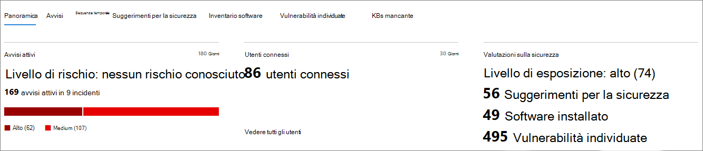
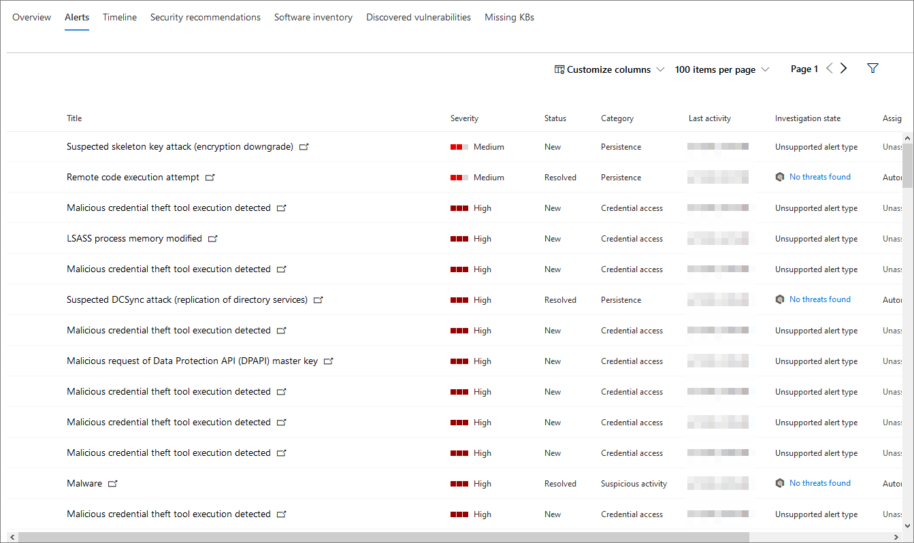
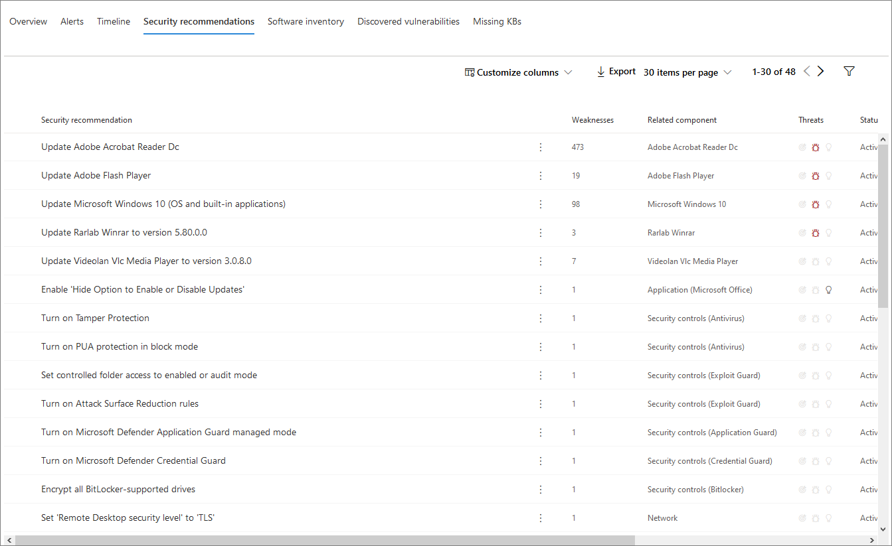
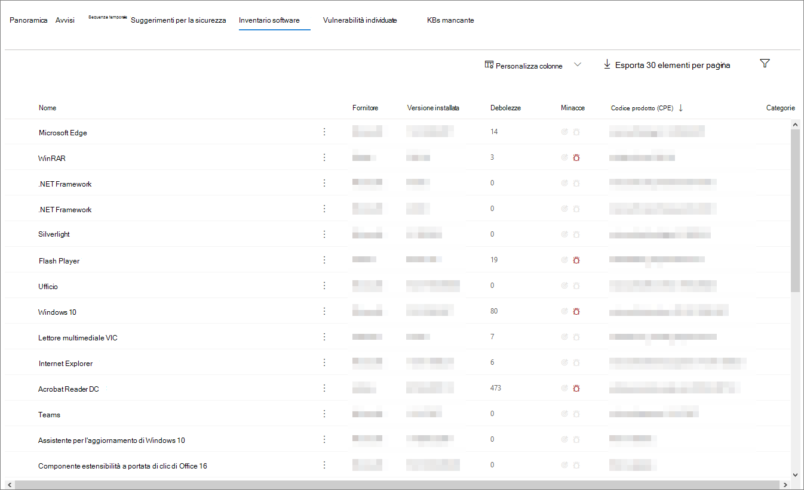
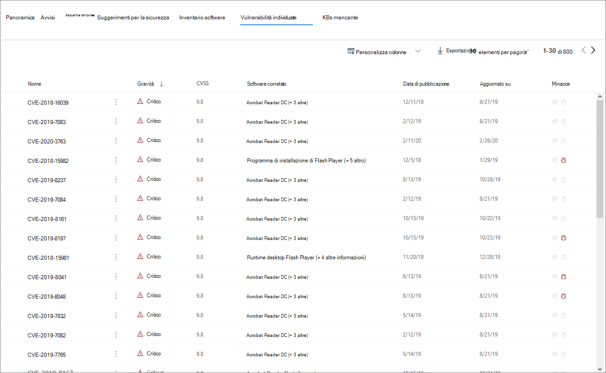

# Pagina del profilo del dispositivo

Il portale di sicurezza di Microsoft 365 fornisce pagine del profilo del dispositivo, in modo da poter valutare rapidamente l'integrità e lo stato dei dispositivi sulla rete.

> [!IMPORTANT]
> La pagina del profilo del dispositivo può essere leggermente diversa, a seconda che il dispositivo sia registrato in Microsoft Defender ATP, Azure ATP o entrambi.

Se il dispositivo è registrato in Microsoft Defender ATP, è possibile utilizzare anche la pagina del profilo del dispositivo per eseguire alcune attività di sicurezza comuni.

## Esplorazione della pagina del profilo del dispositivo

La pagina del profilo è suddivisa in diverse sezioni.

La barra laterale (1) elenca i dettagli di base del dispositivo.

L'area di contenuto principale (2) contiene le schede che è possibile passare per visualizzare diversi tipi di informazioni sul dispositivo.

Se il dispositivo è registrato in Microsoft Defender ATP, verrà visualizzato anche un elenco di azioni di risposta (3). Le azioni di risposta consentono di eseguire attività comuni relative alla sicurezza.

## Barra laterale

Accanto all'area principale del contenuto della pagina del profilo del dispositivo si trova la barra laterale.

Nella barra laterale sono elencati il nome completo e il livello di esposizione del dispositivo. Sono inoltre disponibili alcune importanti informazioni di base in piccole sottosezioni che possono essere attivate in modo aperto o chiuso, ad esempio:

* **Tag** -qualsiasi Microsoft Defender ATP, Azure ATP o tag personalizzati associati al dispositivo. I tag di Azure ATP non sono modificabili.
* **Info sulla sicurezza** -aprire gli incidenti e gli avvisi attivi. I dispositivi registrati in Microsoft Defender ATP visualizzeranno anche il livello di esposizione e il livello di rischio.

> [!TIP]
> Il livello di esposizione si riferisce a quanto il dispositivo è conforme alle indicazioni sulla sicurezza, mentre il livello di rischio viene calcolato in base a una serie di fattori, tra cui i tipi e la gravità degli avvisi attivi.

* **Dettagli del dispositivo** : dominio, sistema operativo, timestamp per la prima volta che il dispositivo è stato visualizzato, indirizzi IP e risorse. Anche i dispositivi registrati in Microsoft Defender ATP visualizzano lo stato di integrità. I dispositivi registrati in Azure ATP visualizzeranno il nome SAM e un timestamp per la prima volta che il dispositivo è stato creato.
* **Attività di rete** -timestamp per la prima volta e l'ultima volta che il dispositivo è stato visualizzato sulla rete.
* **Dati della directory** (*solo per i dispositivi registrati in Azure ATP*)- [account utente](https://docs.microsoft.com/windows/security/identity-protection/user-account-control/user-account-control-overview) flag, [SPN](https://docs.microsoft.com/windows/win32/ad/service-principal-names)e appartenenze ai gruppi.

## Azioni di risposta

Le azioni di risposta offrono una soluzione rapida per la difesa e l'analisi delle minacce.

> [!IMPORTANT]
> * Le [azioni di risposta](https://docs.microsoft.com/windows/security/threat-protection/microsoft-defender-atp/respond-machine-alerts) sono disponibili solo se il dispositivo è registrato in Microsoft Defender ATP.
> * I dispositivi registrati in Microsoft Defender ATP possono visualizzare diversi numeri di azioni di risposta, in base al sistema operativo del dispositivo e al numero di versione.

Le azioni disponibili nella pagina del profilo del dispositivo includono:

* **Gestione tag** : consente di aggiornare i tag personalizzati applicati al dispositivo.
* **Isolate Device** -isola il dispositivo dalla rete dell'organizzazione mantenendo la connessione a Microsoft Defender Advanced Threat Protection. È possibile scegliere di consentire l'esecuzione di Outlook, teams e Skype for business mentre il dispositivo è isolato, a scopo di comunicazione.
* **Centro azioni** : visualizzare lo stato delle azioni inviate. Disponibile solo se è già stata selezionata un'altra azione.
* **Limitare l'esecuzione delle app** -impedisce l'esecuzione di applicazioni non firmate da Microsoft.
* **Run Antivirus Scan** -aggiorna le definizioni di Windows Defender antivirus ed esegue immediatamente un'analisi antivirus. Scegliere tra analisi rapida o analisi completa.
* **Raccolta del pacchetto di analisi** : raccoglie informazioni sul dispositivo. Al termine dell'analisi, è possibile scaricarlo.
* **Avvio di Live Response Session** -carica una shell remota sul dispositivo per [indagini di sicurezza approfondite](https://docs.microsoft.com/windows/security/threat-protection/microsoft-defender-atp/live-response).
* **Avviare l'analisi automatizzata** : consente [di analizzare e correggere automaticamente le minacce](https://docs.microsoft.com/microsoft-365/security/office-365-security/office-365-air). Anche se è possibile attivare manualmente le indagini automatizzate per l'esecuzione da questa pagina, [alcuni criteri di avviso](https://docs.microsoft.com/microsoft-365/compliance/alert-policies?view=o365-worldwide#default-alert-policies) attivano le indagini automatiche in modo autonomo.
* **Centro azioni** : consente di visualizzare le informazioni sulle azioni di risposta attualmente in esecuzione.

## Sezione tabulazioni

Le schede profilo dispositivo consentono di passare attraverso una panoramica dei dettagli sulla sicurezza del dispositivo e delle tabelle contenenti un elenco di avvisi.

I dispositivi registrati in Microsoft Defender ATP visualizzeranno anche schede che dispongono di una sequenza temporale, un elenco di suggerimenti per la sicurezza, un inventario software, un elenco di vulnerabilità individuate e i KBs mancanti (aggiornamenti della sicurezza).

### Scheda Panoramica

La scheda predefinita è **Overview**. In questo modo viene fornita una rapida occhiata ai fatti di sicurezza più importanti per il dispositivo.

In questa sezione, è possibile consultare rapidamente gli avvisi attivi del dispositivo e tutti gli utenti attualmente connessi.

Se il dispositivo è registrato in Microsoft Defender ATP, verrà visualizzato anche il livello di rischio del dispositivo e tutti i dati disponibili sulle valutazioni di sicurezza. Le valutazioni di sicurezza descrivono il livello di esposizione del dispositivo, forniscono suggerimenti per la sicurezza ed elenchino il software e le vulnerabilità individuate.

### Scheda avvisi

La scheda **avvisi** contiene un elenco di avvisi che sono stati generati nel dispositivo, sia da Azure ATP che da Microsoft Defender ATP.

È possibile personalizzare il numero di elementi visualizzati, nonché le colonne visualizzate per ogni elemento. Il comportamento predefinito consiste nell'elencare trenta elementi per ogni pagina.

Nelle colonne di questa scheda sono incluse informazioni sulla gravità del pericolo che ha attivato l'avviso, nonché lo stato, lo stato di indagine e l'utente a cui è stato assegnato l'avviso.

La colonna *entità* interessate si riferisce al dispositivo (entità) il cui profilo si sta visualizzando, oltre a qualsiasi altro dispositivo della rete interessato.

Se si seleziona un elemento da questo elenco, verrà aperto un riquadro a comparsa contenente ulteriori informazioni sull'avviso selezionato.

Questo elenco può essere filtrato in base alla gravità, allo stato o all'utente a cui è stato assegnato l'avviso.

### Scheda sequenza temporale

Nella scheda **sequenza temporale** è incluso un grafico cronologico interattivo di tutti gli eventi generati nel dispositivo. Spostando l'area evidenziata del grafico a sinistra o a destra, è possibile visualizzare gli eventi su diversi periodi di tempo. È anche possibile scegliere un intervallo di date personalizzato dal menu a discesa tra il grafico interattivo e l'elenco di eventi.

Di seguito è riportato un elenco di eventi per l'intervallo di date selezionato.

È possibile personalizzare il numero di elementi visualizzati e le colonne dell'elenco. Le colonne predefinite elencano l'ora dell'evento, l'utente attivo, il tipo di azione, le entità (processi) e altre informazioni sull'evento.

Se si seleziona un elemento da questo elenco, verrà aperto un riquadro a comparsa che visualizza un grafico entità eventi, in cui vengono visualizzati i processi padre e figlio coinvolti nell'evento.

L'elenco può essere filtrato in base al tipo di evento specifico. ad esempio, eventi del registro di sistema o eventi dello Smart Screen.

L'elenco può anche essere esportato in un file CSV, per il download. Anche se il file non è limitato in base al numero di eventi, l'intervallo di tempo massimo che è possibile scegliere di esportare è di sette giorni.

### Scheda suggerimenti per la sicurezza

La scheda consigli per la **sicurezza** elenca le operazioni che è possibile eseguire per proteggere il dispositivo. Se si seleziona un elemento di questo elenco, verrà aperto un riquadro a comparsa in cui è possibile ottenere istruzioni su come applicare il suggerimento.

Come per le schede precedenti, il numero di elementi visualizzati per pagina, nonché le colonne visibili, può essere personalizzato.

La visualizzazione predefinita include colonne che illustrano in dettaglio le debolezze della sicurezza affrontate, la minaccia associata, il componente o il software correlato e altro. Gli elementi possono essere filtrati in base allo stato della raccomandazione.

### Inventario software

Nella scheda **inventario software** sono elencati i software installati nel dispositivo.

La visualizzazione predefinita Visualizza il fornitore del software, il numero di versione installata, il numero di debolezze del software note, le informazioni sulle minacce, il codice prodotto e i tag. È possibile personalizzare il numero di elementi visualizzati e le colonne visualizzate.

Se si seleziona un elemento da questo elenco, verrà aperto un riquadro a comparsa contenente ulteriori informazioni sul software selezionato, nonché il percorso e il timestamp per l'ultima volta che il software è stato trovato.

Questo elenco può essere filtrato in base al codice prodotto.

### Scheda vulnerabilità individuate

La scheda **vulnerabilità individuata** elenca le vulnerabilità e gli exploit comuni (CVE) che possono influire sul dispositivo.

La visualizzazione predefinita elenca la gravità di CVE, il Punteggio di vulnerabilità comune (CVS), il software relativo a CVE, quando è stato pubblicato CVE, quando è stato aggiornato l'ultimo CVE e le minacce associate a CVE.

Come per le schede precedenti, è possibile personalizzare il numero di elementi visualizzati e le colonne visibili.

Se si seleziona un elemento da questo elenco, verrà aperto un riquadro a comparsa che descrive CVE.

### KBs mancante

La scheda **KBS mancante** elenca gli aggiornamenti di Microsoft che devono essere ancora applicati al dispositivo. La "KBs" in questione sono [articoli della Knowledge base](https://support.microsoft.com/help/242450/how-to-query-the-microsoft-knowledge-base-by-using-keywords-and-query) che descrivono questi aggiornamenti; ad esempio, [KB4551762](https://support.microsoft.com/help/4551762/windows-10-update-kb4551762).

La visualizzazione predefinita elenca il Bollettino contenente gli aggiornamenti, la versione del sistema operativo, i prodotti coinvolti, la CVE indirizzata, il numero di KB e i tag.

Il numero di elementi visualizzati per pagina e quali colonne vengono visualizzate può essere personalizzato.

Se si seleziona un elemento, verrà aperto un riquadro a comparsa che si collega all'aggiornamento.

## Argomenti correlati

* [Panoramica su Microsoft Threat Protection](microsoft-threat-protection.md)
* [Attivare Microsoft Threat Protection](mtp-enable.md)
* [Esaminare le entità nei dispositivi, utilizzando la risposta in tempo reale](https://docs.microsoft.com/windows/security/threat-protection/microsoft-defender-atp/live-response)
* [Indagine automatizzata e risposta (AIR) in Office 365](https://docs.microsoft.com/microsoft-365/security/office-365-security/office-365-air)
