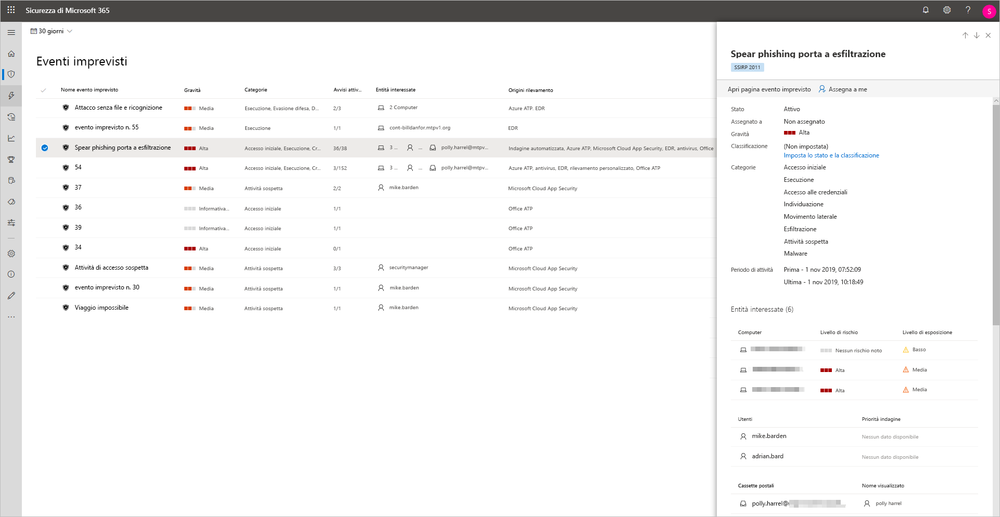
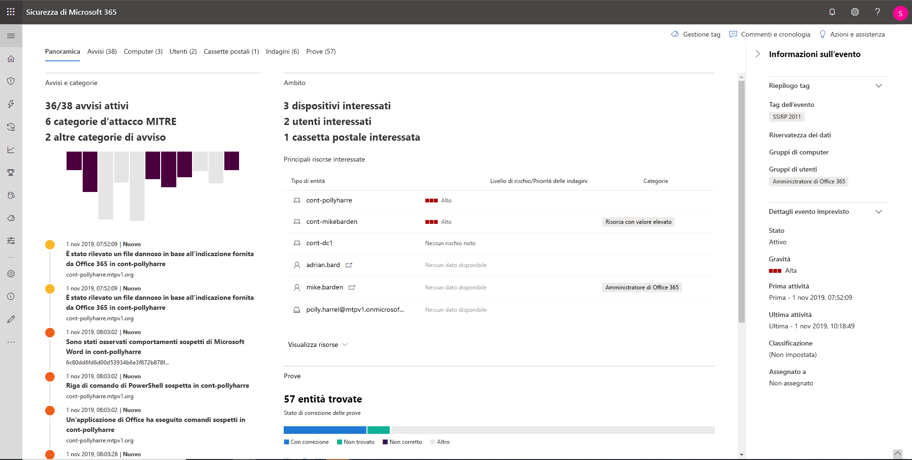
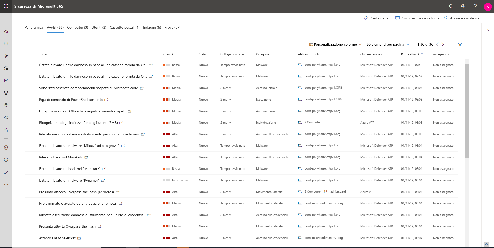
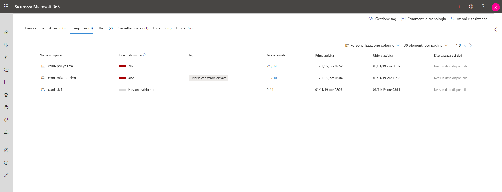
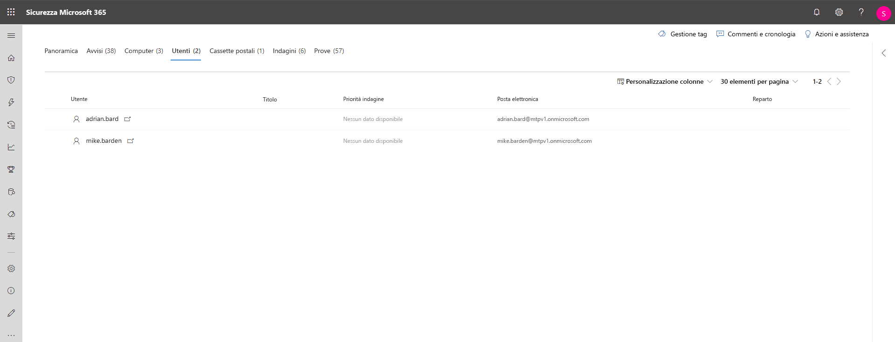
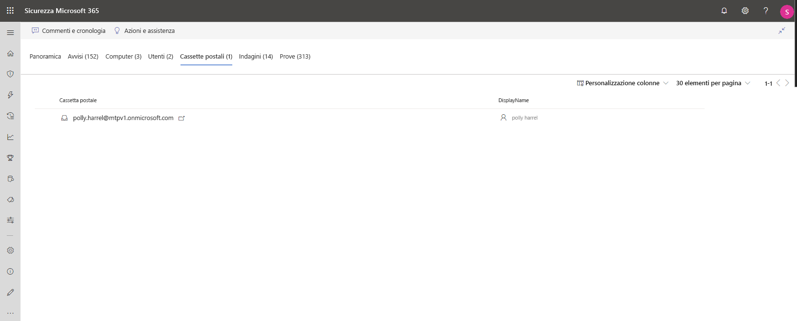
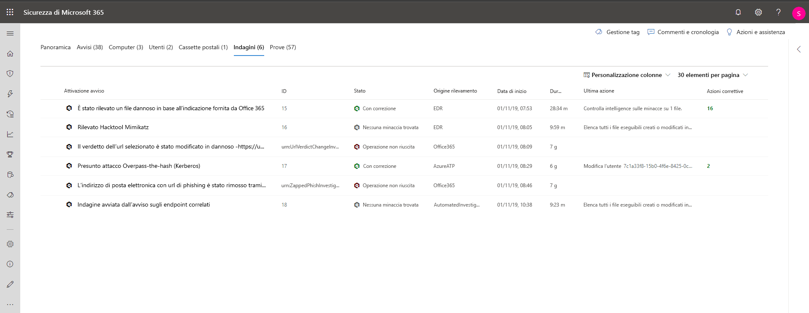
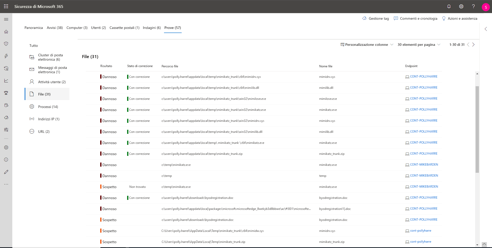

# Analisi degli incidenti in Microsoft Threat Protection

**Si applica a:**
- Microsoft Threat Protection

[!include[Prerelease information](prerelease.md)]

Microsoft Threat Protection aggrega tutti gli avvisi, le risorse, le indagini e le prove relativi a dispositivi, utenti e cassette postali per avere un quadro generale della portata dell'attacco. 

Analizzare gli avvisi che riguardano la rete, comprenderne il significato e raccogliere le prove associate agli incidenti consente di poter elaborare un piano di correzione efficace. 

## Analizzare un incidente

1. Selezionare un incidente dalla relativa coda.   Così facendo si apre un pannello laterale che fornisce un'anteprima delle informazioni importanti come stato, gravità, categorie ed entità interessate.

    

2. Selezionare **Apri pagina dell'incidente**.   L'azione apre la pagina dell'incidente in cui è possibile trovare maggiori informazioni relative all'incidente come dettagli, commenti, azioni e schede (panoramica, avvisi, dispositivi, utenti, indagini, prove).

3. Esaminare gli avvisi, i dispositivi, gli utenti e altre entità coinvolte nell'incidente.

## Panoramica dell'incidente 
La pagina di panoramica offre un quadro generale sugli elementi principali relativi all'incidente a cui prestare attenzione.

Le categorie di attacco consentono di visualizzare in termini numerici il livello di avanzamento dell'attacco rispetto alla kill chain. Come per altri prodotti di sicurezza Microsoft, Microsoft Threat Protection è conforme al framework [MITRE ATT&CK&trade;](https://attack.mitre.org/). 

La sezione relativa all'ambito fornisce un elenco delle principali risorse interessate che fanno parte di questo incidente. Se sono presenti informazioni specifiche su una determinata risorsa (ad esempio, il livello di rischio, la priorità dell'indagine e i contrassegni sulle attività) saranno disponibili in questa sezione.

La sequenza temporale degli avvisi permette di visualizzare un'anteprima dell'ordine cronologico in cui si sono verificati gli avvisi, nonché i motivi per cui tali avvisi sono collegati a questo incidente.

Infine, la sezione delle prove fornisce un riepilogo di quanti artefatti diversi sono stati inclusi nell'incidente e il relativo stato di correzione, in modo da poter identificare immediatamente se sono necessarie azioni da parte dell'utente. 

Questa panoramica può essere utile nella valutazione iniziale dell'incidente fornendo dati analitici relativi alle principali caratteristiche dell'incidente di cui l'utente dovrebbe essere a conoscenza. 

## Avvisi 
È possibile visualizzare tutti gli avvisi relativi all'incidente e altre informazioni correlate come gravità, entità che sono state coinvolte nell'avviso, origine degli avvisi (Azure ATP, Microsoft Defender ATP, Office 365 ATP) e il motivo per cui sono stati collegati. 

Per impostazione predefinita, gli avvisi sono ordinati cronologicamente, per consentire di visualizzare prima come si è svolto l'attacco nel tempo. Facendo clic su ciascun avviso, si accederà alla relativa pagina di avviso in cui è possibile condurre un'indagine approfondita di tale avviso. 

## Dispositivi 
Nella scheda dei dispositivi sono elencati tutti i dispositivi in cui vengono visualizzati gli avvisi relativi all'incidente. 

Facendo clic sul nome del computer in cui si è verificato l'attacco, si accede alla relativa pagina in cui è possibile visualizzare gli avvisi che sono stati attivati e gli eventi correlati forniti per facilitare l'indagine. 

Selezionando la scheda della sequenza temporale è possibile scorrere la sequenza temporale del computer e visualizzare tutti gli eventi e i comportamenti osservati sul computer in ordine cronologico, intervallati dagli avvisi generati. 

## Utenti 
Visualizzare gli utenti che sono stati identificati come parte di un determinato incidente, oppure relativi a esso. 

Facendo clic sul nome utente si accede alla pagina di Cloud App Security dell'utente dove è possibile condurre ulteriori indagini.

## Cassette postali
Analizzare tutte le cassette postali che sono state identificate come parte di un relativo incidente, oppure relative a esso. Per svolgere ulteriori indagini, selezionando l'avviso relativo alla posta elettronica si aprirà Office 365 Advanced Threat Protection in cui è possibile intraprendere azioni correttive.

## Indagini
Selezionare **Indagini** per visualizzare tutte le indagini automatizzate attivate dagli avvisi in questo incidente. Le indagini eseguiranno azioni correttive o attenderanno l'approvazione delle azioni da parte dell'analista, a seconda di come sono state configurate le indagini automatizzate per l'esecuzione in Microsoft Defender ATP e Office 365 Advanced Threat Protection.

Selezionare un'indagine per accedere alla pagina dei dettagli dell'indagine per ottenere informazioni complete sull'indagine e sullo stato della correzione. Se sono presenti azioni in attesa di approvazione come parte dell'indagine, verranno visualizzate nella scheda Azioni in sospeso. È necessario quindi agire come parte della correzione dell'incidente.

## Prove
Microsoft Threat Protection esamina automaticamente tutti gli eventi supportati dagli incidenti e le entità sospette negli avvisi, fornendo risposte automatiche e informazioni su importanti file, processi, servizi, messaggi di posta elettronica e altro ancora. Ciò consente di rilevare e bloccare rapidamente le potenziali minacce nell'incidente. 

Ognuna delle entità analizzate sarà contrassegnata con un verdetto (Dannosa, Sospetta, Pulita) e uno stato di correzione. Ciò consente di comprendere lo stato di correzione dell'intero incidente e quali sono i prossimi passi che possono essere presi per porre ulteriore rimedio.

## Argomenti correlati
- [Panoramica sugli incidenti](incidents-overview.md)
- [Assegnare priorità agli incidenti](incident-queue.md)
- [Gestire gli incidenti](manage-incidents.md)