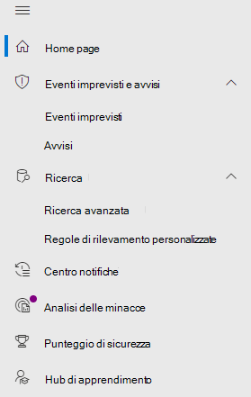

# Microsoft Defender per Endpoint nel Centro sicurezza Microsoft 365Microsoft Defender for Endpoint in the Microsoft 365 security center

[!INCLUDE [Microsoft 365 Defender rebranding](../includes/microsoft-defender.md)]

[!INCLUDE [Prerelease](../includes/prerelease.md)]

**Si applica a:****Applies to:**

- [Microsoft 365 DefenderMicrosoft 365 Defender](https://go.microsoft.com/fwlink/?linkid=2118804)
- [Microsoft Defender ATPMicrosoft Defender for Endpoint](https://go.microsoft.com/fwlink/p/?linkid=2146631)
- [Microsoft Defender per Office 365Microsoft Defender for Office 365](https://go.microsoft.com/fwlink/?linkid=2148715)

Il Centro sicurezza [Microsoft 365](overview-security-center.md) migliorato combina funzionalità di sicurezza che proteggono, rilevano, analizzano e rispondono alle minacce di posta [https://security.microsoft.com](https://security.microsoft.com) elettronica, collaborazione, identità e dispositivi.The improved [Microsoft 365 security center](overview-security-center.md) at [https://security.microsoft.com](https://security.microsoft.com) combines security capabilities that protect, detect, investigate, and respond to email, collaboration, identity, and device threats. Questo centro sicurezza riunisce le funzionalità dei portali di sicurezza Microsoft esistenti, tra cui Microsoft Defender Security Center e il Centro sicurezza & conformità di Office 365.This security center brings together functionality from existing Microsoft security portals, including Microsoft Defender Security Center and the Office 365 Security & Compliance center.

Se si ha familiarità con Microsoft Defender Security Center, questo articolo illustra alcune delle modifiche e dei miglioramenti apportati al Centro sicurezza Microsoft 365 migliorato.If you're familiar with the Microsoft Defender Security Center, this article helps describe some of the changes and improvements in the improved Microsoft 365 security center. Tuttavia, esistono alcuni elementi nuovi e aggiornati di cui tenere conto.However there are some new and updated elements to be aware of.

Da sempre, [Microsoft Defender Security Center](https://docs.microsoft.com/windows/security/threat-protection/microsoft-defender-atp/portal-overview) è stato la sede di Microsoft Defender per Endpoint.Historically, the [Microsoft Defender Security Center](https://docs.microsoft.com/windows/security/threat-protection/microsoft-defender-atp/portal-overview) has been the home for Microsoft Defender for Endpoint. I team di sicurezza aziendali lo hanno usato per monitorare e rispondere agli avvisi di potenziali attività avanzate di minacce persistenti o violazioni dei dati.Enterprise security teams have used it to monitor and help responding to alerts of potential advanced persistent threat activity or data breaches. Per ridurre il numero di portali, il Centro sicurezza Microsoft 365 sarà la sede per il monitoraggio e la gestione della sicurezza tra identità, dati, dispositivi, app e infrastruttura Microsoft.To help reduce the number of portals, the Microsoft 365 security center will be the home for monitoring and managing security across your Microsoft identities, data, devices, apps, and infrastructure.

> [!IMPORTANT]
> Ciò che viene visualizzato nel Centro sicurezza Microsoft 365 dipende dagli abbonamenti correnti.What you see in the Microsoft 365 security center depends on your current subscriptions. Ad esempio, se non si dispone di una licenza per Microsoft Defender per Office 365, la sezione E-mail & Collaboration non verrà visualizzata.For example, if you don't have a license for Microsoft Defender for Office 365, then the Email & Collaboration section will not be shown.

Dai un'occhiata al Centro sicurezza Microsoft 365 migliorato: [https://security.microsoft.com](https://security.microsoft.com) .Take a look at the improved Microsoft 365 security center: [https://security.microsoft.com](https://security.microsoft.com).

Ulteriori informazioni sui vantaggi: Panoramica del Centro sicurezza [Microsoft 365](overview-security-center.md)Learn more about the benefits: [Overview of the Microsoft 365 security center](overview-security-center.md)

## ModificheWhat's changed

Questa tabella è un riferimento rapido alle modifiche tra Microsoft Defender Security Center e il Centro sicurezza Microsoft 365.This table is a quick reference of the changes between the Microsoft Defender Security Center and the Microsoft 365 security center.

### Avvisi e azioniAlerts and actions

|**Area****Area**  |**Descrizione della modifica****Description of change**  |
|---------|---------|
| [Eventi imprevisti & avvisiIncidents & alerts](incidents-overview.md)  | Nel Centro sicurezza Microsoft 365 è possibile gestire eventi imprevisti e avvisi in tutti gli endpoint, la posta elettronica e le identità.In the Microsoft 365 security center, you can manage incidents and alerts across all of your endpoints, email, and identities. L'esperienza è stata convergente per aiutarti a trovare più facilmente gli eventi correlati.We've converged the experience to help you find related events more easily. Per ulteriori informazioni, vedere [Panoramica degli eventi imprevisti.](incidents-overview.md)For more information, see [Incidents Overview](incidents-overview.md).   |
| [RicercaHunting](advanced-hunting-overview.md)  |  La modifica delle regole di rilevamento personalizzate create in Microsoft Defender for Endpoint per includere le tabelle di identità e di posta elettronica le sposta automaticamente in Microsoft 365 Defender.Modifying custom detection rules created in Microsoft Defender for Endpoint to include identity and email tables automatically moves them to Microsoft 365 Defender. Gli avvisi corrispondenti verranno visualizzati anche in Microsoft 365 Defender.Their corresponding alerts will also appear in Microsoft 365 Defender. Per ulteriori informazioni su queste modifiche, vedere Eseguire [la migrazione di regole di rilevamento personalizzate.](advanced-hunting-migrate-from-mdatp.md#migrate-custom-detection-rules)For more details about these changes, read [Migrate custom detection rules](advanced-hunting-migrate-from-mdatp.md#migrate-custom-detection-rules). La `DeviceAlertEvents` tabella per la ricerca avanzata non è disponibile in Microsoft 365 Defender.The `DeviceAlertEvents` table for advanced hunting isn't available in Microsoft 365 Defender. Per eseguire query sulle informazioni sugli avvisi specifici del dispositivo in Microsoft 365 Defender, è possibile utilizzare le tabelle e le tabelle per contenere ulteriori informazioni provenienti da un `AlertInfo` `AlertEvidence` set di origini diverse.To query device-specific alert information in Microsoft 365 Defender, you can use the `AlertInfo` and `AlertEvidence` tables to accommodate even more information from a diverse set of sources. Crea la query correlata al dispositivo successiva seguendo [query di scrittura senza DeviceAlertEvents.](advanced-hunting-migrate-from-mdatp.md#write-queries-without-devicealertevents)Craft your next device-related query by following [Write queries without DeviceAlertEvents](advanced-hunting-migrate-from-mdatp.md#write-queries-without-devicealertevents).|
|[Centro notificheAction center](mtp-action-center.md)    | Elenca le azioni in sospeso e completate eseguite in seguito a indagini automatizzate e azioni di correzione.Lists pending and completed actions that were taken following automated investigations and remediation actions. In precedenza, il centro notifiche nel Microsoft Defender Security Center ha elencato le azioni in sospeso e completate per le azioni di correzione eseguite solo sui dispositivi, mentre le indagini automatizzate hanno elencato avvisi e stato.Formerly, the Action center in the Microsoft Defender Security Center listed pending and completed actions for remediation actions taken on devices only, while Automated investigations listed alerts and status. Nel centro sicurezza Microsoft 365 migliorato, il centro notifiche riunisce le azioni di correzione e le indagini su posta elettronica, dispositivi e utenti, il tutto in un'unica posizione.In the  improved Microsoft 365 security center, the Action center brings together remediation actions and investigations across email, devices, and users—all in one location.  |
| [Analisi delle minacceThreat analytics](threat-analytics.md) |  Spostato nella parte superiore della barra di spostamento per semplificarne l'individuazione e l'utilizzo.Moved to the top of the navigation bar for easier discovery and use. Ora include informazioni sulle minacce sia per gli endpoint che per la posta elettronica e la collaborazione.Now includes threat information for both endpoints and email and collaboration.    |

### EndpointEndpoints

|**Area****Area**  |**Descrizione della modifica****Description of change**  |
|---------|---------|
|RicercaSearch   |  Invece di essere nell'intestazione, la barra di ricerca di Microsoft Defender for Endpoint si sposta sotto la sezione Endpoint.Instead of being in the heading, Microsoft Defender for Endpoint search bar is moving under the Endpoints section. È possibile continuare a cercare dispositivi, file, utenti, URL, INDIRIZZI IP, vulnerabilità, software e suggerimenti.You can continue to search for devices, files, users, URLs, IPs, vulnerabilities, software, and recommendations.  |
|[DashboardDashboard](https://docs.microsoft.com/windows/security/threat-protection/microsoft-defender-atp/security-operations-dashboard)   |  Questo è il dashboard delle operazioni di sicurezza.This is your security operations dashboard. Vedi una panoramica del numero di avvisi attivi attivati, dei dispositivi a rischio, degli utenti a rischio e del livello di gravità per avvisi, dispositivi e utenti.See an overview of how many active alerts were triggered, which devices are at risk, which users are at risk, and severity level for alerts, devices, and users. Puoi anche vedere se alcuni dispositivi hanno problemi con i sensori, l'integrità complessiva del servizio e come sono stati rilevati eventuali avvisi non risolti.You can also see if any devices have sensor issues, your overall service health, and how any unresolved alerts were detected. |
|Inventario dei dispositiviDevice inventory | Nessuna modifica.No changes. |
|[Gestione delle vulnerabilitàVulnerability management](https://docs.microsoft.com/windows/security/threat-protection/microsoft-defender-atp/next-gen-threat-and-vuln-mgt)    |    Il nome è stato abbreviato per adattarsi al riquadro di spostamento.Name was shortened to fit in the navigation pane. È la stessa della sezione di gestione delle minacce e delle vulnerabilità, con tutte le pagine sottostanti.It's the same as the threat and vulnerability management section, with all the pages underneath.     |
| Partner e APIPartners and APIs | Nessuna modifica.No changes. |
| Valutazioni & esercitazioniEvaluations & tutorials    |     Nuove funzionalità di test e apprendimento.New testing and learning capabilities.     |
| Gestione della configurazioneConfiguration management   |  Nessuna modifica.No changes.  |

> [!NOTE]
> **L'analisi e la correzione automatiche** sono ora parte degli incidenti.**Automatic investigation and remediation** is now a part of  incidents. È possibile visualizzare gli eventi di analisi e correzione automatizzati nella **scheda Incident > Investigation.**You can see Automated  investigation and remediation events in the **Incident > Investigation** tab.

### Accesso e creazione di reportAccess and reporting

|**Area****Area**  |**Descrizione della modifica****Description of change**  |
|---------|---------|
| ReportReports  | Vedere i report per gli endpoint e la collaborazione & posta elettronica, tra cui protezione dalle minacce, integrità e conformità dei dispositivi e dispositivi vulnerabili.See reports for endpoints and email & collaboration, including Threat protection, Device health and compliance, and Vulnerable devices. |
| SanitàHealth  |  Attualmente si collega alla pagina "Integrità dei servizi" nell'interfaccia di amministrazione di [Microsoft 365.](https://admin.microsoft.com/)Currently links out to the "Service health" page in the [Microsoft 365 admin center](https://admin.microsoft.com/). |
| ImpostazioniSettings |  Gestire le impostazioni per il Centro sicurezza Microsoft 365, Microsoft 365 Defender, endpoint, collaborazione & posta elettronica, identità e individuazione dei dispositivi.Manage your settings for the Microsoft 365 security center, Microsoft 365 Defender, Endpoints, Email & collaboration, Identities, and Device discovery.   |

## Funzionalità e spostamento per la sicurezza di Microsoft 365Microsoft 365 security navigation and capabilities

Lo spostamento a sinistra, o barra di avvio veloce, avrà un aspetto familiare.The left navigation, or quick launch bar, will look familiar. Tuttavia, in questo Centro sicurezza sono presenti alcuni elementi nuovi e aggiornati.However, there are some new and updated elements in this security center.

### Eventi imprevisti e avvisiIncidents and alerts

Riunisce la gestione degli eventi imprevisti e degli avvisi nella posta elettronica, nei dispositivi e nelle identità.Brings together incident and alert management across your email, devices, and identities. La pagina di avviso fornisce il contesto completo dell'avviso combinando i segnali di attacco per creare una storia dettagliata.The alert page provides full context to the alert by combining attack signals to construct a detailed story. Una nuova esperienza unificata ora riunisce una visualizzazione coerente degli avvisi tra i carichi di lavoro.A new, unified experience now brings together a consistent view of alerts across workloads. È possibile esaminare, analizzare e intraprendere rapidamente un'azione efficace.You can quickly triage, investigate, and take effective action.

- [Altre informazioni sugli incidentiLearn more about incidents](incidents-overview.md)
- [Ulteriori informazioni sulla gestione degli avvisiLearn more about managing alerts](investigate-alerts.md)

### RicercaHunting

Cercare in modo proattivo minacce, malware e attività dannose tra gli endpoint, le cassette postali di Office 365 e altro ancora utilizzando [query di ricerca avanzata.](advanced-hunting-overview.md)Proactively search for threats, malware, and malicious activity across your endpoints, Office 365 mailboxes, and more by using [advanced hunting queries](advanced-hunting-overview.md). Queste query potenti possono essere utilizzate per individuare ed esaminare gli indicatori di minaccia e le entità per le minacce note e potenziali.These powerful queries can be used to locate and review threat indicators and entities for both known and potential threats.

[Le regole di rilevamento](custom-detection-rules.md) personalizzate possono essere create da query di ricerca avanzata che consentono di controllare in modo proattivo gli eventi che potrebbero essere indicativi dell'attività di violazione e dei dispositivi non configurati correttamente.[Custom detection rules](custom-detection-rules.md) can be built from advanced hunting queries to help you proactively watch for events that might be indicative of breach activity and misconfigured devices.

### Centro notificheAction center

Il centro notifiche mostra le indagini create dalle funzionalità di analisi e risposta automatizzate.Action center shows you the investigations created by automated investigation and response capabilities. Questa riparazione automatica in Microsoft 365 Defender può aiutare i team di sicurezza rispondendo automaticamente a eventi specifici.This automated, self-healing in Microsoft 365 Defender can help security teams by automatically responding to specific events.

[Altre informazioni sul centro notificheLearn more about the Action center](mtp-action-center.md)

### Threat AnalyticsThreat Analytics

Ottenere informazioni sulle minacce da esperti ricercatori di sicurezza Microsoft.Get threat intelligence from expert Microsoft security researchers. Threat Analytics consente ai team di sicurezza di essere più efficienti quando affrontano le minacce emergenti.Threat Analytics helps security teams be more efficient when facing emerging threats. Threat Analytics include:Threat Analytics includes:

- Rilevamenti e mitigazioni correlati alla posta elettronica da Microsoft Defender per Office 365.Email-related detections and mitigations from Microsoft Defender for Office 365. Questo si aggiunge ai dati dell'endpoint già disponibili da Microsoft Defender per Endpoint.This is in addition to the endpoint data already available from Microsoft Defender for Endpoint.
- Visualizzazione degli eventi imprevisti correlata alle minacce.Incidents view related to the threats.
- Esperienza migliorata per l'identificazione rapida e l'utilizzo di informazioni utilizzabili nei report.Enhanced experience for quickly identifying and using actionable information in the reports.

È possibile accedere all'analisi delle minacce dalla barra di spostamento in alto a sinistra nel Centro sicurezza Microsoft 365 o da una scheda del dashboard dedicata che mostra le principali minacce per l'organizzazione.You can access threat analytics either from the upper left navigation bar in the Microsoft 365 security center, or from a dedicated dashboard card that shows the top threats for your organization.

Ulteriori informazioni su come tenere traccia [e rispondere alle minacce emergenti con l'analisi delle minacce](https://docs.microsoft.com/microsoft-365/security/mtp/threat-analytics)Learn more about how to [track and respond to emerging threats with threat analytics](https://docs.microsoft.com/microsoft-365/security/mtp/threat-analytics)

### Sezione EndpointEndpoints section

Visualizzare e gestire la sicurezza degli endpoint nell'organizzazione.View and manage the security of endpoints in your organization. Se hai usato Microsoft Defender Security Center, avrà un aspetto familiare.If you've used the Microsoft Defender Security Center, it will look familiar.

### Access e reportAccess and reports

Visualizzare i report, modificare le impostazioni e modificare i ruoli utente.View reports, change your settings, and modify user roles.

### Connessioni API SIEMSIEM API connections

Se usi [l'API Defender for Endpoint SIEM,](/windows/security/threat-protection/microsoft-defender-atp/enable-siem-integration.md)puoi continuare a farlo.If you use the [Defender for Endpoint SIEM API](/windows/security/threat-protection/microsoft-defender-atp/enable-siem-integration.md), you can continue to do so. Sono stati aggiunti nuovi collegamenti nel payload dell'API che puntano alla pagina di avviso o alla pagina degli eventi imprevisti nel portale di sicurezza di Microsoft 365.We’ve added new links on the API payload that point to the alert page or the incident page in the Microsoft 365 security portal. I nuovi campi API includono LinkToMTP e IncidentLinkToMTP.New API fields include LinkToMTP and IncidentLinkToMTP. Per altre informazioni, vedere [Reindirizzamento degli account da Microsoft Defender per Endpoint al Centro sicurezza Microsoft 365.](/microsoft-365/security/mtp/microsoft-365-security-mde-redirection.md)For more information, see [Redirecting accounts from Microsoft Defender for Endpoint to the Microsoft 365 security center](/microsoft-365/security/mtp/microsoft-365-security-mde-redirection.md).

### Avvisi tramite posta elettronicaEmail alerts

Puoi continuare a usare gli avvisi di posta elettronica per Defender per Endpoint.You can continue to use email alerts for Defender for Endpoint. Abbiamo aggiunto nuovi collegamenti nei messaggi di posta elettronica che puntano alla pagina di avviso o alla pagina degli eventi imprevisti nel Centro sicurezza Microsoft 365.We've added new links in the emails that point to the alert page or the incident page in the Microsoft 365 security center. Per altre informazioni, vedere [Reindirizzamento degli account da Microsoft Defender per Endpoint al Centro sicurezza Microsoft 365.](/microsoft-365/security/mtp/microsoft-365-security-mde-redirection.md)For more information, see [Redirecting accounts from Microsoft Defender for Endpoint to the Microsoft 365 security center](/microsoft-365/security/mtp/microsoft-365-security-mde-redirection.md).

## Informazioni correlateRelated information

- [Centro sicurezza Microsoft 365Microsoft 365 security center](overview-security-center.md)
- [Microsoft Defender per Endpoint nel Centro sicurezza Microsoft 365Microsoft Defender for Endpoint in the Microsoft 365 security center](microsoft-365-security-center-mde.md)
- [Reindirizzamento degli account da Microsoft Defender per Endpoint al Centro sicurezza Microsoft 365Redirecting accounts from Microsoft Defender for Endpoint to the Microsoft 365 security center](microsoft-365-security-mde-redirection.md)
