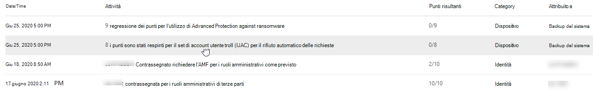
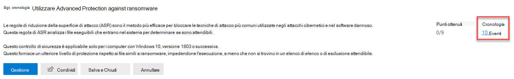
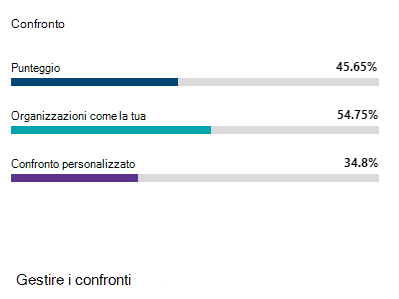
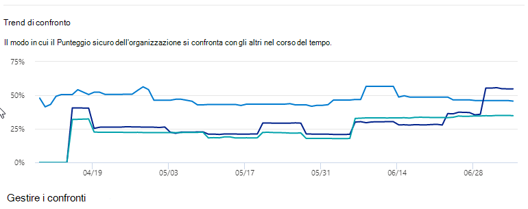

# Tenere traccia della cronologia di Microsoft Secure Score e raggiungere gli obiettiviTrack your Microsoft Secure Score history and meet goals

[!INCLUDE [Microsoft 365 Defender rebranding](../includes/microsoft-defender.md)]

[Microsoft Secure Score è](microsoft-secure-score.md) una misura della posizione di sicurezza di un'organizzazione, con un numero maggiore che indica più azioni di miglioramento intraprese.[Microsoft Secure Score](microsoft-secure-score.md) is a measurement of an organization's security posture, with a higher number indicating more improvement actions taken. È disponibile nel Centro sicurezza https://security.microsoft.com/securescore [Microsoft 365.](overview-security-center.md)It can be found at https://security.microsoft.com/securescore in the [Microsoft 365 security center](overview-security-center.md).

## Ottenere informazioni approfondite sull'attività che ha influenzato il punteggioGain insights into activity that has affected your score

Visualizzare un grafico del punteggio dell'organizzazione nel tempo nella **scheda** Cronologia.View a graph of your organization's score over time in the **History** tab.

Sotto il grafico è riportato un elenco di tutte le azioni eseguite nell'intervallo di tempo selezionato e dei relativi attributi, ad esempio i punti risultanti e la categoria.Below the graph is a list of all the actions taken in the selected time range and their attributes, such as resulting points and category. È possibile personalizzare un intervallo di date e filtrare in base alla categoria.You can customize a date range and filter by category.

Se si seleziona l'azione di miglioramento associata a un'attività, verrà visualizzato il riquadro a comparsa dell'azione di miglioramento completo.If you select the improvement action associated with an activity, the full improvement action flyout will appear.

Per visualizzare tutta la cronologia per quella specifica azione di miglioramento, selezionare il collegamento della cronologia nel riquadro a comparsa.To view all history for that specific improvement action, select the history link in the flyout.

## Individuare le tendenze e impostare gli obiettiviDiscover trends and set goals

Nella scheda **Metriche & tendenze** sono disponibili diversi grafici e grafici per offrire maggiore visibilità sulle tendenze e impostare gli obiettivi.In the **Metrics & trends** tab, there are several graphs and charts to give you more visibility into trends and set goals. È possibile impostare l'intervallo di date per l'intera pagina di visualizzazioni.You can set the date range for the whole page of visualizations. Le visualizzazioni includono:The visualizations include:

* **Area secure score:** personalizzata in base alle definizioni e gli obiettivi dell'organizzazione di intervalli di punteggi validi, validi e non validi.**Your Secure Score zone** - Customized based on your organization's goals and definitions of good, okay, and bad score ranges.
* **Tendenza di regressione:** sequenza temporale di punti che sono stati regressi a causa delle modifiche apportate alla configurazione, all'utente o al dispositivo.**Regression trend** - A timeline of points that have regressed because of configuration, user, or device changes.  
* **Tendenza di confronto:** confronto tra secure score dell'organizzazione e altri nel tempo.**Comparison trend** - How your organization's Secure Score compares to others' over time. Questa visualizzazione può includere linee che rappresentano la media del punteggio delle organizzazioni con un numero di postazioni simile e una visualizzazione di confronto personalizzata che è possibile impostare.This view can include lines representing the score average of organizations with similar seat count and a custom comparison view that you can set.
* **Tendenza di accettazione dei rischi** - Sequenza temporale delle azioni di miglioramento contrassegnate come "rischio accettato".**Risk acceptance trend** - Timeline of improvement actions marked as "risk accepted."
* **Modifiche al** punteggio : numero di punti ottenuti, punti regressi e modifiche al punteggio nell'intervallo di date specificato.**Score changes** - The number of points achieved, points regressed, and changes to your score in the specified date range.

### Confrontare il punteggio con organizzazioni come la tuaCompare your score to organizations like yours

Esistono due posizioni in cui vedere il confronto tra il punteggio e le organizzazioni simili a te.There are two places to see how your score compares to organizations that are similar to you. In entrambi i grafici è possibile selezionare Gestisci confronti **per** visualizzare e modificare le informazioni dell'organizzazione.In both charts, you can select **Manage comparisons** to view and edit your organization's information. È inoltre possibile creare un confronto personalizzato in base al settore, alle dimensioni dell'organizzazione, alle licenze e alle aree geografiche.You can also create a custom comparison based on industry, organization size, licenses, and regions.

#### Grafico a barre di confrontoComparison bar chart

Il grafico a barre di confronto è la **scheda** Panoramica. Posizionare il puntatore del mouse sul grafico per visualizzare il punteggio e segnare le opportunità.The comparison bar chart is the **Overview** tab. Hover over the chart to view the score and score opportunity. I dati di confronto sono anonimi, quindi non sappiamo esattamente quali altri tenant sono in combinazione.The comparison data is anonymized so we don’t know exactly which others tenants are in the mix.

- **Organizzazioni come la** tua : un punteggio medio di altri tenant (purché abbiamo almeno cinque o più tenant da confrontare) che si qualificano con i criteri seguenti:**Organizations like yours**: an average score of other tenants (provided we have at least five or more tenants to compare) that qualify with the following criteria:
    1. Stesso settoreSame industry
    2. Stesse dimensioni dell'organizzazioneSame organization size
    3. Tutte le aree geograficheAll regions
    4. I prodotti Microsoft usati sono simili all'80%Microsoft products used are 80% similar
    5. Opportunità (punteggio massimo che può essere ottenuto dalla licenza corrente) entro un intervallo del 20% dal tenantOpportunity (max score that can be achieved by current license) within a 20% range from your tenant

- **Confronto personalizzato**: deve essere configurato selezionando **Gestisci** confronto in base ai criteri seguenti:**Custom Comparison**: needs to be set up by selecting **Manage Comparison** based on the following criteria:
    1. Settori selezionatiSelected industry(s)
    2. Dimensioni dell'organizzazione selezionateSelected organization size(s)
    3. Aree selezionateSelected region(s)
    4. Licenze selezionateSelected license(s)
    5. I prodotti Microsoft usati sono simili all'80%Microsoft products used are 80% similar
    6. Opportunità (punteggio massimo che può essere ottenuto dalla licenza corrente) entro un intervallo del 20% dal tenantOpportunity (max score that can be achieved by current license) within a 20% range from your tenant

Se è stata effettuata una selezione personalizzata, ma i risultati hanno meno di cinque altri tenant che è possibile confrontare, verrà visualizzato "Non disponibile a causa di dati limitati".If you've made a custom selection but the results have less than five other tenants that we can compare against, you'll see “Not available due to limited data”.

#### Tendenza di confrontoComparison trend

Nella scheda **Metriche & tendenze,** visualizzare il confronto tra Secure Score dell'organizzazione e quello degli altri utenti nel tempo.In the **Metrics & trends** tab, view how your organization's Secure Score compares to others' over time.

## L'opinione degli utenti è importanteWe want to hear from you

In caso di problemi, contattaci pubblicando il post nella community [sicurezza, privacy & conformità.](https://techcommunity.microsoft.com/t5/Security-Privacy-Compliance/bd-p/security_privacy)If you have any issues, let us know by posting in the [Security, Privacy & Compliance](https://techcommunity.microsoft.com/t5/Security-Privacy-Compliance/bd-p/security_privacy) community. Stiamo monitorando la community e forniremo assistenza.We're monitoring the community and will provide help.

## Risorse correlateRelated resources

- [Panoramica di Microsoft Secure ScoreMicrosoft Secure Score overview](microsoft-secure-score.md)
- [Valutazione del profilo di sicurezzaAssess your security posture](microsoft-secure-score-improvement-actions.md)
- [Novità in arrivoWhat's coming](microsoft-secure-score-whats-coming.md)
- [NovitàWhat's new](microsoft-secure-score-whats-new.md)
