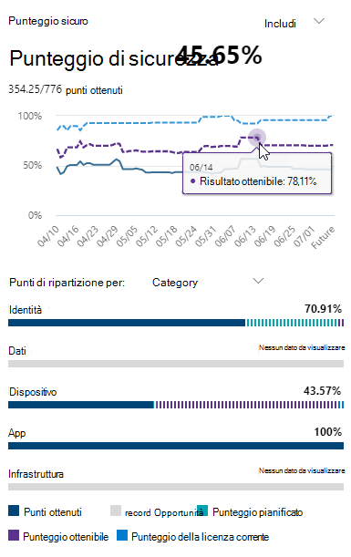

# Valutare la propria posizione di sicurezza con Microsoft Secure Score

[!INCLUDE [Microsoft 365 Defender rebranding](../includes/microsoft-defender.md)]

Microsoft Secure Score è una misura della posizione di sicurezza di un'organizzazione, con un numero superiore che indica altre azioni di miglioramento eseguite. Può essere trovato https://security.microsoft.com/securescore nel [Centro sicurezza Microsoft 365](overview-security-center.md).

Per facilitare le informazioni necessarie più rapidamente, le azioni di miglioramento di Microsoft sono organizzate in gruppi:

* Identity (Azure Active Directory accounts & Roles)
* Dispositivo (Microsoft Defender per endpoint, noto come [Microsoft Secure Score for Devices](https://docs.microsoft.com/windows/security/threat-protection/microsoft-defender-atp/tvm-microsoft-secure-score-devices))
* App (applicazioni di posta elettronica e cloud, tra cui Office 365 e Microsoft cloud app Security)

>[!NOTE]
>Nella versione recente di Microsoft Secure Score è stato rilasciato un modello di Punteggio migliorato che rendeva Microsoft Secure Score incompatibile temporaneamente con identità Secure score e l'API del grafico. [Visualizza dettagli](microsoft-secure-score-whats-new.md)

Nella pagina Panoramica dei punteggi di Microsoft Secure, vedere come vengono divisi i punti tra questi gruppi e quali sono i punti disponibili. È anche possibile ottenere una panoramica completa del punteggio totale, della tendenza storica del Punteggio sicuro con i confronti di benchmark e delle azioni di miglioramento prioritarie che possono essere intraprese per migliorare il punteggio.

## Controllare il punteggio corrente

Per controllare il punteggio corrente, passare alla pagina Panoramica di Microsoft Secure score e cercare il riquadro che indica il **Punteggio sicuro**. Il Punteggio verrà visualizzato come percentuale, insieme al numero di punti ottenuti al di fuori dei punti totali possibili.

Inoltre, se si seleziona il pulsante **Includi** accanto alla partitura, è possibile scegliere diverse visualizzazioni del punteggio. Queste visualizzazioni di Punteggio diverse verranno visualizzate nel grafico sul riquadro dei punteggi e nel grafico di scomposizione dei punti.

Di seguito sono riportati i punteggi che è possibile aggiungere alla visualizzazione del punteggio complessivo per fornire un'immagine più completa del Punteggio globale:

- **Punteggio pianificato**: Mostra il Punteggio proiettato quando vengono completate le azioni pianificate
- **Punteggio della licenza corrente**: Mostra il punteggio che può essere ottenuto con la licenza Microsoft corrente
- **Punteggio ottenibile**: Mostra il punteggio che è possibile ottenere con le licenze Microsoft e l'accettazione del rischio corrente

Questa visualizzazione è l'aspetto che avrà se sono state incluse tutte le visualizzazioni possibili del Punteggio:

## Eseguire un'azione per migliorare il Punteggio

Nella scheda **azioni di miglioramento** sono elencati i suggerimenti per la sicurezza che indirizzano le possibili superfici di attacco. Include anche il relativo stato (per risolvere, pianificare, rischi accettati, risolti tramite terze parti, risolti tramite attenuazione alternativa e completata). È possibile eseguire la ricerca, il filtro e il raggruppamento di tutte le azioni di miglioramento.  

### Classificazione

La classificazione si basa sul numero di punti da raggiungere, la difficoltà di implementazione, l'impatto dell'utente e la complessità. Le azioni di miglioramento più elevate hanno un numero elevato di punti rimanenti con difficoltà bassa, impatto dell'utente e complessità.

### Visualizzare i dettagli dell'azione di miglioramento

Quando si seleziona un'azione di miglioramento specifica, viene visualizzato un riquadro a comparsa a pagina intera.  

Per completare l'azione, sono disponibili alcune opzioni:

- Selezionare **Gestisci** per passare alla schermata di configurazione e apportare le modifiche. Sarà quindi possibile ottenere i punti che l'azione vale, visibili nel volo. I punti generalmente richiedono circa 24 ore per l'aggiornamento.

- Selezionare **Condividi** per copiare il collegamento diretto all'azione di miglioramento. È inoltre possibile scegliere la piattaforma per la condivisione del collegamento, ad esempio la posta elettronica, Microsoft teams, Microsoft Planner o ServiceNow. La selezione di ServiceNow consente di creare un ticket di modifica che sarà visibile in ServiceNow e nella Home page del Centro sicurezza Microsoft 365. Per ulteriori informazioni, vedere [Microsoft 365 Security Center e ServiceNow Integration](tickets-security-center.md).

Aggiungere **Note** per tenere sotto controllo i progressi o qualsiasi altra operazione che si desidera sottoporre a commento. Se si aggiungono i propri **tag** all'azione di miglioramento, è possibile filtrare in base a tali tag.

### Scegliere uno stato di azione di miglioramento

Scegliere eventuali stati e note di record specifiche per l'azione di miglioramento.

- **Per risolvere** il caso, si riconosce che l'azione di miglioramento è necessaria e si prevede di affrontarla a un certo punto in futuro. Questo stato si applica anche alle azioni rilevate come parzialmente, ma non completamente completate.
- **Pianificato** -esistono piani concreti per completare l'azione di miglioramento.
- **Risk accepted** -la sicurezza deve essere sempre bilanciata con l'usabilità e non ogni raccomandazione funzionerà per l'ambiente. In questo caso, è possibile scegliere di accettare il rischio o il rischio restante e non applicare l'azione di miglioramento. Non verranno assegnati punti, ma l'azione non sarà più visibile nell'elenco delle azioni di miglioramento. È possibile visualizzare questa azione nella cronologia o annullarla in qualsiasi momento.
- **Risolti tramite terze parti** e **risolti tramite attenuazione alternativa** -l'azione di miglioramento è già stata affrontata da un'applicazione o un software di terze parti o da uno strumento interno. Si otterranno i punti che il valore dell'azione vale, in modo che il Punteggio rifletta meglio la posizione di sicurezza complessiva. Se uno strumento di terze parti o interno non è più in grado di coprire il controllo, è possibile scegliere un altro stato. Tenere presente che Microsoft non avrà visibilità sulla completezza dell'implementazione se l'azione di miglioramento è contrassegnata come uno di questi Stati.

#### Azioni di miglioramento della gestione della vulnerabilità & di minacce

Per le azioni di miglioramento nella categoria "dispositivo", non è possibile scegliere stato. Al contrario, si verrà indirizzati ai consigli di sicurezza associati per la [gestione della vulnerabilità e delle minacce](https://docs.microsoft.com/windows/security/threat-protection/microsoft-defender-atp/tvm-security-recommendation) nel [Centro sicurezza Microsoft Defender](https://docs.microsoft.com/windows/security/threat-protection/microsoft-defender-atp/use) per eseguire l'azione. L'eccezione scelta e la giustificazione scritta saranno specifiche per il portale. Non sarà presente nel portale Microsoft Secure score.

#### Azioni di miglioramento completate

Le azioni di miglioramento hanno uno stato "completato" una volta che sono stati raggiunti tutti i punti possibili per l'azione di miglioramento. Le azioni di miglioramento completate sono state confermate anche se Microsoft Data e non è possibile modificare lo stato.

### Valutare le informazioni e esaminare l'impatto dell'utente

La sezione chiamata **a colpo d'occhio** vi dirà la categoria, gli attacchi che può proteggere e il prodotto.

L' **impatto dell'utente** è quello che gli utenti sperimenteranno se l'azione di miglioramento è stata adottata e **gli utenti interessati** sono quelli che avranno un impatto.

### Implementazione dell'azione di miglioramento

La sezione **implementazione** Visualizza eventuali prerequisiti, passaggi successivi per completare l'azione di miglioramento, lo stato di implementazione corrente dell'azione di miglioramento e qualsiasi altro collegamento per ulteriori informazioni.

I prerequisiti includono tutte le licenze necessarie o le azioni che devono essere completate prima che venga affrontata l'azione di miglioramento. Assicurarsi di disporre di un numero sufficiente di posti nella licenza per completare l'azione di miglioramento e che tali licenze vengano applicate agli utenti necessari.  

## L'opinione degli utenti è importante

In caso di problemi, inviaci informazioni scrivendo nella community [sicurezza, Privacy & conformità](https://techcommunity.microsoft.com/t5/Security-Privacy-Compliance/bd-p/security_privacy) . Si sta monitorando la community e viene fornita assistenza.

## Risorse correlate

- [Panoramica del Punteggio Microsoft Secure](microsoft-secure-score.md)
- [Monitorare la cronologia dei punteggi di Microsoft Secure e raggiungere gli obiettivi](microsoft-secure-score-history-metrics-trends.md)
- [Novità in arrivo](microsoft-secure-score-whats-coming.md)
- [Novità](microsoft-secure-score-whats-new.md)
