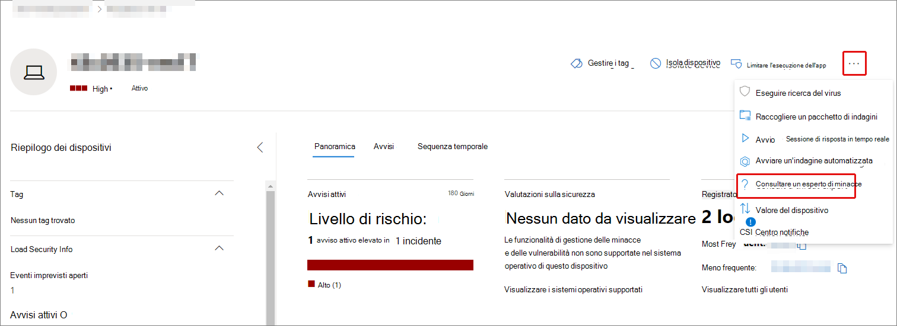
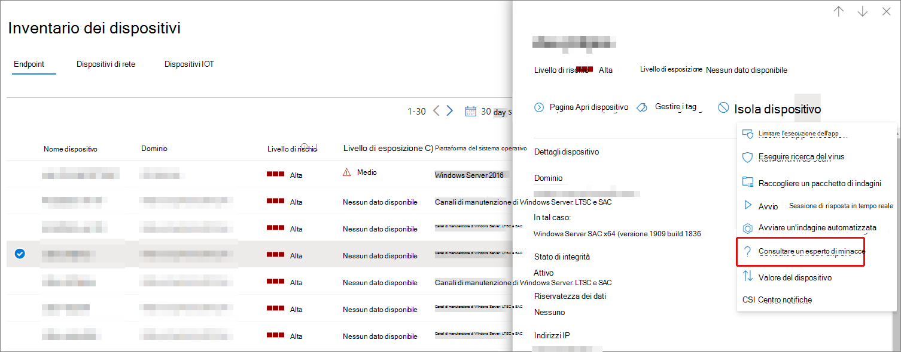
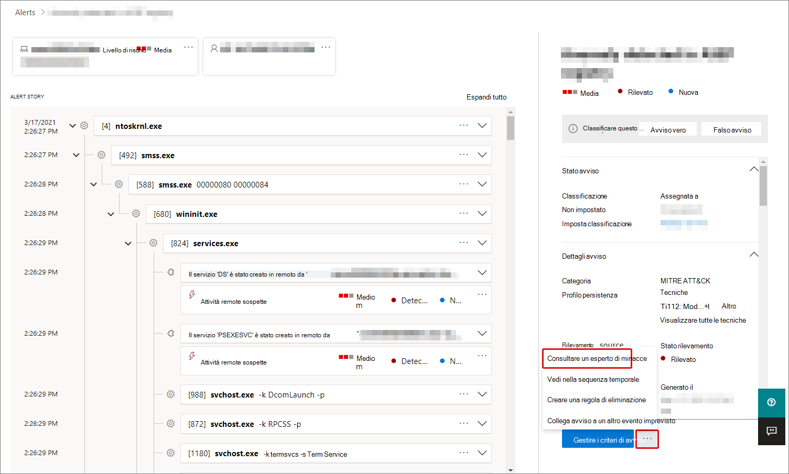

# Microsoft Threat Experts in Microsoft 365 panoramica

[!INCLUDE [Microsoft 365 Defender rebranding](../includes/microsoft-defender.md)]

**Si applica a:**

- [Microsoft 365 Defender](https://go.microsoft.com/fwlink/?linkid=2118804)
- [Microsoft Defender ATP](https://go.microsoft.com/fwlink/p/?linkid=2154037)

[!INCLUDE [Prerelease](../includes/prerelease.md)]

Microsoft Threat Experts - Le notifiche di attacco mirato sono un servizio di ricerca delle minacce gestito. Dopo aver applicato e accettato, riceverai notifiche di attacco mirate da esperti di minacce Microsoft, in modo da non perdere le minacce critiche per l'ambiente. Queste notifiche consentono di proteggere gli endpoint, la posta elettronica e le identità dell'organizzazione.
Microsoft Threat Experts: gli esperti su richiesta ti consentono di ricevere consigli esperti sulle minacce che l'organizzazione deve affrontare. È possibile contattare l'utente per ottenere assistenza sulle minacce che l'organizzazione deve affrontare. È disponibile come servizio di sottoscrizione.

## Richiedere l'Microsoft Threat Experts - Notifiche di attacco mirato

> [!IMPORTANT]
> Prima di candidarti, assicurati di discutere i requisiti di idoneità per Microsoft Threat Experts – Notifiche di attacco mirato con il tuo provider di servizi tecnici Microsoft e il team di account.

Se hai già Microsoft Defender per Endpoint e Microsoft 365 Defender, puoi richiedere le notifiche di attacco mirato Microsoft Threat Experts - Microsoft Threat Experts tramite il portale Microsoft 365 Defender. Vai a Impostazioni > endpoint > generale > **funzionalità avanzate > Microsoft Threat Experts – Notifiche di** attacco mirato e seleziona **Applica**. Per [una descrizione completa, vedere Configure Microsoft Threat Experts capabilities.](./configure-microsoft-threat-experts.md)

Dopo l'approvazione dell'applicazione, inizierai a ricevere notifiche di attacco mirate ogni volta che gli esperti delle minacce rilevano una minaccia per l'ambiente.

## Sottoscrizione a Microsoft Threat Experts - Esperti su richiesta

Contattare il proprio rappresentante Microsoft per sottoscrivere esperti su richiesta.  Per [informazioni dettagliate, vedere Configure Microsoft Threat Experts capabilities.](./configure-microsoft-threat-experts.md)

## Ricevere una notifica di attacco mirato

La Microsoft Threat Experts – Notifica di attacco mirato offre una ricerca proattiva delle minacce più importanti per la rete. I nostri esperti di minacce sono a caccia di intrusioni umane, attacchi hands-on-keyboard e attacchi avanzati, ad esempio cyberspionage. Queste notifiche verranno mostrate come nuovo avviso. Il servizio di ricerca gestito include:

- Monitoraggio e analisi delle minacce, riducendo i tempi di attività e i rischi per l'azienda
- Intelligenza artificiale addestrata da Hunter per individuare e mirare sia gli attacchi noti che le minacce emergenti
- Identificazione dei rischi più pertinenti, aiutando i SOC a massimizzarne l'efficacia
- Aiuta a individuare le compromissione dell'ambito e a fornire il più possibile il contesto che può essere rapidamente fornito per consentire una risposta SOC rapida.

## Collaborare con esperti su richiesta

È inoltre possibile contattare esperti di minacce Microsoft direttamente all'interno del portale Microsoft 365 sicurezza, per una risposta rapida e accurata alle minacce.  Gli esperti possono fornire informazioni approfondite per comprendere meglio le minacce complesse che l'organizzazione potrebbe affrontare.  Consultare un esperto per:

- Raccogliere informazioni aggiuntive sugli avvisi e gli eventi imprevisti, incluse le cause radice e l'ambito
- Acquisire chiarezza in dispositivi, avvisi o eventi imprevisti sospetti e ottenere i passaggi successivi se si trova di fronte a un utente malintenzionato avanzato
- Determinare i rischi e le protezioni disponibili correlati a minacce, campagne o tecniche di attacco emergenti

L'opzione **Consulta un esperto di minacce** è disponibile in diversi punti del portale:

- <i>**Menu Azioni pagina dispositivo**</i> 

- <i>**Menu a comparsa pagina inventario dispositivi**</i> 

- <i>**Menu a comparsa della pagina Avvisi**</i> 

- <i>**Menu Azioni pagina eventi imprevisti**</i> 

- <i>**Pagina inventario eventi imprevisti**</i> 

> [!NOTE]
> Se si dispone di un abbonamento al supporto Premier mappato alla licenza di Microsoft Defender per Office 365, è possibile tenere traccia dello stato dei casi esperti su richiesta tramite Microsoft Services Hub.

Guarda questo video per una breve panoramica dell'hub dei servizi Microsoft.

> [!VIDEO https://www.microsoft.com/videoplayer/embed/RE4pk9f]

## Vedere anche

- [Configurare Microsoft Threat Experts funzionalità](./configure-microsoft-threat-experts.md)
