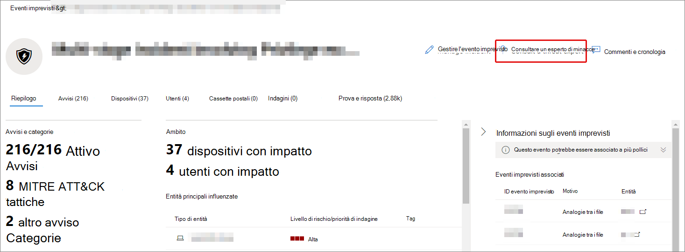

# Panoramica di Microsoft Threat Experts in Microsoft 365Microsoft Threat Experts in Microsoft 365 overview

[!INCLUDE [Microsoft 365 Defender rebranding](../includes/microsoft-defender.md)]

**Si applica a:****Applies to:**

- [Microsoft 365 DefenderMicrosoft 365 Defender](https://go.microsoft.com/fwlink/?linkid=2118804)
- [Microsoft Defender ATPMicrosoft Defender for Endpoint](https://go.microsoft.com/fwlink/p/?linkid=2154037)

[!INCLUDE [Prerelease](../includes/prerelease.md)]

Esperti di minacce Microsoft- Notifiche di attacco mirato è un servizio di ricerca delle minacce gestito.Microsoft Threat Experts - Targeted Attack Notifications is a managed threat hunting service. Dopo aver applicato e accettato, riceverai notifiche di attacco mirate da esperti di minacce Microsoft, in modo da non perdere le minacce critiche per l'ambiente.Once you apply and are accepted, you'll receive targeted attack notifications from Microsoft threat experts, so you won't miss critical threats to your environment. Queste notifiche consentono di proteggere gli endpoint, la posta elettronica e le identità dell'organizzazione.These notifications will help you protect your organization's endpoints, email, and identities.
Esperti microsoft sulle minacce: gli esperti su richiesta ti consentono di ricevere consigli esperti sulle minacce che l'organizzazione sta affrontando.Microsoft Threat Experts – Experts on Demand lets you get expert advice about threats your organization is facing. È possibile contattare l'utente per ottenere assistenza sulle minacce che l'organizzazione deve affrontare.You can reach out for help on threats your organization is facing. È disponibile come servizio di sottoscrizione.It's available as a subscription service.

## Richiedere gli esperti di Microsoft Threat – Notifiche di attacco miratoApply for Microsoft Threat Experts – Targeted Attack Notifications

> [!IMPORTANT]
> Prima di candidarti, assicurati di discutere i requisiti di idoneità per gli esperti di Microsoft Threat – Notifiche di attacco mirato con il tuo provider di servizi tecnici Microsoft e il team di account.Before you apply, make sure to discuss the eligibility requirements for Microsoft Threat Experts – Targeted Attack Notifications  with your Microsoft Technical Service provider and account team.

Se hai già Microsoft Defender per Endpoint e Microsoft 365 Defender, puoi richiedere gli esperti di Microsoft Threat – Notifiche di attacco mirato tramite il portale di Microsoft 365 Defender.If you already have Microsoft Defender for Endpoint and Microsoft 365 Defender, you can apply for Microsoft Threat Experts – Targeted Attack Notifications through their Microsoft 365 Defender portal. Vai a Impostazioni > endpoint > generale > funzionalità avanzate **> Microsoft Threat Experts – Notifiche di** attacco mirato e seleziona **Applica.**Go to **Settings > Endpoints > General > Advanced features > Microsoft Threat Experts – Targeted Attack Notifications**, and select **Apply**. Per [una descrizione completa, vedere](./configure-microsoft-threat-experts.md) Configure Microsoft Threat Experts capabilities.See [Configure Microsoft Threat Experts capabilities](./configure-microsoft-threat-experts.md) for a full description.

Dopo l'approvazione dell'applicazione, inizierai a ricevere notifiche di attacco mirate ogni volta che gli esperti delle minacce rilevano una minaccia per l'ambiente.Once your application is approved, you'll start receiving targeted attack notifications whenever Threat Experts detect a threat to your environment.

## Abbonati a Microsoft Threat Experts - Esperti su richiestaSubscribe to Microsoft Threat Experts - Experts on Demand

Contattare il proprio rappresentante Microsoft per sottoscrivere esperti su richiesta.Contact your Microsoft representative to subscribe to Experts on Demand.  Per [informazioni dettagliate, vedere Configure Microsoft Threat Experts capabilities.](./configure-microsoft-threat-experts.md)See [Configure Microsoft Threat Experts capabilities](./configure-microsoft-threat-experts.md) for full details.

## Ricevere una notifica di attacco miratoReceive targeted attack notification

La funzionalità Microsoft Threat Experts – Targeted Attack Notification offre una ricerca proattiva delle minacce più importanti per la rete.The Microsoft Threat Experts – Targeted Attack Notification capability provides proactive hunting for the most important threats to your network. I nostri esperti di minacce sono a caccia di intrusioni umane, attacchi hands-on-keyboard e attacchi avanzati, ad esempio cyberspionage.Our threat experts hunt for human adversary intrusions, hands-on-keyboard attacks, and advanced attacks, such as cyberespionage. Queste notifiche verranno mostrate come nuovo avviso.These notifications will show up as a new alert. Il servizio di ricerca gestito include:The managed hunting service includes:

- Monitoraggio e analisi delle minacce, riducendo i tempi di attività e i rischi per l'aziendaThreat monitoring and analysis, reducing dwell time and the risk to your business
- Intelligenza artificiale addestrata da Hunter per individuare e mirare sia gli attacchi noti che le minacce emergentiHunter-trained artificial intelligence to discover and target both known attacks and emerging threats
- Identificazione dei rischi più pertinenti, aiutando i SOC a massimizzarne l'efficaciaIdentification of the most pertinent risks, helping SOCs maximize their effectiveness
- Aiuta a individuare le compromissione dell'ambito e a fornire il più possibile il contesto che può essere rapidamente fornito per consentire una risposta SOC rapida.Help scoping compromises and providing as much context as can be quickly delivered to enable a swift SOC response.

## Collaborare con esperti su richiestaCollaborate with experts on demand

È inoltre possibile contattare esperti di minacce Microsoft direttamente all'interno del portale di sicurezza di Microsoft 365 per una risposta alle minacce rapida e accurata.You can also contact Microsoft threat experts from directly inside the Microsoft 365 security portal, for a swift and accurate threat response.  Gli esperti possono fornire informazioni approfondite per comprendere meglio le minacce complesse che l'organizzazione potrebbe affrontare.Experts can provide insight to better understand the complex threats your organization may face.  Consultare un esperto per:Consult an expert to:

- Raccogliere informazioni aggiuntive sugli avvisi e gli eventi imprevisti, incluse le cause radice e l'ambitoGather additional information on alerts and incidents, including root causes and scope
- Acquisire chiarezza in dispositivi, avvisi o eventi imprevisti sospetti e ottenere i passaggi successivi se si trova di fronte a un utente malintenzionato avanzatoGain clarity into suspicious devices, alerts, or incidents and get next steps if faced with an advanced attacker
- Determinare i rischi e le protezioni disponibili correlati a minacce, campagne o tecniche di attacco emergentiDetermine risks and available protections related to threat actors, campaigns, or emerging attacker techniques

L'opzione **Consulta un esperto di minacce** è disponibile in diversi punti del portale:The option to **Consult a threat expert** is available in several places throughout the portal:

- <i>**Menu Azioni pagina dispositivo**</i><i>**Device page actions menu**</i> 

- <i>**Menu a comparsa pagina inventario dispositivi**</i><i>**Device inventory page flyout menu**</i> 

- <i>**Menu a comparsa della pagina Avvisi**</i><i>**Alerts page flyout menu**</i> 

- <i>**Menu Azioni pagina eventi imprevisti**</i><i>**Incidents page actions menu**</i> 

- <i>**Pagina inventario eventi imprevisti**</i><i>**Incidents inventory page**</i> 

> [!NOTE]
> Se si dispone di un abbonamento al supporto Premier mappato alla licenza di Microsoft Defender per Office 365, è possibile tenere traccia dello stato dei casi esperti su richiesta tramite Hub dei servizi Microsoft.If you have Premier Support subscription mapped to your Microsoft Defender for Office 365 license, you can track the status of your Experts on Demand cases through Microsoft Services Hub.

Guarda questo video per una breve panoramica dell'hub dei servizi Microsoft.Watch this video for a quick overview of the Microsoft Services Hub.

> [!VIDEO https://www.microsoft.com/videoplayer/embed/RE4pk9f]

## Vedere ancheSee also

- [Configurare le funzionalità di Microsoft Threat ExpertsConfigure Microsoft Threat Experts capabilities](./configure-microsoft-threat-experts.md)
