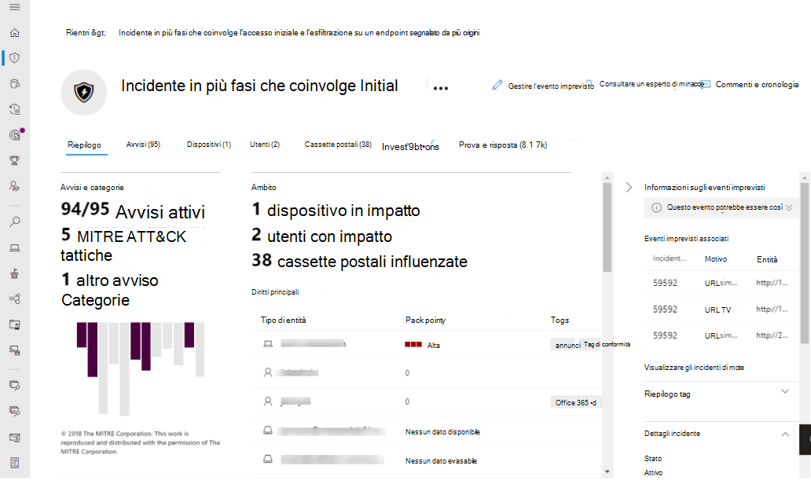
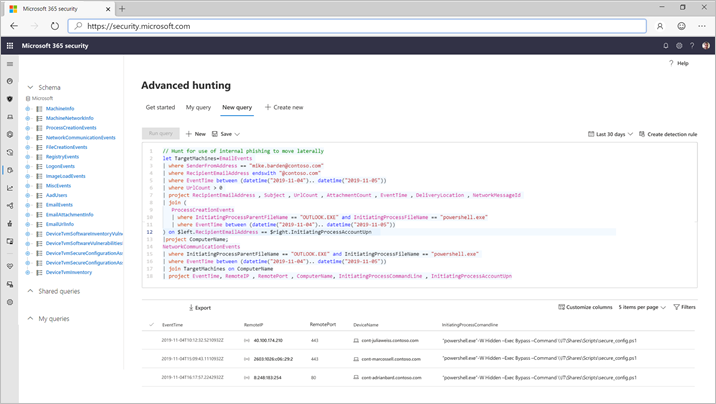

# Microsoft Threat Protection

**Si applica a:**
- Microsoft Threat Protection

[!INCLUDE [Prerelease information](../includes/prerelease.md)]

Microsoft Threat Protection è una famiglia di prodotti per la difesa dell'organizzazione che si integra in modo nativo tra endpoint, identità, posta elettronica e applicazioni per rilevare, prevenire, indagare e rispondere automaticamente agli attacchi più sofisticati.  

Con la soluzione integrata Microsoft Threat Protection, i professionisti della sicurezza possono unire i segnali di minaccia che ognuno di questi prodotti riceve e determina l'intero ambito e l'impatto della minaccia; come è entrata nell'ambiente, cosa ne è interessata e come sta attualmente influenzando l'organizzazione. Microsoft Threat Protection interviene automaticamente per impedire o arrestare l'attacco e la correzione automatica delle cassette postali, degli endpoint e delle identità degli utenti.  

Microsoft Threat Protection Suite protegge: 
- **Endpoint con Microsoft Defender ATP** -Microsoft Defender ATP è una piattaforma endpoint unificata per la protezione preventiva, il rilevamento post-violazione, l'analisi automatizzata e la risposta. 
- La **posta elettronica e la collaborazione con office 365 ATP** -Office 365 ATP salvaguarda la propria organizzazione dalle minacce dannose poste da messaggi di posta elettronica, collegamenti (URL) e strumenti di collaborazione. 
- **Identità con Azure ATP e Azure ad Identity Protection** -Azure ATP utilizza segnali di Active Directory per identificare, rilevare ed esaminare le minacce avanzate, le identità compromesse e le azioni Insider dannose indirizzate alla propria organizzazione. 
- **Applicazioni con Microsoft cloud app Security** -Microsoft cloud app Security è una soluzione cross-SaaS completa che introduce una visibilità profonda, forti controlli dati e una protezione avanzata dalle minacce per le app cloud. 

Microsoft Threat Protection ' s Unique cross-product layer aumenta i singoli componenti della famiglia per:
- Contribuire alla protezione contro gli attacchi e coordinare le risposte difensive attraverso la famiglia attraverso la condivisione dei segnali e le azioni automatiche
- Raccontare la storia completa dell'attacco tra avvisi di prodotto, comportamenti e contesto per i team di sicurezza unendo i dati su avvisi, eventi sospetti e risorse interessate a' incidenti '
- Automatizzare la risposta al compromesso mediante l'attivazione della correzione automatica per le risorse interessate tramite la correzione automatica
- Consentire ai team di sicurezza di eseguire la ricerca di minacce dettagliate ed effettive tra endpoint e dati di Office

  
Evento incrociato tra i prodotti (panoramica)

 
Tutti gli avvisi correlati tra i prodotti della suite correlati tra loro in un singolo incidente (visualizzazione avvisi)

 
Caccia basata su query in cima alla posta elettronica e ai dati non elaborati dell'endpoint

Caratteristiche di Microsoft Threat Protection Cross-Product include: 
- **Riquadro singolo tra prodotti di vetro** -centrale visualizzare tutte le informazioni per i rilevamenti, le risorse interessate, le azioni automatizzate eseguite e le evidenze correlate in una singola coda e in un unico riquadro in [Security.Microsoft.com](https://security.microsoft.com). 
- **Coda degli incidenti combinati** -per aiutare i professionisti della sicurezza a concentrarsi su ciò che è critico, assicurando che l'ambito di attacco completo, le risorse interessate e le azioni di correzione automatizzate vengano raggruppate e riemerse in modo tempestivo. 
- **Risposta automatica alle minacce** : le informazioni di minacce critiche sono condivise in tempo reale tra i prodotti Microsoft Threat Protection per impedire la progressione di un attacco. Ad esempio, se un file dannoso viene rilevato su un endpoint protetto da Microsoft Defender ATP, incaricherà Office 365 ATP di analizzare e rimuovere il file da tutti i messaggi di posta elettronica. Il file verrà bloccato a vista dall'intera famiglia di prodotti Microsoft 365 Security.
- **Autoguarigione per i dispositivi compromessi, le identità degli utenti e le cassette postali** -Microsoft Threat Protection utilizza le azioni automatiche ai e i PlayBook per correggere le risorse interessate di nuovo in uno stato sicuro. Microsoft Threat Protection utilizza le funzionalità di correzione automatica dei prodotti della famiglia per garantire che tutte le risorse interessate a un evento imprevisto vengano automaticamente rimediate laddove possibile.
- **Cross-product Threat Hunting** -i team di sicurezza possono sfruttare le proprie conoscenze organizzative esclusive per cercare segni di compromesso creando query personalizzate sui dati non elaborati raccolti dai vari prodotti di protezione. Microsoft Threat Protection fornisce l'accesso basato su query a 30 giorni di segnali RAW cronologici e dati di avviso tra endpoint e dati ATP di Office 365. 

<h2>Servizi Microsoft Threat Protection
</h2>
<table><tr><td>
<b><a href="https://docs.microsoft.com/windows/security/threat-protection/microsoft-defender-atp/microsoft-defender-advanced-threat-protection"><b>Protezione avanzata dalle minacce di Microsoft Defender</b>
</a></td>
<td>
<b><a href="https://docs.microsoft.com/office365/securitycompliance/office-365-atp"><b>Protezione avanzata dalle minacce di Office 365</b>
</a></td>
<td>
<b><a href="https://docs.microsoft.com/azure-advanced-threat-protection/"><b>Protezione avanzata dalle minacce di Azure</b></a>
</td>
<td>
<b><a href="https://docs.microsoft.com/cloud-app-security/"><b>Sicurezza delle app di Microsoft Cloud</b></a>
</td>
</tr>
</table>
 

## Per iniziare
I clienti che dispongono di Microsoft 365 E5 o di una licenza equivalente possono usare Microsoft Threat Protection. Per iniziare, abilitare il servizio nel centro sicurezza Microsoft 365 all' [Security.Microsoft.com](https://security.microsoft.com). Per ulteriori informazioni, vedere:
- [Requisiti relativi alle licenze](prerequisites.md#licensing-requirements)
- [Attivare Microsoft Threat Protection](mtp-enable.md)
