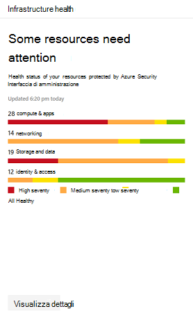

# Monitoraggio e creazione di report delle app nel centro sicurezza Microsoft 365

[!INCLUDE [Microsoft 365 Defender rebranding](../includes/microsoft-defender.md)]

Questi rapporti offrono maggiori informazioni su come vengono utilizzate le app Cloud nell'organizzazione. Include diversi tipi di app, il livello di rischio e gli avvisi.

## Monitorare gli account di posta elettronica a rischio

La **protezione della posta** elettronica Visualizza gli account di posta elettronica a rischio. È possibile selezionare un account per approfondire il Centro sicurezza di Microsoft Defender.

## Monitorare le autorizzazioni delle app concesse dagli utenti

**Cloud app Security-OAuth Apps** elenca le app scoperte dalla protezione delle app cloud alle quali sono state concesse le autorizzazioni per gli utenti. Il catalogo rischi di cloud app Security include oltre 16.000 app valutate con oltre 70 fattori di rischio.

I fattori di rischio partono dalle informazioni generali, ad esempio l'editore app. Si sposta quindi su misure di sicurezza e controlli, ad esempio se l'app supporta la crittografia a riposo o fornisce un registro di controllo delle attività degli utenti.

## Monitorare gli account utente delle app Cloud

Gli **account delle app cloud per gli elenchi di revisione** possono richiedere attenzione.

## Informazioni sulle app Cloud utilizzate

Le **app del cloud scoperte (categorie)** mostrano quali tipi di app vengono utilizzate nell'organizzazione. Si collega al dashboard di individuazione cloud in cloud app Security. Per ulteriori informazioni, vedere [Guida introduttiva: lavorare con le app scoperte](https://docs.microsoft.com/cloud-app-security/discovered-apps).  

## Monitorare la posizione in cui gli utenti accedono alle app Cloud

Le **posizioni delle attività delle app Cloud** mostrano dove gli utenti accedono alle app cloud.

## Monitorare l'integrità dei carichi di lavoro dell'infrastruttura

L' **integrità dell'infrastruttura** Visualizza gli avvisi sullo stato dell'integrità per i carichi di lavoro dell'infrastruttura in Azure Security Center.

Azure Security Center fornisce la gestione della sicurezza unificata e la protezione avanzata dalle minacce tra carichi di lavoro locali e cloud. È possibile raccogliere, cercare e analizzare i dati di sicurezza provenienti da origini diverse, tra cui i firewall e altre soluzioni partner.

Per ulteriori informazioni, vedere [documentazione relativa al centro sicurezza di Azure](https://docs.microsoft.com/azure/security-center/).

