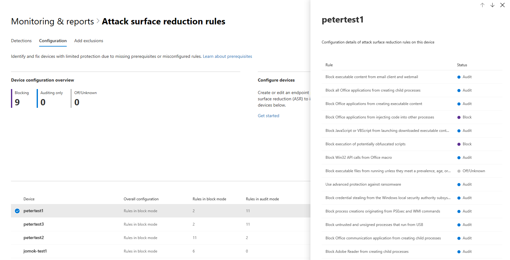

# <a name="device-monitoring-and-reporting-in-the-microsoft-365-security-center"></a><span data-ttu-id="bdac3-104">Monitoraggio e Reporting dei dispositivi nel centro sicurezza Microsoft 365</span><span class="sxs-lookup"><span data-stu-id="bdac3-104">Device monitoring and reporting in the Microsoft 365 security center</span></span>

[!INCLUDE [Microsoft 365 Defender rebranding](../includes/microsoft-defender.md)]


<span data-ttu-id="bdac3-105">Mantenere i dispositivi sicuri, aggiornati e individuare potenziali minacce nel centro sicurezza Microsoft 365.</span><span class="sxs-lookup"><span data-stu-id="bdac3-105">Keep your devices secure, up-to-date, and spot potential threats in the Microsoft 365 security center.</span></span>

## <a name="view-device-alerts"></a><span data-ttu-id="bdac3-106">Visualizzare gli avvisi per i dispositivi</span><span class="sxs-lookup"><span data-stu-id="bdac3-106">View device alerts</span></span>

<span data-ttu-id="bdac3-107">Ottenere avvisi aggiornati sull'attività di violazione e altre minacce sui dispositivi da Microsoft Defender ATP (disponibile con una licenza E5).</span><span class="sxs-lookup"><span data-stu-id="bdac3-107">Get up-to-date alerts about breach activity and other threats on your devices from Microsoft Defender ATP (available with an E5 license).</span></span> <span data-ttu-id="bdac3-108">Microsoft 365 Security Center monitora efficacemente gli avvisi a un livello elevato utilizzando il flusso di lavoro preferito.</span><span class="sxs-lookup"><span data-stu-id="bdac3-108">Microsoft 365 security center effectively monitors these alerts at a high level using your preferred workflow.</span></span>

### <a name="monitor-high-impact-alerts"></a><span data-ttu-id="bdac3-109">Monitorare gli avvisi ad impatto elevato</span><span class="sxs-lookup"><span data-stu-id="bdac3-109">Monitor high-impact alerts</span></span>

<span data-ttu-id="bdac3-110">Ogni avviso del trifosfato di adenosina di Microsoft Defender ha un livello di gravità corrispondente (alto, medio, basso o informativo).</span><span class="sxs-lookup"><span data-stu-id="bdac3-110">Each Microsoft Defender ATP alert has a corresponding severity (high, medium, low, or informational).</span></span> <span data-ttu-id="bdac3-111">Indica un impatto potenziale per la rete se non è presente.</span><span class="sxs-lookup"><span data-stu-id="bdac3-111">It indicates potential impact to your network if left unattended.</span></span>  

<span data-ttu-id="bdac3-112">Utilizzare la scheda **gravità avviso dispositivo** per concentrarsi in modo specifico sugli avvisi più gravi e potrebbe richiedere una risposta immediata.</span><span class="sxs-lookup"><span data-stu-id="bdac3-112">Use the **Device alert severity** card to focus specifically on alerts that are more severe and might require immediate response.</span></span> <span data-ttu-id="bdac3-113">Da questa scheda, è possibile visualizzare altre informazioni sul portale Microsoft Defender Security Center.</span><span class="sxs-lookup"><span data-stu-id="bdac3-113">From this card, you can view more information on the Microsoft Defender Security Center portal.</span></span>


### <a name="understand-sources-of-alerts"></a><span data-ttu-id="bdac3-115">Informazioni sulle origini degli avvisi</span><span class="sxs-lookup"><span data-stu-id="bdac3-115">Understand sources of alerts</span></span>

<span data-ttu-id="bdac3-116">Microsoft Defender ATP utilizza i dati provenienti da una vasta gamma di sensori di sicurezza e fonti di intelligence per generare avvisi.</span><span class="sxs-lookup"><span data-stu-id="bdac3-116">Microsoft Defender ATP leverages data from a broad range of security sensors and intelligence sources to generate alerts.</span></span> <span data-ttu-id="bdac3-117">Ad esempio, è possibile utilizzare le informazioni di rilevamento di Microsoft Defender Antivirus e di terze parti antimalware.</span><span class="sxs-lookup"><span data-stu-id="bdac3-117">For example, it can use detection information from Microsoft Defender Antivirus and third-party antimalware.</span></span> <span data-ttu-id="bdac3-118">È inoltre possibile utilizzare la propria Intelligence di minacce personalizzata fornita tramite l'API del servizio Web.</span><span class="sxs-lookup"><span data-stu-id="bdac3-118">It can also use your own custom threat intelligence provided through the web service API.</span></span>

<span data-ttu-id="bdac3-119">La scheda fonti di **rilevamento avvisi dispositivo** Visualizza la distribuzione degli avvisi per origine.</span><span class="sxs-lookup"><span data-stu-id="bdac3-119">The **Device alert detection** sources card shows the distribution of alerts by source.</span></span> <span data-ttu-id="bdac3-120">Monitorare le attività relative a determinate origini, in particolare le origini personalizzate.</span><span class="sxs-lookup"><span data-stu-id="bdac3-120">Track activity related to certain sources, particularly your custom sources.</span></span> <span data-ttu-id="bdac3-121">È inoltre possibile utilizzare la scheda per concentrarsi sugli avvisi provenienti da sensori che non sono configurati per bloccare automaticamente le attività o i componenti dannosi.</span><span class="sxs-lookup"><span data-stu-id="bdac3-121">You can also use the card to focus on alerts coming from sensors that aren't configured to automatically block malicious activity or components.</span></span>


<span data-ttu-id="bdac3-123">Da questa scheda, è possibile visualizzare altre informazioni sul portale Microsoft Defender Security Center.</span><span class="sxs-lookup"><span data-stu-id="bdac3-123">From this card, you can view more information on the Microsoft Defender Security Center portal.</span></span>

### <a name="understand-the-types-of-threats-that-trigger-alerts"></a><span data-ttu-id="bdac3-124">Comprendere i tipi di minacce che attivano gli avvisi</span><span class="sxs-lookup"><span data-stu-id="bdac3-124">Understand the types of threats that trigger alerts</span></span>

<span data-ttu-id="bdac3-125">Microsoft Defender ATP Ordina ogni avviso in una categoria che rappresenta una determinata fase della catena di attacco o del tipo di componente di minaccia.</span><span class="sxs-lookup"><span data-stu-id="bdac3-125">Microsoft Defender ATP sorts each alert into a category representing a certain stage in the attack chain or type of threat component.</span></span> <span data-ttu-id="bdac3-126">Ad esempio, un'attività di minacce rilevata potrebbe essere categorizzata come "movimento laterale" per indicare che si è verificato un tentativo di raggiungere altri dispositivi sulla rete.</span><span class="sxs-lookup"><span data-stu-id="bdac3-126">For example, a detected threat activity might be categorized as "lateral movement" to indicate there was an attempt to reach other devices on the network.</span></span> <span data-ttu-id="bdac3-127">L'attività è probabile che si verifichi dopo che gli aggressori hanno acquisito un punto di appoggio iniziale.</span><span class="sxs-lookup"><span data-stu-id="bdac3-127">The activity has likely occurred after attackers gained an initial foothold.</span></span> <span data-ttu-id="bdac3-128">Una volta rilevato, un componente di rischio può essere classificato in senso lato come malware o in modo specifico come tipo di minaccia specifico.</span><span class="sxs-lookup"><span data-stu-id="bdac3-128">When detected, a threat component might be classified broadly as malware or specifically as a specific threat type.</span></span> <span data-ttu-id="bdac3-129">Le specifiche includono ransomware, furto di credenziali o altri tipi di software dannoso o indesiderato.</span><span class="sxs-lookup"><span data-stu-id="bdac3-129">Specifics include ransomware, credential stealing, or other types of malicious or unwanted software.</span></span>

<span data-ttu-id="bdac3-130">La scheda **categorie minacce dispositivo** Visualizza la distribuzione degli avvisi in queste categorie.</span><span class="sxs-lookup"><span data-stu-id="bdac3-130">The **Device threat categories** card shows the distribution of alerts into these categories.</span></span> <span data-ttu-id="bdac3-131">Utilizzare queste informazioni per identificare le attività di minacce, ad esempio i tentativi di furto di credenziali, che in genere hanno un impatto maggiore rispetto ai tentativi di social engineering.</span><span class="sxs-lookup"><span data-stu-id="bdac3-131">Use this information to identify threat activity, such as credential theft attempts, that usually have higher impact than social engineering attempts.</span></span> <span data-ttu-id="bdac3-132">È inoltre possibile eseguire il monitoraggio di minacce potenzialmente distruttive come ransomware.</span><span class="sxs-lookup"><span data-stu-id="bdac3-132">You can also to monitor for potentially destructive threats like ransomware.</span></span>


### <a name="monitor-active-alerts"></a><span data-ttu-id="bdac3-134">Monitorare gli avvisi attivi</span><span class="sxs-lookup"><span data-stu-id="bdac3-134">Monitor active alerts</span></span>

<span data-ttu-id="bdac3-135">La scheda **stato avviso dispositivo** indica il numero di avvisi che non sono stati risolti e potrebbe richiedere attenzione.</span><span class="sxs-lookup"><span data-stu-id="bdac3-135">The **Device alert status** card indicates the number of alerts that haven't been resolved and may require attention.</span></span> <span data-ttu-id="bdac3-136">Da questa scheda, è possibile visualizzare altre informazioni sul portale Microsoft Defender Security Center.</span><span class="sxs-lookup"><span data-stu-id="bdac3-136">From this card, you can view more information on the Microsoft Defender Security Center portal.</span></span>


### <a name="monitor-classification-of-resolved-alerts"></a><span data-ttu-id="bdac3-138">Monitorare la classificazione degli avvisi risolti</span><span class="sxs-lookup"><span data-stu-id="bdac3-138">Monitor classification of resolved alerts</span></span>

<span data-ttu-id="bdac3-139">Durante la risoluzione di un avviso di Microsoft Defender ATP, il personale di sicurezza può specificare se un avviso è stato verificato come:</span><span class="sxs-lookup"><span data-stu-id="bdac3-139">When resolving a Microsoft Defender ATP alert, your security staff can specify whether an alert has been verified as:</span></span>

* <span data-ttu-id="bdac3-140">Un avviso vero che identifica le attività di violazione effettive o i componenti di minaccia</span><span class="sxs-lookup"><span data-stu-id="bdac3-140">A true alert that identifies actual breach activity or threat components</span></span>
* <span data-ttu-id="bdac3-141">Un falso avviso che ha rilevato erroneamente attività normale</span><span class="sxs-lookup"><span data-stu-id="bdac3-141">A false alert that has incorrectly detected normal activity</span></span>

<span data-ttu-id="bdac3-142">La scheda di **classificazione avviso dispositivo** indica se gli avvisi risolti sono stati classificati come avvisi veri o falsi.</span><span class="sxs-lookup"><span data-stu-id="bdac3-142">The **Device alert classification** card shows whether your resolved alerts have been classified as true or false alerts.</span></span> <span data-ttu-id="bdac3-143">Da questa scheda, è possibile visualizzare altre informazioni sul portale Microsoft Defender Security Center.</span><span class="sxs-lookup"><span data-stu-id="bdac3-143">From this card, you can view more information on the Microsoft Defender Security Center portal.</span></span>

<span data-ttu-id="bdac3-144">Nota: in alcuni casi, le informazioni di classificazione non sono disponibili per determinati avvisi.</span><span class="sxs-lookup"><span data-stu-id="bdac3-144">Note: In some cases, classification information is unavailable for certain alerts.</span></span>


### <a name="monitor-determination-of-resolved-alerts"></a><span data-ttu-id="bdac3-146">Monitorare la determinazione degli avvisi risolti</span><span class="sxs-lookup"><span data-stu-id="bdac3-146">Monitor determination of resolved alerts</span></span>

<span data-ttu-id="bdac3-147">Insieme alla classificazione se un avviso è vero o falso durante la risoluzione, il personale di sicurezza può fornire una determinazione.</span><span class="sxs-lookup"><span data-stu-id="bdac3-147">Along with classifying whether an alert is true or false during resolution, your security staff can provide a determination.</span></span> <span data-ttu-id="bdac3-148">Una determinazione indica il tipo di attività normale o dannosa individuata durante la convalida dell'avviso.</span><span class="sxs-lookup"><span data-stu-id="bdac3-148">A determination indicates the type of normal or malicious activity that was found while validating the alert.</span></span>

<span data-ttu-id="bdac3-149">La scheda di **determinazione dell'avviso del dispositivo** Visualizza la determinazione fornita per ogni avviso.</span><span class="sxs-lookup"><span data-stu-id="bdac3-149">The **Device alert determination** card shows the determination provided for each alert.</span></span>

* <span data-ttu-id="bdac3-150">**Apt**: Advanced Persistent Threat, che indica che l'attività rilevata o il componente di minaccia è parte di una sofisticata violazione progettata per ottenere un punto di appoggio nella rete in questione</span><span class="sxs-lookup"><span data-stu-id="bdac3-150">**APT**: advanced persistent threat, indicating that the detected activity or threat component is part of a sophisticated breach designed to gain a foothold in the affected network</span></span>  
* <span data-ttu-id="bdac3-151">**Malware**: file o codice dannoso</span><span class="sxs-lookup"><span data-stu-id="bdac3-151">**Malware**: malicious file or code</span></span>
* <span data-ttu-id="bdac3-152">**Personale di sicurezza**: attività normale eseguita dal personale della sicurezza</span><span class="sxs-lookup"><span data-stu-id="bdac3-152">**Security personnel**: normal activity performed by security staff</span></span>
* <span data-ttu-id="bdac3-153">**Test di sicurezza**: attività o componenti studiati per simulare le minacce effettive e prevedere l'attivazione di sensori di sicurezza e generare avvisi</span><span class="sxs-lookup"><span data-stu-id="bdac3-153">**Security testing**: activity or components designed to simulate actual threats and expected to trigger security sensors and generate alerts</span></span>
* <span data-ttu-id="bdac3-154">**Software indesiderato**: app e altri software che non sono considerati dannosi, ma violano in altro modo i criteri o gli standard di utilizzo accettabili</span><span class="sxs-lookup"><span data-stu-id="bdac3-154">**Unwanted software**: apps and other software that are not considered malicious, but otherwise violate policy or acceptable use standards</span></span>
* <span data-ttu-id="bdac3-155">**Altri**: qualsiasi altra determinazione che non rientra nei tipi forniti</span><span class="sxs-lookup"><span data-stu-id="bdac3-155">**Others**: any other determination that doesn't fall under the provided types</span></span>

<span data-ttu-id="bdac3-156">Da questa scheda, è possibile visualizzare altre informazioni in Microsoft Defender Security Center.</span><span class="sxs-lookup"><span data-stu-id="bdac3-156">From this card, you can view more information in Microsoft Defender Security Center.</span></span>


### <a name="understand-which-devices-are-at-risk"></a><span data-ttu-id="bdac3-158">Comprendere quali dispositivi sono a rischio</span><span class="sxs-lookup"><span data-stu-id="bdac3-158">Understand which devices are at risk</span></span>

<span data-ttu-id="bdac3-159">La **protezione del dispositivo** Visualizza il livello di rischio per i dispositivi.</span><span class="sxs-lookup"><span data-stu-id="bdac3-159">**Device protection** shows the risk level for devices.</span></span> <span data-ttu-id="bdac3-160">Il livello di rischio si basa su fattori quali il tipo e la gravità degli avvisi nel dispositivo.</span><span class="sxs-lookup"><span data-stu-id="bdac3-160">The risk level is based on factors such as the type and severity of alerts on the device.</span></span>


## <a name="monitor-and-report-status-of-intune-managed-devices"></a><span data-ttu-id="bdac3-162">Monitorare e segnalare lo stato dei dispositivi gestiti da Intune</span><span class="sxs-lookup"><span data-stu-id="bdac3-162">Monitor and report status of Intune-managed devices</span></span>

<span data-ttu-id="bdac3-163">Nei rapporti seguenti sono contenuti dati provenienti da dispositivi registrati in Intune.</span><span class="sxs-lookup"><span data-stu-id="bdac3-163">The following reports contain data from devices enrolled in Intune.</span></span> <span data-ttu-id="bdac3-164">I dati dei dispositivi non registrati non sono inclusi.</span><span class="sxs-lookup"><span data-stu-id="bdac3-164">Data from unenrolled devices isn't included.</span></span> <span data-ttu-id="bdac3-165">Solo gli amministratori globali possono visualizzare queste schede.</span><span class="sxs-lookup"><span data-stu-id="bdac3-165">Only Global Administrators can view these cards.</span></span>

<span data-ttu-id="bdac3-166">I dati dei dispositivi registrati di Intune includono:</span><span class="sxs-lookup"><span data-stu-id="bdac3-166">Intune enrolled device data includes:</span></span>

* <span data-ttu-id="bdac3-167">Conformità dispositivo</span><span class="sxs-lookup"><span data-stu-id="bdac3-167">Device compliance</span></span>
* <span data-ttu-id="bdac3-168">Dispositivi con malware attivo</span><span class="sxs-lookup"><span data-stu-id="bdac3-168">Devices with active malware</span></span>
* <span data-ttu-id="bdac3-169">Tipi di malware nei dispositivi</span><span class="sxs-lookup"><span data-stu-id="bdac3-169">Types of malware on devices</span></span>
* <span data-ttu-id="bdac3-170">Malware nei dispositivi</span><span class="sxs-lookup"><span data-stu-id="bdac3-170">Malware on devices</span></span>
* <span data-ttu-id="bdac3-171">Dispositivi con rilevamenti di malware</span><span class="sxs-lookup"><span data-stu-id="bdac3-171">Devices with malware detections</span></span>
* <span data-ttu-id="bdac3-172">Utenti con rilevamenti di malware</span><span class="sxs-lookup"><span data-stu-id="bdac3-172">Users with malware detections</span></span>

### <a name="monitor-device-compliance"></a><span data-ttu-id="bdac3-173">Monitorare la conformità del dispositivo</span><span class="sxs-lookup"><span data-stu-id="bdac3-173">Monitor device compliance</span></span>

<span data-ttu-id="bdac3-174">La **conformità del dispositivo** indica il numero di dispositivi registrati in Intune conformi ai criteri di configurazione.</span><span class="sxs-lookup"><span data-stu-id="bdac3-174">**Device compliance** shows how many devices that are enrolled in Intune comply with configuration policies.</span></span>


### <a name="discover-devices-with-malware-detections"></a><span data-ttu-id="bdac3-176">Individuare i dispositivi con rilevamenti di malware</span><span class="sxs-lookup"><span data-stu-id="bdac3-176">Discover devices with malware detections</span></span>

<span data-ttu-id="bdac3-177">I **rilevamenti di malware** per i dispositivi forniscono il numero di dispositivi registrati di Intune con malware che non è stato completamente risolto.</span><span class="sxs-lookup"><span data-stu-id="bdac3-177">**Device malware detections** provide the number of Intune enrolled devices with malware that hasn't been fully resolved.</span></span> <span data-ttu-id="bdac3-178">La mancanza di soluzione può essere dovuta a operazioni in sospeso, a un riavvio, a un'analisi completa, a azioni manuali dell'utente o a un'operazione di correzione non completata.</span><span class="sxs-lookup"><span data-stu-id="bdac3-178">A lack of resolution can be because of pending actions, a restart, a full scan, manual user actions, or if the remediation action was not successfully completed.</span></span>


### <a name="understand-the-types-of-malware-detected"></a><span data-ttu-id="bdac3-180">Informazioni sui tipi di malware rilevati</span><span class="sxs-lookup"><span data-stu-id="bdac3-180">Understand the types of malware detected</span></span>

<span data-ttu-id="bdac3-181">I **tipi di malware nei dispositivi** mostrano diversi tipi di malware che sono stati rilevati nei dispositivi registrati in Intune.</span><span class="sxs-lookup"><span data-stu-id="bdac3-181">**Types of malware on devices** show different kinds of malware that have been detected on devices enrolled in Intune.</span></span> <span data-ttu-id="bdac3-182">È possibile esaminare ogni tipo nel centro sicurezza Microsoft 365.</span><span class="sxs-lookup"><span data-stu-id="bdac3-182">You can investigate each type in the Microsoft 365 security center.</span></span>


### <a name="understand-the-specific-malware-detected-on-your-devices"></a><span data-ttu-id="bdac3-184">Comprendere il malware specifico rilevato nei dispositivi</span><span class="sxs-lookup"><span data-stu-id="bdac3-184">Understand the specific malware detected on your devices</span></span>

<span data-ttu-id="bdac3-185">**Malware nei dispositivi** fornisce un elenco di malware specifici rilevati nei dispositivi.</span><span class="sxs-lookup"><span data-stu-id="bdac3-185">**Malware on devices** provides a list of the specific malware detected on your devices.</span></span>


### <a name="understand-which-devices-have-the-most-malware"></a><span data-ttu-id="bdac3-187">Informazioni sui dispositivi con la maggior parte dei malware</span><span class="sxs-lookup"><span data-stu-id="bdac3-187">Understand which devices have the most malware</span></span>

<span data-ttu-id="bdac3-188">I **dispositivi con rilevamenti di malware** mostrano quali dispositivi presentano la maggior parte dei rilevamenti di malware.</span><span class="sxs-lookup"><span data-stu-id="bdac3-188">**Devices with malware detections** show which devices have the most malware detections.</span></span> <span data-ttu-id="bdac3-189">nel centro sicurezza Microsoft 365, è possibile verificare se il malware è attivo, chi usa il dispositivo e lo stato di gestione in Intune.</span><span class="sxs-lookup"><span data-stu-id="bdac3-189">in the Microsoft 365 security center, you can investigate whether malware is active, who uses the device, and its management status in Intune.</span></span>


### <a name="understand-which-users-have-devices-with-the-most-malware"></a><span data-ttu-id="bdac3-191">Comprendere quali utenti dispongono di dispositivi con la maggior parte dei malware</span><span class="sxs-lookup"><span data-stu-id="bdac3-191">Understand which users have devices with the most malware</span></span>

<span data-ttu-id="bdac3-192">**Gli utenti che dispongono di rilevamenti di malware** mostrano agli utenti i dispositivi con più rilevamenti di malware.</span><span class="sxs-lookup"><span data-stu-id="bdac3-192">**Users with malware detections** show users with devices that had the most malware detections.</span></span> <span data-ttu-id="bdac3-193">Nel centro sicurezza Microsoft 365, è possibile visualizzare il numero di dispositivi assegnati a ciascun utente e ulteriori informazioni su ogni dispositivo e sul tipo di malware.</span><span class="sxs-lookup"><span data-stu-id="bdac3-193">In the Microsoft 365 security center, you can see how many devices are assigned to each user and more information about each device and the type of malware.</span></span>


## <a name="monitor-and-manage-attack-surface-reduction-rule-deployment-and-detections"></a><span data-ttu-id="bdac3-195">Monitorare e gestire la distribuzione e i rilevamenti delle regole di riduzione delle superfici di attacco</span><span class="sxs-lookup"><span data-stu-id="bdac3-195">Monitor and manage attack surface reduction rule deployment and detections</span></span>

<span data-ttu-id="bdac3-196">[Le regole di riduzione dell'attacco superficiale (ASR, Attack Surface Reduction)](https://docs.microsoft.com/windows/security/threat-protection/microsoft-defender-atp/attack-surface-reduction) consentono di prevenire azioni e app che in genere vengono utilizzate da malware in grado di sfruttare i dispositivi.</span><span class="sxs-lookup"><span data-stu-id="bdac3-196">[Attack Surface Reduction (ASR) rules](https://docs.microsoft.com/windows/security/threat-protection/microsoft-defender-atp/attack-surface-reduction) help prevent actions and apps that are typically used by exploit-seeking malware to infect devices.</span></span> <span data-ttu-id="bdac3-197">Queste regole controllano il modo in cui possono essere eseguiti i file eseguibili.</span><span class="sxs-lookup"><span data-stu-id="bdac3-197">These rules control when and how executables can run.</span></span> <span data-ttu-id="bdac3-198">Ad esempio, è possibile impedire a JavaScript o VBScript di avviare un file eseguibile scaricato, bloccare le chiamate API Win32 dalle macro di Office o bloccare i processi eseguiti da unità USB.</span><span class="sxs-lookup"><span data-stu-id="bdac3-198">For example, you can prevent JavaScript or VBScript from launching a downloaded executable, block Win32 API calls from Office macros, or block processes that run from USB drives.</span></span>


<span data-ttu-id="bdac3-200">La scheda **Regole per la riduzione della superficie di attacco** fornisce una panoramica della distribuzione delle regole in tutti i dispositivi.</span><span class="sxs-lookup"><span data-stu-id="bdac3-200">The **Attack surface reduction rules** card provides an overview of the deployment of rules across your devices.</span></span>

<span data-ttu-id="bdac3-201">La barra superiore della scheda mostra il numero totale di dispositivi che si trovano nelle modalità di distribuzione seguenti:</span><span class="sxs-lookup"><span data-stu-id="bdac3-201">The top bar on the card shows the total number of devices that are in the following deployment modes:</span></span>

* <span data-ttu-id="bdac3-202">**Modalità di blocco**: dispositivi con almeno una regola configurata per bloccare l'attività rilevata</span><span class="sxs-lookup"><span data-stu-id="bdac3-202">**Block mode**: devices with at least one rule configured to block detected activity</span></span>
* <span data-ttu-id="bdac3-203">**Modalità di controllo**: i dispositivi con nessuna regola impostata per bloccare l'attività rilevata, ma hanno almeno un set di regole per il controllo dell'attività rilevata</span><span class="sxs-lookup"><span data-stu-id="bdac3-203">**Audit mode**: devices with no rules set to block detected activity, but has at least one rule set to audit detected activity</span></span>  
* <span data-ttu-id="bdac3-204">**Disattivato**: i dispositivi con tutte le regole di ASR sono disattivati</span><span class="sxs-lookup"><span data-stu-id="bdac3-204">**Off**: devices with all ASR rules turned off</span></span>

<span data-ttu-id="bdac3-205">La parte inferiore della scheda mostra le impostazioni per ciascuna regola in tutti i dispositivi.</span><span class="sxs-lookup"><span data-stu-id="bdac3-205">The lower part of this card shows settings by rule across your devices.</span></span> <span data-ttu-id="bdac3-206">Ogni barra indica il numero di dispositivi impostati per il blocco, il rilevamento di controllo o la regola completamente disattivata.</span><span class="sxs-lookup"><span data-stu-id="bdac3-206">Each bar indicates the number of devices that are set to block, audit detection, or have the rule completely turned off.</span></span>

### <a name="view-asr-detections"></a><span data-ttu-id="bdac3-207">Visualizzazione dei rilevamenti ASR</span><span class="sxs-lookup"><span data-stu-id="bdac3-207">View ASR detections</span></span>

<span data-ttu-id="bdac3-208">Per visualizzare informazioni dettagliate sui rilevamenti delle regole di ASR nella rete, selezionare **Visualizza rilevamenti** nella scheda **regole di riduzione della superficie di attacco** .</span><span class="sxs-lookup"><span data-stu-id="bdac3-208">To view detailed information about ASR rule detections in your network, select **View detections** on the **Attack surface reduction rules** card.</span></span> <span data-ttu-id="bdac3-209">Verrà aperta la scheda **rilevamenti** nella pagina rapporto dettagliato.</span><span class="sxs-lookup"><span data-stu-id="bdac3-209">The **Detections** tab in the detailed report page will open.</span></span>


<span data-ttu-id="bdac3-211">Il grafico nella parte superiore della pagina Visualizza rilevamenti nel tempo di rilevamenti di sovrapposizione che sono stati bloccati o controllati.</span><span class="sxs-lookup"><span data-stu-id="bdac3-211">The chart at the top of the page shows detections over time stacking detections that were either blocked or audited.</span></span> <span data-ttu-id="bdac3-212">La tabella in basso elenca i rilevamenti più recenti.</span><span class="sxs-lookup"><span data-stu-id="bdac3-212">The table at the bottom lists the most recent detections.</span></span> <span data-ttu-id="bdac3-213">Utilizzare le informazioni seguenti nella tabella per comprendere la natura dei rilevamenti:</span><span class="sxs-lookup"><span data-stu-id="bdac3-213">Use the following information on the table to understand the nature of the detections:</span></span>

* <span data-ttu-id="bdac3-214">**File rilevato**: il file, in genere uno script o un documento, il cui contenuto ha attivato l'attività di attacco sospetta</span><span class="sxs-lookup"><span data-stu-id="bdac3-214">**Detected file**: the file, typically a script or document, whose contents triggered the suspected attack activity</span></span>
* <span data-ttu-id="bdac3-215">**Regola**: nome che descrive le attività di attacco la regola è progettata per essere intercettata.</span><span class="sxs-lookup"><span data-stu-id="bdac3-215">**Rule**: name describing the attack activities the rule is designed to catch.</span></span> <span data-ttu-id="bdac3-216">Leggere le regole ASR esistenti</span><span class="sxs-lookup"><span data-stu-id="bdac3-216">Read about existing ASR rules</span></span>
* <span data-ttu-id="bdac3-217">**App di origine**: l'applicazione che ha caricato o eseguito contenuto che attiva l'attività di attacco sospetta.</span><span class="sxs-lookup"><span data-stu-id="bdac3-217">**Source app**: the application that loaded or executed content triggering the suspected attack activity.</span></span> <span data-ttu-id="bdac3-218">Potrebbe essere un'applicazione legittima, ad esempio il Web browser, un'applicazione di Office o uno strumento di sistema come PowerShell.</span><span class="sxs-lookup"><span data-stu-id="bdac3-218">It could be a legitimate application, such as web browser, an Office application, or a system tool like PowerShell</span></span>
* <span data-ttu-id="bdac3-219">**Publisher**: il fornitore che ha rilasciato l'app di origine</span><span class="sxs-lookup"><span data-stu-id="bdac3-219">**Publisher**: the vendor that released the source app</span></span>

### <a name="review-device-asr-rule-settings"></a><span data-ttu-id="bdac3-220">Esaminare le impostazioni della regola di ASR del dispositivo</span><span class="sxs-lookup"><span data-stu-id="bdac3-220">Review device ASR rule settings</span></span>

<span data-ttu-id="bdac3-221">Nella pagina rapporto **regole di riduzione della superficie di attacco** passare alla scheda **configurazione** per esaminare le impostazioni delle regole per i singoli dispositivi.</span><span class="sxs-lookup"><span data-stu-id="bdac3-221">In the **Attack surface reduction rules** report page, go to the **Configuration** tab to review rule settings for individual devices.</span></span> <span data-ttu-id="bdac3-222">Selezionare un dispositivo per ottenere informazioni dettagliate sul fatto che ogni regola sia in modalità di blocco, modalità di controllo o disattivata completamente.</span><span class="sxs-lookup"><span data-stu-id="bdac3-222">Select a device to get detailed information about whether each rule is in block mode, audit mode, or turned off entirely.</span></span>



<span data-ttu-id="bdac3-224">Microsoft Intune offre funzionalità di gestione per le regole di ASR.</span><span class="sxs-lookup"><span data-stu-id="bdac3-224">Microsoft Intune provides management functionality for your ASR rules.</span></span> <span data-ttu-id="bdac3-225">Se si desidera aggiornare le impostazioni, selezionare **Get Started** in **Configure Devices** nella scheda per aprire Gestione dispositivi su Intune.</span><span class="sxs-lookup"><span data-stu-id="bdac3-225">If you want to update your settings, select **Get started** under **Configure devices** in the tab to open device management on Intune.</span></span>

### <a name="exclude-files-from-asr-rules"></a><span data-ttu-id="bdac3-226">Escludi file dalle regole di ASR</span><span class="sxs-lookup"><span data-stu-id="bdac3-226">Exclude files from ASR rules</span></span>

<span data-ttu-id="bdac3-227">Microsoft 365 Security Center raccoglie i nomi dei [file che potrebbe essere necessario escludere](https://docs.microsoft.com/windows/security/threat-protection/microsoft-defender-atp/enable-attack-surface-reduction#exclude-files-and-folders-from-asr-rules) dai rilevamenti tramite le regole di riduzione della superficie di attacco.</span><span class="sxs-lookup"><span data-stu-id="bdac3-227">Microsoft 365 security center collects the names of the [files you might want to exclude](https://docs.microsoft.com/windows/security/threat-protection/microsoft-defender-atp/enable-attack-surface-reduction#exclude-files-and-folders-from-asr-rules) from detections by attack surface reduction rules.</span></span> <span data-ttu-id="bdac3-228">Escludendo i file, è possibile ridurre i rilevamenti falsi positivi e distribuire in modo più sicuro le regole di riduzione della superficie di attacco in modalità di blocco.</span><span class="sxs-lookup"><span data-stu-id="bdac3-228">By excluding files, you can reduce false positive detections and more confidently deploy attack surface reduction rules in block mode.</span></span>

<span data-ttu-id="bdac3-229">Le esclusioni sono gestite su Microsoft Intune, ma Microsoft 365 Security Center fornisce uno strumento di analisi per facilitare la comprensione dei file.</span><span class="sxs-lookup"><span data-stu-id="bdac3-229">The exclusions are managed on Microsoft Intune, but Microsoft 365 security center provides an analysis tool to help you understand the files.</span></span> <span data-ttu-id="bdac3-230">Per avviare la raccolta dei file per l'esclusione, passare alla scheda **Aggiungi esclusioni** nella pagina rapporto **regole di riduzione della superficie di attacco** .</span><span class="sxs-lookup"><span data-stu-id="bdac3-230">To start collecting files for exclusion, go to the **Add exclusions** tab in the **Attack surface reduction rules** report page.</span></span>

>[!NOTE]  
><span data-ttu-id="bdac3-231">Lo strumento analizza i rilevamenti per tutte le regole di riduzione della superficie di attacco, ma [solo alcune regole supportano le esclusioni](https://docs.microsoft.com/windows/security/threat-protection/microsoft-defender-atp/troubleshoot-asr).</span><span class="sxs-lookup"><span data-stu-id="bdac3-231">The tool analyzes detections by all attack surface reduction rules, but [only some rules support exclusions](https://docs.microsoft.com/windows/security/threat-protection/microsoft-defender-atp/troubleshoot-asr).</span></span>


<span data-ttu-id="bdac3-233">Nella tabella sono elencati tutti i nomi di file rilevati dalle regole di riduzione della superficie di attacco.</span><span class="sxs-lookup"><span data-stu-id="bdac3-233">The table lists all the file names detected by your attack surface reduction rules.</span></span> <span data-ttu-id="bdac3-234">È possibile selezionare i file per esaminare l'impatto dell'esclusione:</span><span class="sxs-lookup"><span data-stu-id="bdac3-234">You can select files to review the impact of excluding them:</span></span>

* <span data-ttu-id="bdac3-235">Quanti meno rilevamenti</span><span class="sxs-lookup"><span data-stu-id="bdac3-235">How many fewer detections</span></span>
* <span data-ttu-id="bdac3-236">Quanti meno dispositivi segnalano i rilevamenti</span><span class="sxs-lookup"><span data-stu-id="bdac3-236">How many fewer devices report the detections</span></span>

<span data-ttu-id="bdac3-237">Per ottenere un elenco dei file selezionati con i percorsi completi per l'esclusione, selezionare **Ottieni percorsi di esclusione**.</span><span class="sxs-lookup"><span data-stu-id="bdac3-237">To get a list of the selected files with their full paths for exclusion, select **Get exclusion paths**.</span></span>

<span data-ttu-id="bdac3-238">Registri per la regola di ASR **Block Credential Stealing from the Windows Local Security Authority Subsystem (lsass.exe)** Capture the source app **lsass.exe**.</span><span class="sxs-lookup"><span data-stu-id="bdac3-238">Logs for the ASR rule **Block credential stealing from the Windows local security authority subsystem (lsass.exe)** capture the source app **lsass.exe**.</span></span> <span data-ttu-id="bdac3-239">Si tratta di un normale file di sistema, ma acquisito come file rilevato.</span><span class="sxs-lookup"><span data-stu-id="bdac3-239">It is a normal system file, but captured as the detected file.</span></span> <span data-ttu-id="bdac3-240">Di conseguenza, l'elenco generato dei percorsi di esclusione includerà questo file.</span><span class="sxs-lookup"><span data-stu-id="bdac3-240">As a result, the generated list of exclusion paths will include this file.</span></span> <span data-ttu-id="bdac3-241">Per escludere il file che ha attivato questa regola anziché **lsass.exe**, utilizzare il percorso dell'applicazione di origine anziché del file rilevato.</span><span class="sxs-lookup"><span data-stu-id="bdac3-241">To exclude the file that triggered this rule instead of **lsass.exe**, use the path to the source app instead of the detected file.</span></span>

<span data-ttu-id="bdac3-242">Per individuare l'app di origine, eseguire la [query di ricerca avanzata](https://docs.microsoft.com/windows/security/threat-protection/microsoft-defender-atp/advanced-hunting) seguente per questa regola specifica (identificata dalla regola ID 9e6c4e1f-7d60-472F-ba1a-a39ef669e4b2):</span><span class="sxs-lookup"><span data-stu-id="bdac3-242">To locate the source app, run the following [advanced hunting query](https://docs.microsoft.com/windows/security/threat-protection/microsoft-defender-atp/advanced-hunting) for this specific rule (identified by rule ID 9e6c4e1f-7d60-472f-ba1a-a39ef669e4b2):</span></span>

```kusto
DeviceEvents
| where Timestamp > ago(7d)
| where ActionType startswith "Asr"
| where AdditionalFields contains "9e6c4e1f-7d60-472f-ba1a-a39ef669e4b2"
| project InitiatingProcessFolderPath, InitiatingProcessFileName
```

#### <a name="check-files-for-exclusion"></a><span data-ttu-id="bdac3-243">Controllare i file per l'esclusione</span><span class="sxs-lookup"><span data-stu-id="bdac3-243">Check files for exclusion</span></span>

<span data-ttu-id="bdac3-244">Prima di escludere un file da ASR, è consigliabile ispezionare il file per determinare se non è effettivamente dannoso.</span><span class="sxs-lookup"><span data-stu-id="bdac3-244">Before excluding a file from ASR, we recommend that you inspect the file to determine if it's indeed not malicious.</span></span>

<span data-ttu-id="bdac3-245">Per esaminare un file, utilizzare la [pagina informazioni sui file](https://docs.microsoft.com/windows/security/threat-protection/microsoft-defender-atp/investigate-files) in Microsoft Defender Security Center.</span><span class="sxs-lookup"><span data-stu-id="bdac3-245">To review a file, use the [file information page](https://docs.microsoft.com/windows/security/threat-protection/microsoft-defender-atp/investigate-files) on Microsoft Defender Security Center.</span></span> <span data-ttu-id="bdac3-246">La pagina fornisce informazioni sulla prevalenza e sul rapporto di rilevamento antivirus di VirusTotal.</span><span class="sxs-lookup"><span data-stu-id="bdac3-246">The page provides prevalence information and the VirusTotal antivirus detection ratio.</span></span> <span data-ttu-id="bdac3-247">È inoltre possibile utilizzare la pagina per inviare il file per un'analisi approfondita.</span><span class="sxs-lookup"><span data-stu-id="bdac3-247">You can also use the page to submit the file for deep analysis.</span></span>

<span data-ttu-id="bdac3-248">Per individuare un file rilevato in Microsoft Defender Security Center, cercare tutti i rilevamenti ASR utilizzando la query di caccia avanzata seguente:</span><span class="sxs-lookup"><span data-stu-id="bdac3-248">To locate a detected file in Microsoft Defender Security Center, search for all ASR detections using the following advanced hunting query:</span></span>

```kusto
MiscEvents
| where EventTime > ago(7d)
| where ActionType startswith "Asr"
| project FolderPath, FileName, SHA1, InitiatingProcessFolderPath, InitiatingProcessFileName, InitiatingProcessSHA1
```

<span data-ttu-id="bdac3-249">Utilizzare l'interfaccia **SHA1** o la **InitiatingProcessSHA1** nei risultati per cercare il file utilizzando la barra di ricerca universale in Microsoft Defender Security Center.</span><span class="sxs-lookup"><span data-stu-id="bdac3-249">Use the **SHA1** or the **InitiatingProcessSHA1** in the results to search for the file using the universal search bar in Microsoft Defender Security Center.</span></span>
