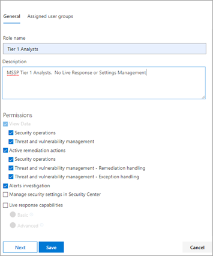
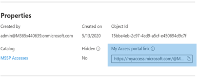

# Fornire l'accesso al provider di servizi di sicurezza gestito (MSSP)Provide managed security service provider (MSSP) access 

[!INCLUDE [Microsoft 365 Defender rebranding](../includes/microsoft-defender.md)]

[!INCLUDE [Prerelease](../includes/prerelease.md)]

**Si applica a:****Applies to:**

- [Microsoft 365 DefenderMicrosoft 365 Defender](https://go.microsoft.com/fwlink/?linkid=2118804)
- [Microsoft Defender ATPMicrosoft Defender for Endpoint](https://go.microsoft.com/fwlink/p/?linkid=2146631)

Per implementare una soluzione di accesso delegato multi-tenant, eseguire la procedura seguente:To implement a multi-tenant delegated access solution, take the following steps:

1. Abilitare [il controllo dell'accesso](https://docs.microsoft.com/windows/security/threat-protection/microsoft-defender-atp/rbac) basato sui ruoli in Defender per Endpoint nel Centro sicurezza Microsoft 365 e connettersi ai gruppi di Azure Active Directory (Azure AD).Enable [role-based access control](https://docs.microsoft.com/windows/security/threat-protection/microsoft-defender-atp/rbac) in Defender for Endpoint in Microsoft 365 security center and connect with Azure Active Directory (Azure AD) groups.

2. Configurare i [pacchetti di accesso di](https://docs.microsoft.com/azure/active-directory/governance/identity-governance-overview) governance per la richiesta di accesso e il provisioning.Configure [Governance Access Packages](https://docs.microsoft.com/azure/active-directory/governance/identity-governance-overview) for access request and provisioning.

3. Gestire le richieste di accesso e i controlli in [Microsoft Myaccess.](https://docs.microsoft.com/azure/active-directory/governance/entitlement-management-request-approve)Manage access requests and audits in [Microsoft Myaccess](https://docs.microsoft.com/azure/active-directory/governance/entitlement-management-request-approve).

## Abilitare i controlli di accesso in base al ruolo in Microsoft Defender per Endpoint nel Centro sicurezza Microsoft 365Enable role-based access controls in Microsoft Defender for Endpoint in Microsoft 365 security center

1. **Creare gruppi di accesso per le risorse MSSP in Customer AAD: Gruppi****Create access groups for MSSP resources in Customer AAD: Groups**

    Questi gruppi verranno collegati ai ruoli creati in Defender per Endpoint nel Centro sicurezza Microsoft 365.These groups will be linked to the Roles you create in Defender for Endpoint in Microsoft 365 security center. A tale scopo, nel tenant di Active Directory del cliente crea tre gruppi.To do so, in the customer AD tenant, create three groups. Nell'approccio di esempio vengono creati i gruppi seguenti:In our example approach, we create the following groups:

    - Analista di livello 1Tier 1 Analyst 
    - Analista di livello 2Tier 2 Analyst 
    - Responsabili approvazione analista MSSPMSSP Analyst Approvers  

2. Creare ruoli di Defender per endpoint per i livelli di accesso appropriati in Ruoli e gruppi del Centro sicurezza Microsoft 365 in Customer Defender for Endpoint.Create Defender for Endpoint roles for appropriate access levels in Customer Defender for Endpoint in Microsoft 365 security center roles and groups.

    Per abilitare RBAC nel Centro sicurezza Microsoft 365 del cliente, accedere ai ruoli Autorizzazioni **> Endpoints** & gruppi > Ruoli con un account utente con diritti di amministratore globale o amministratore della sicurezza.To enable RBAC in the customer Microsoft 365 security center, access **Permissions >  Endpoints roles & groups > Roles** with a user account with Global Administrator or Security Administrator rights.

    

    Creare quindi i ruoli RBAC per soddisfare le esigenze del livello SOC MSSP.Then, create RBAC roles to meet MSSP SOC Tier needs. Collegare questi ruoli ai gruppi di utenti creati tramite "Gruppi di utenti assegnati".Link these roles to the created user groups via "Assigned user groups".

    Due possibili ruoli:Two possible roles:

    - **Analisti di livello 1****Tier 1 Analysts**  
      Eseguire tutte le azioni ad eccezione della risposta in tempo reale e gestire le impostazioni di sicurezza.Perform all actions except for live response and manage security settings.

    - **Analisti di livello 2****Tier 2 Analysts**  
      Funzionalità di livello 1 con l'aggiunta della [risposta in tempo reale](https://docs.microsoft.com/windows/security/threat-protection/microsoft-defender-atp/live-response)Tier 1 capabilities with the addition to [live response](https://docs.microsoft.com/windows/security/threat-protection/microsoft-defender-atp/live-response)

    Per ulteriori informazioni, vedere [Use role-based access control.](https://docs.microsoft.com/windows/security/threat-protection/microsoft-defender-atp/rbac)For more information, see [Use role-based access control](https://docs.microsoft.com/windows/security/threat-protection/microsoft-defender-atp/rbac).

## Configurare i pacchetti di accesso alla governanceConfigure Governance Access Packages

1.  **Aggiungere MSSP come organizzazione connessa in Customer AAD: Identity Governance****Add MSSP as Connected Organization in Customer AAD: Identity Governance**
    
    L'aggiunta del provider di servizi condivisi come organizzazione connessa consentirà al provider di servizi condivisi di richiedere e di disporre degli accessi di cui è stato eseguito il provisioning.Adding the MSSP as a connected organization will allow the MSSP to request and have accesses provisioned. 

    A tale scopo, nel tenant di Active Directory del cliente, accedere a Identity Governance: Organizzazione connessa.To do so, in the customer AD tenant, access Identity Governance: Connected organization. Aggiungere una nuova organizzazione e cercare il tenant dell'analista MSSP tramite l'ID tenant o il dominio.Add a new organization and search for your MSSP Analyst tenant via Tenant ID or Domain. È consigliabile creare un tenant AD separato per gli analisti MSSP.We suggest creating a separate AD tenant for your MSSP Analysts.

2. **Creare un catalogo delle risorse in Customer AAD: Identity Governance****Create a resource catalog in Customer AAD: Identity Governance**

    I cataloghi delle risorse sono una raccolta logica di pacchetti di accesso, creati nel tenant di Active Directory del cliente.Resource catalogs are a logical collection of access packages, created in the customer AD tenant.

    A tale scopo, nel tenant di Active Directory del cliente, accedere a Identity Governance: Cataloghi e aggiungere **Nuovo catalogo.**To do so, in the customer AD tenant,  access Identity Governance: Catalogs, and add **New Catalog**. In questo esempio verrà chiamato **MSSP Accesses.**In our example, we will call it **MSSP Accesses**. 

    

    Per ulteriori informazioni, vedere [Creare un catalogo di risorse.](https://docs.microsoft.com/azure/active-directory/governance/entitlement-management-catalog-create)Further more information, see [Create a catalog of resources](https://docs.microsoft.com/azure/active-directory/governance/entitlement-management-catalog-create).

3. **Creare pacchetti di accesso per le risorse MSSP Customer AAD: Identity Governance****Create access packages for MSSP resources Customer AAD: Identity Governance**

    I pacchetti di accesso sono la raccolta di diritti e accessi a cui verrà concesso un richiedente all'approvazione.Access packages are the collection of rights and accesses that a requestor will be granted upon approval. 

    A tale scopo, nel tenant di Active Directory del cliente, accedere a Identity Governance: Pacchetti di accesso e aggiungere **nuovo pacchetto di accesso.**To do so, in the customer AD tenant, access Identity Governance: Access Packages, and add **New Access Package**. Creare un pacchetto di accesso per i responsabili approvazione mssp e ogni livello di analista.Create an access package for the MSSP approvers and each analyst tier. Ad esempio, la seguente configurazione dell'analista di livello 1 crea un pacchetto di accesso che:For example, the following Tier 1 Analyst configuration creates an access package that:

    - Richiede a un membro del gruppo AD **responsabili approvazione analista MSSP** di autorizzare nuove richiesteRequires a member of the AD group **MSSP Analyst Approvers** to authorize new requests
    - Ha revisioni di accesso annuali, in cui gli analisti SOC possono richiedere un'estensione di accessoHas annual access reviews, where the SOC analysts can request an access extension
    - Può essere richiesto solo dagli utenti nel tenant SOC MSSPCan only be requested by users in the MSSP SOC Tenant
    - Access scade automaticamente dopo 365 giorniAccess auto expires after 365 days

    

    Per altre informazioni, vedi [Creare un nuovo pacchetto di accesso.](https://docs.microsoft.com/azure/active-directory/governance/entitlement-management-access-package-create)For more information, see [Create a new access package](https://docs.microsoft.com/azure/active-directory/governance/entitlement-management-access-package-create).

4. **Fornire il collegamento alla richiesta di accesso alle risorse MSSP da Customer AAD: Identity Governance****Provide access request link to MSSP resources from Customer AAD: Identity Governance**

    Il collegamento al portale My Access viene usato dagli analisti SOC di MSSP per richiedere l'accesso tramite i pacchetti di accesso creati.The My Access portal link is used by MSSP SOC analysts to request access via the access packages created. Il collegamento è permanente, ovvero lo stesso collegamento può essere usato nel tempo per i nuovi analisti.The link is durable, meaning the same link may be used over time for new analysts. La richiesta dell'analista entra in una coda per l'approvazione da parte dei responsabili approvazione **analista MSSP.**The analyst request goes into a queue for approval by the **MSSP Analyst Approvers**.

    

    Il collegamento si trova nella pagina di panoramica di ogni pacchetto di accesso.The link is located on the overview page of each access package.

## Gestire accessiManage access 

1. Esaminare e autorizzare le richieste di accesso in Myaccess del cliente e/o del provider mssp.Review and authorize access requests in Customer and/or MSSP myaccess.

    Le richieste di accesso vengono gestite nel cliente Accesso personale dai membri del gruppo Responsabili approvazione analista MSSP.Access requests are managed in the customer My Access, by members of the MSSP Analyst Approvers group.

    A tale scopo, accedere all'accesso del cliente tramite:  `https://myaccess.microsoft.com/@<Customer Domain >` .To do so, access the customer's myaccess using:  `https://myaccess.microsoft.com/@<Customer Domain >`. 

    Esempio:  `https://myaccess.microsoft.com/@M365x440XXX.onmicrosoft.com#/`Example:  `https://myaccess.microsoft.com/@M365x440XXX.onmicrosoft.com#/`   
2. Approvare o rifiutare le richieste nella **sezione Approvazioni** dell'interfaccia utente.Approve or deny requests in the **Approvals** section of the UI.

     A questo punto, è stato effettuato il provisioning dell'accesso dell'analista e ogni analista dovrebbe essere in grado di accedere al Centro sicurezza Microsoft 365 del cliente:At this point, analyst access has been provisioned, and each analyst should be able to access the customer's Microsoft 365 Security Center: 

    `https://security.microsoft.com/?tid=<CustomerTenantId>` con le autorizzazioni e i ruoli a cui sono stati assegnati.`https://security.microsoft.com/?tid=<CustomerTenantId>` with the permissions and roles they were assigned.

> [!IMPORTANT]
> L'accesso delegato a Microsoft Defender per Endpoint nel Centro sicurezza Microsoft 365 attualmente consente l'accesso a un singolo tenant per finestra del browser.Delegated access to Microsoft Defender for Endpoint in the Microsoft 365 security center currently allows access to a single tenant per browser window. 