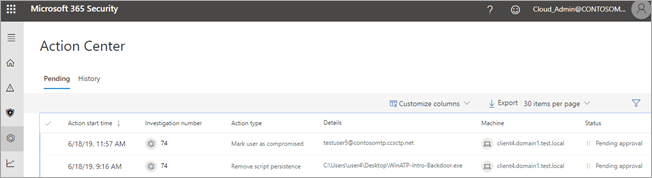

# Centro operativo

**Si applica a:**
- Microsoft Threat Protection

Utilizzare il centro notifiche per visualizzare i risultati delle indagini attuali e passate sui dispositivi e le cassette postali dell'organizzazione. A seconda del tipo di minaccia e del verdetto risultante, le [azioni di correzione](https://docs.microsoft.com/microsoft-365/security/mtp/mtp-remediation-actions) si verificano automaticamente o dopo l'approvazione da parte del team di operazioni di sicurezza dell'organizzazione. Tutte le azioni correttive, siano esse in attesa di approvazione o già approvate, vengono consolidate nel centro notifiche. 

## Un'esperienza a "riquadro unico"

Il centro notifiche include un "riquadro unico" per le attività, ad esempio:
- approvazione delle azioni di correzione in sospeso;
- visualizzazione di un log di controllo delle azioni di correzione già approvate;
- revisione delle azioni di correzione completate.

Il team delle operazioni di sicurezza può lavorare in modo più efficace ed efficiente, poiché il centro notifiche offre una visione completa del funzionamento di Microsoft Threat Protection.

## Accedere al centro notifiche

1. Andare su [https://security.microsoft.com](https://security.microsoft.com) ed eseguire l’accesso. 

2. Nel riquadro di spostamento, scegliere **Centro notifiche**. 

3. Nel centro azioni vengono visualizzate due schede: in **sospeso** e **cronologia**.

    - Nella scheda **In sospeso** sono elencate le indagini che richiedono la revisione e l'approvazione da parte di qualcuno nel team delle operazioni di sicurezza per continuare. Assicurarsi di rivedere e agire sugli elementi in sospeso visualizzati nella scheda.

    - Nella scheda **Cronologia** sono elencate le indagini precedenti e le azioni correttive intraprese automaticamente. È possibile visualizzare i dati relativi all'ultimo giorno, mese, all'ultima settimana o agli ultimi sei mesi.

4. Per visualizzare solo le colonne desiderate, selezionare **Personalizza colonne**. 

5. Selezionare un elemento nell'elenco per visualizzare maggiori dettagli relativi a un'indagine. Si aprirà la visualizzazione dei dettagli dell'indagine. 

    - Se l'indagine è relativa al contenuto della posta elettronica (ad esempio, l'entità è una cassetta postale), i dettagli dell'indagine vengono aperti nel centro sicurezza & Compliance ( [https://protection.office.com/threatinvestigation](https://protection.office.com/threatinvestigation) ). 

    - Se l'indagine riguarda un dispositivo, i dettagli dell'indagine vengono aperti nel Centro sicurezza ([https://security.microsoft.com](https://security.microsoft.com)). 

> [!TIP]
> Se si pensa che qualcosa è stato perso o rilevato erroneamente dalle funzionalità di analisi e risposta automatizzate in Microsoft Threat Protection, fatecelo sapere! Vedere [How to report false positives/negatives in Automatic Investigation and Response (Air) capabilities in Microsoft Threat Protection](mtp-autoir-report-false-positives-negatives.md).

## Azioni disponibili

Poiché vengono eseguite azioni di correzione, sono elencate nella scheda cronologia del centro operazioni. Tali azioni includono le seguenti:

- Raccolta del pacchetto di analisi 
- Dispositivo isolato (questa azione può essere annullata) 
- Macchina trasferisce 
- Esecuzione del codice di rilascio 
- Rilascio dalla quarantena 
- Esempio di richiesta 
- Limitare l'esecuzione del codice (questa azione può essere annullata) 
- Eseguire l'analisi antivirus 
- Arresto e quarantena 

## Autorizzazioni necessarie per le attività del centro notifiche

Per approvare o rifiutare le azioni in sospeso nel centro notifiche, è necessario disporre delle autorizzazioni elencate nella tabella seguente:

|Azione correttiva |Ruoli e autorizzazioni necessari |
|--|----|
|Correzione di Microsoft Defender ATP (dispositivi) |Ruolo di amministratore della protezione assegnato in Azure Active Directory ([https://portal.azure.com](https://portal.azure.com)) o nell'interfaccia di amministrazione di Microsoft 365 ([https://admin.microsoft.com](https://admin.microsoft.com)) --- o --- Ruolo di azioni correttive attive assegnato in Microsoft Defender ATP     Per altre informazioni, vedere le risorse seguenti:  - [Autorizzazioni del ruolo di amministratore in Azure Active Directory](https://docs.microsoft.com/azure/active-directory/users-groups-roles/directory-assign-admin-roles) - [Creare e gestire ruoli per il controllo dell'accesso basato sui ruoli (Microsoft Defender ATP)](https://docs.microsoft.com/windows/security/threat-protection/microsoft-defender-atp/user-roles)  |
|Correzione di Office 365 ATP (contenuti e messaggi di posta elettronica di Office)  |Ruolo di amministratore della protezione assegnato in Azure Active Directory ([https://portal.azure.com](https://portal.azure.com)) o nell'interfaccia di amministrazione di Microsoft 365 ([https://admin.microsoft.com](https://admin.microsoft.com)) --- e ---  Ruolo di ricerca e spurgo assegnato al centro sicurezza & Compliance ( [https://protection.office.com](https://protection.office.com) )   **Importante**: se il ruolo amministratore della sicurezza è assegnato solo nel centro sicurezza & Compliance, non sarà possibile accedere al centro azioni o alle funzionalità di protezione dalle minacce di Microsoft. È necessario avere il ruolo di amministratore della protezione assegnato in Azure Active Directory o nell'interfaccia di amministrazione di Microsoft 365.   Per altre informazioni, vedere le risorse seguenti:  - [Autorizzazioni del ruolo di amministratore in Azure Active Directory](https://docs.microsoft.com/azure/active-directory/users-groups-roles/directory-assign-admin-roles) - [Autorizzazioni nel centro sicurezza & conformità](https://docs.microsoft.com/microsoft-365/security/office-365-security/permissions-in-the-security-and-compliance-center) |

> [!NOTE]
> Gli utenti che hanno il ruolo di amministratore globale assegnato in Azure Active Directory possono approvare o rifiutare qualsiasi azione in sospeso nel centro notifiche. Tuttavia, come procedura consigliata, l'organizzazione dovrebbe limitare il numero di persone a cui è assegnato il ruolo di amministratore globale. È consigliabile usare i ruoli di amministratore della protezione, azioni correttive attive e ricerca ed eliminazione elencati in precedenza per le autorizzazioni del centro notifiche.

## Passaggi successivi 

- [Ulteriori informazioni sugli incidenti in Microsoft Threat Protection](incidents-overview.md)

- [Visualizzare i risultati di un'indagine automatizzata](mtp-autoir-results.md)

- [Informazioni sulla ricerca in Microsoft Threat Protection](advanced-hunting-overview.md)

