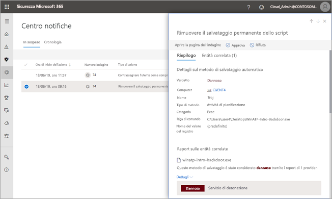

# Approvare o rifiutare azioni in sospeso dalle indagini automatizzateApprove or reject pending actions from automated investigations

**Si applica a:****Applies to:**
- Microsoft Threat ProtectionMicrosoft Threat Protection

[!INCLUDE [Prerelease information](../includes/prerelease.md)]

Quando viene eseguita un’indagine automatizzata, può dare come risultato una o più [azioni di correzione](mtp-action-center.md#remediation-actions) che richiedono l’approvazione prima di procedere.When an automated investigation runs, it can result in one or more [remediation actions](mtp-action-center.md#remediation-actions) that require approval to proceed. Ad esempio, potrebbe essere necessario eliminare un gruppo di email o potrebbe essere necessario eliminare un file in quarantena.For example, a cluster of email messages might need to be deleted, or a quarantined file might need to be removed. È importante approvare (o rifiutare) le azioni in sospeso il prima possibile in modo che l’indagine automatizzata possa essere completata nel tempo previsto.It's important to approve (or reject) pending actions as soon as possible so that your automated investigations can proceed and complete in a timely manner. 

Le azioni in sospeso possono essere riviste e approvate usando uno dei metodi seguenti:Pending actions can be reviewed and approved by using one of several methods:
- [Utilizzare il centro notificheUse the Action center](#review-a-pending-action-in-the-action-center)
- [Utilizzare visualizzazione dettagli indagineUse the investigation details view](#review-a-pending-action-in-the-investigation-details-view)

> [!NOTE]
> È necessario avere [autorizzazioni appropriate](mtp-action-center.md#required-permissions-for-action-center-tasks) per approvare o rifiutare azioni correttive.You must have [appropriate permissions](mtp-action-center.md#required-permissions-for-action-center-tasks) to approve or reject remediation actions.

## Rivedere un'azione in sospeso nel centro notificheReview a pending action in the Action center

1. Andare su [https://security.microsoft.com](https://security.microsoft.com) ed eseguire l’accesso.Go to [https://security.microsoft.com](https://security.microsoft.com) and sign in. 

2. Nel riquadro di spostamento fare clic su **Centro notifiche**.In the navigation pane, choose **Action center**. 

3. Nel centro notifiche, nella scheda **In sospeso**, selezionare un elemento dall’elenco.In the Action Center, on the **Pending** tab, select an item in the list. 

    - Se si seleziona un elemento nella colonna **Numero indagine**, verrà visualizzata la pagina con i dettagli sulle indagini.If you select an item in the **Investigation number** column, the investigation details page opens. In questa pagina è possibile visualizzare i risultati dell'indagine e quindi approvare o rifiutare l'azione consigliata.There, you can view the results of the investigation, and then either approve or reject the recommended action.
 
    - Se si seleziona una riga nell'elenco, verrà visualizzato un riquadro a comparsa, in cui sarà possibile vedere le informazioni su quell'elemento.If you select a row in the list, a flyout opens, where you can view information about that item.   Utilizzare i collegamenti per visualizzare un avviso associato o un’indagine e approvare o rifiutare l’azione.Use the links to view an associated alert or an investigation, and approve or reject the action.

## Rivedere un'azione in sospeso nella visualizzazione dettagli indaginiReview a pending action in the investigation details view

1. In una pagina di [investigazione dettagli](mtp-autoir-results.md), selezionare la scheda **azioni in sospeso** (o **Azioni**). Gli elementi in attesa di approvazione sono elencati in questa scheda.On an [investigation details](mtp-autoir-results.md) page, select the **Pending actions** (or **Actions**) tab. Items that are pending approval are listed here.

2. Selezionare un elemento nella lista, quindi scegliere **Approva** o **Rifiuta**.Select an item in the list, and then choose **Approve** or **Reject**.

## Passaggi successiviNext steps

- [Altre informazioni sul centro notificheLearn more about the Action center](mtp-action-center.md)
- [Altre informazioni sugli incidentiLearn more about incidents](incidents-overview.md)
- [Altre informazioni sulla ricercaLearn about hunting](advanced-hunting-overview.md)
