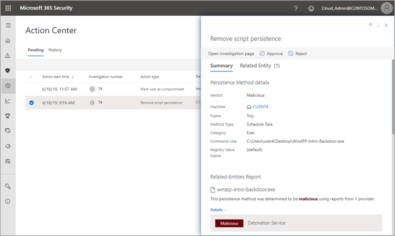

# Approvare o rifiutare azioni in sospeso dalle indagini automatizzate

**Si applica a:**
- Microsoft Threat Protection

Quando viene eseguita un’indagine automatizzata, può dare come risultato una o più [azioni di correzione](https://docs.microsoft.com/microsoft-365/security/mtp/mtp-remediation-actions) che richiedono l’approvazione prima di procedere. Ad esempio, potrebbe essere necessario eliminare un gruppo di email o potrebbe essere necessario eliminare un file in quarantena. È importante approvare (o rifiutare) le azioni in sospeso il prima possibile in modo che l’indagine automatizzata possa essere completata nel tempo previsto. 

> [!TIP]
> Se si pensa che qualcosa è stato perso o rilevato erroneamente dalle funzionalità di analisi e risposta automatizzate in Microsoft Threat Protection, fatecelo sapere! Vedere [How to report false positives/negatives in Automatic Investigation and Response (Air) capabilities in Microsoft Threat Protection](mtp-autoir-report-false-positives-negatives.md).

Le azioni in sospeso possono essere riviste e approvate usando uno dei metodi seguenti:
- [Utilizzare il centro notifiche](#review-a-pending-action-in-the-action-center)
- [Utilizzare visualizzazione dettagli indagine](#review-a-pending-action-in-the-investigation-details-view)

> [!NOTE]
> È necessario avere [autorizzazioni appropriate](mtp-action-center.md#required-permissions-for-action-center-tasks) per approvare o rifiutare azioni correttive.

## Rivedere un'azione in sospeso nel centro notifiche

1. Andare su [https://security.microsoft.com](https://security.microsoft.com) ed eseguire l’accesso. 

2. Nel riquadro di spostamento fare clic su **Centro notifiche**. 

3. Nel centro notifiche, nella scheda **In sospeso**, selezionare un elemento dall’elenco. 

    - Se si seleziona un elemento nella colonna **Numero indagine**, verrà visualizzata la pagina con i dettagli sulle indagini. In questa pagina è possibile visualizzare i risultati dell'indagine e quindi approvare o rifiutare l'azione consigliata.
 
    - Se si seleziona una riga nell'elenco, verrà visualizzato un riquadro a comparsa, in cui sarà possibile vedere le informazioni su quell'elemento.   Utilizzare i collegamenti per visualizzare un avviso associato o un’indagine e approvare o rifiutare l’azione.

## Rivedere un'azione in sospeso nella visualizzazione dettagli indagini

1. In una pagina di [investigazione dettagli](mtp-autoir-results.md), selezionare la scheda **azioni in sospeso** (o **Azioni**). Gli elementi in attesa di approvazione sono elencati in questa scheda.

2. Selezionare un elemento nella lista, quindi scegliere **Approva** o **Rifiuta**.

## Passaggi successivi

- [Altre informazioni sul centro notifiche](mtp-action-center.md)
- [Altre informazioni sugli incidenti](incidents-overview.md)
- [Altre informazioni sulla ricerca](advanced-hunting-overview.md)
