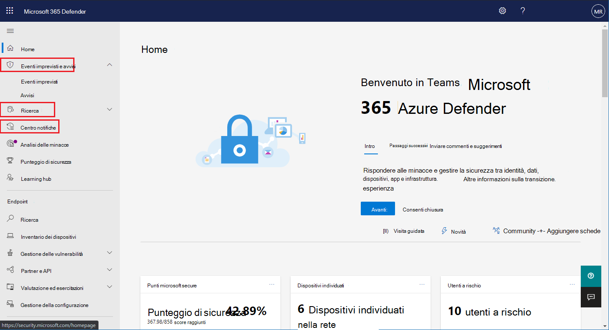

# Attivare Microsoft Threat Protection

**Si applica a:**
- Microsoft Threat Protection

[Microsoft Threat Protection](microsoft-threat-protection.md) unifica il processo di risposta agli incidenti mediante l'integrazione di funzionalità chiave in Microsoft Defender Advanced Threat Protection (ATP), Office 365 ATP, Microsoft cloud app Security e Azure ATP. Questa esperienza unificata aggiunge importanti funzionalità alle quali è possibile accedere nel Centro sicurezza Microsoft 365.

Microsoft Threat Protection si attiva automaticamente quando i clienti idonei con le autorizzazioni necessarie visitano Microsoft 365 Security Center. Leggere questo articolo per comprendere i vari prerequisiti e il provisioning di Microsoft Threat Protection.

## Verificare l'idoneità delle licenze e le autorizzazioni necessarie
Una licenza per un prodotto di sicurezza Microsoft 365 in genere consente di utilizzare Microsoft Threat Protection in Microsoft 365 Security Center senza ulteriori costi di licenza. Si consiglia di ottenere una licenza di sicurezza Microsoft 365 E5, E5 Security, a5 o a5 o una combinazione valida di licenze che fornisce l'accesso a tutti i servizi supportati.

Per informazioni dettagliate sulla licenza, [leggere i requisiti di licenza](prerequisites.md#licensing-requirements).

### Controllare il ruolo
Per abilitare Microsoft Threat Protection, è necessario essere un amministratore **globale** o un **amministratore della sicurezza** in Azure Active Directory. [Visualizzare i ruoli in Azure AD](https://docs.microsoft.com//azure/active-directory/users-groups-roles/directory-manage-roles-portal)

## Servizi supportati
Microsoft Threat Protection aggrega i dati provenienti dai vari servizi supportati già distribuiti. I dati verranno elaborati e archiviati in modo centralizzato per identificare nuove informazioni e rendere possibili flussi di lavoro di risposta centralizzati. In questo caso, senza influire sulle distribuzioni, le impostazioni o i dati esistenti associati ai servizi integrati.

Per ottenere la migliore protezione e ottimizzare Microsoft Threat Protection, è consigliabile distribuire tutti i servizi supportati in rete. Per ulteriori informazioni, [vedere informazioni sulla distribuzione di servizi supportati](deploy-supported-services.md).

## Prima di avviare il servizio
Prima di abilitare il servizio, Microsoft 365 Security Center ([Security.Microsoft.com](https://security.microsoft.com)) consente di visualizzare la pagina delle impostazioni di protezione delle minacce di Microsoft quando si seleziona **incidenti**, **Centro azioni**o **ricerca** nel riquadro di spostamento. Questi elementi di spostamento non vengono visualizzati se non si è idonei per l'utilizzo di Microsoft Threat Protection.

 *nelle impostazioni di Microsoft Threat Protection in Microsoft 365 Security Center*

## Avvio del servizio
Per abilitare Microsoft Threat Protection, è sufficiente selezionare **attiva Microsoft Threat Protection** e applicare la modifica. È inoltre possibile accedere a questa opzione selezionando **Impostazioni** ([Security.Microsoft.com/settings](https://security.microsoft.com/settings)) nel riquadro di spostamento e quindi selezionando **Microsoft Threat Protection**.

>[!NOTE]
>Se non si visualizzano le **Impostazioni** nel riquadro di spostamento o non è stato possibile accedere alla pagina, controllare autorizzazioni e licenze.

### Percorso Data Center
Microsoft Threat Protection archivierà ed elaborerà i dati nello [stesso percorso utilizzato da Microsoft Defender ATP](https://docs.microsoft.com/windows/security/threat-protection/microsoft-defender-atp/data-storage-privacy). Se non si dispone di Microsoft Defender ATP, viene selezionata automaticamente una nuova posizione del Data Center in base alla posizione dei servizi di sicurezza Microsoft 365 attivi. La posizione del Data Center selezionato viene visualizzata nella schermata.

>[!NOTE]
>Selezionare **serve assistenza?** nel centro sicurezza Microsoft 365 contattare il supporto tecnico Microsoft per il provisioning della protezione dalle minacce di Microsoft in una posizione data center diversa. 

### Verificare che il servizio sia attivo
Dopo aver eseguito il provisioning il servizio aggiunge:

- [Gestione degli eventi imprevisti](incidents-overview.md)
- Un centro operativo per la gestione delle [analisi e risposte automatiche](mtp-autoir.md)
- Funzionalità di [ricerca avanzata](advanced-hunting-overview.md)

 *Microsoft 365 Security Center con gestione degli incidenti e altre funzionalità di Microsoft Threat Protection*

### Ottenere i dati di Azure ATP
Per condividere i dati di Azure ATP con Microsoft Threat Protection, accertarsi che l'integrazione di Microsoft Cloud App Security e Azure ATP sia attivata. [Altre informazioni sull'integrazione](https://docs.microsoft.com/cloud-app-security/aatp-integration)

## Disattivare Microsoft Threat Protection
Per interrompere l'uso del servizio Microsoft Threat Protection, passare a **Impostazioni** > **Microsoft Threat Protection** > ** Consenso esplicito/rifiuto esplicito** nel Centro sicurezza Microsoft 365. Deselezionare **attiva Microsoft Threat Protection** e applicare le modifiche.

Le funzionalità corrispondenti verranno rimosse dal centro sicurezza Microsoft 365.

## Ottenere assistenza

Per ottenere le risposte alle domande più frequenti relative all'attivazione di Microsoft Threat Protection, [leggere le FAQ](mtp-enable-faq.md).

Il personale del supporto tecnico Microsoft può contribuire a provisionare o deprovisionare il servizio e le risorse correlate sul tenant. Per assistenza, selezionare **serve assistenza?** nel centro sicurezza Microsoft 365. Per contattare il supporto tecnico, fare riferimento a Microsoft Threat Protection.

## Argomenti correlati

- [Domande frequenti](mtp-enable-faq.md)
- [Requisiti relativi alle licenze e altri prerequisiti](prerequisites.md)
- [Distribuire i servizi supportati](deploy-supported-services.md)
- [Panoramica di Microsoft Threat Protection](microsoft-threat-protection.md)
- [Panoramica di Microsoft Defender ATP](https://docs.microsoft.com/windows/security/threat-protection/microsoft-defender-atp/microsoft-defender-advanced-threat-protection)
- [Panoramica di Office 365 ATP](../office-365-security/office-365-atp.md)
- [Panoramica di Microsoft Cloud App Security](https://docs.microsoft.com/cloud-app-security/what-is-cloud-app-security)
- [Panoramica di Azure ATP](https://docs.microsoft.com/azure-advanced-threat-protection/what-is-atp)
- [Archiviazione dei dati di Microsoft Defender ATP](https://docs.microsoft.com/windows/security/threat-protection/microsoft-defender-atp/data-storage-privacy)