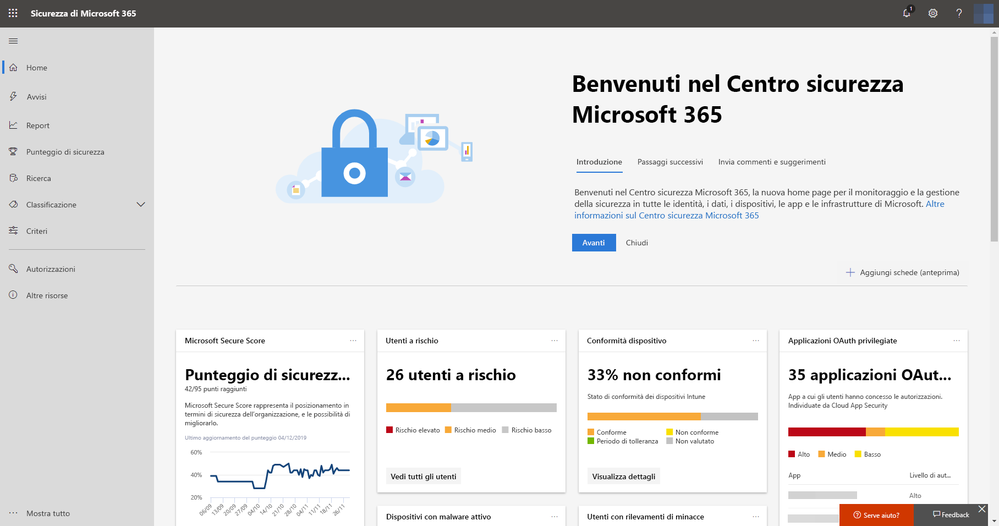

# Attivare Microsoft Threat Protection

**Si applica a:**
- Microsoft Threat Protection

[!include[Prerelease information](prerelease.md)]

Microsoft Threat Protection unifica il processo di risposta agli eventi imprevisti integrando le funzionalità principali in Microsoft Defender Advanced Threat Protection (ATP), Office 365 ATP, Microsoft Cloud App Security e Azure ATP. Questa esperienza unificata aggiunge importanti funzionalità alle quali è possibile accedere nel Centro sicurezza Microsoft 365.

## Verificare l'idoneità
I clienti che dispongono di Microsoft 365 E5 o di una licenza equivalente possono usare Microsoft Threat Protection. Per altre informazioni [consultare i requisiti di licenza](prerequisites.md#licensing-requirements).

## Iniziare a usare il servizio
L'attivazione del servizio Microsoft Threat Protection aggrega i dati dai vari servizi integrati. I dati vengono elaborati e archiviati in modo centralizzato per identificare nuovi approfondimenti e consentire flussi di lavoro di risposte centralizzate.

Prima dell'attivazione del servizio, nel Centro sicurezza Microsoft 365 ([security.microsoft.com](https://security.microsoft.com)) non vengono visualizzati gli **Eventi imprevisti** e le opzioni del **Centro operativo** nel menu.

*Centro sicurezza Microsoft 365 con Microsoft Threat Protection disattivato*

Per attivare il servizio Microsoft Threat Protection, passare a **Impostazioni** > **Microsoft Threat Protection** > ** Consenso esplicito/rifiuto esplicito** nel Centro sicurezza Microsoft 365. Per eseguire questa attività, è necessario ricoprire il ruolo di amministratore globale oppure di amministratore della sicurezza in [Azure Active Directory](https://docs.microsoft.com/azure/active-directory/users-groups-roles/directory-assign-admin-roles#available-roles).

Se è stato eseguito il provisioning di Microsoft Defender ATP per l'organizzazione, i dati verranno archiviati ed elaborati nella stessa area data center selezionata per i [dati di Microsoft Defender ATP](https://docs.microsoft.com/windows/security/threat-protection/microsoft-defender-atp/data-storage-privacy). Se non si dispone di Microsoft Defender ATP, verrà chiesto di scegliere una nuova area data center specifica per Microsoft Threat Protection. Sarà necessario fornire il consenso prima che i dati vengano condivisi tra i servizi e gli aggregati.

### Verificare che il servizio sia attivo
Dopo aver eseguito il provisioning il servizio aggiunge:

- [Gestione degli eventi imprevisti](incidents-overview.md)
- Un centro operativo per la gestione delle [analisi e risposte automatiche](mtp-autoir.md)
- Funzionalità di [ricerca avanzata](advanced-hunting-overview.md) alla pagina **Ricerca** esistente

*Centro sicurezza Microsoft 365 con gestione degli eventi imprevisti e altre funzionalità di Microsoft Threat Protection*

### Ottenere i dati di Azure ATP
Per condividere i dati di Azure ATP con Microsoft Threat Protection, accertarsi che l'integrazione di Microsoft Cloud App Security e Azure ATP sia attivata. [Altre informazioni sull'integrazione](https://docs.microsoft.com/cloud-app-security/aatp-integration)

## Disattivare Microsoft Threat Protection
Per interrompere l'uso del servizio Microsoft Threat Protection, passare a **Impostazioni** > **Microsoft Threat Protection** > ** Consenso esplicito/rifiuto esplicito** nel Centro sicurezza Microsoft 365. Deselezionare **Attiva Microsoft Threat Protection** e salvare le modifiche.

I dati verranno eliminati definitivamente e le funzionalità corrispondenti verranno rimosse dal Centro sicurezza Microsoft 365.

## Ottenere assistenza

Il personale Microsoft può fornire assistenza per eseguire il provisioning o deprovisioning del servizio e delle risorse correlate nel tenant. Per assistenza [contattare il supporto tecnico Premier](https://go.microsoft.com/fwlink/?LinkID=733758).

## Argomenti correlati

- [Panoramica di Microsoft Threat Protection](microsoft-threat-protection.md)
- [Requisiti relativi alle licenze e altri prerequisiti](prerequisites.md)
- [Panoramica di Microsoft Defender ATP](https://docs.microsoft.com/windows/security/threat-protection/microsoft-defender-atp/microsoft-defender-advanced-threat-protection)
- [Panoramica di Office 365 ATP](../office-365-security/office-365-atp.md)
- [Panoramica di Microsoft Cloud App Security](https://docs.microsoft.com/cloud-app-security/what-is-cloud-app-security)
- [Panoramica di Azure ATP](https://docs.microsoft.com/azure-advanced-threat-protection/what-is-atp)
- [Archiviazione dei dati di Microsoft Defender ATP](https://docs.microsoft.com/windows/security/threat-protection/microsoft-defender-atp/data-storage-privacy)
