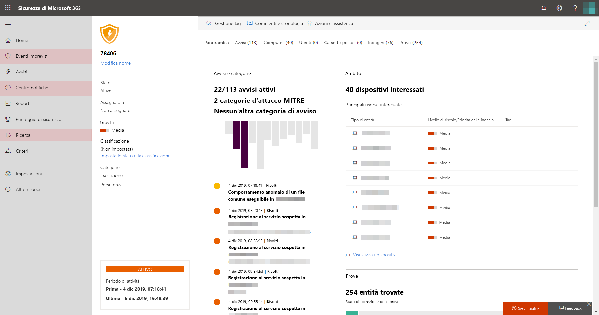

# Attivare Microsoft Threat ProtectionTurn on Microsoft Threat Protection

**Si applica a:****Applies to:**
- Microsoft Threat ProtectionMicrosoft Threat Protection

Microsoft Threat Protection unifica il processo di risposta agli eventi imprevisti integrando le funzionalità principali in Microsoft Defender Advanced Threat Protection (ATP), Office 365 ATP, Microsoft Cloud App Security e Azure ATP.Microsoft Threat Protection unifies your incident response process by integrating key capabilities across Microsoft Defender Advanced Threat Protection (ATP), Office 365 ATP, Microsoft Cloud App Security, and Azure ATP. Questa esperienza unificata aggiunge importanti funzionalità alle quali è possibile accedere nel Centro sicurezza Microsoft 365.This unified experience adds powerful features you can access in the Microsoft 365 security center.

Per ottenere la migliore protezione e ottimizzare Microsoft Threat Protection, è consigliabile distribuire tutti i servizi supportati in rete.To get the best protection and optimize Microsoft Threat Protection, we recommend deploying all applicable supported services on your network. Per ulteriori informazioni, [vedere informazioni sulla distribuzione di servizi supportati](deploy-supported-services.md).For more information, [read about deploying supported services](deploy-supported-services.md).

## Verificare l'idoneità delle licenze e le autorizzazioni necessarieCheck license eligibility and required permissions
Una licenza di sicurezza Microsoft 365 E5, E5, a5 o a5 o una combinazione valida di licenze fornisce l'accesso ai servizi supportati e autorizza l'utilizzo di Microsoft Threat Protection in Microsoft 365 Security Center senza ulteriori costi di licenza.A Microsoft 365 E5, E5 Security, A5, or A5 Security license or a valid combination of licenses provides access to supported services and entitles you to use Microsoft Threat Protection in Microsoft 365 security center without additional licensing cost.

Per informazioni dettagliate sulla licenza, [leggere i requisiti di licenza](prerequisites.md#licensing-requirements).For detailed licensing information, [read the licensing requirements](prerequisites.md#licensing-requirements).

### Controllare il ruoloCheck your role
Per abilitare Microsoft Threat Protection, è necessario essere un amministratore **globale** o un **amministratore della sicurezza** in Azure Active Directory.You must be a **global administrator** or a **security administrator** in Azure Active Directory to turn on Microsoft Threat Protection. [Visualizzare i ruoli in Azure ADView your roles in Azure AD](https://docs.microsoft.com//azure/active-directory/users-groups-roles/directory-manage-roles-portal)

## Iniziare a usare il servizioStart using the service

>[!IMPORTANT]
>A partire dal 3 maggio 2020, Microsoft eseguirà gradualmente nuove esperienze ottimizzate in merito [ai requisiti di licenza](prerequisites.md#licensing-requirements) e all'attivazione di Microsoft Threat Protection.Starting May 3, 2020, Microsoft will gradually roll out new, optimized experiences around [licensing requirements](prerequisites.md#licensing-requirements) and turning on Microsoft Threat Protection. Per alcune settimane durante questo periodo, alcuni clienti inizieranno a visualizzare le modifiche apportate alle esperienze del portale.For several weeks during this period, some customers will start to see changes to their portal experiences. Le informazioni sulle nuove esperienze sono state contrassegnate come **nuova esperienza** in questo articolo.Information about the new experiences are marked **New experience** in this article.

Microsoft Threat Protection aggrega i dati provenienti dai vari servizi integrati.Microsoft Threat Protection aggregates data from the various integrated services. I dati verranno elaborati e archiviati in modo centralizzato per identificare nuove informazioni e rendere possibili flussi di lavoro di risposta centralizzati.It will process and store data centrally to identify new insights and make centralized response workflows possible. In questo caso, senza influire sulle distribuzioni, le impostazioni o i dati esistenti associati ai servizi integrati.It does this without affecting existing deployments, settings, or data associated with the integrated services.

Prima di abilitare il servizio, Microsoft 365 Security Center ([Security.Microsoft.com](https://security.microsoft.com)) Visualizza la pagina di benvenuto di Microsoft Threat Protection quando si seleziona **incidenti**, **Centro azioni**o **ricerca** nel riquadro di spostamento.Before you turn on the service, the Microsoft 365 security center ([security.microsoft.com](https://security.microsoft.com)) shows the Microsoft Threat Protection welcome page when you select **Incidents**, **Action center**, or **Hunting** from the navigation pane. Queste opzioni di spostamento non vengono visualizzate se non si è idonei per l'utilizzo di Microsoft Threat Protection.These navigation options are not shown if you are not eligible to use Microsoft Threat Protection.

*nella pagina di benvenuto Microsoft Threat Protection in Microsoft 365 Security Center*
*Microsoft Threat Protection welcome page in Microsoft 365 security center*

Per abilitare Microsoft Threat Protection, è sufficiente completare il processo dalla pagina di benvenuto.To turn on Microsoft Threat Protection, simply complete the process from the welcome page. È inoltre possibile abilitare Microsoft Threat Protection accedendo alle **Impostazioni** ([Security.Microsoft.com/settings](https://security.microsoft.com/settings)) nel riquadro di spostamento e selezionando **Microsoft Threat Protection**.You can also turn on Microsoft Threat Protection by accessing **Settings** ([security.microsoft.com/settings](https://security.microsoft.com/settings)) in the navigation pane and selecting **Microsoft Threat Protection**.

>[!NOTE]
>Se non si visualizzano le **Impostazioni** nel riquadro di spostamento o non è stato possibile accedere alla pagina, controllare autorizzazioni e licenze.If you don't see **Settings** in the navigation pane or couldn't access the page, check your permissions and licenses.       

### Selezionare percorso Data CenterSelect data center location
Se è stato eseguito il provisioning di Microsoft Defender ATP per l'organizzazione, i dati verranno archiviati ed elaborati nella stessa area data center selezionata per i [dati di Microsoft Defender ATP](https://docs.microsoft.com/windows/security/threat-protection/microsoft-defender-atp/data-storage-privacy).If Microsoft Defender ATP has been provisioned for your organization, data will be stored and processed in the same data center location you have selected for [your Microsoft Defender ATP data](https://docs.microsoft.com/windows/security/threat-protection/microsoft-defender-atp/data-storage-privacy). Se non si dispone di Microsoft Defender ATP, verrà chiesto di scegliere una nuova area data center specifica per Microsoft Threat Protection.If you don't have Microsoft Defender ATP, you will be asked to choose a new data center location specifically for Microsoft Threat Protection. 
 
È necessario fornire il consenso prima che i dati vengano condivisi tra i servizi e aggregati.You need to provide consent before data is shared between services and aggregated.

**Nuova esperienza:** A partire dal 3 maggio 2020, i clienti riceveranno gradualmente le modifiche apportate a questa esperienza.**New experience:** Starting May 3, 2020, customers will gradually receive changes to this experience. Per gli utenti con la nuova esperienza, il servizio seleziona automaticamente la posizione ottimale del centro dati per i dati aggregati in base ai servizi di sicurezza esistenti di Microsoft 365.For those with the new experience, the service automatically selects the optimal data center location for your aggregated data based on your existing Microsoft 365 security services. La posizione del Data Center selezionato viene visualizzata nella schermata.The selected data center location is shown in the screen.

### Verificare che il servizio sia attivoConfirm that the service is on
Dopo aver eseguito il provisioning il servizio aggiunge:Once the service is provisioned, it adds:

- [Gestione degli eventi imprevistiIncidents management](incidents-overview.md)
- Un centro operativo per la gestione delle [analisi e risposte automatiche](mtp-autoir.md)An action center for managing [automated investigation and response](mtp-autoir.md)
- Funzionalità di [ricerca avanzata](advanced-hunting-overview.md)[Advanced hunting](advanced-hunting-overview.md) capabilities

caratteristiche*Microsoft 365 Security Center con gestione degli incidenti e altre funzionalità di Microsoft Threat Protection*
*Microsoft 365 security center with incidents management and other Microsoft Threat Protection capabilities*

### Ottenere i dati di Azure ATPGetting Azure ATP data
Per condividere i dati di Azure ATP con Microsoft Threat Protection, accertarsi che l'integrazione di Microsoft Cloud App Security e Azure ATP sia attivata.To share Azure ATP data with Microsoft Threat Protection, ensure that Microsoft Cloud App Security and Azure ATP integration is turned on. [Altre informazioni sull'integrazioneLearn more about this integration](https://docs.microsoft.com/cloud-app-security/aatp-integration)

## Disattivare Microsoft Threat ProtectionTurn off Microsoft Threat Protection
Per interrompere l'uso del servizio Microsoft Threat Protection, passare a **Impostazioni** > **Microsoft Threat Protection** > \*\* Consenso esplicito/rifiuto esplicito\*\* nel Centro sicurezza Microsoft 365.To stop using Microsoft Threat Protection, go to **Settings** > **Microsoft Threat Protection** > **Opt-in / Opt-out** in the Microsoft 365 security center. Deselezionare **Attiva Microsoft Threat Protection** e salvare le modifiche.Unselect **Turn on Microsoft Threat Protection** and save the changes.

Le funzionalità corrispondenti verranno rimosse dal centro sicurezza Microsoft 365.Corresponding features will be removed from the Microsoft 365 security center.

## Ottenere assistenzaGet assistance

Il personale del supporto tecnico Microsoft può contribuire a provisionare o deprovisionare il servizio e le risorse correlate sul tenant.Microsoft support staff can help provision or deprovision the service and related resources on your tenant. Per assistenza, selezionare **serve assistenza?** nel centro sicurezza Microsoft 365.For assistance, select **Need help?** in the Microsoft 365 security center. Per contattare il supporto tecnico, fare riferimento a Microsoft Threat Protection.When contacting support, mention Microsoft Threat Protection.

## Argomenti correlatiRelated topics

- [Panoramica di Microsoft Threat ProtectionMicrosoft Threat Protection overview](microsoft-threat-protection.md)
- [Requisiti relativi alle licenze e altri prerequisitiLicensing requirements and other prerequisites](prerequisites.md)
- [Distribuire i servizi supportatiDeploy supported services](deploy-supported-services.md)
- [Panoramica di Microsoft Defender ATPMicrosoft Defender ATP overview](https://docs.microsoft.com/windows/security/threat-protection/microsoft-defender-atp/microsoft-defender-advanced-threat-protection)
- [Panoramica di Office 365 ATPOffice 365 ATP overview](../office-365-security/office-365-atp.md)
- [Panoramica di Microsoft Cloud App SecurityMicrosoft Cloud App Security overview](https://docs.microsoft.com/cloud-app-security/what-is-cloud-app-security)
- [Panoramica di Azure ATPAzure ATP overview](https://docs.microsoft.com/azure-advanced-threat-protection/what-is-atp)
- [Archiviazione dei dati di Microsoft Defender ATPMicrosoft Defender ATP data storage](https://docs.microsoft.com/windows/security/threat-protection/microsoft-defender-atp/data-storage-privacy)
