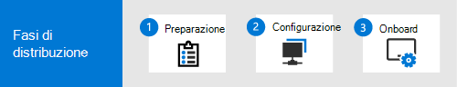

# Creare un laboratorio di valutazione di Microsoft 365 Defender o un ambiente pilotaCreate a Microsoft 365 Defender trial lab or pilot environment 

[!INCLUDE [Microsoft 365 Defender rebranding](../includes/microsoft-defender.md)]

**Si applica a:****Applies to:**
- Microsoft 365 DefenderMicrosoft 365 Defender

Lo scopo della creazione di questo laboratorio di valutazione o di un ambiente pilota è quello di illustrare le funzionalità complete e integrate di Microsoft 365 Defender.The purpose of creating this trial lab or pilot environment is to illustrate the comprehensive and integrated Microsoft 365 Defender capabilities. Sperimentare come questa soluzione di sicurezza intelligente rileva, impedisce, indaga automaticamente e risponde alle minacce avanzate dell'organizzazione.Experience how this intelligent security solution detects, prevents, automatically investigates, and responds to advanced threats your organization. 

Questa guida illustra i passaggi necessari per avviare la valutazione di Microsoft 365 Defender in base ai percorsi di distribuzione consigliati.This guide takes you through the steps to start your Microsoft 365 Defender evaluation based on the recommended deployment paths. L'obiettivo è facilitare la configurazione della soluzione di sicurezza in un ambiente lab con un account di prova oppure in un ambiente pilota in produzione con una licenza completa.The goal is to help you set up the security solution either in a lab environment with a trial account, or in a pilot environment in production with a full license. La preparazione del Lab di valutazione o dell'ambiente pilota può fornire informazioni sui casi di utilizzo delle operazioni di sicurezza ai responsabili decisionali nell'organizzazione.Preparing your trial lab or pilot environment can help you present security operation use cases to decision makers in your organization. Al termine dell'esecuzione delle simulazioni di attacco e soddisfatte dei risultati, è possibile distribuirlo e operazionalizzare completamente nell'organizzazione con l'ausilio di professionisti o esperti di Microsoft Technical Sales nella propria organizzazione.When you’re done running your attack simulations and are satisfied with the results, you can fully deploy and operationalize it in your organization with the help of Microsoft Technical Sales Professionals or experts in your organization. 

Questa guida ti aiuterà a:This guide will help you:
- Configurare il server e i computer labSet up your lab server and computers
- Configurare Active Directory con utenti e gruppiConfigure Active Directory with users and groups
- Impostare e configurare Microsoft Defender per Identity, Microsoft Defender per Office 365, Microsoft Defender per endpoint e Microsoft cloud app SecuritySet up and configure Microsoft Defender for Identity, Microsoft Defender for Office 365, Microsoft Defender for Endpoint, and Microsoft Cloud App Security
- Impostare i criteri locali per il server e i computerSet up local policies for your server and computers
- Simulare un attacco di minaccia per generare un avviso o un evento di prova in Microsoft 365 DefenderMimic a threat attack to generate a test incident or alert in Microsoft 365 Defender

>[!IMPORTANT]
>Per ottenere risultati ottimali, seguire le istruzioni per l'installazione del Lab il più fedelmente possibile.For optimum results, follow the lab setup instructions as closely as possible.

## Fasi di distribuzioneDeployment phases

Sono disponibili tre fasi per la creazione di un ambiente di laboratorio di valutazione di Microsoft 365 Defender e la relativa distribuzione:There are three phases in creating a Microsoft 365 Defender trial lab environment and deploying it:

|FasePhase | DescrizioneDescription | 
|:-------|:-----|
|[Fase 1: preparazionePhase 1: Prepare](prepare-mtpeval.md)| Informazioni su ciò che è necessario prendere in considerazione quando si distribuisce Microsoft 365 Defender in un laboratorio di valutazione o in un ambiente pilota:Learn what you need to consider when deploying Microsoft 365 Defender in a trial lab or pilot environment:   -Parti interessate e disconnessione- Stakeholders and sign-off   -Considerazioni sull'ambiente- Environment considerations  -Access- Access  -Configurazione di Azure Active Directory- Azure Active Directory setup   -Ordine di configurazione- Configuration order
|[Fase 2: installazionePhase 2: Setup](setup-mtpeval.md)|  Eseguire la procedura iniziale per accedere al centro sicurezza Microsoft 365 per configurare l'ambiente pilota o il laboratorio di valutazione di Microsoft 365 Defender.Take the initial steps to access Microsoft 365 Security Center to set up your Microsoft 365 Defender trial lab or pilot environment. Verrà visualizzata la guida per:You'll be guided to:  -Iscriversi alla versione di valutazione di Microsoft 365 E5- Sign up for Microsoft 365 E5 Trial    -Configurare il dominio- Configure domain -Assegnare licenze Microsoft 365 E5- Assign Microsoft 365 E5 licenses -Completare l'installazione guidata nel portale- Complete the setup wizard in the portal|
|[Fase 3: configurare & onboardPhase 3: Configure & Onboard](config-mtpeval.md) | Configurare ogni pilastro Microsoft 365 Defender e gli endpoint di bordo.Configure each Microsoft 365 Defender pillar and onboard endpoints. Verrà visualizzata la guida per:You'll be guided to:  -Configurare Microsoft Defender per Office 365- Configure Microsoft Defender for Office 365 -Configurare Microsoft cloud app Security- Configure Microsoft Cloud App Security -Configurare Microsoft Defender per Identity- Configure Microsoft Defender for Identity -Configurare Microsoft Defender per endpoint- Configure Microsoft Defender for Endpoint

## Nell'ambitoIn scope

Le attività seguenti rientrano nell'ambito di questa guida:The following tasks are in scope for this guide:
-   Configurare Azure Active DirectorySet up Azure Active Directory
-   Configurare Microsoft 365 DefenderSet up Microsoft 365 Defender
    -   Iscriversi a Microsoft 365 E5 trial o utilizzare la licenza completa se si sta eseguendo un progetto pilotaSign up for Microsoft 365 E5 Trial or use your full license if you're running a pilot
    -   Configurare il dominioConfigure domain
    -   Assegnare le licenze Microsoft 365 E5Assign Microsoft 365 E5 licenses
    -   Completamento dell'installazione guidata all'interno del portaleCompleting the setup wizard within the portal
-   Configurare tutti i pilastri di Microsoft 365 Defender in base alle procedure consigliateConfigure all Microsoft 365 Defender pillars based on best practices
    -   Microsoft Defender per Office 365Microsoft Defender for Office 365
    -   Microsoft Defender per identitàMicrosoft Defender for Identity
    -   Microsoft Cloud App SecurityMicrosoft Cloud App Security
    -   Microsoft Defender per endpointMicrosoft Defender for Endpoint

## EsclusioniOut of scope

Di seguito sono riportate le seguenti condizioni:The following are out of scope of this deployment guide:

-   Configurazione di soluzioni di terze parti che possono essere integrate con Microsoft 365 DefenderConfiguration of third-party solutions that might integrate with Microsoft 365 Defender
-   Test di penetrazione nell'ambiente di produzionePenetration testing in production environment

## Passaggio successivoNext step
[Fase 1: preparazione](prepare-mtpeval.md) 
[Phase 1: Prepare](prepare-mtpeval.md) 
  Preparare il laboratorio di valutazione Microsoft 365 Defender o l'ambiente pilotaPrepare your Microsoft 365 Defender trial lab or pilot environment
