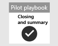

# Chiusura e riepilogo del progetto pilota di Microsoft 365 Defender  

[!INCLUDE [Microsoft 365 Defender rebranding](../includes/microsoft-defender.md)]

**Si applica a:**
- Microsoft 365 Defender

| [Pianificazione](mtp-pilot-plan.md) | [Preparazione](prepare-mtpeval.md) |  [Simula attacco](mtp-pilot-simulate.md) |  Chiudi e riepiloga|
|--|--|--|--|
|| | |*Sei qui!*|

È in corso la fase di chiusura e riepilogo.

È stata appena eseguita una simulazione avanzata di attacco solo memoria che ha eseguito codice in modalità remota in un controller di dominio. Hai visto come Microsoft Defender for Endpoint e Microsoft Defender for Identity rilevano e creano avvisi su attività dannose furtive. È stato anche illustrato come gli avvisi provenienti da origini diverse vengono recapitati insieme ad altre informazioni contestuali in un singolo evento imprevisto nel portale del Centro sicurezza Microsoft 365. L'esperienza di tale integrazione consente agli analisti SOC di analizzare e intraprendere le azioni necessarie. È stata inoltre creata una query di ricerca avanzata che identificherà i messaggi di posta elettronica in ingresso in cui l'utente ha aperto o salvato l'allegato e creato il rilevamento in base a tale query.

È stata raggiunta la fine del processo al termine di tutti i test.

L'output finale deve essere:

- Scorecard completata
- Un report dettagliato dei risultati del progetto pilota
- Una decisione su come procedere

Presenta i rapporti dall'output finale alle parti interessate interne (identificate durante la fase [di](./prepare-mtpeval.md) preparazione) e ai contatti Microsoft. Questo sforzo garantisce che qualsiasi feedback possa essere usato per migliorare i prodotti e la documentazione.

Ci auguriamo che questa simulazione sia stata apprezzata. Iniziare a implementare quanto appreso su una scala più ampia nell'organizzazione per ottenere il massimo dalla soluzione di sicurezza integrata.

## Passaggio successivo
Ulteriori informazioni sui pilastri di Microsoft 365 Defender sono disponibili nelle seguenti guide interattive:
- [Proteggere l'organizzazione con Microsoft Defender per Office 365](https://aka.ms/O365ATP-Interactive-Guide)
- [Individuare attività sospette e potenziali attacchi con Microsoft Defender per identità](https://aka.ms/AATP-Interactive-Guide)
- [Rilevare le minacce e gestire gli avvisi con Microsoft Cloud App Security](https://aka.ms/DetectThreatsAndAlertsMCAS-InteractiveGuide)
- [Analizzare e correggere le minacce con Microsoft Defender for Endpoint](https://aka.ms/MDATP-IR-Interactive-Guide)