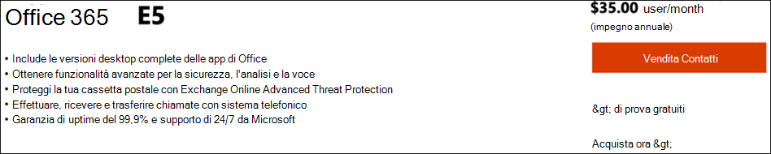
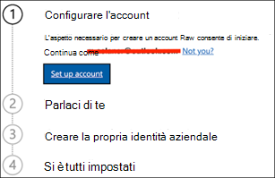
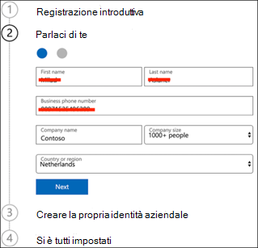
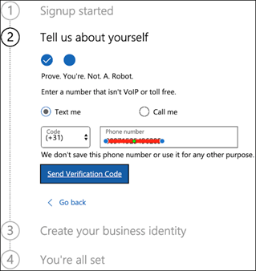
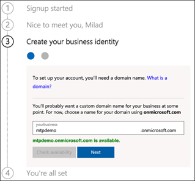
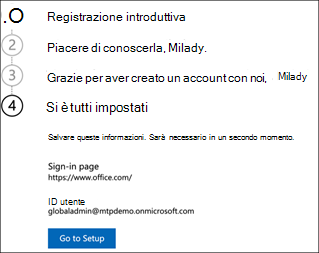
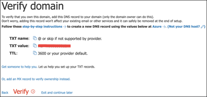
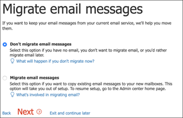
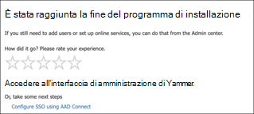

# Configurare l'ambiente di test lab di Microsoft Threat Protection 

**Si applica a:**
- Microsoft Threat Protection 

La creazione di un ambiente pilota o di un laboratorio di valutazione di Microsoft Threat Protection è un processo in tre fasi:

 
<table border="0" width="100%" align="center">
  <tr style="text-align:center;">
    <td align="center" style="width:25%; border:0;" >
      <a href= "https://docs.microsoft.com/microsoft-365/security/mtp/prepare-mtpeval?view=o365-worldwide"> 
        
       Fase 1: preparazione </a> 
    </td>
     <td align="center"bgcolor="#d5f5e3">
      <a href="https://docs.microsoft.com/microsoft-365/security/mtp/setup-mtpeval?view=o365-worldwide">
        
       Fase 2: installazione </a> 
    </td>
    <td align="center">
      <a href="https://docs.microsoft.com/microsoft-365/security/mtp/config-mtpeval?view=o365-worldwide">
        
       Fase 3: configurare & onboard </a> 
</td>

  </tr>
</table>

Si è attualmente in fase di configurazione. Eseguire i passaggi iniziali per accedere a Microsoft 365 Security Center e quindi configurare il laboratorio di valutazione o l'ambiente pilota.

Iscriversi a una sottoscrizione di Office 365 o Azure Active Directory per generare un tenant con *estensione onmicrosoft.com* che è possibile utilizzare per iscriversi alla propria licenza Microsoft 365 E5. 

>[!NOTE]
>Se si dispone già di una sottoscrizione di Office 365 o Azure Active Directory, è possibile ignorare i passaggi di valutazione di Office 365 E5 o di creazione di tenant pilota.

In questa fase, verranno guidati i seguenti aspetti:
- Creare un tenant di valutazione di Office 365 E5
- Abilitare la sottoscrizione di valutazione di Microsoft 365

## Creare un tenant di valutazione di Office 365 E5
>[!NOTE]
>Se si dispone già di una sottoscrizione di Office 365 o di Azure Active Directory, è possibile ignorare la procedura di creazione del tenant di valutazione di Office 365 E5.

1. Andare al [portale del prodotto Office 365 E5](https://www.microsoft.com/microsoft-365/business/office-365-enterprise-e5-business-software?activetab=pivot%3aoverviewtab) e selezionare **versione di valutazione gratuita**.
  
  
2. Completare la registrazione di prova inserendo l'indirizzo di posta elettronica (personale o aziendale). Fare clic su **Configura account**.
   

3. Inserire il nome, il cognome, il numero di telefono aziendale, il nome della società, la dimensione dell'azienda e il paese o l'area geografica.  
   
>[!NOTE]
>Il paese o l'area geografica impostata in questa sezione determina l'area del Data Center in cui verrà ospitata la sede di Office 365.
  
4. Scegliere la preferenza di verifica: tramite un messaggio di testo o una chiamata. Fare clic su **Invia codice di verifica**. 
  

5. Impostare il nome di dominio personalizzato per il tenant, quindi fare clic su **Avanti**.
   
 
6. Impostare la prima identità, che sarà un amministratore globale per il tenant. Immettere il **nome** e la **password**. Fare clic su **Iscriviti**.
  

7. Fare clic su **Vai al programma di installazione** per completare il provisioning del tenant di valutazione di Office 365 E5.
   

8. Connettere il dominio aziendale al tenant di Office 365. Optional Scegliere **Connect a Domain your già own** e digitare il nome di dominio. Fare clic su **Avanti**.
   
 
9. Aggiungere un record TXT o MX per convalidare la proprietà del dominio. Dopo aver aggiunto il record TXT o MX al dominio, selezionare **Verifica**.
   
 
10. Optional Creare più account utente per il tenant. È possibile ignorare questo passaggio facendo clic su **Avanti**.
  
 
11. Optional Scaricare le app di Office. Fare clic su **Avanti** per ignorare questo passaggio. 
   

12. Optional Eseguire la migrazione dei messaggi di posta elettronica. Anche in questo caso, è possibile ignorare questo passaggio.
   
 
13. Scegliere servizi online. Selezionare **Exchange** e fare clic su **Avanti**. 
   

14. Aggiungere i record MX, CNAME e TXT al dominio. Al termine, selezionare **Verifica**.
   
 
15. Congratulazioni, è stato completato il provisioning del tenant di Office 365.
   

## Abilitare la sottoscrizione di valutazione di Microsoft 365

>[!NOTE]
>La registrazione per una versione di valutazione fornisce 25 licenze utente da utilizzare per un mese. Per ulteriori informazioni, vedere [provare o acquistare un abbonamento a M365](https://docs.microsoft.com/microsoft-365/commerce/try-or-buy-microsoft-365?view=o365-worldwide#try-or-buy-a-microsoft-365-subscription-1) .

1. Dall'interfaccia di [amministrazione di Microsoft 365](https://admin.microsoft.com/), fare clic su **fatturazione** , quindi passare a **acquisto servizi**.

2. Selezionare **Microsoft 365 E5** e fare clic su **Avvia versione di valutazione gratuita**. 
  

3. Scegliere la preferenza di verifica: tramite un messaggio di testo o una chiamata. Dopo aver deciso, immettere il numero di telefono, selezionare **Text me** or **Call me** a seconda della selezione.
  
 
4. Immettere il codice di verifica e fare clic su **Avvia la versione di valutazione gratuita**. 
   

5. Fare clic su **prova ora** per confermare la versione di valutazione di Microsoft 365 E5.
   
 
6. Accedere agli utenti attivi degli utenti dell'interfaccia di **amministrazione di Microsoft 365**  >  **Users**  >  **Active users**. Selezionare l'account utente, selezionare **Gestisci licenze di prodotto**, quindi scambiare la licenza da Office 365 E5 a **Microsoft 365 E5**. Fare clic su **Salva**.
  
 
7. Selezionare di nuovo l'account di amministratore globale e quindi fare clic su **Gestisci nome utente**.
   

8. Optional Modificare il dominio da *onmicrosoft.com* al proprio dominio, a seconda di cosa si è scelto nei passaggi precedenti. Fare clic su **Salva modifiche**.
   

## Passaggio successivo
  [Fase 3: configurare & onboard](config-mtpeval.md)  Configurare ogni pilastro Microsoft Threat Protection per il laboratorio di valutazione di Microsoft Threat Protection o l'ambiente pilota e onboard your Endpoints.
