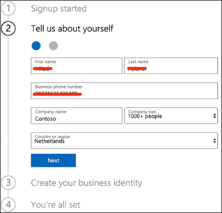

# Configurare l'ambiente di test lab di Microsoft Threat ProtectionSet up your Microsoft Threat Protection trial lab environment 

**Si applica a:****Applies to:**
- Microsoft Threat ProtectionMicrosoft Threat Protection 

La creazione di un ambiente di laboratorio di valutazione di Microsoft Threat Protection e la distribuzione di questo è un processo in tre fasi:Creating a Microsoft Threat Protection trial lab environment and deploying it is a three-phase process:

 
<table border="0" width="100%" align="center">
  <tr style="text-align:center;">
    <td align="center" style="width:25%; border:0;" >
      <a href= "https://docs.microsoft.com/microsoft-365/security/mtp/prepare-mtpeval?view=o365-worldwide"> 
        
       Fase 1: preparazione </a>Phase 1: Prepare </a> 
    </td>
     <td align="center"bgcolor="#d5f5e3">
      <a href="https://docs.microsoft.com/microsoft-365/security/mtp/setup-mtpeval?view=o365-worldwide">
        
       Fase 2: installazione </a>Phase 2: Setup </a> 
    </td>
    <td align="center">
      <a href="https://docs.microsoft.com/microsoft-365/security/mtp/config-mtpeval?view=o365-worldwide">
        
       Fase 3: configurare & onboard </a>Phase 3: Configure & Onboard </a> 
</td>

  </tr>
</table>

Si è attualmente in fase di configurazione.You are currently in the set up phase. Eseguire la procedura iniziale per accedere a Microsoft 365 Security Center e quindi configurare l'ambiente di prova.Take the initial steps to access Microsoft 365 Security Center then setup your trial lab environment.

Iscriversi a una sottoscrizione di Office 365 o Azure Active Directory per generare un tenant con *estensione onmicrosoft.com* che è possibile utilizzare per iscriversi alla propria licenza Microsoft 365 E5.Sign up for an Office 365 or Azure Active Directory subscription to generate a *.onmicrosoft.com* tenant that you can use to sign up for your Microsoft 365 E5 license. 

>[!NOTE]
>Se si dispone già di una sottoscrizione di Office 365 o di Azure Active Directory, è possibile ignorare la procedura di creazione del tenant di valutazione di Office 365 E5.If you already have an existing Office 365 or Azure Active Directory subscription, you can skip the Office 365 E5 trial tenant creation steps.

In questa fase, verranno guidati i seguenti aspetti:In this phase, you'll be guided to:
- Creare un tenant di valutazione di Office 365 E5Create an Office 365 E5 trial tenant
- Abilitare la sottoscrizione di valutazione di Microsoft 365Enable Microsoft 365 trial subscription

## Creare un tenant di valutazione di Office 365 E5Create an Office 365 E5 trial tenant
>[!NOTE]
>Se si dispone già di una sottoscrizione di Office 365 o di Azure Active Directory, è possibile ignorare la procedura di creazione del tenant di valutazione di Office 365 E5.If you already have an existing Office 365 or Azure Active Directory subscription, you can skip the Office 365 E5 trial tenant creation steps.

1. Andare al [portale del prodotto Office 365 E5](https://www.microsoft.com/microsoft-365/business/office-365-enterprise-e5-business-software?activetab=pivot%3aoverviewtab) e selezionare **versione di valutazione gratuita**.Go to the [Office 365 E5 product portal](https://www.microsoft.com/microsoft-365/business/office-365-enterprise-e5-business-software?activetab=pivot%3aoverviewtab) and select **Free trial**.
  
  
2. Completare la registrazione di prova inserendo l'indirizzo di posta elettronica (personale o aziendale).Complete the trial registration by entering your email address (personal or corporate). Fare clic su **Configura account**.Click **Set up account**.
   

3. Inserire il nome, il cognome, il numero di telefono aziendale, il nome della società, la dimensione dell'azienda e il paese o l'area geografica.Fill in your first name, last name, business phone number, company name, company size and country or region.  
   
>[!NOTE]
>Il paese o l'area geografica impostata in questa sezione determina l'area del Data Center in cui verrà ospitata la sede di Office 365.The country or region you set here determines the data center region your Office 365 will be hosted.
  
4. Scegliere la preferenza di verifica: tramite un messaggio di testo o una chiamata.Choose your verification preference: through a text message or call. Fare clic su **Invia codice di verifica**.Click **Send Verification Code**. 
  

5. Impostare il nome di dominio personalizzato per il tenant, quindi fare clic su **Avanti**.Set the custom domain name for your tenant, then click **Next**.
   
 
6. Configurare la prima identità che sarà un amministratore globale per il tenant.Set up the first identity which will be a Global Administrator for the tenant. Immettere il **nome** e la **password**.Fill in **Name** and **Password**. Fare clic su **Iscriviti**.Click **Sign up**.
  

7. Fare clic su **Vai al programma di installazione** per completare il provisioning del tenant di valutazione di Office 365 E5.Click **Go to Setup** to complete the Office 365 E5 trial tenant provisioning.
   

8. Connettere il dominio aziendale al tenant di Office 365.Connect your corporate domain to the Office 365 tenant. Optional Scegliere **Connect a Domain your già own** e digitare il nome di dominio.[Optional] Choose **Connect a domain you already own** and type in your domain name. Fare clic su **Avanti**.Click **Next**.
   
 
9. Sarà necessario aggiungere un record TXT o MX per convalidare la proprietà del dominio.You will need to add a TXT or MX record to validate the domain ownership. Dopo aver aggiunto il record TXT o MX al dominio, selezionare **Verifica**.Once you’ve added the TXT or MX record to your domain, select **Verify**.
   
 
10. Optional Creare più account utente per il tenant.[Optional] Create more user accounts for your tenant. È possibile ignorare questo passaggio facendo clic su **Avanti**.You can skip this step by clicking **Next**.
  
 
11. Optional Scaricare le app di Office.[Optional] Download Office apps. Fare clic su **Avanti** per ignorare questo passaggio.Click **Next** to skip this step. 
   

12. Optional Eseguire la migrazione dei messaggi di posta elettronica.[Optional] Migrate email messages. Anche in questo caso, è possibile ignorare questo passaggio.Again, you can skip this step.
   
 
13. Scegliere servizi online.Choose online services. Selezionare **Exchange** e fare clic su **Avanti**.Select **Exchange** and click **Next**. 
   

14. Aggiungere i record MX, CNAME e TXT al dominio.Add MX, CNAME and TXT records to your domain. Al termine, selezionare **Verifica**.When completed, select **Verify**.
   
 
15. Congratulazioni, è stato completato il provisioning del tenant di Office 365.Congratulations, you have completed the provisioning of your Office 365 tenant.
   

## Abilitare la sottoscrizione di valutazione di Microsoft 365Enable Microsoft 365 trial subscription

>[!NOTE]
>La registrazione per una versione di valutazione fornisce 25 licenze utente da utilizzare per un mese.Signing up for a trial gives you 25 user licenses to use for a month. Per ulteriori informazioni, vedere [provare o acquistare un abbonamento a M365](https://docs.microsoft.com/microsoft-365/commerce/try-or-buy-microsoft-365?view=o365-worldwide#try-or-buy-a-microsoft-365-subscription-1) .See [Try or Buy an M365 subscription](https://docs.microsoft.com/microsoft-365/commerce/try-or-buy-microsoft-365?view=o365-worldwide#try-or-buy-a-microsoft-365-subscription-1) for details.

1. Dall'interfaccia di [amministrazione di Microsoft 365](https://admin.microsoft.com/), fare clic su **fatturazione** , quindi passare a **acquisto servizi**.From [Microsoft 365 Admin Center](https://admin.microsoft.com/), click **Billing** and then navigate to **Purchase services**.

2. Selezionare **Microsoft 365 E5** e fare clic su **Avvia versione di valutazione gratuita**.Select **Microsoft 365 E5** and click **Start free trial**. 
  

3. Scegliere la preferenza di verifica: tramite un messaggio di testo o una chiamata.Choose your verification preference: through a text message or call. Dopo aver deciso, immettere il numero di telefono, selezionare **Text me** or **Call me** a seconda della selezione.Once you have decided, enter the phone number, select **Text me** or **Call me** depending on your selection.
  
 
4. Immettere il codice di verifica e fare clic su **Avvia la versione di valutazione gratuita**.Enter the verification code and click **Start your free trial**. 
   

5. Fare clic su **prova ora** per confermare la versione di valutazione di Microsoft 365 E5.Click **Try now** to confirm your Microsoft 365 E5 trial.
   
 
6. Accedere agli utenti attivi degli utenti dell'interfaccia di **amministrazione di Microsoft 365**  >  **Users**  >  **Active users**.Go to the **Microsoft 365 Admin Center** > **Users** > **Active users**. Selezionare l'account utente, selezionare **Gestisci licenze di prodotto**, quindi scambiare la licenza da Office 365 E5 a **Microsoft 365 E5**.Select your user account, select **Manage product licenses**, then swap the license from Office 365 E5 to **Microsoft 365 E5**. Fare clic su **Salva**.Click **Save**.
  
 
7. Selezionare di nuovo l'account di amministratore globale e quindi fare clic su **Gestisci nome utente**.Select the global administrator account again then click **Manage username**.
   

8. Optional Modificare il dominio da *onmicrosoft.com* al proprio dominio, a seconda di cosa si è scelto nei passaggi precedenti.[Optional] Change the domain from *onmicrosoft.com* to your own domain—depending on what you chose on the previous steps. Fare clic su **Salva modifiche**.Click **Save changes**.
   

## Passaggio successivoNext step
  [Fase 3: configurare & onboardPhase 3: Configure & Onboard](config-mtpeval.md)  Configurare ogni pilastro di Microsoft Threat Protection per il Lab di valutazione di Microsoft Threat Protection e onboard your Endpoints.Configure each Microsoft Threat Protection pillar for your Microsoft Threat Protection evaluation lab and onboard your endpoints.
