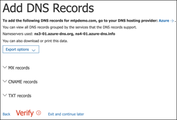

# Configurare l'ambiente di test lab di Microsoft 365 Defender 

[!INCLUDE [Microsoft 365 Defender rebranding](../includes/microsoft-defender.md)]

**Si applica a:**
- Microsoft 365 Defender 

La creazione di un ambiente pilota o di un laboratorio di valutazione di Microsoft 365 Defender è un processo in tre fasi:

| [Fase 1: preparazione](prepare-mtpeval.md) | Fase 2: configurare | [Fase 3: Onboard](config-mtpeval.md) |  [Torna a Pilot PlayBook](mtp-pilot.md) |
|--|--|--|--|
||*Sei qui!*  | | |

Si è attualmente in fase di configurazione. Eseguire i passaggi iniziali per accedere a Microsoft 365 Security Center e quindi configurare il laboratorio di valutazione o l'ambiente pilota.

Iscriversi a una sottoscrizione di Office 365 o Azure Active Directory per generare un tenant con *estensione onmicrosoft.com* che è possibile utilizzare per iscriversi alla propria licenza Microsoft 365 E5. 

>[!NOTE]
>Se si dispone già di una sottoscrizione di Office 365 o Azure Active Directory, è possibile ignorare i passaggi di valutazione di Office 365 E5 o di creazione di tenant pilota.

In questa fase, verranno guidati i seguenti aspetti:
- Creare un tenant di valutazione di Office 365 E5
- Abilitare la sottoscrizione di valutazione di Microsoft 365

## Creare un tenant di valutazione di Office 365 E5
>[!NOTE]
>Se si dispone già di una sottoscrizione di Office 365 o di Azure Active Directory, è possibile ignorare la procedura di creazione del tenant di valutazione di Office 365 E5.

1. Andare al [portale del prodotto Office 365 E5](https://www.microsoft.com/microsoft-365/business/office-365-enterprise-e5-business-software?activetab=pivot%3aoverviewtab) e selezionare **versione di valutazione gratuita**.

   
  
2. Completare la registrazione di prova inserendo l'indirizzo di posta elettronica (personale o aziendale). Fare clic su **Configura account**.

   

3. Inserire il nome, il cognome, il numero di telefono aziendale, il nome della società, la dimensione dell'azienda e il paese o l'area geografica.  

   
   
   > [!NOTE]
   > Il paese o l'area geografica impostata in questa sezione determina l'area del Data Center in cui verrà ospitata la sede di Office 365.
  
4. Scegliere la preferenza di verifica: tramite un messaggio di testo o una chiamata. Fare clic su **Invia codice di verifica**. 

   

5. Impostare il nome di dominio personalizzato per il tenant, quindi fare clic su **Avanti**.

   
 
6. Impostare la prima identità, che sarà un amministratore globale per il tenant. Immettere il **nome** e la **password**. Fare clic su **Iscriviti**.

   

7. Fare clic su **Vai al programma di installazione** per completare il provisioning del tenant di valutazione di Office 365 E5.

   

8. Connettere il dominio aziendale al tenant di Office 365. Optional Scegliere **Connect a Domain your già own** e digitare il nome di dominio. Fare clic su **Avanti**.

   
 
9. Aggiungere un record TXT o MX per convalidare la proprietà del dominio. Dopo aver aggiunto il record TXT o MX al dominio, selezionare **Verifica**.

   
 
10. Optional Creare più account utente per il tenant. È possibile ignorare questo passaggio facendo clic su **Avanti**.

    
 
11. Optional Scaricare le app di Office. Fare clic su **Avanti** per ignorare questo passaggio. 

    

12. Optional Eseguire la migrazione dei messaggi di posta elettronica. Anche in questo caso, è possibile ignorare questo passaggio.

    
 
13. Scegliere servizi online. Selezionare **Exchange** e fare clic su **Avanti**. 

    

14. Aggiungere i record MX, CNAME e TXT al dominio. Al termine, selezionare **Verifica**.

    
 
15. Congratulazioni, è stato completato il provisioning del tenant di Office 365.

    

## Abilitare la sottoscrizione di valutazione di Microsoft 365

>[!NOTE]
>La registrazione per una versione di valutazione fornisce 25 licenze utente da utilizzare per un mese. Per ulteriori informazioni, vedere [provare o acquistare un abbonamento a M365](https://docs.microsoft.com/microsoft-365/commerce/try-or-buy-microsoft-365#try-or-buy-a-microsoft-365-subscription-1) .

1. Dall'interfaccia di [amministrazione di Microsoft 365](https://admin.microsoft.com/), fare clic su **fatturazione** , quindi passare a **acquisto servizi**.

2. Selezionare **Microsoft 365 E5** e fare clic su **Avvia versione di valutazione gratuita**. 

   

3. Scegliere la preferenza di verifica: tramite un messaggio di testo o una chiamata. Dopo aver deciso, immettere il numero di telefono, selezionare **Text me** or **Call me** a seconda della selezione.

   
 
4. Immettere il codice di verifica e fare clic su **Avvia la versione di valutazione gratuita**.

   

5. Fare clic su **prova ora** per confermare la versione di valutazione di Microsoft 365 E5.

   
 
6. Accedere agli utenti attivi degli utenti dell'interfaccia di **amministrazione di Microsoft 365**  >  **Users**  >  **Active users**. Selezionare l'account utente, selezionare **Gestisci licenze di prodotto**, quindi scambiare la licenza da Office 365 E5 a **Microsoft 365 E5**. Fare clic su **Salva**.

   
 
7. Selezionare di nuovo l'account di amministratore globale e quindi fare clic su **Gestisci nome utente**.

   

8. Optional Modificare il dominio da *onmicrosoft.com* al proprio dominio, a seconda di cosa si è scelto nei passaggi precedenti. Fare clic su **Salva modifiche**.

   

## Passaggio successivo
|[Fase 3: configurare & onboard](config-mtpeval.md) | Configurare ogni pilastro Microsoft 365 Defender per il laboratorio di valutazione di Microsoft 365 Defender o l'ambiente pilota e onboard your Endpoints.
|:-------|:-----|
