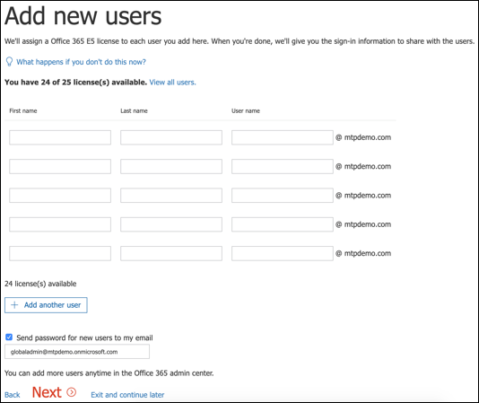

# Configurare l'ambiente lab di valutazione di Microsoft 365 Defender 

[!INCLUDE [Microsoft 365 Defender rebranding](../includes/microsoft-defender.md)]

**Si applica a:**
- Microsoft 365 Defender 

La creazione di un laboratorio di valutazione o di un ambiente pilota di Microsoft 365 Defender e la distribuzione è un processo in tre fasi:

| [Fase 1: preparare](prepare-mtpeval.md) | Fase 2: configurazione | [Fase 3: onboard](config-mtpeval.md) |  [Torna al playbook pilota](mtp-pilot.md) |
|--|--|--|--|
||*Sei qui!*  | | |

Si è attualmente in fase di configurazione. Eseguire i passaggi iniziali per accedere al Centro sicurezza Microsoft 365 e quindi configurare il laboratorio di valutazione o l'ambiente pilota.

Iscriversi a una sottoscrizione di Office 365 o Azure Active Directory per generare un tenant *.onmicrosoft.com* che è possibile usare per iscriversi alla licenza di Microsoft 365 E5. 

>[!NOTE]
>Se si dispone già di un abbonamento a Office 365 o Azure Active Directory esistente, è possibile ignorare i passaggi di creazione del tenant pilota o di valutazione di Office 365 E5.

In questa fase, si verrà guidati a:
- Creare un tenant di valutazione di Office 365 E5
- Abilitare la sottoscrizione di valutazione di Microsoft 365

## Creare un tenant di valutazione di Office 365 E5
>[!NOTE]
>Se si dispone già di una sottoscrizione di Office 365 o Azure Active Directory esistente, è possibile ignorare i passaggi di creazione del tenant di valutazione di Office 365 E5.

1. Passare al portale [del prodotto Office 365 E5](https://www.microsoft.com/microsoft-365/business/office-365-enterprise-e5-business-software?activetab=pivot%3aoverviewtab) e selezionare **Versione di valutazione gratuita.**

   
  
2. Completare la registrazione della versione di valutazione immettendo l'indirizzo di posta elettronica (personale o aziendale). Fare **clic su Configura account**.

   

3. Compilare nome, cognome, numero di telefono dell'azienda, nome della società, dimensioni della società e paese o area geografica.  

   
   
   > [!NOTE]
   > Il paese o l'area geografica impostata qui determina l'area del data center in cui verrà ospitato Office 365.
  
4. Scegli la preferenza di verifica: tramite un SMS o una chiamata. Fare **clic su Invia codice di verifica**. 

   

5. Impostare il nome di dominio personalizzato per il tenant, quindi fare clic su **Avanti.**

   
 
6. Configurare la prima identità, che sarà un amministratore globale per il tenant. Compilare **Nome** e **Password**. Fare **clic su Iscriviti.**

   

7. Fare **clic su Vai a Installazione** per completare il provisioning del tenant di valutazione di Office 365 E5.

   

8. Connettere il dominio aziendale al tenant di Office 365. [Facoltativo] Scegliere **Connetti un dominio di cui si è già proprietari** e digitare il nome di dominio. Fare clic su **Avanti**.

   
 
9. Aggiungere un record TXT o MX per convalidare la proprietà del dominio. Dopo aver aggiunto il record TXT o MX al dominio, selezionare **Verifica**.

   
 
10. [Facoltativo] Creare altri account utente per il tenant. È possibile ignorare questo passaggio facendo clic su **Avanti.**

    
 
11. [Facoltativo] Scaricare le app di Office. Fare **clic su** Avanti per ignorare questo passaggio. 

    

12. [Facoltativo] Eseguire la migrazione dei messaggi di posta elettronica. Anche in questo caso, è possibile ignorare questo passaggio.

    
 
13. Scegliere i servizi online. Selezionare **Exchange** e fare clic su **Avanti.** 

    

14. Aggiungere record MX, CNAME e TXT al dominio. Al termine, selezionare **Verifica**.

    
 
15. Congratulazioni, il provisioning del tenant di Office 365 è stato completato.

    

## Abilitare la sottoscrizione di valutazione di Microsoft 365

>[!NOTE]
>La registrazione a una versione di valutazione offre 25 licenze utente da usare per un mese. Per [informazioni dettagliate, vedere Try or Buy an M365 subscription.](../../commerce/try-or-buy-microsoft-365.md#try-or-buy-a-microsoft-365-subscription-1)

1. [Dall'interfaccia di amministrazione di Microsoft 365,](https://admin.microsoft.com/)fare clic su **Fatturazione** e quindi passare a **Acquista servizi.**

2. Selezionare **Microsoft 365 E5 e fare** clic su Avvia versione di valutazione **gratuita.** 

   

3. Scegli la preferenza di verifica: tramite un SMS o una chiamata. Una volta deciso, immettere il numero di telefono, selezionare **Chiamami** o **Chiamami** a seconda della selezione.

   
 
4. Immetti il codice di verifica e fai clic **su Avvia la versione di valutazione gratuita.**

   

5. Fai **clic su Prova ora** per confermare la versione di valutazione di Microsoft 365 E5.

   
 
6. Accedere all'interfaccia di amministrazione di **Microsoft 365**  >  **Utenti**  >  **attivi**. Selezionare l'account utente, selezionare Gestisci licenze **prodotto,** quindi scambiare la licenza da Office 365 E5 a **Microsoft 365 E5.** Fare clic su **Salva**.

   
 
7. Selezionare di nuovo l'account amministratore globale, quindi fare clic **su Gestisci nome utente.**

   

8. [Facoltativo] Modificare il dominio *da onmicrosoft.com* al proprio dominio, a seconda di ciò che è stato scelto nei passaggi precedenti. Fare clic su **Salva modifiche**.

   

## Passaggio successivo
|[Fase 3: configurare & onboard](config-mtpeval.md) | Configurare ogni pilastro di Microsoft 365 Defender per il laboratorio di valutazione o l'ambiente pilota di Microsoft 365 Defender e l'onboardboard degli endpoint.
|:-------|:-----|