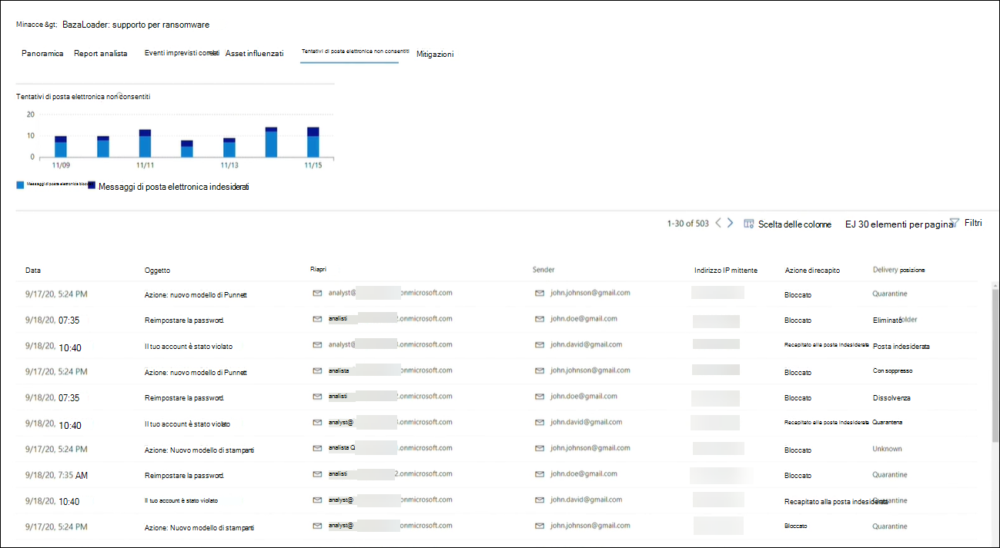
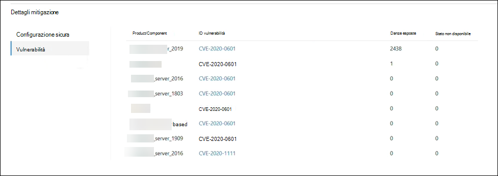

# Tenere traccia e rispondere alle minacce emergenti con l'analisi delle minacceTrack and respond to emerging threats with threat analytics 

[!INCLUDE [Microsoft 365 Defender rebranding](../includes/microsoft-defender.md)]

**Si applica a:****Applies to:**
- Microsoft 365 DefenderMicrosoft 365 Defender

> Vuoi provare Microsoft 365 Defender?Want to experience Microsoft 365 Defender? È possibile [valutarlo in un ambiente lab o](https://aka.ms/mtp-trial-lab) eseguire il progetto pilota in [produzione.](https://aka.ms/m365d-pilotplaybook)You can [evaluate it in a lab environment](https://aka.ms/mtp-trial-lab) or [run your pilot project in production](https://aka.ms/m365d-pilotplaybook).
>

[!INCLUDE [Prerelease](../includes/prerelease.md)]

L'analisi delle minacce è la soluzione di intelligence per le minacce nel prodotto di esperti ricercatori di sicurezza Microsoft, progettata per aiutare i team di sicurezza a essere il più efficienti possibile affrontando le minacce emergenti, tra cui:Threat analytics is our in-product threat intelligence solution from expert Microsoft security researchers, designed to assist security teams to be as efficient as possible while facing emerging threats, including:

- Attori delle minacce attive e le loro campagneActive threat actors and their campaigns
- Tecniche di attacco popolari e nuovePopular and new attack techniques
- Vulnerabilità criticheCritical vulnerabilities
- Superfici di attacco comuniCommon attack surfaces
- Malware diffusoPrevalent malware

Guarda questo breve video per saperne di più su come l'analisi delle minacce può aiutarti a tenere traccia delle minacce più recenti e a fermarle.Watch this short video to learn more about how threat analytics can help you track the latest threats and stop them.

>[!VIDEO https://www.microsoft.com/en-us/videoplayer/embed/RWwJfU]

È possibile accedere all'analisi delle minacce dal lato superiore sinistro della barra di spostamento del portale di sicurezza di Microsoft 365 o da una scheda del dashboard dedicata che mostra le minacce principali nell'organizzazione. Ottenere visibilità sulle campagne attive o in corso e sapere cosa fare tramite l'analisi delle minacce può aiutare il team delle operazioni di sicurezza a prendere decisioni informate.You can access threat analytics either from the upper left-hand side of Microsoft 365 security portal’s navigation bar, or from a dedicated dashboard card which shows the top threats in your org. Getting visibility on active or ongoing campaigns and knowing what to do through threat analytics can help equip your security operations team with informed decisions. 

_Dove accedere all'analisi delle minacce__Where to access threat analytics_

Con gli avversari più sofisticati e le nuove minacce che emergono spesso e prevalentemente, è fondamentale essere in grado di:With more sophisticated adversaries and new threats emerging frequently and prevalently, it's critical to be able to quickly:

- Identificare e reagire alle minacce emergentiIdentify and react to emerging threats 
- Informazioni se si è attualmente sotto attaccoLearn if you are currently under attack
- Valutare l'impatto della minaccia per le risorseAssess the impact of the threat to your assets
- Esaminare la resilienza o l'esposizione alle minacceReview your resilience against or exposure to the threats
- Identificare le azioni di mitigazione, ripristino o prevenzione che è possibile eseguire per arrestare o contenere le minacceIdentify the mitigation, recovery, or prevention actions you can take to stop or contain the threats

Ogni report fornisce un'analisi di una minaccia monitorata e indicazioni dettagliate su come difendersi da tale minaccia.Each report provides an analysis of a tracked threat and extensive guidance on how to defend against that threat. Incorpora inoltre i dati della rete, che indicano se la minaccia è attiva e se sono presenti protezioni applicabili.It also incorporates data from your network, indicating whether the threat is active and if you have applicable protections in place.

## Visualizzare il dashboard di analisi delle minacceView the threat analytics dashboard

Il dashboard di analisi delle minacce ([security.microsoft.com/threatanalytics3](https://security.microsoft.com/threatanalytics3)) evidenzia i report più rilevanti per l'organizzazione.The threat analytics dashboard ([security.microsoft.com/threatanalytics3](https://security.microsoft.com/threatanalytics3)) highlights the reports that are most relevant to your organization. Riepiloga le minacce nelle sezioni seguenti:It summarizes the threats in the following sections:

- **Minacce più** recenti: elenca i report sulle minacce pubblicati o aggiornati più di recente, insieme al numero di avvisi attivi e risolti.**Latest threats**—lists the most recently published or updated threat reports, along with the number of active and resolved alerts.
- **Minacce ad alto impatto:** elenca le minacce che hanno il maggiore impatto sull'organizzazione.**High-impact threats**—lists the threats that have the highest impact to your organization. In questa sezione vengono elencate per prime le minacce con il maggior numero di avvisi attivi e risolti.This section lists threats with the highest number of active and resolved alerts first.
- **Riepilogo delle** minacce: fornisce l'impatto complessivo di tutte le minacce rilevate mostrando il numero di minacce con avvisi attivi e risolti.**Threat summary**—provides the overall impact of all tracked threats by showing the number of threats with active and resolved alerts.

Selezionare una minaccia dal dashboard per visualizzare il report per tale minaccia.Select a threat from the dashboard to view the report for that threat.

_Dashboard di analisi delle minacce. Puoi anche fare clic sull'icona Cerca per trovare una parola chiave correlata al report di analisi delle minacce che vuoi leggere.__Threat analytics dashboard. You can also click the Search icon to key in a keyword related to the threat analytics report that you'd like to read._ 

## Visualizzare un report di analisi delle minacceView a threat analytics report

Ogni report di analisi delle minacce fornisce informazioni in diverse sezioni:Each threat analytics report provides information in several sections: 

- [**Panoramica****Overview**](#overview-quickly-understand-the-threat-assess-its-impact-and-review-defenses) 
- [**Report analista****Analyst report**](#analyst-report-get-expert-insight-from-microsoft-security-researchers)
- [**Eventi imprevisti correlati****Related incidents**](#related-incidents-view-and-manage-related-incidents)
- [**Asset influenzati****Impacted assets**](#impacted-assets-get-list-of-impacted-devices-and-mailboxes)
- [**Tentativi di posta elettronica non consentiti****Prevented email attempts**](#prevented-email-attempts-view-blocked-or-junked-threat-emails)
- [**Mitigazioni****Mitigations**](#mitigations-review-list-of-mitigations-and-the-status-of-your-devices)

### Panoramica: comprendere rapidamente la minaccia, valutarne l'impatto ed esaminare le difeseOverview: Quickly understand the threat, assess its impact, and review defenses

La **sezione Panoramica** offre un'anteprima del report dettagliato degli analisti.The **Overview** section provides a preview of the detailed analyst report. Fornisce inoltre grafici che evidenziano l'impatto della minaccia per l'organizzazione e l'esposizione tramite dispositivi non configurati correttamente e senzapatch.It also provides charts that highlight the impact of the threat to your organization and your exposure through misconfigured and unpatched devices.

_Sezione Panoramica di un report di analisi delle minacce__Overview section of a threat analytics report_

#### Valutare l'impatto sull'organizzazioneAssess impact on your organization
Ogni report include grafici progettati per fornire informazioni sull'impatto organizzativo di una minaccia:Each report includes charts designed to provide information about the organizational impact of a threat:
- **Eventi imprevisti correlati:** offre una panoramica dell'impatto della minaccia rilevata per l'organizzazione con i dati seguenti:**Related incidents**—provides an overview of the impact of the tracked threat to your organization with the following data:
  - Numero di avvisi attivi e numero di eventi imprevisti attivi a cui sono associatiNumber of active alerts and the number of active incidents they are associated with
  - Gravità degli eventi imprevisti attiviSeverity of active incidents
- **Avvisi nel tempo:** mostra il numero di avvisi **attivi** **e risolti** correlati nel tempo.**Alerts over time**—shows the number of related **Active** and **Resolved** alerts over time. Il numero di avvisi risolti indica la velocità con cui l'organizzazione risponde agli avvisi associati a una minaccia.The number of resolved alerts indicates how quickly your organization responds to alerts associated with a threat. Idealmente, il grafico dovrebbe mostrare gli avvisi risolti entro pochi giorni.Ideally, the chart should be showing alerts resolved within a few days.
- **Asset influenzati:** mostra il numero di dispositivi distinti e account di posta elettronica (cassette postali) che attualmente hanno almeno un avviso attivo associato alla minaccia rilevata.**Impacted assets**—shows the number of distinct devices and email accounts (mailboxes) that currently have at least one active alert associated with the tracked threat. Gli avvisi vengono attivati per le cassette postali che hanno ricevuto messaggi di posta elettronica di minaccia.Alerts are triggered for mailboxes that received threat emails. Esaminare i criteri a livello di organizzazione e utente per le sostituzioni che causano il recapito dei messaggi di posta elettronica di minaccia.Review both org- and user-level policies for overrides that cause the delivery of threat emails.
- **Tentativi di posta elettronica** non consentiti: indica il numero di messaggi di posta elettronica degli ultimi sette giorni bloccati prima del recapito o recapitati nella cartella posta indesiderata.**Prevented email attempts**—shows the number of emails from the past seven days that were either blocked before delivery or delivered to the junk mail folder.

#### Esaminare la resilienza e la postura della sicurezzaReview security resilience and posture
Ogni report include grafici che forniscono una panoramica della resilienza dell'organizzazione rispetto a una determinata minaccia:Each report includes charts that provide an overview of how resilient your organization is against a given threat:
- **Stato configurazione sicura:** indica il numero di dispositivi con impostazioni di sicurezza non configurate correttamente.**Secure configuration status**—shows the number of devices with misconfigured security settings. Applicare le impostazioni di sicurezza consigliate per attenuare la minaccia.Apply the recommended security settings to help mitigate the threat. I dispositivi sono **considerati sicuri** se hanno applicato _tutte_ le impostazioni rilevate.Devices are considered **Secure** if they have applied _all_ the tracked settings.
- **Stato patch vulnerabilità:** mostra il numero di dispositivi vulnerabili.**Vulnerability patching status**—shows the number of vulnerable devices. Applicare aggiornamenti della sicurezza o patch per risolvere le vulnerabilità sfruttate dalla minaccia.Apply security updates or patches to address vulnerabilities exploited by the threat.

### Report degli analisti: ottenere informazioni approfondite dai ricercatori di sicurezza MicrosoftAnalyst report: Get expert insight from Microsoft security researchers
Nella sezione **Report analista** leggere la descrizione dettagliata dell'esperto.In the **Analyst report** section, read through the detailed expert write-up. La maggior parte dei report fornisce descrizioni dettagliate delle catene di attacco, tra cui tattiche e tecniche mappate al framework CK di MITRE ATT&, elenchi esaustivi di suggerimenti e potenti indicazioni per la ricerca di [minacce.](advanced-hunting-overview.md)Most reports provide detailed descriptions of attack chains, including tactics and techniques mapped to the MITRE ATT&CK framework, exhaustive lists of recommendations, and powerful [threat hunting](advanced-hunting-overview.md) guidance.

[Ulteriori informazioni sul report degli analistiLearn more about the analyst report](threat-analytics-analyst-reports.md)

### Eventi imprevisti correlati: visualizzare e gestire gli eventi imprevisti correlatiRelated incidents: View and manage related incidents
La **scheda Eventi imprevisti** correlati fornisce l'elenco di tutti gli eventi imprevisti correlati alla minaccia rilevata.The **Related incidents** tab provides the list of all incidents related to the tracked threat. È possibile assegnare eventi imprevisti o gestire gli avvisi collegati a ogni evento imprevisto.You can assign incidents or manage alerts linked to each incident. 

_Sezione Eventi imprevisti correlati di un report di analisi delle minacce__Related incidents section of a threat analytics report_

### Asset influenzati: ottenere l'elenco dei dispositivi e delle cassette postali influenzatiImpacted assets: Get list of impacted devices and mailboxes
Un asset viene considerato interessato se è interessato da un avviso attivo e non risolto.An asset is considered impacted if it is affected by an active, unresolved alert. Nella **scheda Asset influenzati** sono elencati i seguenti tipi di asset influenzati:The **Impacted assets** tab lists the following types of impacted assets:
- **Dispositivi influenzati:** endpoint con avvisi di Microsoft Defender for Endpoint irrisolti.**Impacted devices**—endpoints that have unresolved Microsoft Defender for Endpoint alerts. Questi avvisi vengono in genere generati da avvistamenti di indicatori di minaccia e attività noti.These alerts typically fire on sightings of known threat indicators and activities.
- **Cassette postali influenzate:** cassette postali che hanno ricevuto messaggi di posta elettronica che hanno attivato gli avvisi di Microsoft Defender per Office 365.**Impacted mailboxes**—mailboxes that have received email messages that have triggered Microsoft Defender for Office 365 alerts. Sebbene la maggior parte dei messaggi che attivano avvisi sia in genere bloccata, i criteri a livello di utente o di organizzazione possono ignorare i filtri.While most messages that trigger alerts are typically blocked, user- or org-level policies can override filters.

_Sezione Asset influenzati di un report di analisi delle minacce__Impacted assets section of a threat analytics report_

### Tentativi di posta elettronica non consentiti: visualizzare i messaggi di posta elettronica di minacce bloccate o indesideratePrevented email attempts: View blocked or junked threat emails
Microsoft Defender per Office 365 in genere blocca i messaggi di posta elettronica con indicatori di minaccia noti, inclusi collegamenti o allegati dannosi.Microsoft Defender for Office 365 typically blocks emails with known threat indicators, including malicious links or attachments. In alcuni casi, i meccanismi di filtro proattivi che controllano la presenza di contenuti sospetti invieranno invece messaggi di posta elettronica di minacce alla cartella posta indesiderata.In some cases, proactive filtering mechanisms that check for suspicious content will instead send threat emails to the junk mail folder. In entrambi i casi, le probabilità che la minaccia che avvia il codice malware sul dispositivo sia ridotta.In either case, the chances of the threat launching malware code on the device is reduced.

Nella **scheda Tentativi di posta elettronica** non consentiti sono elencati tutti i messaggi di posta elettronica che sono stati bloccati prima del recapito o inviati alla cartella posta indesiderata da Microsoft Defender per Office 365.The **Prevented email attempts** tab lists all the emails that have either been blocked before delivery or sent to the junk mail folder by Microsoft Defender for Office 365. 

_Sezione Tentativi di posta elettronica non consentiti di un report di analisi delle minacce__Prevented email attempts section of a threat analytics report_

### Mitigazioni: esaminare l'elenco delle mitigazioni e lo stato dei dispositiviMitigations: Review list of mitigations and the status of your devices
Nella sezione **Mitigazioni** esaminare l'elenco di suggerimenti specifici che consentono di aumentare la resilienza dell'organizzazione contro la minaccia.In the **Mitigations** section, review the list of specific actionable recommendations that can help you increase your organizational resilience against the threat. L'elenco delle mitigazioni rilevate include:The list of tracked mitigations includes:

- **Aggiornamenti della sicurezza:** distribuzione degli aggiornamenti della sicurezza software supportati per le vulnerabilità riscontrate nei dispositivi onboarded**Security updates**—deployment of supported software security updates for vulnerabilities found on onboarded devices
- **Configurazioni di sicurezza supportate****Supported security configurations**
  - Protezione basata sul cloudCloud-delivered protection  
  - Protezione delle applicazioni potenzialmente indesideratePotentially unwanted application (PUA) protection
  - Protezione in tempo realeReal-time protection
 
Le informazioni di mitigazione contenute in questa sezione incorporano i dati della gestione delle minacce e delle [vulnerabilità,](https://docs.microsoft.com/windows/security/threat-protection/microsoft-defender-atp/next-gen-threat-and-vuln-mgt)che forniscono inoltre informazioni dettagliate di drill-down da vari collegamenti nel report.Mitigation information in this section incorporates data from [threat and vulnerability management](https://docs.microsoft.com/windows/security/threat-protection/microsoft-defender-atp/next-gen-threat-and-vuln-mgt), which also provides detailed drill-down information from various links in the report.

 

_Sezione Mitigazioni di un report di analisi delle minacce__Mitigations section of a threat analytics report_

## Ulteriori dettagli e limitazioni del reportAdditional report details and limitations
>[!NOTE]
>Come parte dell'esperienza di sicurezza unificata, l'analisi delle minacce è ora disponibile non solo per Microsoft Defender for Endpoint, ma anche per i titolari della licenza di Microsoft Defender per Office E5.As part of the unified security experience, threat analytics is now available not just for Microsoft Defender for Endpoint, but also for Microsoft Defender for Office E5 license holders.
>Se non si utilizza il portale di sicurezza di Microsoft 365 (Microsoft 365 Defender), è anche possibile visualizzare i dettagli del report (senza i dati di Microsoft Defender per Office) nel portale di Microsoft Defender Security Center (Microsoft Defender for Endpoint).If you are not using the Microsoft 365 security portal (Microsoft 365 Defender), you can also see the report details (without the Microsoft Defender for Office data) in the Microsoft Defender Security Center portal (Microsoft Defender for Endpoint). 

Per accedere al report di analisi delle minacce sono necessari determinati ruoli e autorizzazioni.To access threat analytics report you need certain roles and permissions. Per informazioni dettagliate, vedere Ruoli personalizzati nel controllo dell'accesso basato sui ruoli [per Microsoft 365 Defender.](custom-roles.md)See [Custom roles in role-based access control for Microsoft 365 Defender](custom-roles.md) for details.
  - Per visualizzare gli avvisi, gli eventi imprevisti o i dati degli asset a impatto, devi disporre delle autorizzazioni per i dati degli avvisi di Microsoft Defender per Office o Microsoft Defender for Endpoint o entrambi.To view alerts, incidents, or impacted assets data, you need to have permissions to Microsoft Defender for Office or Microsoft Defender for Endpoint alerts data, or both.
  - Per visualizzare i tentativi di posta elettronica non consentiti, è necessario disporre delle autorizzazioni per i dati di ricerca di Microsoft Defender per Office.To view prevented email attempts, you need to have permissions to Microsoft Defender for Office hunting data. 
  - Per visualizzare le mitigazioni, è necessario disporre delle autorizzazioni per i dati di gestione delle minacce e delle vulnerabilità in Microsoft Defender per Endpoint.To view mitigations, you need to have permissions to threat and vulnerability management data in Microsoft Defender for Endpoint.

Quando si esaminano i dati di analisi delle minacce, tenere presente i fattori seguenti:When looking at the threat analytics data, remember the following factors:
- I grafici riflettono solo le mitigazioni rilevate.Charts reflect only mitigations that are tracked. Controllare la panoramica del report per ulteriori mitigazioni che non vengono visualizzate nei grafici.Check the report overview for additional mitigations that are not shown in the charts.
- Le mitigazioni non garantiscono resilienza completa.Mitigations don't guarantee complete resilience. Le mitigazioni fornite riflettono le migliori azioni possibili necessarie per migliorare la resilienza.The provided mitigations reflect the best possible actions needed to improve resiliency.
- I dispositivi vengono conteggiati come "non disponibili" se non hanno trasmesso dati al servizio.Devices are counted as "unavailable" if they have not transmitted data to the service.
- Le statistiche relative all'antivirus si basano sulle impostazioni di Microsoft Defender Antivirus.Antivirus-related statistics are based on Microsoft Defender Antivirus settings. I dispositivi con soluzioni antivirus di terze parti possono apparire come "esposti".Devices with third-party antivirus solutions can appear as "exposed".

## Argomenti correlatiRelated topics
- [Trovare in modo proattivo le minacce con la ricerca avanzataProactively find threats with advanced hunting](advanced-hunting-overview.md) 
- [Informazioni sulla sezione relativa al report degli analistiUnderstand the analyst report section](threat-analytics-analyst-reports.md)
- [Valutare e risolvere i punti deboli e le esposizioni della sicurezzaAssess and resolve security weaknesses and exposures](https://docs.microsoft.com/windows/security/threat-protection/microsoft-defender-atp/next-gen-threat-and-vuln-mgt)
